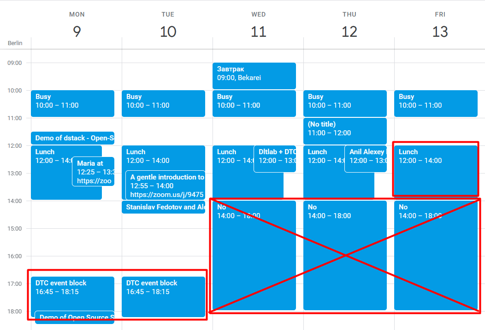
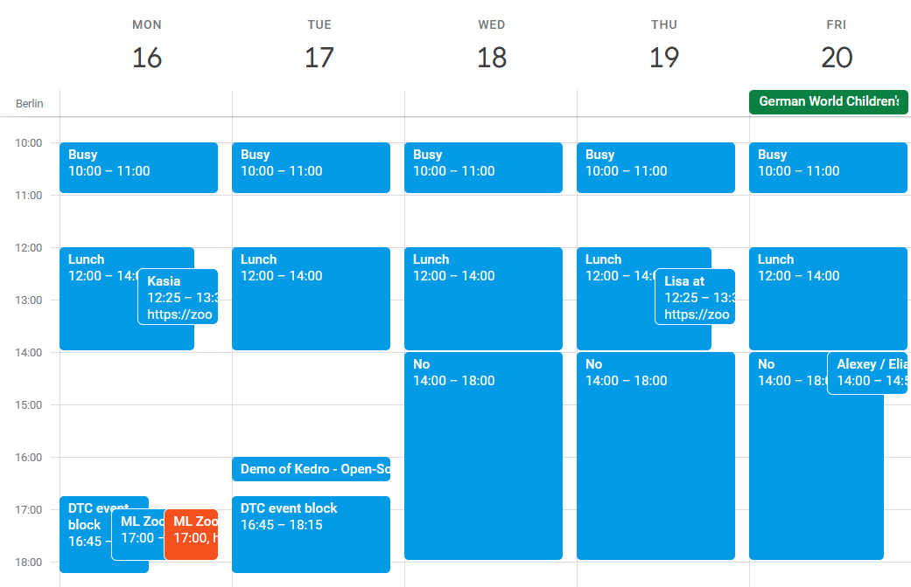
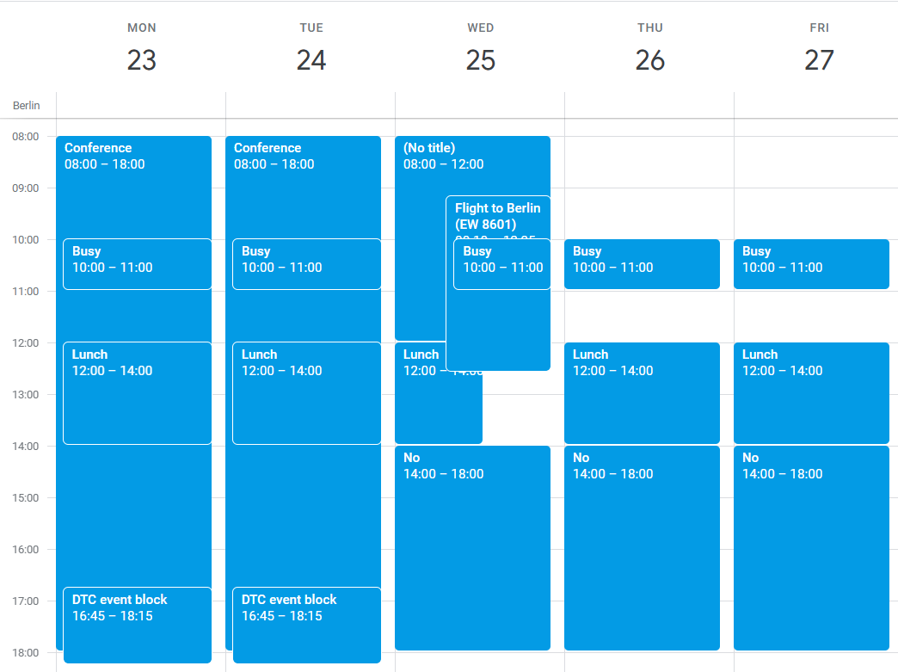
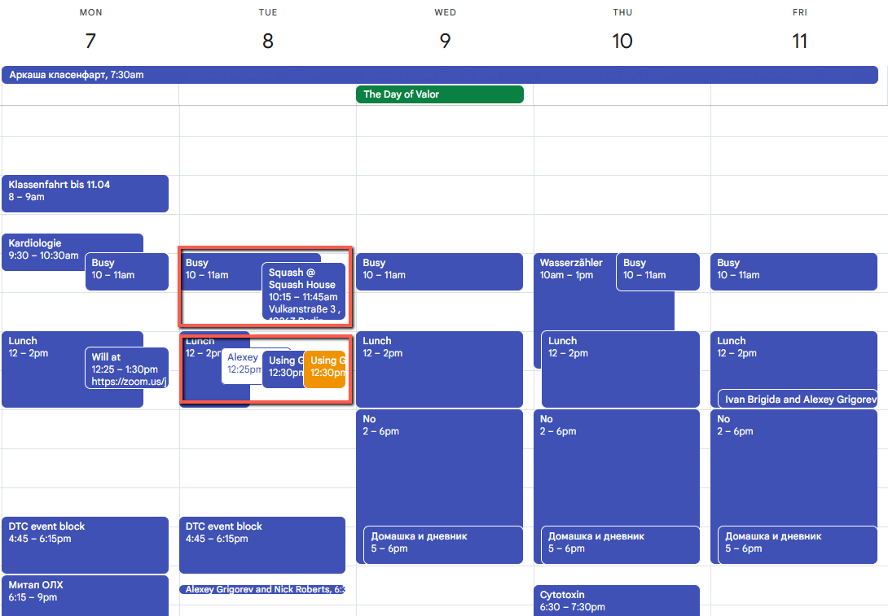

# Alexey's Calendar

## Summary

## Content

### Calendar

You have access to Alexey’s calendar. When selecting the slot for an event, always cross-check it with his calendar.

This is how it usually looks like:

Image note: This screenshot shows Alexey’s weekly calendar with available and blocked lunchtime/evening slots marked. Use the red markings to avoid busy days and to identify which lunch or 17:00 slots can be proposed.

(Red lines are added)

- You can typically schedule something during Lunch meetings if there’s nothing. For example, Friday is free, so it’s possible to schedule something there. Wednesday and Thursday aren’t free, so we can’t schedule anything on these days. Also, we already have events on Monday and Tuesday

- If the guest is from the US, Lunchtime (Berlin time) is too early for them. We can then offer them slots at 17:00 on Monday (or Tuesday – but better Monday). But not on Wednesday, Thursday or Friday.

- 12:30 is the preferable time, so it’s better to do it then.

- It’s better to avoid scheduling things on Tuesday after 16:00 – if possible.

- If there’s an event across the entire day, or an event that says “no”, “busy”, “no title”, or something else etc – don’t book anything there.

- Never schedule anything on weekend

- If not sure, check with Alexey

Other examples:

Image note: This screenshot shows a week with some lunch and evening slots already occupied. Use it to distinguish available lunch blocks from existing events before offering dates to guests.

- Already have an event on Monday lunchtime, Monday 17:00 time and on Thursday lunchtime

- Lunchtimes on Tuesday, Wednesday and Friday are still available

Image note: This screenshot shows a week blocked by a conference and travel. Treat full-day events and travel blocks as unavailable unless Alexey explicitly approves scheduling there.

- Conference on Monday and Tuesday – can’t schedule anything there (unless Alexey explicitly asks to do it)

- Flight on Wednesday - can’t schedule anything

- Lunchtime on Thursday and Friday is available!

Image note: This screenshot shows a dense week where the key signal is whether meetings leave enough buffer between events. Use it to check not only open time blocks, but also whether there is enough preparation time before proposing a slot.

To ensure smooth scheduling and avoid conflicts between events, consider the following steps:

- Verify Event Timing: Ensure that events have adequate intervals between them. For this example, if an event ends at 11:45 AM, the next event should start at 12:45 PM or later to allow for preparation and avoid overlaps.​

- Confirm Alexey’s Availability: If events are scheduled with minimal intervals, ping Alexey via Telegram to confirm his availability or discuss possible adjustments. This approach helps prevent scheduling conflicts.

By implementing these practices, you can effectively manage event schedules, minimize conflicts, and ensure a smooth flow between sessions.

## References

-
