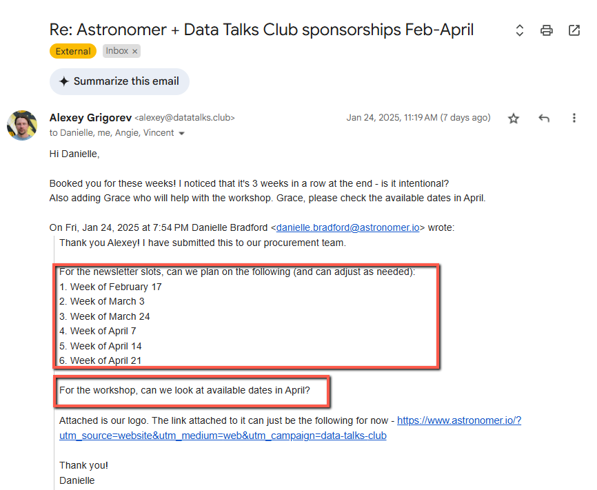
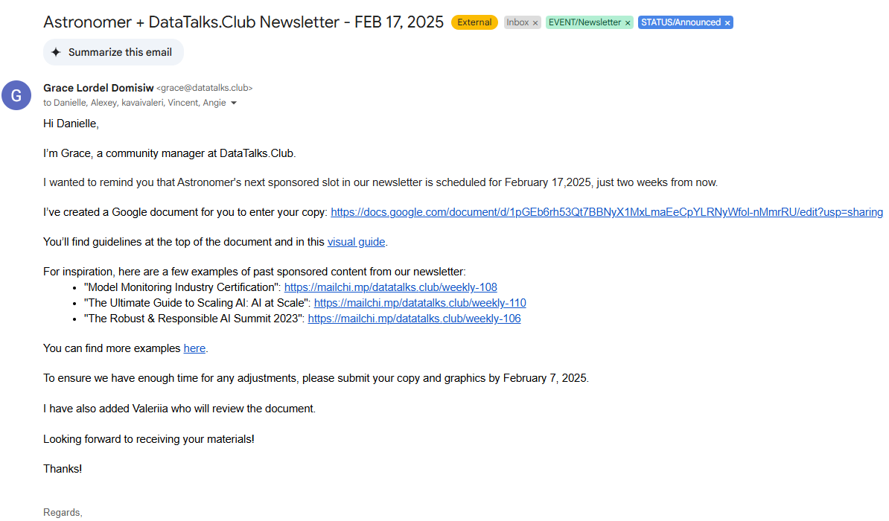
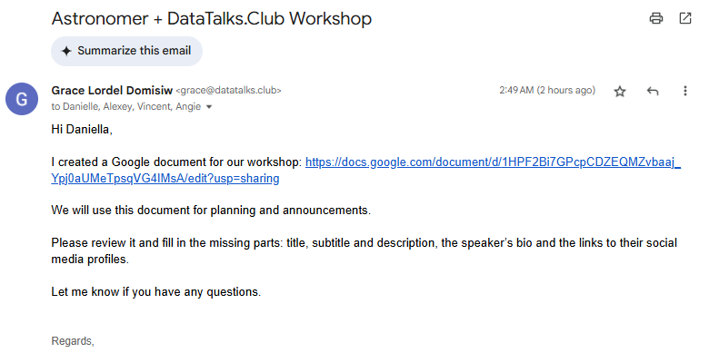

# Rules for creating a Mail thread

## Summary

## Content

Rules for creating a Mail thread
To ensure clarity and better management, separate email threads should be created for each event. This allows for focused discussions, accurate tracking, and prevents confusion with dates, details, or event-specific information. Avoid responding with mixed information for different events in a single email thread.

### When to Create a New Email Thread
- Emails that are forwarded by Alexey
  Ex. Please create a document or find a schedule.

- Multiple events are indicated in the thread, or the discussion involves different event types
  Ex. 6 newsletters and 1 workshop.

- *More scenarios will be added as we encounter them.(TODO)*

### When NOT to Create a New Email Thread
- If the sponsor has not confirmed their interest in the newsletter, there’s no need to create a separate thread yet. Once they confirm, we can start a new thread to finalize the date and prepare the details for the newsletter.

- *More scenarios will be added as we encounter them.(TODO)*

### Email Subject Formatting

| Event Type                   | Subject Format                                        |
|----------------------------------|-----------------------------------------------------------|
| Newsletter                       | \<COMPANY\> + DataTalks.Club Newsletter - \<MM DD, YYYY\> |
| Sponsored Workshop               | \<TOOL/COMPANY\> + DataTalks.Club Workshop                |
| Community/Non-Sponsored Workshop | \<NAME\> + DataTalks.Club Workshop                        |
| Webinar                          | \<NAME\> + DataTalks.Club Webinar                         |
| Podcast                          | \<FIRST NAME\> at DataTalks.Club Podcast                  |
| Open Source Spotlight            | \<TOOL\> at Open Source Spotlight                         |

### By following this structured approach, we can maintain clear, organized communication with sponsors and guests while ensuring smooth event coordination.

Image note: This screenshot anchors the preceding step of the Rules for creating a Mail thread process by showing the screen for completing this step. Look for the red box, arrow, selected row, or highlighted screen area, then use that highlighted area as the target for the action before continuing.

Image note: This screenshot anchors the preceding step of the Rules for creating a Mail thread process by showing the screen for completing this step. Look for the red box, arrow, selected row, or highlighted screen area, then use that highlighted area as the target for the action before continuing.

Image note: This screenshot anchors the preceding step of the Rules for creating a Mail thread process by showing the screen for completing this step. Look for the red box, arrow, selected row, or highlighted screen area, then use that highlighted area as the target for the action before continuing.

## References

-
