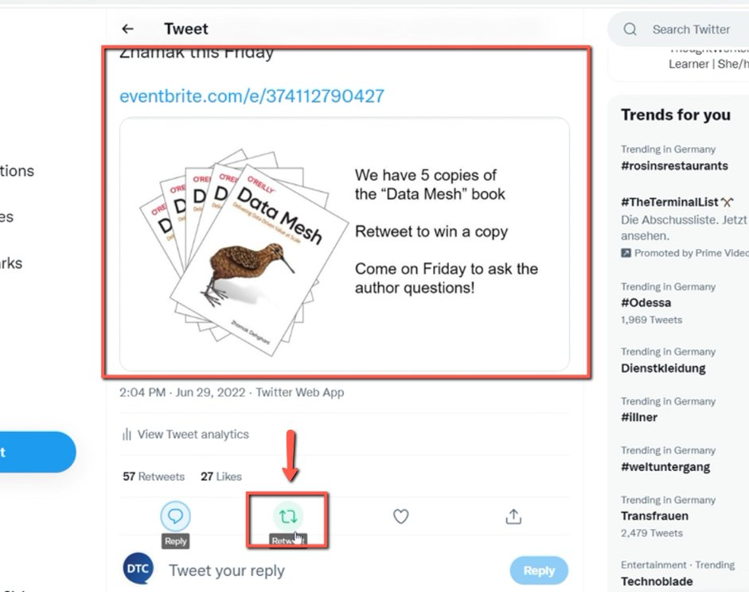
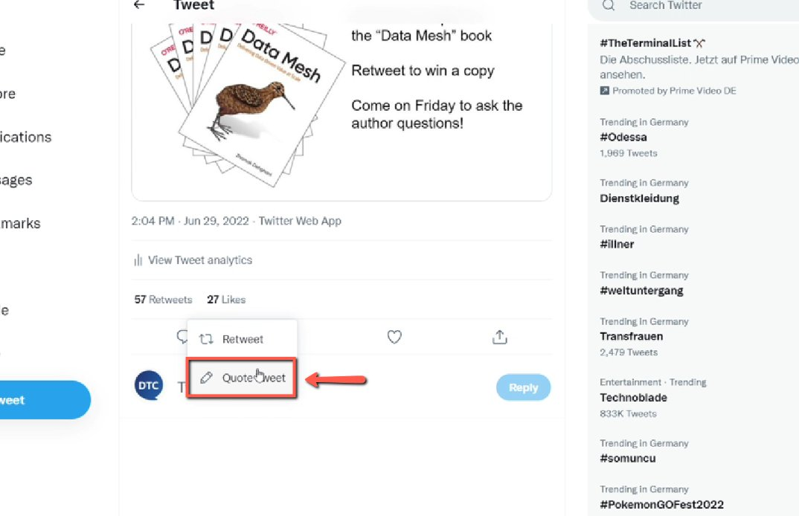
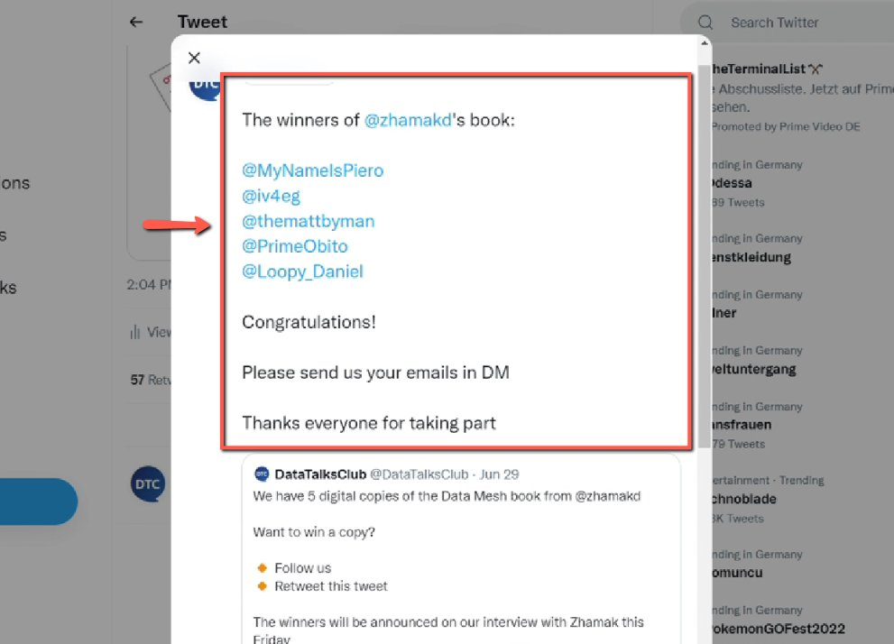
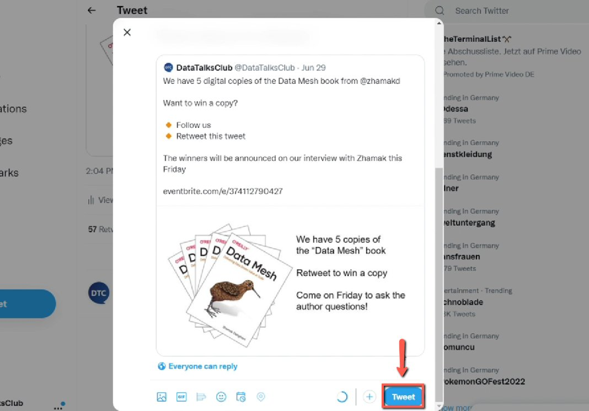

# Announcing Winners of Giveaway Campaigns

<!-- sop-section-start: summary -->
## Summary

- Purpose: Announce giveaway winners on Twitter/X.
- Outcome: A quote tweet lists the selected winners and follow-up offer.
- Trigger: Giveaway winners have been selected.
- Frequency: After each giveaway campaign.
<!-- sop-section-end -->

<!-- sop-section-start: prerequisites -->
## Prerequisites

- Access: DataTalks.Club Twitter/X account.
- Tools: Twitter/X.
- Inputs: Original giveaway tweet and winner handles.
<!-- sop-section-end -->

<!-- sop-section-start: procedure -->
## Procedure

<!-- sop-prose-start -->
How to Announce Winners of Giveaway campaigns
This procedure will show you the steps on how to Announce Winners of Giveaway campaigns.

Step-by-step Instructions
<!-- sop-prose-end -->

<!-- sop-step-start id=1 -->
1.  After you selected the winners of the book, the next thing you need to do is announce them and retweet the giveaway book tweet on Twitter. First, Click the “Retweet” icon.

    <!-- sop-screenshot-start -->
    
    <!-- sop-caption-start -->
    This screenshot anchors step 1 of the Announcing Winners of Giveaway Campaigns process by showing the screen for after you selected the winners of the book, the next thing you need to do is announce them and retweet the. Look for the red box or arrow around "Retweet", then use that highlighted area as the target for the action before continuing.
    <!-- sop-caption-end -->
    <!-- sop-screenshot-end -->
<!-- sop-step-end -->

<!-- sop-step-start id=2 -->
2.  And select “Quote Tweet”

    <!-- sop-screenshot-start -->
    
    <!-- sop-caption-start -->
    This screenshot anchors step 2 of the Announcing Winners of Giveaway Campaigns process by showing the screen for and select "Quote Tweet". Look for the red box or arrow around "Quote Tweet", then use that highlighted area as the target for the action before continuing.
    <!-- sop-caption-end -->
    <!-- sop-screenshot-end -->
<!-- sop-step-end -->

<!-- sop-step-start id=3 -->
3.  Then, enter the announcement and paste the lucky winners of the book giveaway.

    Template:

    The winners are:

    @xxx

    @xxx

    @xxx

    Congratulations! DM us for tickets

    Didn't win? No worries. Get 15% off with code DATATALKSCLUB2022-15

    Thanks, everyone for taking part!

    <!-- sop-screenshot-start -->
    
    <!-- sop-caption-start -->
    This screenshot anchors step 3 of the Announcing Winners of Giveaway Campaigns process by showing the screen for enter the announcement and paste the lucky winners of the book giveaway. Template: The winners are: @xxx @xxx @xxx. Look for the red box, arrow, selected row, or highlighted screen area, then use that highlighted area as the target for the action before continuing.
    <!-- sop-caption-end -->
    <!-- sop-screenshot-end -->
<!-- sop-step-end -->

<!-- sop-step-start id=4 -->
4.  Then, click “Tweet”

    <!-- sop-screenshot-start -->
    
    <!-- sop-caption-start -->
    This screenshot anchors step 4 of the Announcing Winners of Giveaway Campaigns process by showing the screen for click "Tweet". Look for the red box or arrow around "Tweet", then use that highlighted area as the target for the action before continuing.
    <!-- sop-caption-end -->
    <!-- sop-screenshot-end -->
<!-- sop-step-end -->
<!-- sop-section-end -->

<!-- sop-section-start: validation -->
## Validation

-
<!-- sop-section-end -->

<!-- sop-section-start: troubleshooting -->
## Troubleshooting

-
<!-- sop-section-end -->

<!-- sop-section-start: references -->
## References

-
<!-- sop-section-end -->
