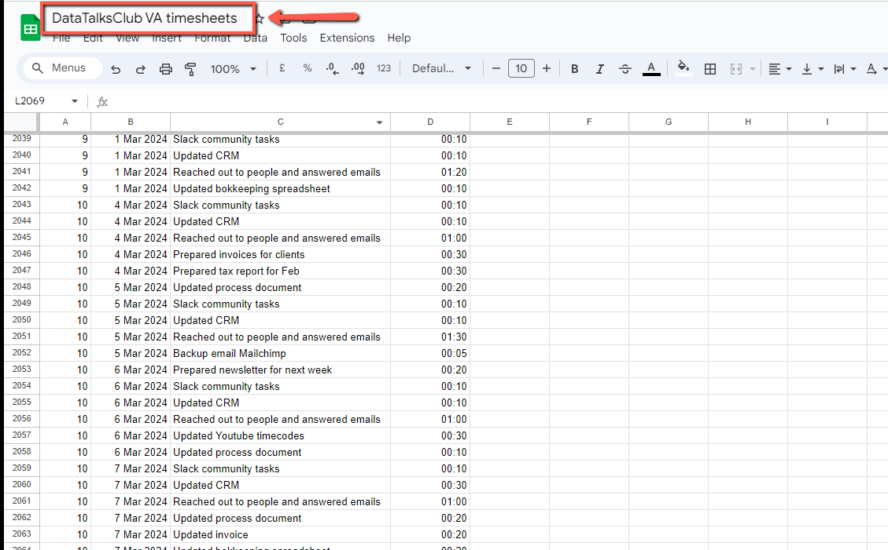
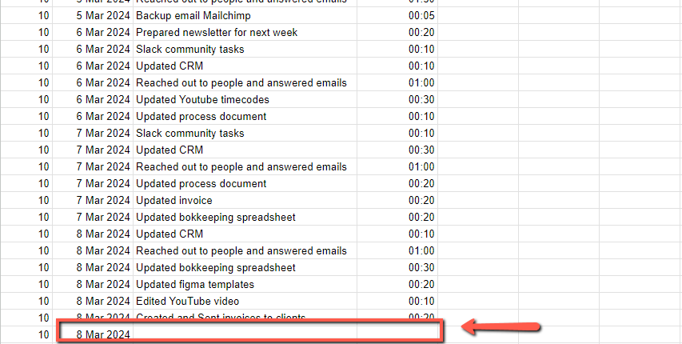
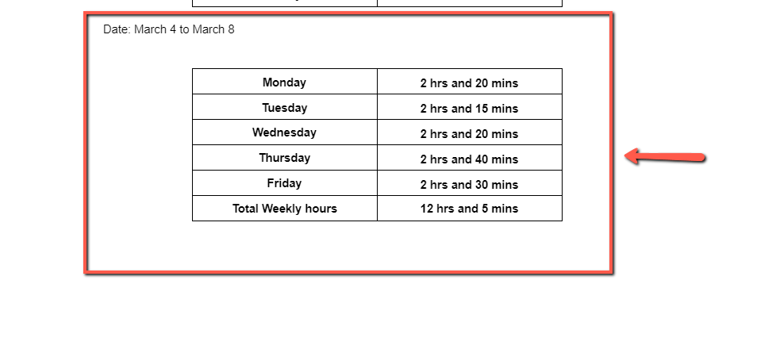

# Creating your Weekly reports

<!-- sop-section-start: summary -->
## Summary

- Purpose:
- Outcome:
- Trigger:
- Frequency:
<!-- sop-section-end -->

<!-- sop-section-start: prerequisites -->
## Prerequisites

- Access:
- Tools:
- Inputs:
<!-- sop-section-end -->

<!-- sop-section-start: procedure -->
## Procedure

<!-- sop-prose-start -->
How to Create Weekly Reports
This procedure will show you the steps on How to Create your Weekly Reports

Step-by-step Instructions
<!-- sop-prose-end -->

<!-- sop-step-start id=1 -->
1.  The first thing you need to do is open the [VA timesheet](https://docs.google.com/spreadsheets/d/1BbDXb8tOq3Y3-XDyTSiyQ7pO-QaZh7f1iQEWfCCwq_A/edit#gid=0) to log your reports

    <!-- sop-screenshot-start -->
    
    <!-- sop-caption-start -->
    This screenshot confirms you are in the `DataTalksClub VA timesheets` spreadsheet before entering work logs. Use the existing rows as the format reference: week number, date, task description, and duration should be filled consistently.
    <!-- sop-caption-end -->
    <!-- sop-screenshot-end -->
<!-- sop-step-end -->

<!-- sop-step-start id=2 -->
2.  After, add your reports to the space on the spreadsheet. The report includes the date, the task, and the number of hours or minutes you did that particular task.

    <!-- sop-screenshot-start -->
    
    <!-- sop-caption-start -->
    The highlighted row shows where the next daily report entry should be added in the timesheet. Continue below the existing entries so the weekly totals can be calculated from a complete list of dated tasks.
    <!-- sop-caption-end -->
    <!-- sop-screenshot-end -->
<!-- sop-step-end -->

<!-- sop-step-start id=3 -->
3.  Once done, total the number of hours per day and add it to the weekly report document

    Note: Make sure to include the number of work hours you’ve done on Saturday

    <!-- sop-screenshot-start -->
    
    <!-- sop-caption-start -->
    This screenshot shows the weekly report summary that is created after the timesheet entries are complete. Use it to verify that each day has a total and that the final `Total Weekly hours` value includes all reported work for the week.
    <!-- sop-caption-end -->
    <!-- sop-screenshot-end -->
<!-- sop-step-end -->
<!-- sop-section-end -->

<!-- sop-section-start: validation -->
## Validation

-
<!-- sop-section-end -->

<!-- sop-section-start: troubleshooting -->
## Troubleshooting

-
<!-- sop-section-end -->

<!-- sop-section-start: references -->
## References

-
<!-- sop-section-end -->
