# Create a newsletter draft from a template in Mailchimp [10-01-2024 update]

## Summary

- Purpose: Create a Mailchimp newsletter draft by replicating the existing template.
- Outcome: A new weekly newsletter draft is named, linked, and ready for content updates.
- Trigger: The next newsletter campaign needs to be prepared.
- Frequency: Typically two weeks before the newsletter goes live.
## Prerequisites

- Access: Mailchimp campaigns and the DataTalks.Club schedule spreadsheet.
- Tools: Mailchimp campaign editor and Google Sheets.
- Inputs: Newsletter number, send date, template campaign, and current content links.

## Usage

- Use when:
- Audience:
- Required inputs:

## Template

What: Creating a draft for a newsletter campaign in mailchimp from a template

Why: We have a template for our newsletter campaign, so we want to start our newsletter process by using the existing template

When: When we need to prepare for the next campaign, typically two weeks before it goes live.

### Step-by-step Instructions

### Creating a draft from a template

1.  The first thing you need to do is visit [Mailchimp.com](https://us19.admin.mailchimp.com/) and on the right side of your screen, click "All campaigns"

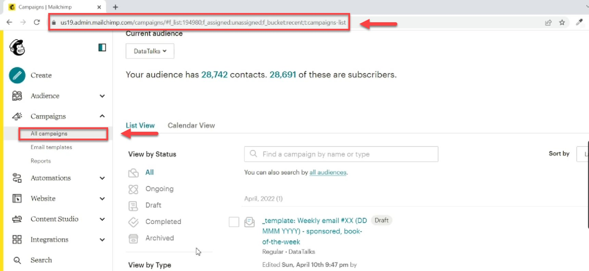
Image note: This screenshot anchors the step about visit Mailchimp.com and on the right side of your screen, click "All campaigns" so you can match the documented UI before acting. Look for “All campaigns”, then use that cue to complete or verify the step before continuing.

2.  After, select the latest weekly email.

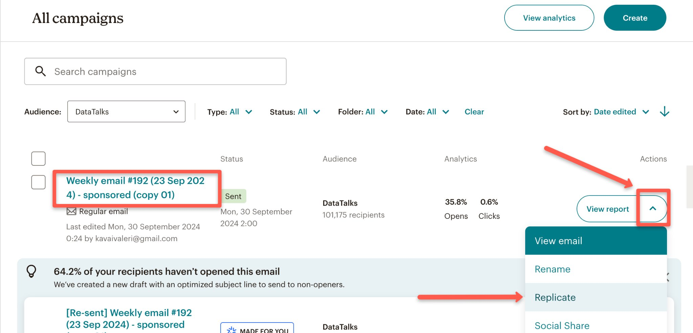
Image note: This screenshot anchors the step to select the latest weekly email so you can match the documented UI before acting. Look for the email or message detail shown there, then use it to confirm you are in the correct place before continuing.

3.  Once done replicating, click on "Edit name" on the replica template.

    Note: Do NOT edit the original draft, only the replica.

    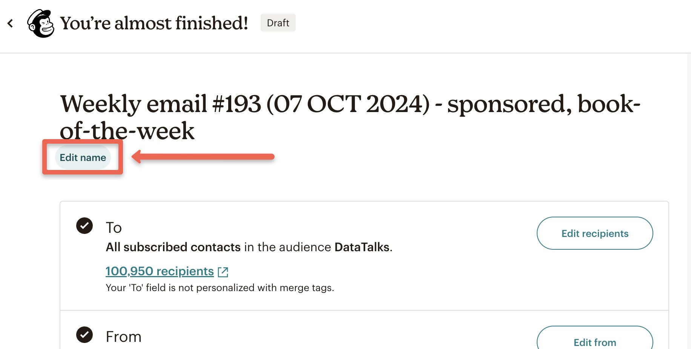
    Image note: This screenshot anchors the step about replicating, click on "Edit name" on the replica template so you can match the documented UI before acting. Look for “Edit name”, then use that cue to complete or verify the step before continuing.

4.  And then, rename the template to update the “Weekly email #” and date. Once done, click “Save”

    Note: In this example, the name of the newsletter is: "Weekly email #193 (07 OCT 2024) -” The weekly email number is 193 and the release date is on Oct. 7, 2024. And since there is no sponsor or book of the week, remove the "sponsored" and “book-of-the-week”.

    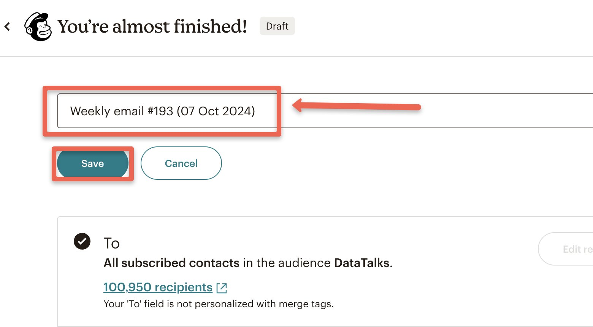
    Image note: This screenshot anchors the example shown in the procedure so you can match the documented UI before acting. Look for “Weekly email #193 (07 OCT 2024) -” and “sponsored”, then use those cues to complete or verify the step before continuing.

5.  To proceed, scroll down and change the email link by clicking "Edit"

    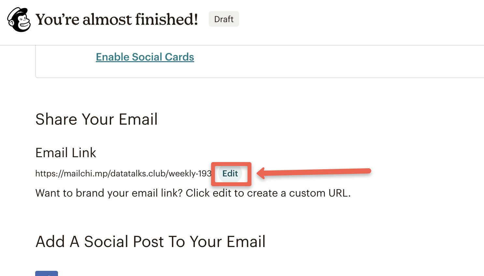
    Image note: This screenshot anchors the step to scroll down and change the email link by clicking "Edit" so you can match the documented UI before acting. Look for “Edit”, then use that cue to complete or verify the step before continuing.

6.  Now, edit the email URL, and once done, click "Save"
    It should follow the format: “weekly-#”. It should be the same as the weekly email number. For this example, it is 193. You will find it in the newsletter sheet in the [DataTalks.Club schedule](https://docs.google.com/spreadsheets/d/1-T8qkmShlFUrT2NmkI8Pi1NgUS9IunP6wO5-L79xe2s/edit?gid=1710801712#gid=1710801712) spreadsheet.

    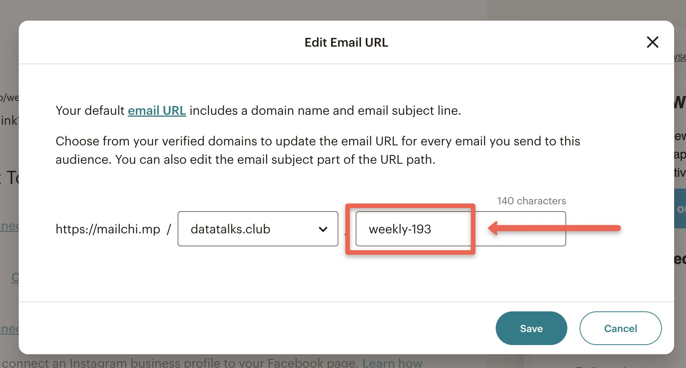
    Image note: This screenshot anchors the step about it should follow the format: “weekly-#”. It should be the same as the weekly email number. For this example, it is 193. Yo... so you can match the documented UI before acting. Look for “weekly-#”, then use that cue to complete or verify the step before continuing.

7.  To edit the Content of the template, scroll back up and click "Edit Design" beside the “Content” menu.

    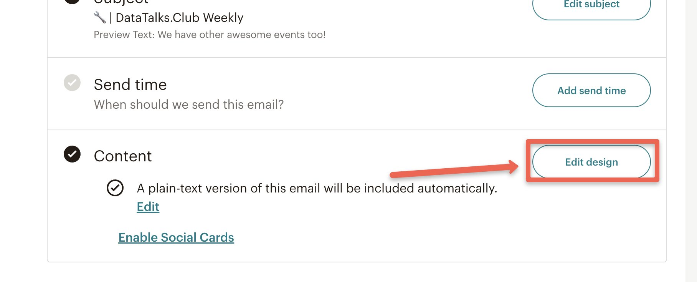
    Image note: This screenshot anchors the step about to edit the Content of the template, scroll back up and click "Edit Design" beside the “Content” menu so you can match the documented UI before acting. Look for “Edit Design” and “Content”, then use those cues to complete or verify the step before continuing.

Do not proceed with the process below until further notice.

### Event block

8.  For the Event block, copy and paste the upcoming events from [DataTalks.Club.](https://datatalks.club/events.html)

Note: Make sure that it follows the correct bullet format.

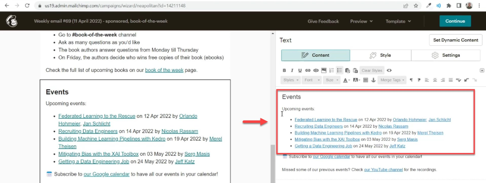
Image note: This screenshot anchors the step about make sure that it follows the correct bullet format so you can match the documented UI before acting. Look for the relevant screen area shown there, then use it to confirm you are in the correct place before continuing.

9.  Once done, click "Save & Close"

    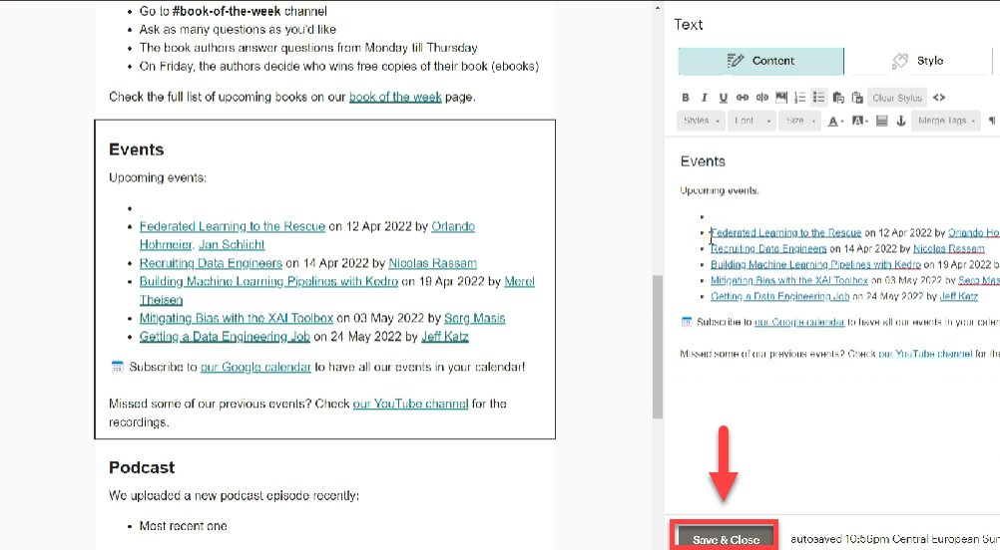
    Image note: This screenshot anchors the step to click "Save & Close" so you can match the documented UI before acting. Look for “Save & Close”, then use that cue to complete or verify the step before continuing.

### Podcast block

10. On the Podcast block, paste the recent podcast we had last Friday. For the previous episodes, paste the last 3 recent podcast episodes we had in [DataTalks.Club](https://datatalks.club/events.html)
Note: In this example, the recent podcast is "Innovation and Design for Machine Learning" while the last 3 podcast episode was "Hacking your Data Career, Visualising Machine Learning, and From Math Teacher to Analytics Engineer”

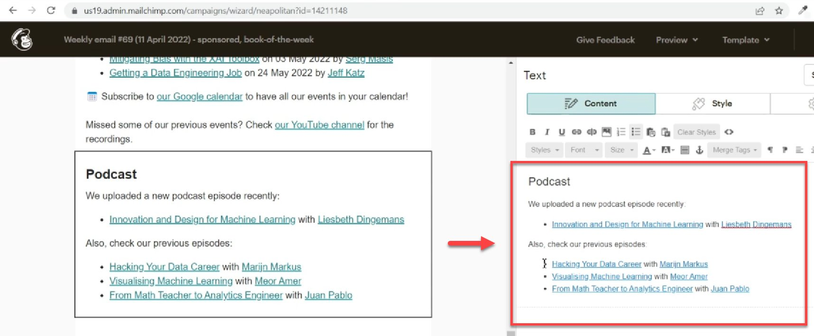
Image note: This screenshot anchors the example shown in the procedure so you can match the documented UI before acting. Look for “Innovation and Design for Machine Learning”, then use that cue to complete or verify the step before continuing.

11. And then, click "Save & Close"

    Note: Keep in mind to review and check the links in the newsletter.

Image note: This screenshot anchors the step about keep in mind to review and check the links in the newsletter so you can match the documented UI before acting. Look for the link, copy, or paste target shown there, then use it to confirm you are in the correct place before continuing.

### Articles block

12. Next, in the “Articles” section, paste the three recent articles published on the website.

    Note: If we don't have any new articles, we don't keep the section. Click the “Trash” icon.

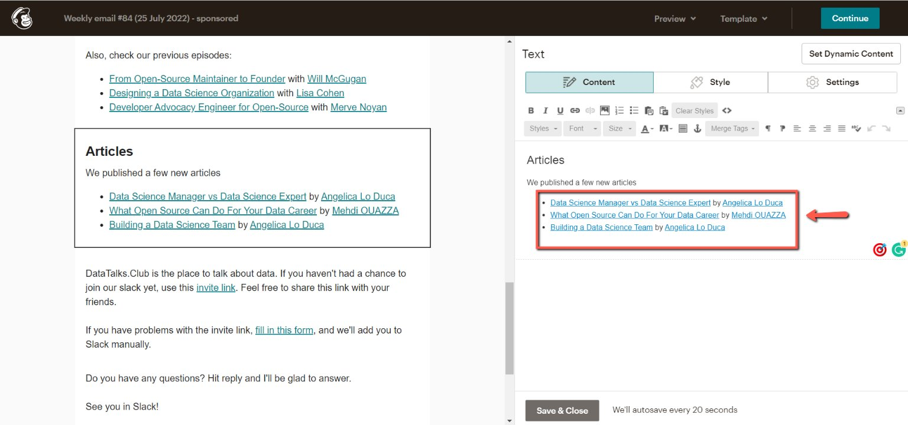
Image note: This screenshot anchors the step about if we don't have any new articles, we don't keep the section. Click the “Trash” icon so you can match the documented UI before acting. Look for “Trash”, then use that cue to complete or verify the step before continuing.

### Finishing

13. After reviewing, click "Continue" on the right side of your screen.

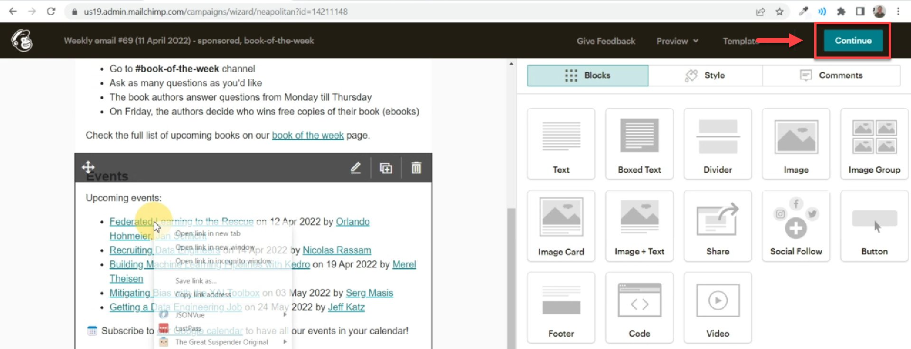
Image note: This screenshot anchors the step about reviewing, click "Continue" on the right side of your screen so you can match the documented UI before acting. Look for “Continue”, then use that cue to complete or verify the step before continuing.

## Notes

-
