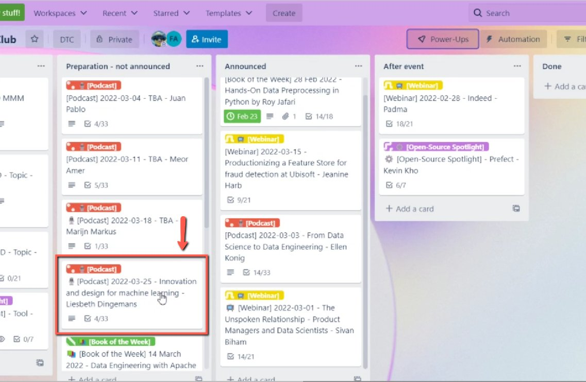
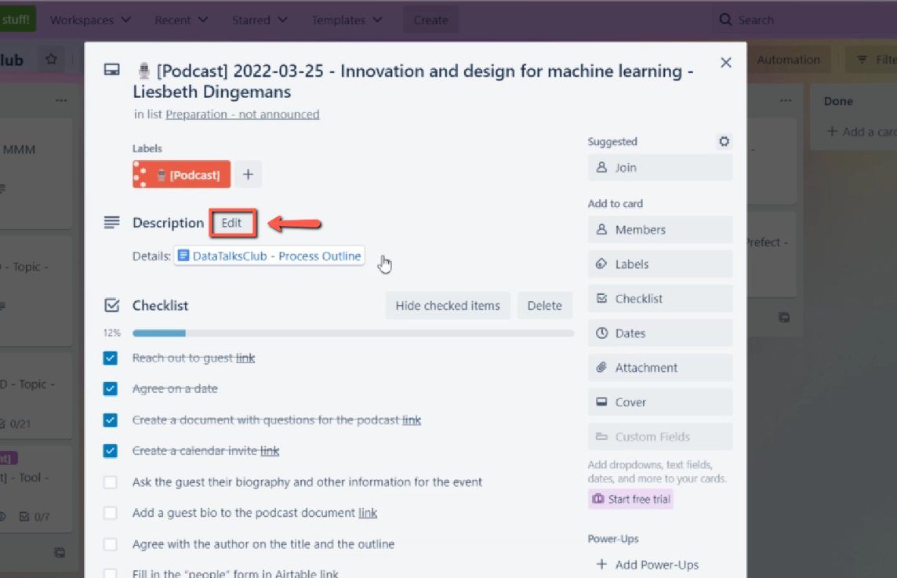
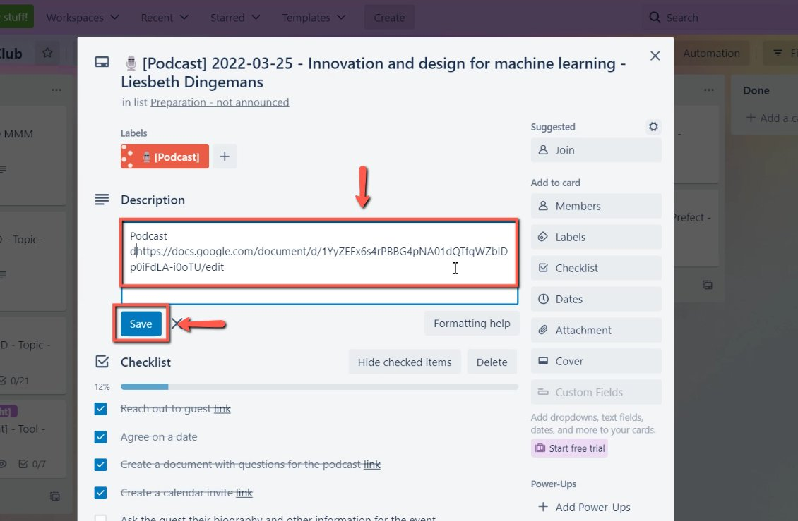

# Add podcast docs to Trello cards

<!-- sop-section-start: summary -->
## Summary

- Purpose: Add podcast document links to the relevant Trello card.
- Outcome: The Trello card description includes the podcast document link and any related links.
- Trigger: A podcast document or related link is ready to attach to a Trello card.
- Frequency: For each podcast Trello card that needs documentation links.
<!-- sop-section-end -->

<!-- sop-section-start: prerequisites -->
## Prerequisites

- Access: Trello board and podcast document.
- Tools: Trello.
- Inputs: Trello card and podcast document URL.
<!-- sop-section-end -->

<!-- sop-section-start: procedure -->
## Procedure

<!-- sop-prose-start -->
How to add podcast docs to Trello cards

This procedure will show you the steps on how to add podcast docs to Trello cards.

Step-by-step Instructions
<!-- sop-prose-end -->

<!-- sop-step-start id=1 -->
1.  The first thing you need to do is open the Trello card.

    <!-- sop-screenshot-start -->
    
    <!-- sop-caption-start -->
    This screenshot anchors step 1 of the Add podcast docs to Trello cards process by showing the screen for open the Trello card. Look for the red box or arrow around Open, then use that highlighted area as the target for the action before continuing.
    <!-- sop-caption-end -->
    <!-- sop-screenshot-end -->
<!-- sop-step-end -->

<!-- sop-step-start id=2 -->
2.  Next, click on "Edit" beside “Description”

    <!-- sop-screenshot-start -->
    
    <!-- sop-caption-start -->
    This screenshot anchors step 2 of the Add podcast docs to Trello cards process by showing the screen for click on "Edit" beside "Description". Look for the red boxes or arrows around "Edit", "Description", then use that highlighted area as the target for the action before continuing.
    <!-- sop-caption-end -->
    <!-- sop-screenshot-end -->
<!-- sop-step-end -->

<!-- sop-step-start id=3 -->
3.  And now, you can paste the link of the podcast document you created and then click “Save”

    Note: It should follow the format: Podcast document: link. You may also add other useful links like the YouTube link.
    <!-- sop-screenshot-start -->
    
    <!-- sop-caption-start -->
    This screenshot anchors step 3 of the Add podcast docs to Trello cards process by showing the screen for and now, you can paste the link of the podcast document you created and then click "Save". Look for the red box or arrow around "Save", then use that highlighted area as the target for the action before continuing.
    <!-- sop-caption-end -->
    <!-- sop-screenshot-end -->
<!-- sop-step-end -->
<!-- sop-section-end -->

<!-- sop-section-start: validation -->
## Validation

-
<!-- sop-section-end -->

<!-- sop-section-start: troubleshooting -->
## Troubleshooting

-
<!-- sop-section-end -->

<!-- sop-section-start: references -->
## References

-
<!-- sop-section-end -->
