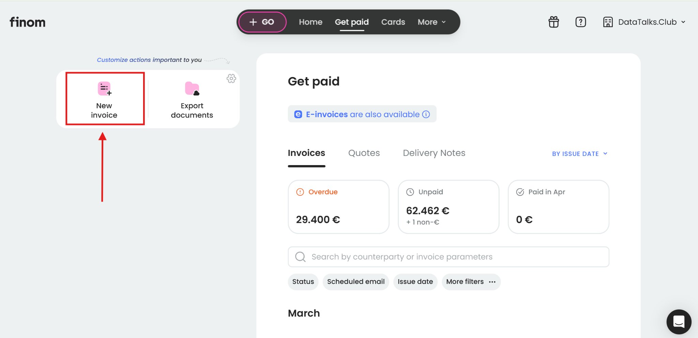
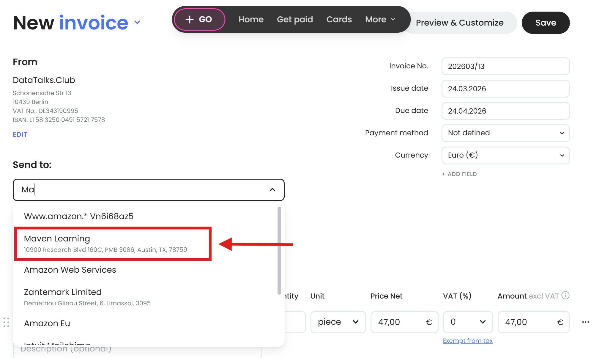
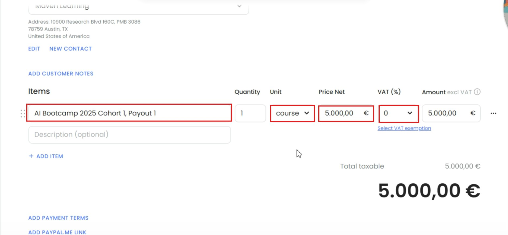
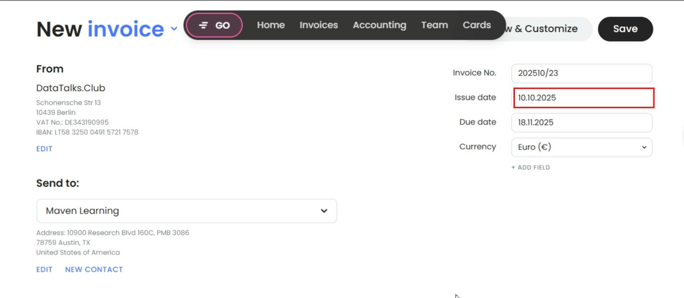

# Creating Invoices for Maven Course Payout from Stripe Transactions in Finom(To Update)

<!-- sop-section-start: summary -->
## Summary

- Purpose: Create a Finom invoice for Maven course payout records.
- Outcome: An internal accounting invoice is created in Finom for the Maven payout.
- Trigger: A Maven course payout from Stripe needs to be recorded.
- Frequency: As needed
<!-- sop-section-end -->

<!-- sop-section-start: prerequisites -->
## Prerequisites

- Access: Finom and Maven payout or Stripe transaction details.
- Tools: Finom.
- Inputs: Maven payout amount, payout date, course details, and transaction details.
<!-- sop-section-end -->

<!-- sop-section-start: procedure -->
## Procedure

<!-- sop-prose-start -->
Creating Invoices for Maven Course Payout from Stripe Transactions in Finom
This procedure will show you the step on Creating Invoices for Maven Course Payout from Stripe Transactions in Finom!

These Stripe transactions represent payments from Maven for Alexey’s courses. Because Maven does not provide a formal invoice, we must manually create an invoice within Finom to properly declare this income for bookkeeping and tax purposes.

Step-by-step Instructions
<!-- sop-prose-end -->

<!-- sop-step-start id=1 -->
1.  Log in to [Finom](https://app.finom.co/en/signin) account. Click “New Invoice” in the main dashboard.

    <!-- sop-screenshot-start -->
    
    <!-- sop-caption-start -->
    This screenshot shows the invoice detail or action needed in Finom. Look for the red callout around "New Invoice", then use it to verify the invoice before saving, downloading, or sending it.
    <!-- sop-caption-end -->
    <!-- sop-screenshot-end -->
<!-- sop-step-end -->

<!-- sop-step-start id=2 -->
2.  In the "Send to:" field, click the dropdown menu and select "Maven Learning" from the available options.

    <!-- sop-screenshot-start -->
    
    <!-- sop-caption-start -->
    This screenshot shows the invoice detail or action needed in Finom. Look for the red callout around "Maven Learning", then use it to verify the invoice before saving, downloading, or sending it.
    <!-- sop-caption-end -->
    <!-- sop-screenshot-end -->
<!-- sop-step-end -->

<!-- sop-step-start id=3 -->
3.  In the Items, type in the name of the course.

    Unit = Course

    Price = You can use the amount shown in the statement

    VAT = 0, Exempt from Tax

    In this example is AI Bootcamp 2025 Cohort, Pay out 1

    <!-- sop-screenshot-start -->
    
    <!-- sop-caption-start -->
    This screenshot verifies the payment evidence in Finom. Look for the red callout around the highlighted amount, recipient, transaction row, or proof-of-payment control, then confirm the transaction matches the invoice or bookkeeping row before continuing.
    <!-- sop-caption-end -->
    <!-- sop-screenshot-end -->
<!-- sop-step-end -->

<!-- sop-step-start id=4 -->
4.  For the Issue date, check the statement on when the transaction happened.

    <!-- sop-screenshot-start -->
    
    <!-- sop-caption-start -->
    This screenshot shows the invoice detail or action needed in Finom. Look for the red callout around the highlighted customer, item, amount, date, tax, download, save, or send control, then use it to verify the invoice before saving, downloading, or sending it.
    <!-- sop-caption-end -->
    <!-- sop-screenshot-end -->
<!-- sop-step-end -->

<!-- sop-step-start id=5 -->
5.  Then save and download the file.

    Note: We’re only making this invoice for our own accounting records. No need to send it to Maven as they already have their own.
<!-- sop-step-end -->
<!-- sop-section-end -->

<!-- sop-section-start: validation -->
## Validation

-
<!-- sop-section-end -->

<!-- sop-section-start: troubleshooting -->
## Troubleshooting

-
<!-- sop-section-end -->

<!-- sop-section-start: references -->
## References

-
<!-- sop-section-end -->
