# Creating Lightning Lessons on Maven

<!-- sop-section-start: summary -->
## Summary

- Purpose: Create and publish a Maven Lightning Lesson from the provided lesson information.
- Outcome: A Maven Lightning Lesson is created with the right title, schedule, description, speaker, and image.
- Trigger: Alexey provides information for a new Lightning Lesson.
- Frequency: Per Maven Lightning Lesson.
<!-- sop-section-end -->

<!-- sop-section-start: prerequisites -->
## Prerequisites

- Access: Maven school dashboard, ChatGPT or Gemini, DataTalks.Club schedule and calendar.
- Tools: Maven, ChatGPT or Gemini, Google Calendar, Google Sheets.
- Inputs: Lesson details from Alexey, Maven prompt, date and time, speaker information.
<!-- sop-section-end -->

<!-- sop-section-start: procedure -->
## Procedure

<!-- sop-prose-start -->
Creating Lightning Lessons on Maven
This procedure will show you the steps on how to create Lightning Lessons on Maven.

Step-by-step Instructions
<!-- sop-prose-end -->

<!-- sop-step-start id=1 -->
1.  Log in to [Maven](https://maven.com/me/managed-courses).

    <!-- sop-screenshot-start -->
    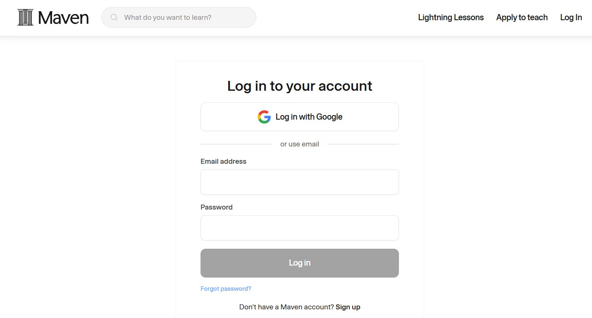
    <!-- sop-caption-start -->
    This screenshot matters for confirming the process is on the expected screen before the next action; look for the highlighted area or matching UI state shown in the image. Use it to verify the screen state, then complete the step described above.
    <!-- sop-caption-end -->
    <!-- sop-screenshot-end -->
<!-- sop-step-end -->

<!-- sop-step-start id=2 -->
2.  Navigate to Maven, go to the School dashboard and select “Lightning Lessons” at the left side of the screen. Under the UPCOMING, click on “+ New Lightning Lesson”.

    <!-- sop-screenshot-start -->
    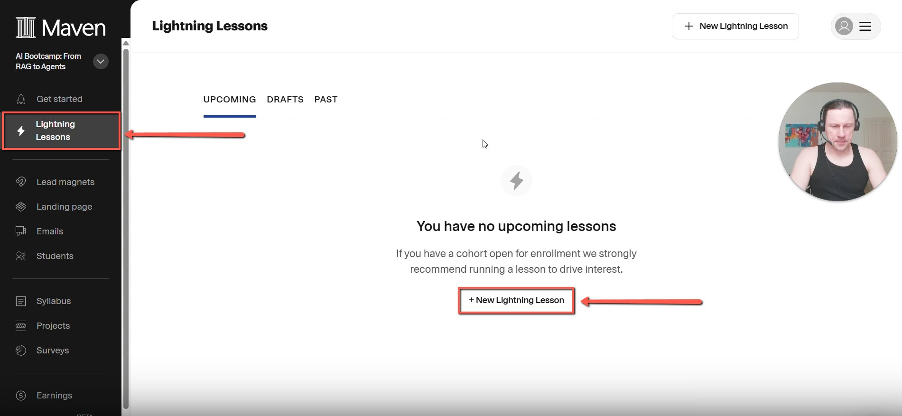
    <!-- sop-caption-start -->
    This screenshot matters for confirming the process is on the expected screen before the next action; look for the highlighted area or visible control labeled Lightning Lessons. Use that match to verify the screen state, then complete the step described above.
    <!-- sop-caption-end -->
    <!-- sop-screenshot-end -->
<!-- sop-step-end -->

<!-- sop-step-start id=3 -->
3.  We need to fill in the information and for us to do that. Go to Chatgpt/ Gemini and open a new chat then copy the [Maven prompt](../../prompts/maven-prompt.md).

    <!-- sop-screenshot-start -->
    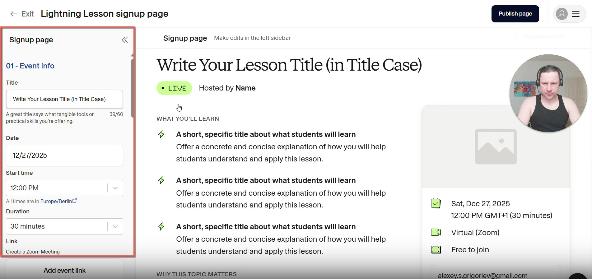
    <!-- sop-caption-start -->
    This screenshot matters for capturing or placing the correct link information; look for the highlighted area or matching UI state shown in the image. Use it to verify the screen state, then complete the step described above.
    <!-- sop-caption-end -->
    <!-- sop-screenshot-end -->
<!-- sop-step-end -->

<!-- sop-step-start id=4 -->
4.  Copy the content provided by Alexey.

    Note: There are multiple ways Alexey may provide the information, for example via a Telegram voice message or a link to ChatGPT. In this case, we had Chatgpt link, look and use for the latest conversation between Alexey and the agent and use that information to fill in the content in the prompt.

    <!-- sop-screenshot-start -->
    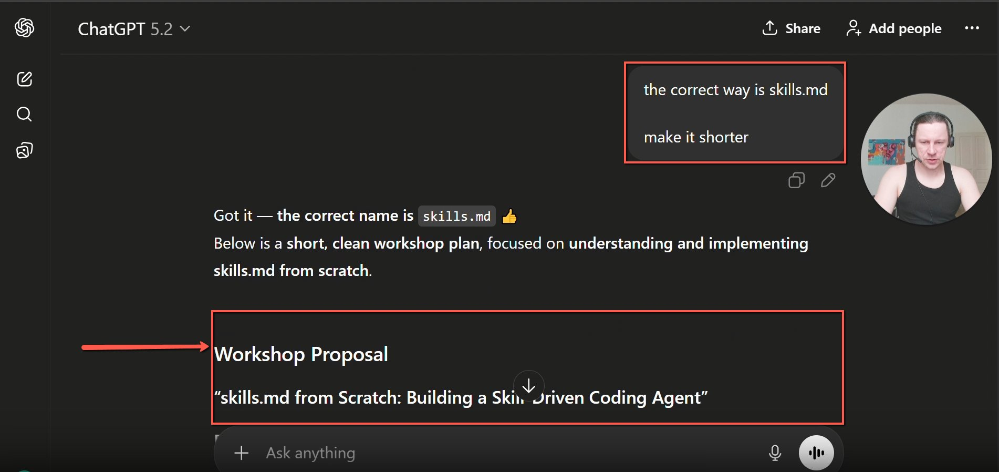
    <!-- sop-caption-start -->
    This screenshot matters for capturing or placing the correct link information; look for the highlighted area or matching UI state shown in the image. Use it to verify the screen state, then complete the step described above.
    <!-- sop-caption-end -->
    <!-- sop-screenshot-end -->
<!-- sop-step-end -->

<!-- sop-step-start id=5 -->
5.  Press enter to generate the information.

    <!-- sop-screenshot-start -->
    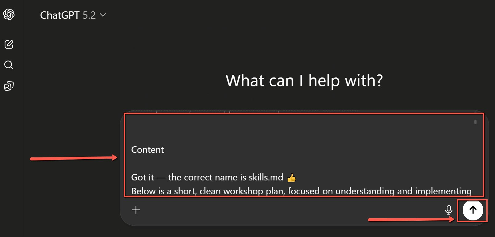
    <!-- sop-caption-start -->
    This screenshot matters for confirming the correct record, field, or status before updating the workflow; look for the highlighted area or visible control labeled enter to generate the information. Use that match to verify the screen state, then complete the step described above.
    <!-- sop-caption-end -->
    <!-- sop-screenshot-end -->
<!-- sop-step-end -->

<!-- sop-step-start id=6 -->
6.  Then use it to fill in the information in Maven

    Title: Use the title generated

    Date: Same process with other events in checking with Alexey and take note of the [calendar](../../../internal-admin/reference/alexey-s-calendar.md) as well.

    Start Time: Same process with other events in checking with Alexey and take note of the [calendar](../../../internal-admin/reference/alexey-s-calendar.md) as well.

    Duration: Typically for workshops is 1 hour and 30 minutes

    <!-- sop-screenshot-start -->
    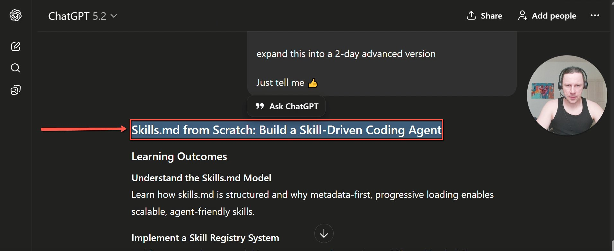
    <!-- sop-caption-start -->
    This screenshot matters for confirming the process is on the expected screen before the next action; look for the highlighted area or matching UI state shown in the image. Use it to verify the screen state, then complete the step described above.
    <!-- sop-caption-end -->
    <!-- sop-screenshot-end -->

    <!-- sop-screenshot-start -->
    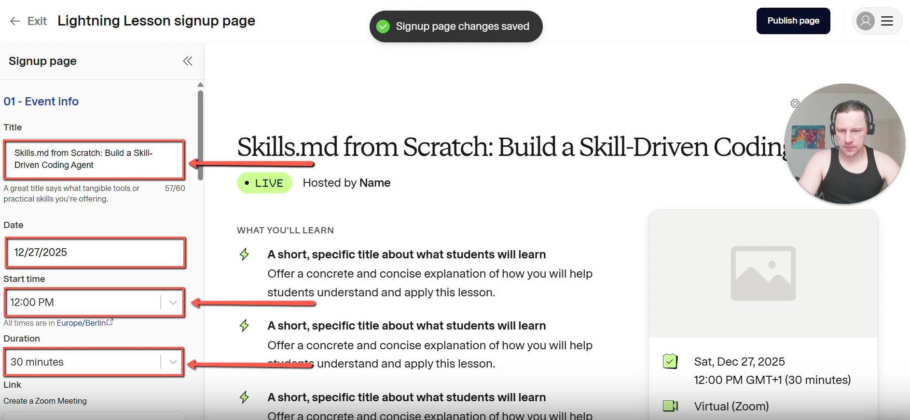
    <!-- sop-caption-start -->
    This screenshot matters for confirming the process is on the expected screen before the next action; look for the highlighted area or matching UI state shown in the image. Use it to verify the screen state, then complete the step described above.
    <!-- sop-caption-end -->
    <!-- sop-screenshot-end -->
<!-- sop-step-end -->

<!-- sop-step-start id=7 -->
7.  Scroll down and click “Add event link”.

    <!-- sop-screenshot-start -->
    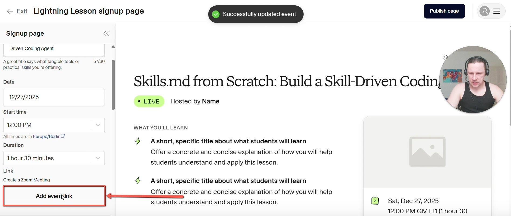
    <!-- sop-caption-start -->
    This screenshot matters for capturing or placing the correct link information; look for the highlighted area or visible control labeled Add event link. Use that match to verify the screen state, then complete the step described above.
    <!-- sop-caption-end -->
    <!-- sop-screenshot-end -->
<!-- sop-step-end -->

<!-- sop-step-start id=8 -->
8.  On the pop up window, click on “Create a Zoom meeting”.

    <!-- sop-screenshot-start -->
    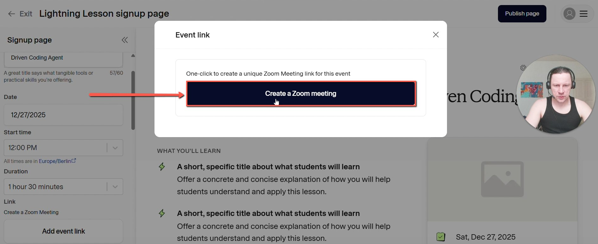
    <!-- sop-caption-start -->
    This screenshot matters for confirming the process is on the expected screen before the next action; look for the highlighted area or visible control labeled Create a Zoom meeting. Use that match to verify the screen state, then complete the step described above.
    <!-- sop-caption-end -->
    <!-- sop-screenshot-end -->
<!-- sop-step-end -->

<!-- sop-step-start id=9 -->
9.  Click on “Done”.

    <!-- sop-screenshot-start -->
    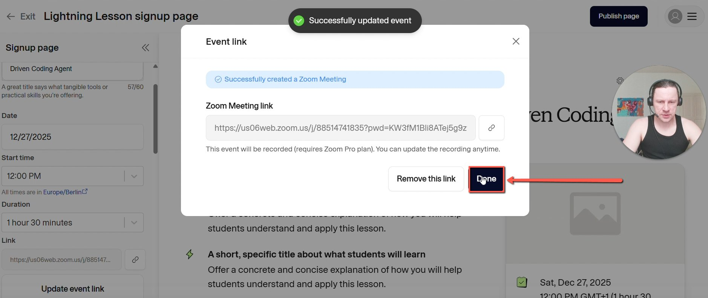
    <!-- sop-caption-start -->
    This screenshot matters for confirming the process is on the expected screen before the next action; look for the highlighted area or visible control labeled Done. Use that match to verify the screen state, then complete the step described above.
    <!-- sop-caption-end -->
    <!-- sop-screenshot-end -->
<!-- sop-step-end -->

<!-- sop-step-start id=10 -->
10. Scroll down to “02 - Lesson Image”, click on “Replace image” and follow this process document [Creating Pictures for Maven Lightning Lessons in Canva](creating-pictures-for-maven-lightning-lessons-in-canva.md) to generate the image. Then click on “Upload”.

    <!-- sop-screenshot-start -->
    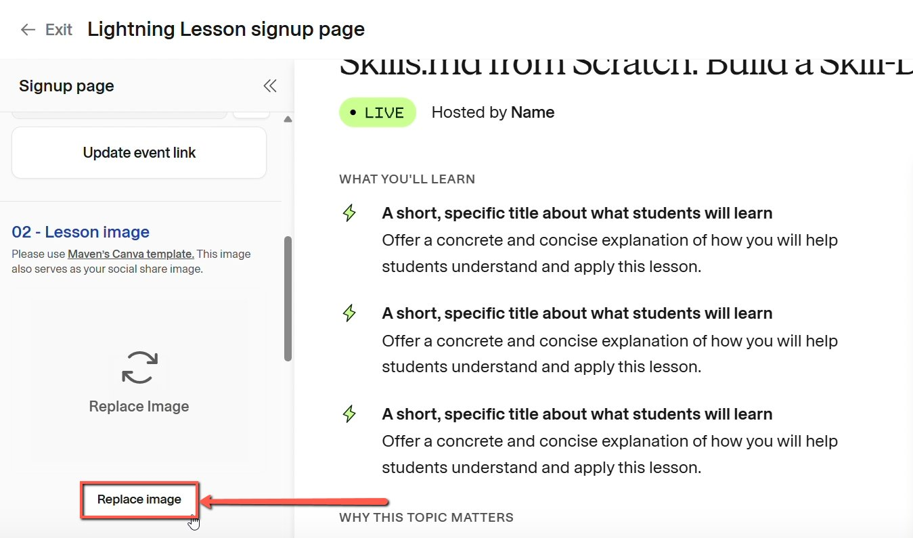
    <!-- sop-caption-start -->
    This screenshot matters for confirming the process is on the expected screen before the next action; look for the highlighted area or visible control labeled 02 - Lesson Image. Use that match to verify the screen state, then complete the step described above.
    <!-- sop-caption-end -->
    <!-- sop-screenshot-end -->

    <!-- sop-screenshot-start -->
    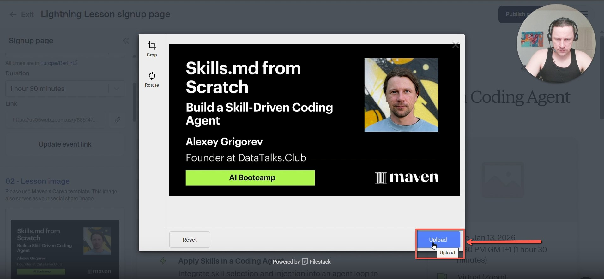
    <!-- sop-caption-start -->
    This screenshot matters for confirming the process is on the expected screen before the next action; look for the highlighted area or visible control labeled 02 - Lesson Image. Use that match to verify the screen state, then complete the step described above.
    <!-- sop-caption-end -->
    <!-- sop-screenshot-end -->
<!-- sop-step-end -->

<!-- sop-step-start id=11 -->
11. Scroll down to “03 - Learning Outcomes” and click on 01.

    <!-- sop-screenshot-start -->
    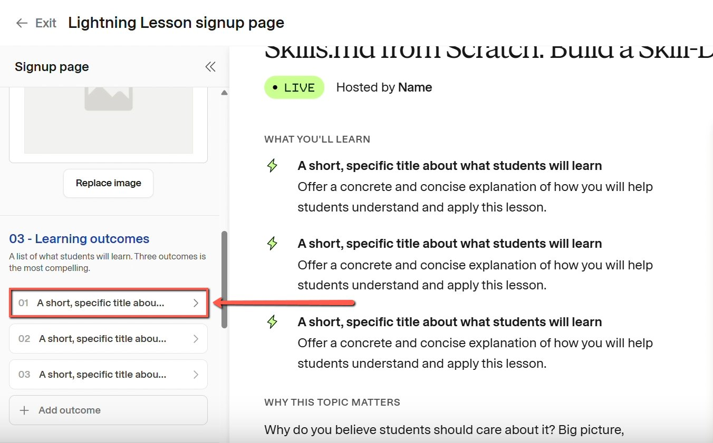
    <!-- sop-caption-start -->
    This screenshot matters for confirming the process is on the expected screen before the next action; look for the highlighted area or visible control labeled 03 - Learning Outcomes. Use that match to verify the screen state, then complete the step described above.
    <!-- sop-caption-end -->
    <!-- sop-screenshot-end -->
<!-- sop-step-end -->

<!-- sop-step-start id=12 -->
12. Go back to ChatGPT and copy the generated text, then paste it into the “Outcome Title”.

    <!-- sop-screenshot-start -->
    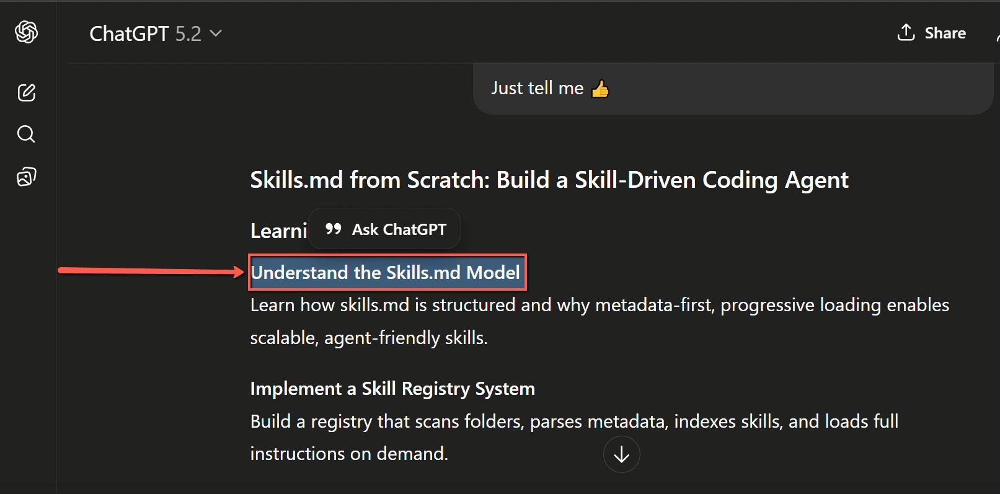
    <!-- sop-caption-start -->
    This screenshot matters for capturing or placing the correct link information; look for the highlighted area or visible control labeled Outcome Title. Use that match to verify the screen state, then complete the step described above.
    <!-- sop-caption-end -->
    <!-- sop-screenshot-end -->

    <!-- sop-screenshot-start -->
    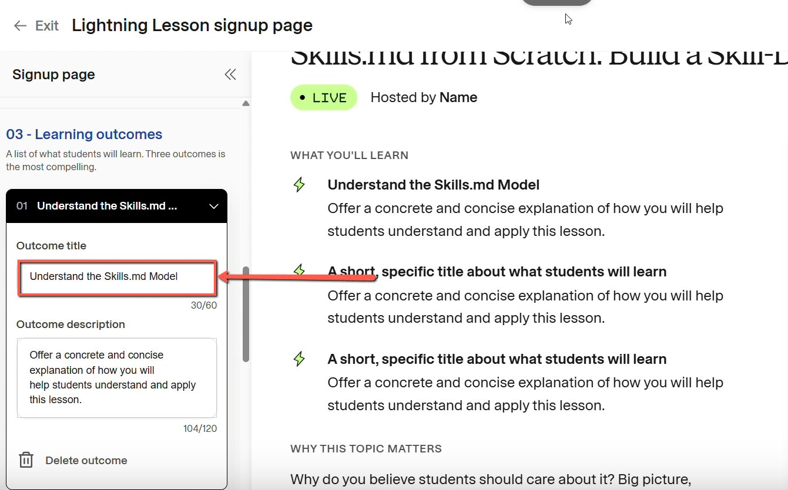
    <!-- sop-caption-start -->
    This screenshot matters for capturing or placing the correct link information; look for the highlighted area or visible control labeled Outcome Title. Use that match to verify the screen state, then complete the step described above.
    <!-- sop-caption-end -->
    <!-- sop-screenshot-end -->
<!-- sop-step-end -->

<!-- sop-step-start id=13 -->
13. Go back to ChatGPT and copy the generated text, then paste it into the “Outcome Description”.

    <!-- sop-screenshot-start -->
    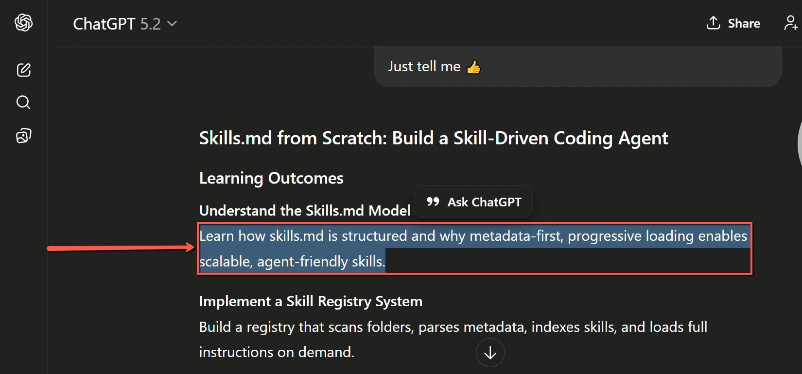
    <!-- sop-caption-start -->
    This screenshot matters for capturing or placing the correct link information; look for the highlighted area or visible control labeled Outcome Description. Use that match to verify the screen state, then complete the step described above.
    <!-- sop-caption-end -->
    <!-- sop-screenshot-end -->

    <!-- sop-screenshot-start -->
    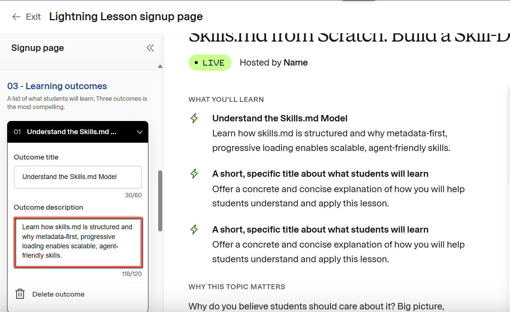
    <!-- sop-caption-start -->
    This screenshot matters for capturing or placing the correct link information; look for the highlighted area or visible control labeled Outcome Description. Use that match to verify the screen state, then complete the step described above.
    <!-- sop-caption-end -->
    <!-- sop-screenshot-end -->
<!-- sop-step-end -->

<!-- sop-step-start id=14 -->
14. Do the same “03 - Learning Outcomes” for \#02 and \#03.
<!-- sop-step-end -->

<!-- sop-step-start id=15 -->
15. Scroll down to “04 - Why this topic matters” and go back to ChatGPT and copy the generated text, then paste it into the text box.

    <!-- sop-screenshot-start -->
    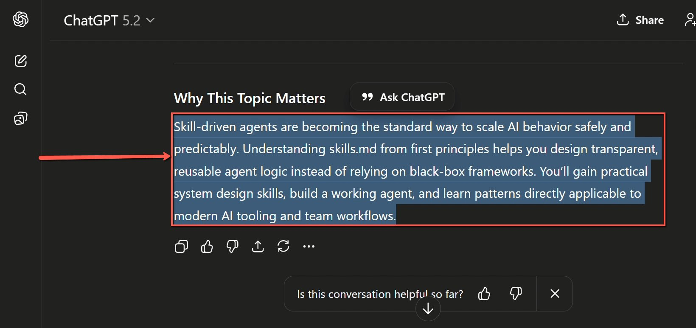
    <!-- sop-caption-start -->
    This screenshot matters for capturing or placing the correct link information; look for the highlighted area or visible control labeled 04 - Why this topic matters. Use that match to verify the screen state, then complete the step described above.
    <!-- sop-caption-end -->
    <!-- sop-screenshot-end -->

    <!-- sop-screenshot-start -->
    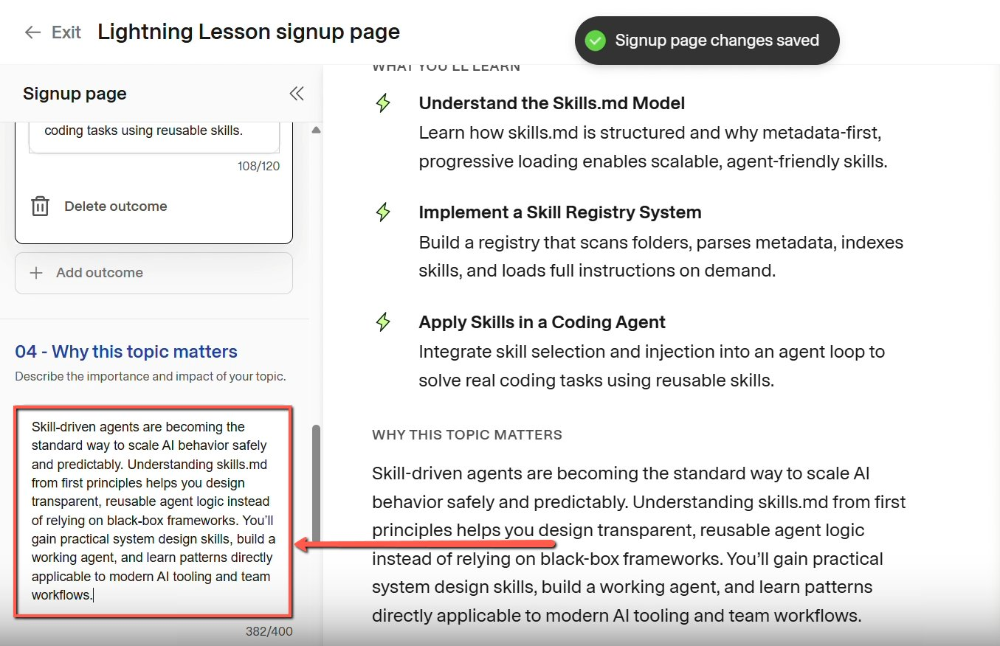
    <!-- sop-caption-start -->
    This screenshot matters for capturing or placing the correct link information; look for the highlighted area or visible control labeled 04 - Why this topic matters. Use that match to verify the screen state, then complete the step described above.
    <!-- sop-caption-end -->
    <!-- sop-screenshot-end -->
<!-- sop-step-end -->

<!-- sop-step-start id=16 -->
16. Scroll down to “05 - You’ll learn from” and click on “01 Name”. Fill up the information

    Instructor name: Alexey Grigorev

    Mini Bio: \[Copy the information from the previous [Maven Lightning Lesson](https://maven.com/p/599db5/ai-bootcamp-demo-day)\]

    More about you: \[Copy the information from the previous [Maven Lightning Lesson](https://maven.com/p/599db5/ai-bootcamp-demo-day)\]

    <!-- sop-screenshot-start -->
    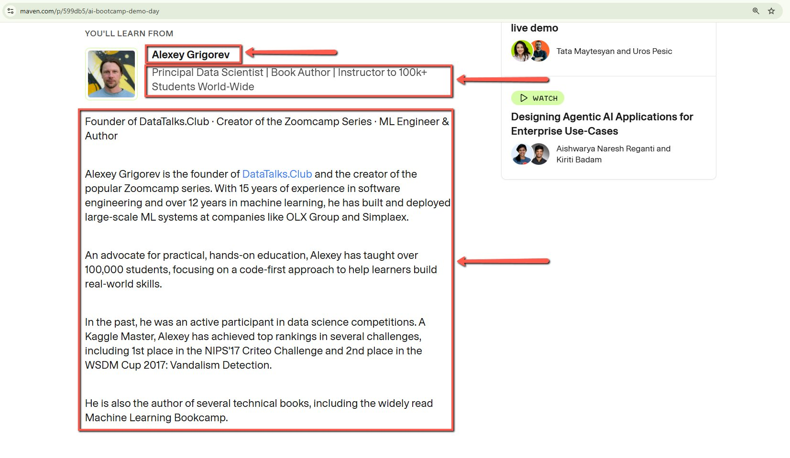
    <!-- sop-caption-start -->
    This screenshot matters for capturing or placing the correct link information; look for the highlighted area or visible control related to the previous Maven Lightning Lesson information. Use that match to verify the screen state, then complete the step described above.
    <!-- sop-caption-end -->
    <!-- sop-screenshot-end -->

    <!-- sop-screenshot-start -->
    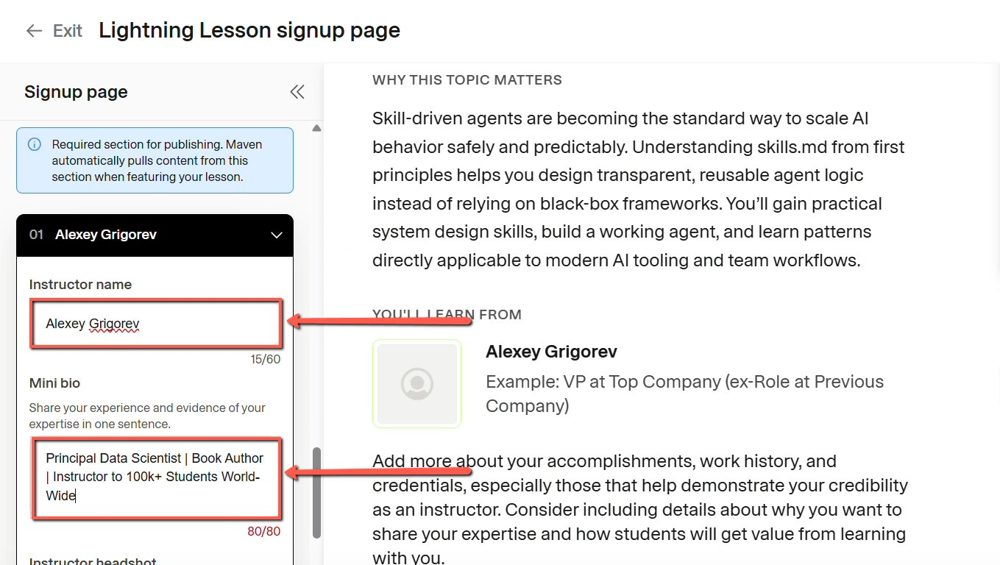
    <!-- sop-caption-start -->
    This screenshot matters for capturing or placing the correct link information; look for the highlighted area or visible control related to the previous Maven Lightning Lesson information. Use that match to verify the screen state, then complete the step described above.
    <!-- sop-caption-end -->
    <!-- sop-screenshot-end -->

    <!-- sop-screenshot-start -->
    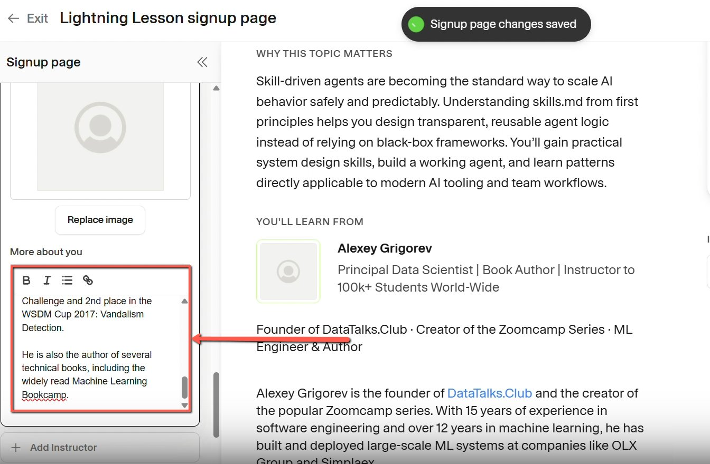
    <!-- sop-caption-start -->
    This screenshot matters for capturing or placing the correct link information; look for the highlighted area or visible control related to the previous Maven Lightning Lesson information. Use that match to verify the screen state, then complete the step described above.
    <!-- sop-caption-end -->
    <!-- sop-screenshot-end -->
<!-- sop-step-end -->

<!-- sop-step-start id=17 -->
17. For the instructor headshot, click on replace and upload [Alexey’s image](https://drive.google.com/file/d/1ZHz-eeIjRHy6EDmJoLCR4zc8mqnYDF58/view?usp=drive_link).

    <!-- sop-screenshot-start -->
    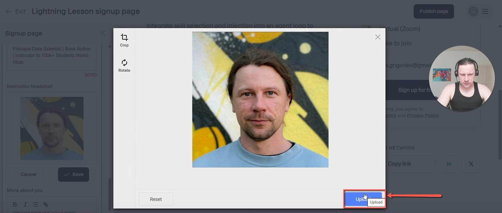
    <!-- sop-caption-start -->
    This screenshot matters for confirming the upload, publishing, or scheduling state before it becomes user-facing; look for the highlighted area or visible control labeled replace and upload Alexey’s image. Use that match to verify the screen state, then complete the step described above.
    <!-- sop-caption-end -->
    <!-- sop-screenshot-end -->
<!-- sop-step-end -->

<!-- sop-step-start id=18 -->
18. After filling up the information, go to the upper right part and click on the “Publish page” button.

    <!-- sop-screenshot-start -->
    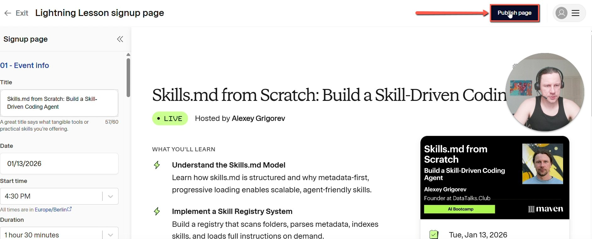
    <!-- sop-caption-start -->
    This screenshot matters for confirming the upload, publishing, or scheduling state before it becomes user-facing; look for the highlighted area or visible control labeled Publish page. Use that match to verify the screen state, then complete the step described above.
    <!-- sop-caption-end -->
    <!-- sop-screenshot-end -->
<!-- sop-step-end -->

<!-- sop-step-start id=19 -->
19. On the pop up notification, click on the “Publish and open for signups” button.

    <!-- sop-screenshot-start -->
    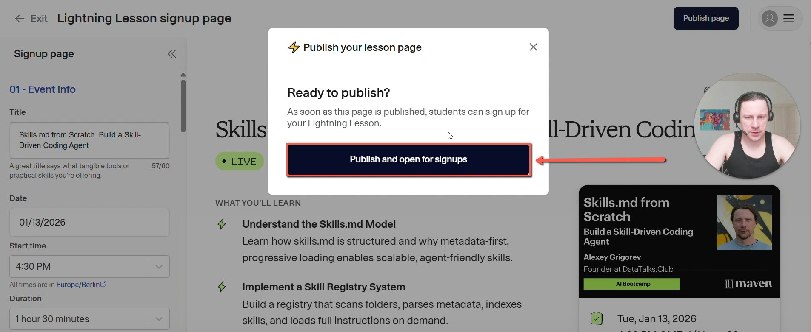
    <!-- sop-caption-start -->
    This screenshot matters for confirming the upload, publishing, or scheduling state before it becomes user-facing; look for the highlighted area or visible control labeled Publish and open for signups. Use that match to verify the screen state, then complete the step described above.
    <!-- sop-caption-end -->
    <!-- sop-screenshot-end -->
<!-- sop-step-end -->

<!-- sop-step-start id=20 -->
20. Copy the link and share it with Valeriia and Alexey via Telegram on the DTC content team channel.

    <!-- sop-screenshot-start -->
    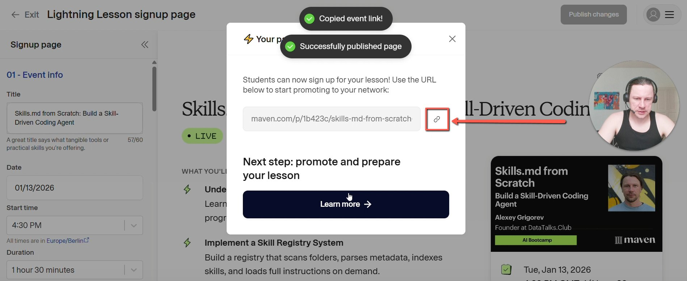
    <!-- sop-caption-start -->
    This screenshot matters for capturing or placing the correct link information; look for the highlighted area or matching UI state shown in the image. Use it to verify the screen state, then complete the step described above.
    <!-- sop-caption-end -->
    <!-- sop-screenshot-end -->

    <!-- sop-screenshot-start -->
    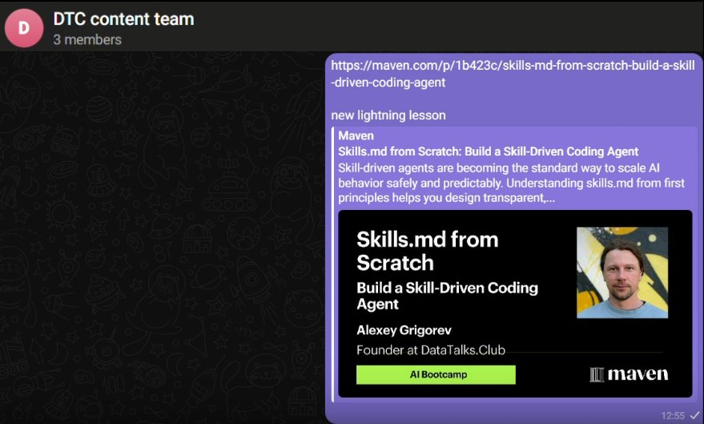
    <!-- sop-caption-start -->
    This screenshot matters for capturing or placing the correct link information; look for the highlighted area or matching UI state shown in the image. Use it to verify the screen state, then complete the step described above.
    <!-- sop-caption-end -->
    <!-- sop-screenshot-end -->
<!-- sop-step-end -->
<!-- sop-section-end -->

<!-- sop-section-start: validation -->
## Validation

-
<!-- sop-section-end -->

<!-- sop-section-start: troubleshooting -->
## Troubleshooting

-
<!-- sop-section-end -->

<!-- sop-section-start: references -->
## References

-
<!-- sop-section-end -->
