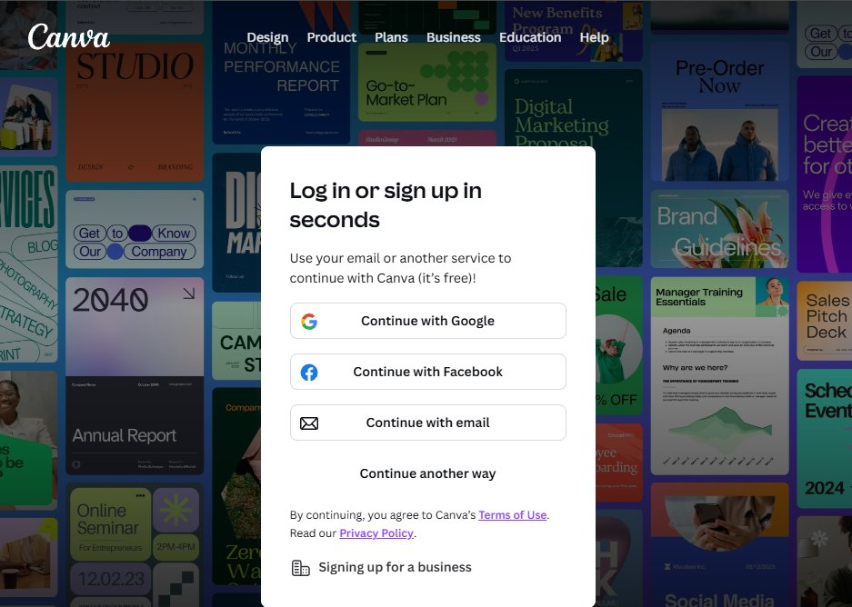
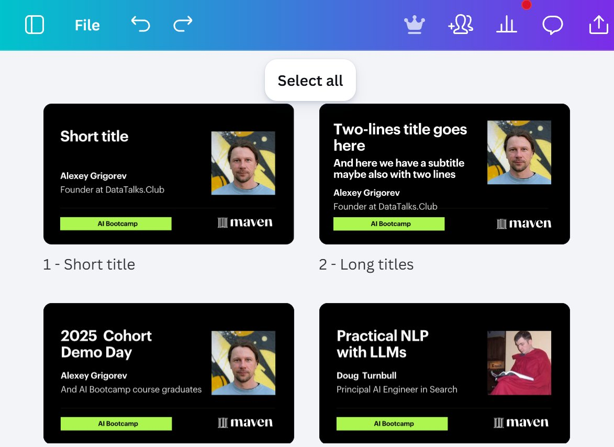
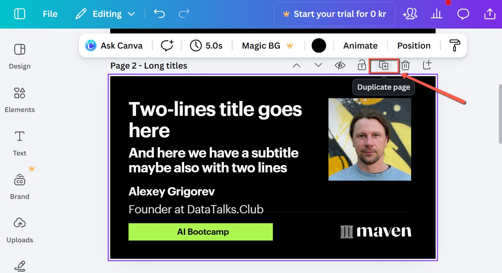
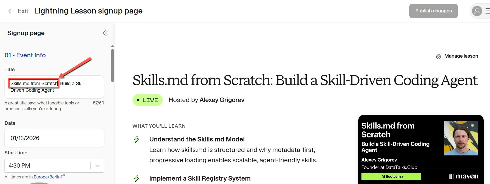
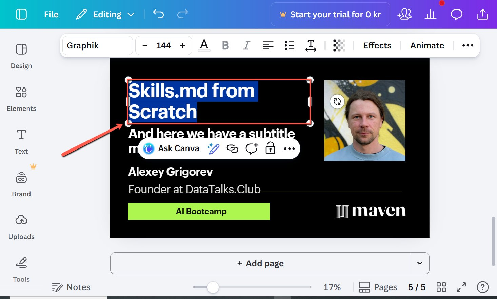
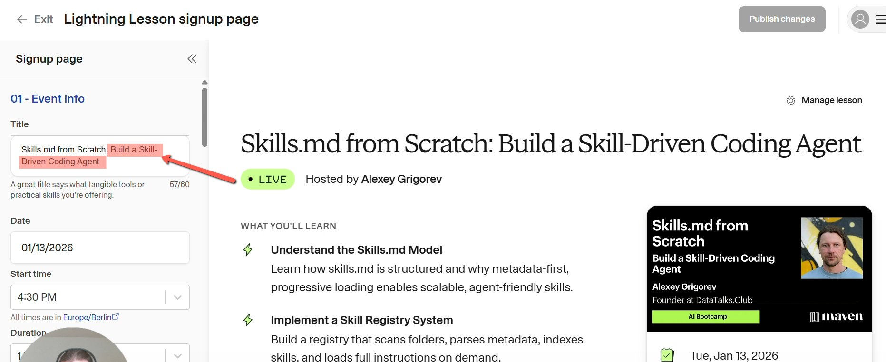
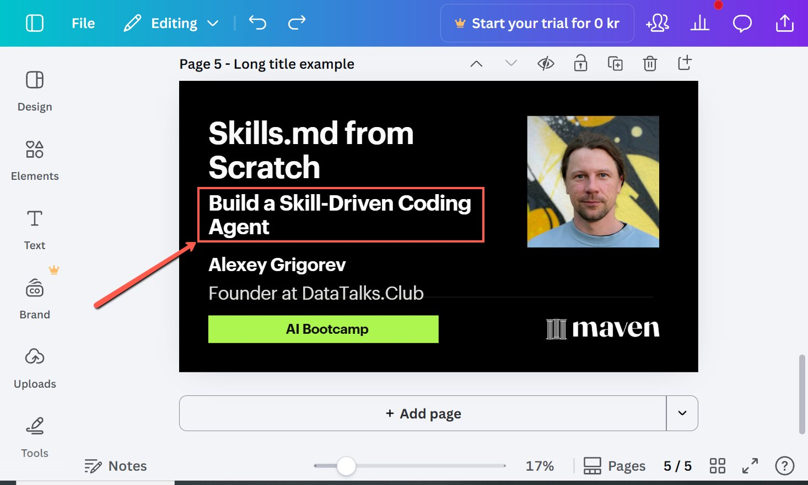
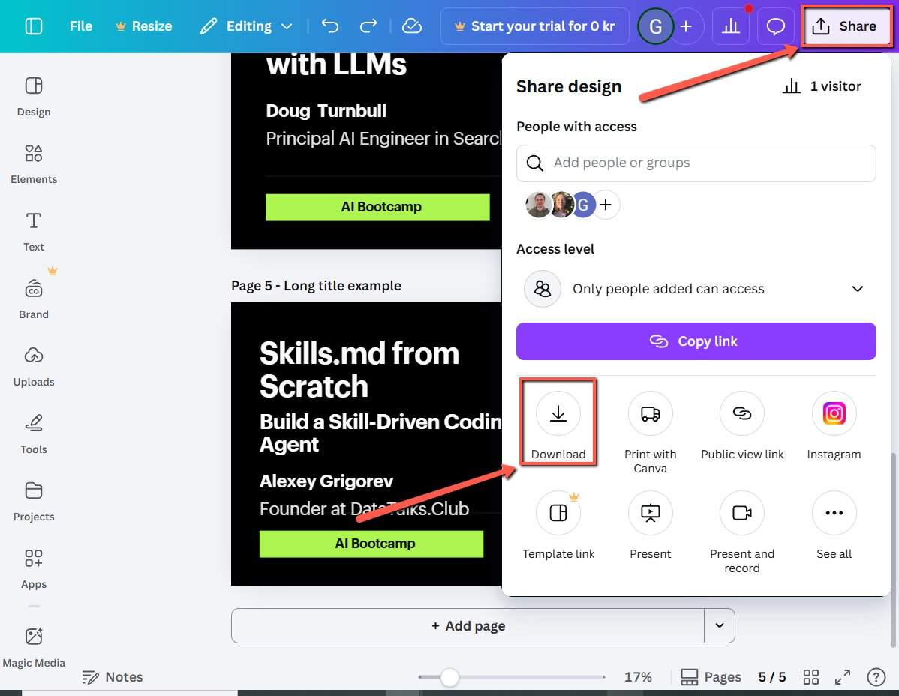
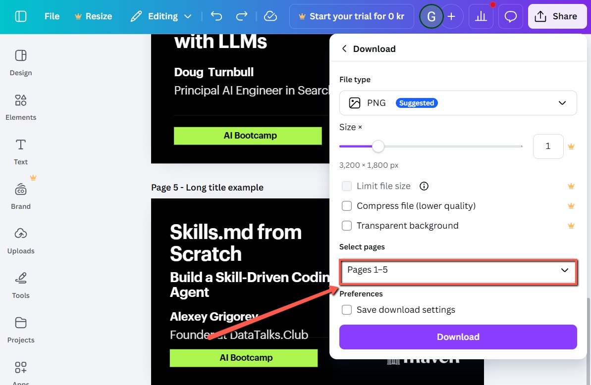
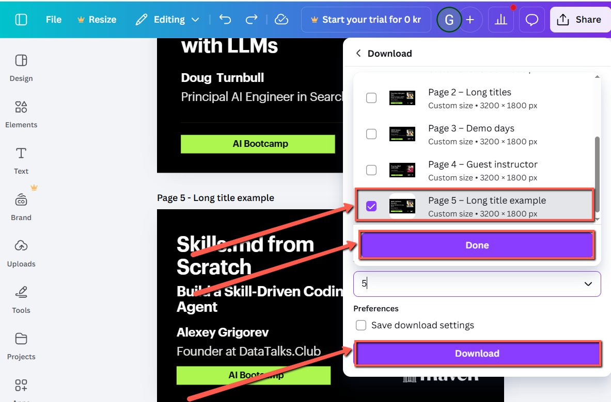

# Creating Pictures for Maven Lightning Lessons in Canva

<!-- sop-section-start: summary -->
## Summary

- Purpose: Create branded Canva pictures for Maven Lightning Lessons.
- Outcome: A correctly formatted image is ready to use for the Maven lesson.
- Trigger: A Maven Lightning Lesson needs its visual assets.
- Frequency: Per Maven Lightning Lesson.
<!-- sop-section-end -->

<!-- sop-section-start: prerequisites -->
## Prerequisites

- Access: Canva template project and the Maven lesson page.
- Tools: Canva, Maven.
- Inputs: Lesson title, event type, guest name, and guest image if needed.
<!-- sop-section-end -->

<!-- sop-section-start: procedure -->
## Procedure

<!-- sop-prose-start -->
Creating Pictures for Maven Lightning Lessons in Canva
This procedure will show you the steps on how to create Pictures for Maven Lightning Lessons in Canva.

Step-by-step Instructions
<!-- sop-prose-end -->

<!-- sop-step-start id=1 -->
1.  Log in to [Canva](https://www.canva.com/en_ph/login/).

    <!-- sop-screenshot-start -->
    
    <!-- sop-caption-start -->
    This screenshot matters for confirming the process is on the expected screen before the next action; look for the highlighted area or matching UI state shown in the image. Use it to verify the screen state, then complete the step described above.
    <!-- sop-caption-end -->
    <!-- sop-screenshot-end -->
<!-- sop-step-end -->

<!-- sop-step-start id=2 -->
2.  Use this [Canva Link](https://www.canva.com/design/DAG8DArY_6A/n-ocIS9muZ-aGRLK9qx0HQ/edit?utm_content=DAG8DArY_6A&utm_campaign=designshare&utm_medium=link2&utm_source=sharebutton) to access the templates. This opens the project where all the ready-to-use templates are stored.
<!-- sop-step-end -->

<!-- sop-step-start id=3 -->
3.  To determine when to use specific template:

    <!-- sop-screenshot-start -->
    
    <!-- sop-caption-start -->
    This screenshot matters for confirming the process is on the expected screen before the next action; look for the highlighted area or matching UI state shown in the image. Use it to verify the screen state, then complete the step described above.
    <!-- sop-caption-end -->
    <!-- sop-screenshot-end -->

    | Page \# | Template Name    | When to Use This                | What to Edit                                                     |
    |-------------|----------------------|-------------------------------------|----------------------------------------------------------------------|
    | Page 1  | Short Title      | Title is only 1–3 words.            | Just type the title. The big font is pre-set.                        |
    | Page 2  | Long Titles      | Title is long and needs more space. | Type the title. The spacing is already done.                         |
    | Page 4  | Demo Days        | For regular Demo Day events.        | Update the year and cohort (e.g., 2026 Cohort 1).                    |
    | Page 5  | Guest Instructor | When a guest speaker is teaching.   | Type the guest’s name in the name box and replace the guest’s image. |
<!-- sop-step-end -->

<!-- sop-step-start id=4 -->
4.  Find the page you need. Click the Duplicate Page icon (the small plus sign above the page) to make a copy. In this example we will use a template for Long titles.

    Note: Only change the copy. Do not change the original templates.

    <!-- sop-screenshot-start -->
    
    <!-- sop-caption-start -->
    This screenshot matters for capturing or placing the correct link information; look for the highlighted area or matching UI state shown in the image. Use it to verify the screen state, then complete the step described above.
    <!-- sop-caption-end -->
    <!-- sop-screenshot-end -->
<!-- sop-step-end -->

<!-- sop-step-start id=5 -->
5.  Go back to Maven and copy the first part of the title.

    <!-- sop-screenshot-start -->
    
    <!-- sop-caption-start -->
    This screenshot matters for capturing or placing the correct link information; look for the highlighted area or visible control labeled first part of the title. Use that match to verify the screen state, then complete the step described above.
    <!-- sop-caption-end -->
    <!-- sop-screenshot-end -->
<!-- sop-step-end -->

<!-- sop-step-start id=6 -->
6.  Click on the text box and paste or type in the Title.

    Note: Do not change the font or the size, as these are already set for the brand. If the text looks slightly uncentered, you can nudge the box up or down with your mouse.

    <!-- sop-screenshot-start -->
    
    <!-- sop-caption-start -->
    This screenshot matters for confirming the process is on the expected screen before the next action; look for the highlighted area or matching UI state shown in the image. Use it to verify the screen state, then complete the step described above.
    <!-- sop-caption-end -->
    <!-- sop-screenshot-end -->
<!-- sop-step-end -->

<!-- sop-step-start id=7 -->
7.  Go back to Maven and copy the second part of the title.

    <!-- sop-screenshot-start -->
    
    <!-- sop-caption-start -->
    This screenshot matters for capturing or placing the correct link information; look for the highlighted area or visible control labeled second part of the title. Use that match to verify the screen state, then complete the step described above.
    <!-- sop-caption-end -->
    <!-- sop-screenshot-end -->
<!-- sop-step-end -->

<!-- sop-step-start id=8 -->
8.  Click on the text box and paste or type in the second part of the title.

    <!-- sop-screenshot-start -->
    
    <!-- sop-caption-start -->
    This screenshot matters for capturing or placing the correct link information; look for the highlighted area or matching UI state shown in the image. Use it to verify the screen state, then complete the step described above.
    <!-- sop-caption-end -->
    <!-- sop-screenshot-end -->
<!-- sop-step-end -->

<!-- sop-step-start id=9 -->
9.  Once done, click “Share” in the top right corner. On the pop up box, click “Download.”

    <!-- sop-screenshot-start -->
    
    <!-- sop-caption-start -->
    This screenshot matters for confirming the download or export step is using the right option; look for the highlighted area or visible control labeled Share. Use that match to verify the screen state, then complete the step described above.
    <!-- sop-caption-end -->
    <!-- sop-screenshot-end -->
<!-- sop-step-end -->

<!-- sop-step-start id=10 -->
10. Under Select pages, click the dropdown option.

    Image note: This screenshot matters for confirming the process is on the expected screen before the next action; look for the highlighted area or visible control labeled pages. Use that match to verify the screen state, then complete the step described above.
<!-- sop-step-end -->

<!-- sop-step-start id=11 -->
11. Uncheck "All Pages" and check only the box for the page you just created. Click “Done” and then click “Download”.

    <!-- sop-screenshot-start -->
    
    <!-- sop-caption-start -->
    This screenshot matters for confirming the download or export step is using the right option; look for the highlighted area or visible control labeled All Pages. Use that match to verify the screen state, then complete the step described above.
    <!-- sop-caption-end -->
    <!-- sop-screenshot-end -->
<!-- sop-step-end -->
<!-- sop-section-end -->

<!-- sop-section-start: validation -->
## Validation

-
<!-- sop-section-end -->

<!-- sop-section-start: troubleshooting -->
## Troubleshooting

-
<!-- sop-section-end -->

<!-- sop-section-start: references -->
## References

-
<!-- sop-section-end -->
