# Downloading, Uploading and Editing Maven Videos for YouTube

<!-- sop-section-start: summary -->
## Summary

- Purpose: Download a Maven recording and publish the edited video on YouTube.
- Outcome: The Maven recording is uploaded, configured, edited, and ready on the correct YouTube channel.
- Trigger: A Maven Lightning Lesson recording is available.
- Frequency: Per Maven recording.
<!-- sop-section-end -->

<!-- sop-section-start: prerequisites -->
## Prerequisites

- Access: Forwarded Zoom recording link, recording password, and Alexey personal YouTube channel.
- Tools: Zoom recording page, YouTube Studio.
- Inputs: Recording link and password, lesson title, description, thumbnail, and edit notes.
<!-- sop-section-end -->

<!-- sop-section-start: procedure -->
## Procedure

<!-- sop-prose-start -->
Downloading, Uploading and Editing Maven Videos for YouTube
This procedure will show you the steps on how to Download, Upload and Edit Maven Videos for YouTube.

Step-by-step Instructions
<!-- sop-prose-end -->

<!-- sop-step-start id=1 -->
1.  Go to the email and check the link forwarded by Alexey. Click the link, and use the password to log in and access the Zoom video link then click “Watch Recording”.

    Note: You should recognize which event it belongs to based on the file name or context of the recent Lightning Lesson.

    <!-- sop-screenshot-start -->
    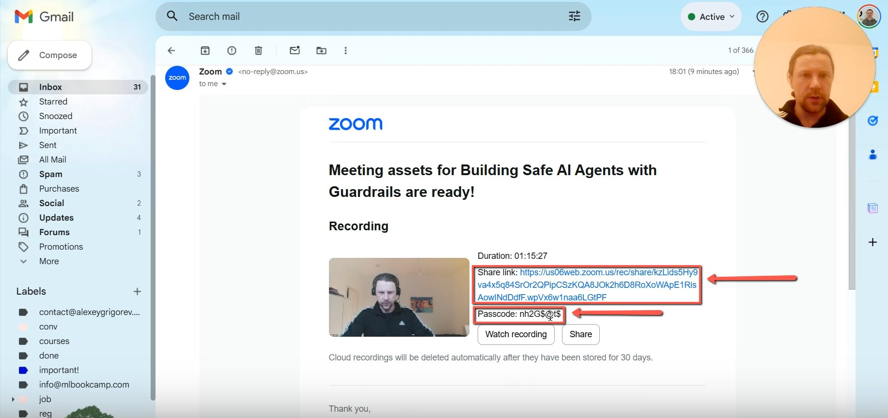
    <!-- sop-caption-start -->
    This screenshot matters for confirming the process is on the expected screen before the next action; look for the highlighted area or matching UI state shown in the image. Use it to verify the screen state, then complete the step described above.
    <!-- sop-caption-end -->
    <!-- sop-screenshot-end -->

    <!-- sop-screenshot-start -->
    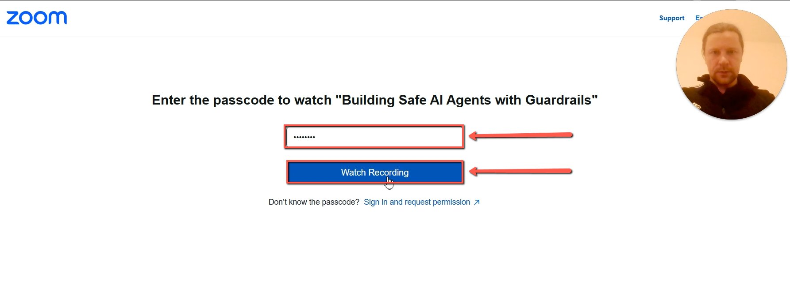
    <!-- sop-caption-start -->
    This screenshot matters for confirming the process is on the expected screen before the next action; look for the highlighted area or matching UI state shown in the image. Use it to verify the screen state, then complete the step described above.
    <!-- sop-caption-end -->
    <!-- sop-screenshot-end -->
<!-- sop-step-end -->

<!-- sop-step-start id=2 -->
2.  Click “Download” at the upper part of the screen. Wait for the download to finish completely before moving to the next step.

    <!-- sop-screenshot-start -->
    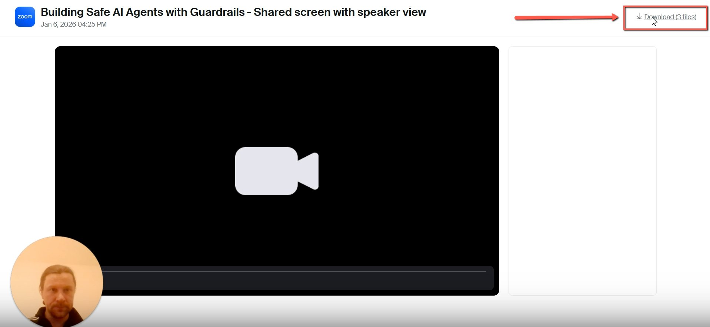
    <!-- sop-caption-start -->
    This screenshot matters for confirming the download or export step is using the right option; look for the highlighted area or visible control labeled Download. Use that match to verify the screen state, then complete the step described above.
    <!-- sop-caption-end -->
    <!-- sop-screenshot-end -->
<!-- sop-step-end -->

<!-- sop-step-start id=3 -->
3.  Log in to Alexey’s personal youtube channel account. Click “Select files”.

    Note: Ensure you are uploading to the Personal Channel, NOT the DataTalks.Club channel.

    <!-- sop-screenshot-start -->
    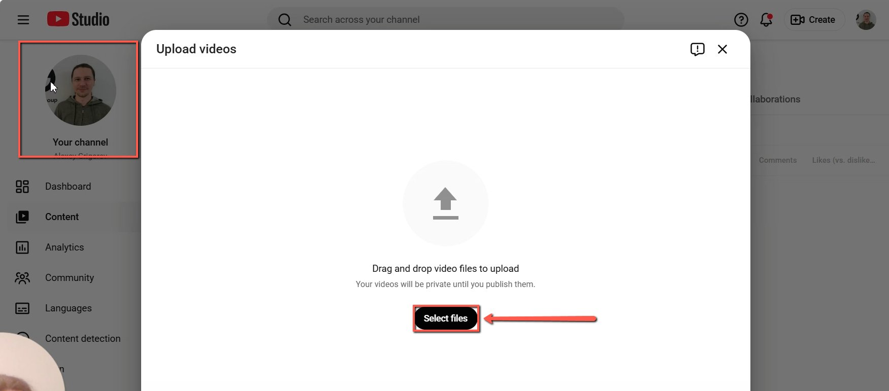
    <!-- sop-caption-start -->
    This screenshot matters for confirming the upload, publishing, or scheduling state before it becomes user-facing; look for the highlighted area or matching UI state shown in the image. Use it to verify the screen state, then complete the step described above.
    <!-- sop-caption-end -->
    <!-- sop-screenshot-end -->
<!-- sop-step-end -->

<!-- sop-step-start id=4 -->
4.  Select the downloaded video from your File manager.

    <!-- sop-screenshot-start -->
    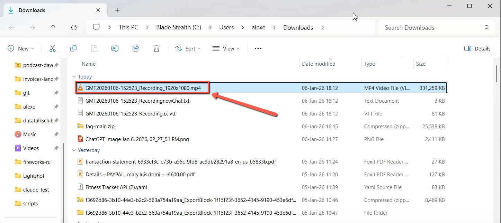
    <!-- sop-caption-start -->
    This screenshot matters for confirming the download or export step is using the right option; look for the highlighted area or visible control labeled downloaded video from your File manager. Use that match to verify the screen state, then complete the step described above.
    <!-- sop-caption-end -->
    <!-- sop-screenshot-end -->
<!-- sop-step-end -->

<!-- sop-step-start id=5 -->
5.  Copy the title of the Lightning Lesson

    <!-- sop-screenshot-start -->
    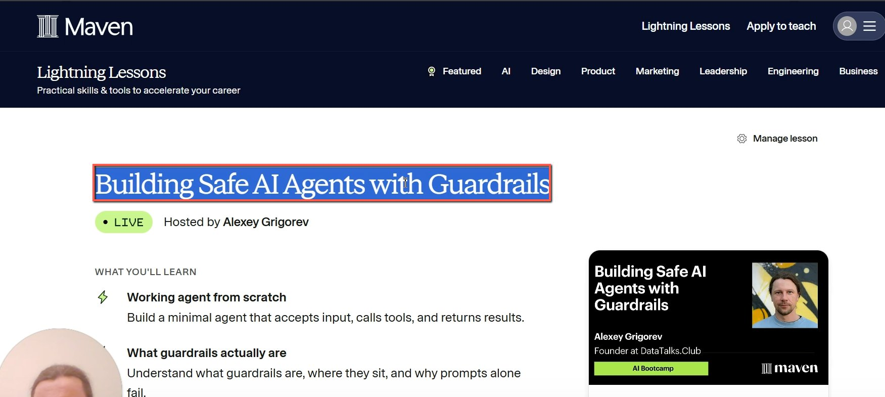
    <!-- sop-caption-start -->
    This screenshot matters for capturing or placing the correct link information; look for the highlighted area or visible control labeled title of the Lightning Lesson. Use that match to verify the screen state, then complete the step described above.
    <!-- sop-caption-end -->
    <!-- sop-screenshot-end -->
<!-- sop-step-end -->

<!-- sop-step-start id=6 -->
6.  Paste it in the title field on Youtube.

    <!-- sop-screenshot-start -->
    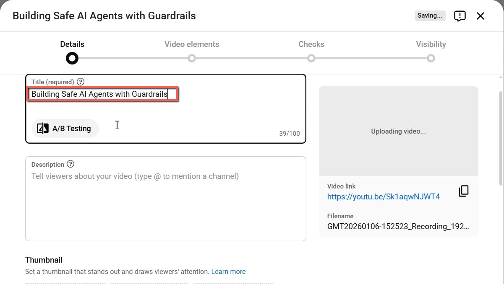
    <!-- sop-caption-start -->
    This screenshot matters for capturing or placing the correct link information; look for the highlighted area or visible control labeled it in the title field on Youtube. Use that match to verify the screen state, then complete the step described above.
    <!-- sop-caption-end -->
    <!-- sop-screenshot-end -->
<!-- sop-step-end -->

<!-- sop-step-start id=7 -->
7.  For the description, copy the description on the Maven Lightning Lesson.

    <!-- sop-screenshot-start -->
    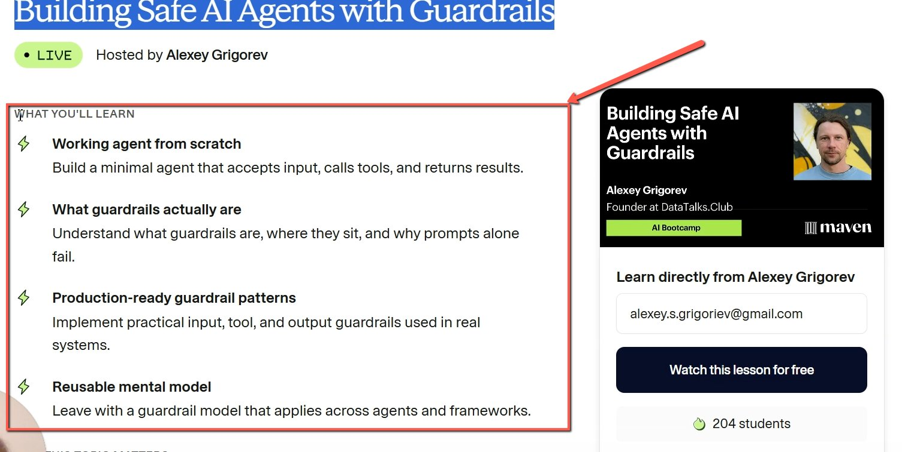
    <!-- sop-caption-start -->
    This screenshot matters for capturing or placing the correct link information; look for the highlighted area or visible control labeled description on the Maven Lightning Lesson. Use that match to verify the screen state, then complete the step described above.
    <!-- sop-caption-end -->
    <!-- sop-screenshot-end -->
<!-- sop-step-end -->

<!-- sop-step-start id=8 -->
8.  Paste it to the description field.

    <!-- sop-screenshot-start -->
    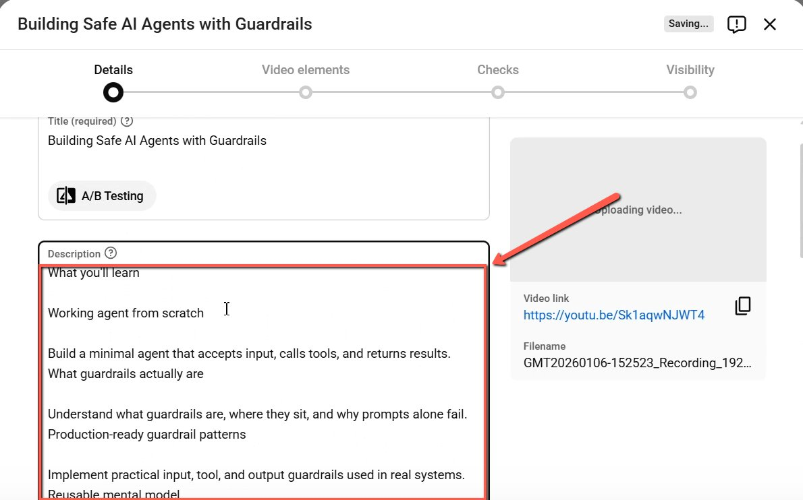
    <!-- sop-caption-start -->
    This screenshot matters for capturing or placing the correct link information; look for the highlighted area or visible control labeled it to the description field. Use that match to verify the screen state, then complete the step described above.
    <!-- sop-caption-end -->
    <!-- sop-screenshot-end -->

    Note: Edit the format, use a colon for “What you’ll learn” and “Why this topic matters,” and for the content of “What you’ll learn,” use a period.

    <!-- sop-screenshot-start -->
    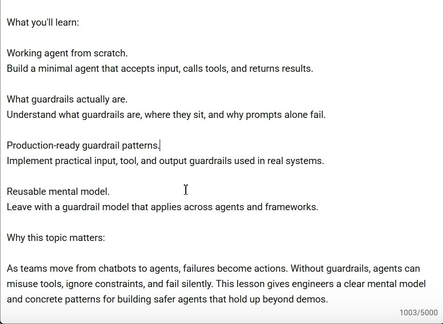
    <!-- sop-caption-start -->
    This screenshot matters for checking the editing, transcript, or timestamp workflow at this point; look for the highlighted area or visible control labeled What you’ll learn. Use that match to verify the screen state, then complete the step described above.
    <!-- sop-caption-end -->
    <!-- sop-screenshot-end -->
<!-- sop-step-end -->

<!-- sop-step-start id=9 -->
9.  Go to the recording chat and copy all the links that Alexey provided.

    Note: Do not copy the links provided by the other guests

    <!-- sop-screenshot-start -->
    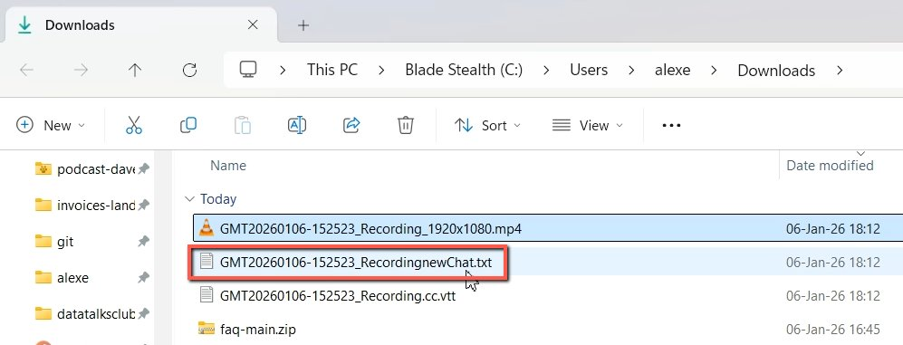
    <!-- sop-caption-start -->
    This screenshot matters for capturing or placing the correct link information; look for the highlighted area or visible control labeled links provided by the other guests. Use that match to verify the screen state, then complete the step described above.
    <!-- sop-caption-end -->
    <!-- sop-screenshot-end -->

    <!-- sop-screenshot-start -->
    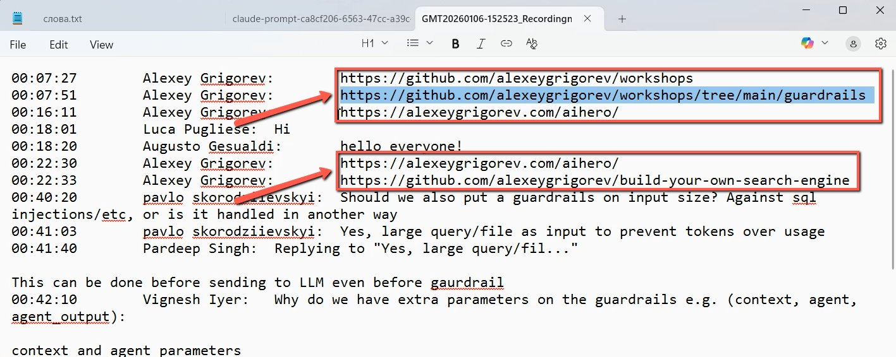
    <!-- sop-caption-start -->
    This screenshot matters for capturing or placing the correct link information; look for the highlighted area or visible control labeled links provided by the other guests. Use that match to verify the screen state, then complete the step described above.
    <!-- sop-caption-end -->
    <!-- sop-screenshot-end -->
<!-- sop-step-end -->

<!-- sop-step-start id=10 -->
10. Paste the links to the description field.

    <!-- sop-screenshot-start -->
    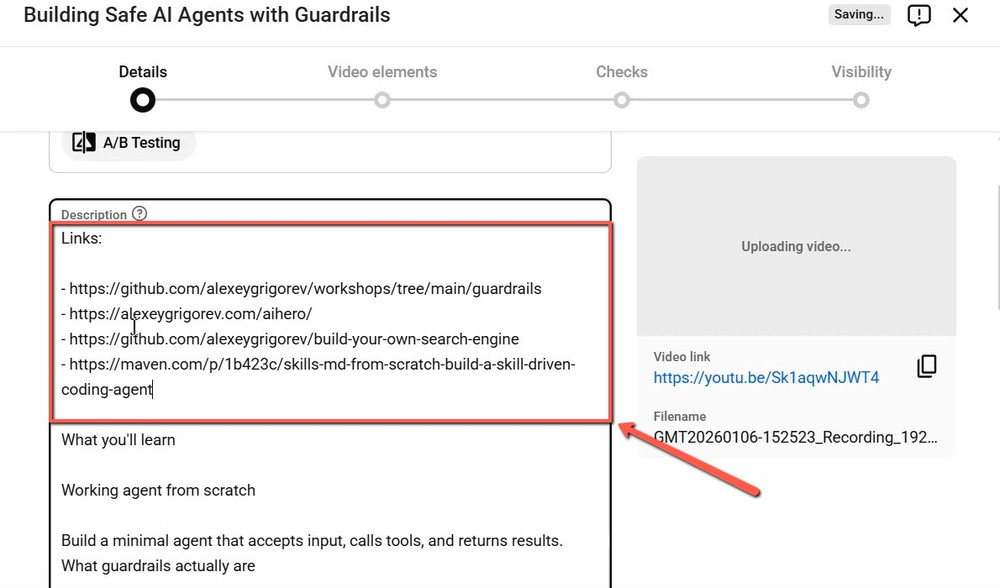
    <!-- sop-caption-start -->
    This screenshot matters for capturing or placing the correct link information; look for the highlighted area or visible control labeled links to the description field. Use that match to verify the screen state, then complete the step described above.
    <!-- sop-caption-end -->
    <!-- sop-screenshot-end -->
<!-- sop-step-end -->

<!-- sop-step-start id=11 -->
11. In the thumbnail get the cover banner from [Canva](https://www.canva.com/en_ph/login/) and follow the process document for [Updating the cover of the YouTube video](../../../media/podcast/sops/updating-the-cover-of-the-youtube-video.md)
<!-- sop-step-end -->

<!-- sop-step-start id=12 -->
12. Scroll down and leave the playlist field blank, as there is no playlist.

    <!-- sop-screenshot-start -->
    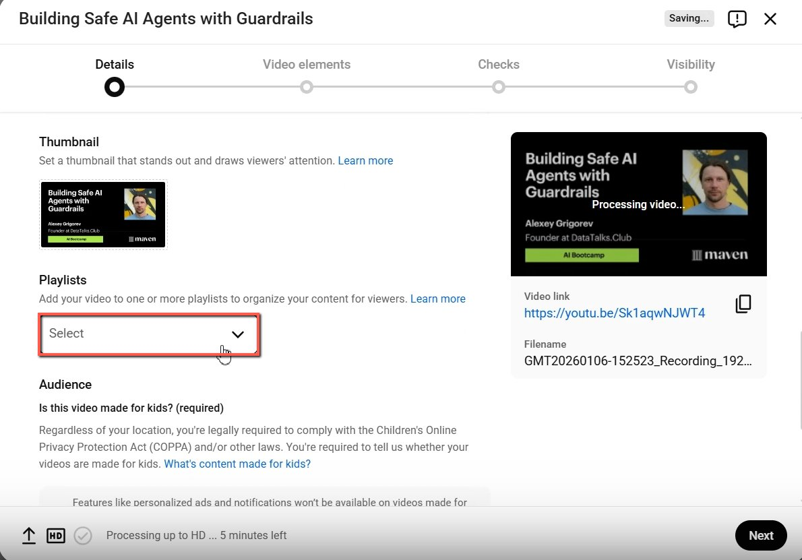
    <!-- sop-caption-start -->
    This screenshot matters for confirming the correct record, field, or status before updating the workflow; look for the highlighted area or matching UI state shown in the image. Use it to verify the screen state, then complete the step described above.
    <!-- sop-caption-end -->
    <!-- sop-screenshot-end -->
<!-- sop-step-end -->

<!-- sop-step-start id=13 -->
13. Scroll down and check “No, it’s not made for kids”, then click the “Next” button.

    <!-- sop-screenshot-start -->
    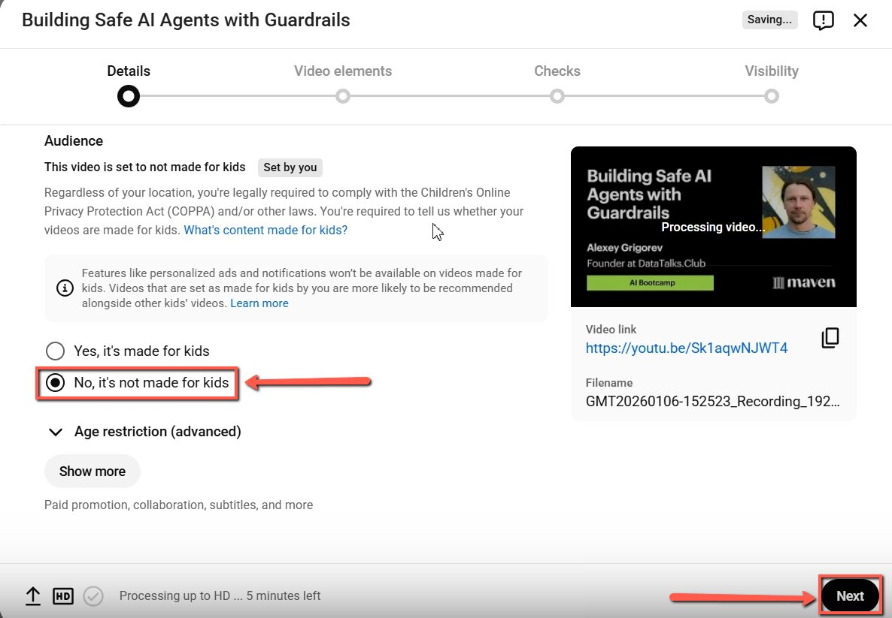
    <!-- sop-caption-start -->
    This screenshot matters for confirming the process is on the expected screen before the next action; look for the highlighted area or visible control labeled No, it’s not made for kids. Use that match to verify the screen state, then complete the step described above.
    <!-- sop-caption-end -->
    <!-- sop-screenshot-end -->
<!-- sop-step-end -->

<!-- sop-step-start id=14 -->
14. Click on “Next” for the Video elements.

    <!-- sop-screenshot-start -->
    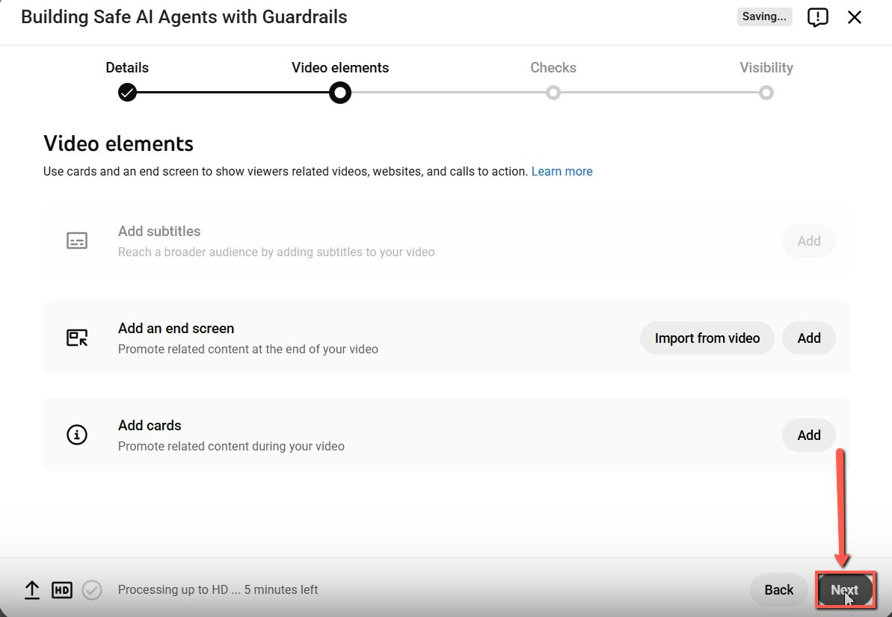
    <!-- sop-caption-start -->
    This screenshot matters for confirming the process is on the expected screen before the next action; look for the highlighted area or visible control labeled Next. Use that match to verify the screen state, then complete the step described above.
    <!-- sop-caption-end -->
    <!-- sop-screenshot-end -->
<!-- sop-step-end -->

<!-- sop-step-start id=15 -->
15. Click on “Next” for checks.

    <!-- sop-screenshot-start -->
    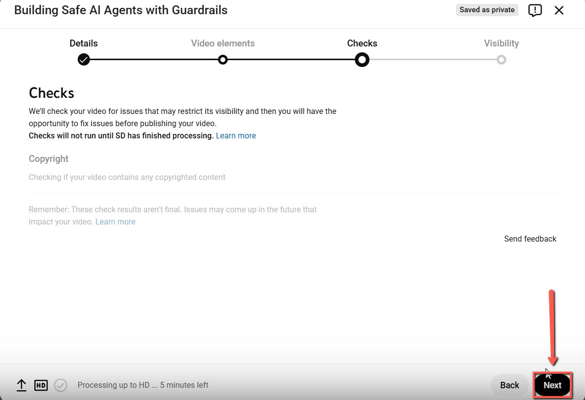
    <!-- sop-caption-start -->
    This screenshot matters for confirming the process is on the expected screen before the next action; look for the highlighted area or visible control labeled Next. Use that match to verify the screen state, then complete the step described above.
    <!-- sop-caption-end -->
    <!-- sop-screenshot-end -->
<!-- sop-step-end -->

<!-- sop-step-start id=16 -->
16. [Add timecodes to YouTube videos](../../../media/video-youtube/sops/add-timecodes-to-youtube-videos.md) and follow the process document.
<!-- sop-step-end -->

<!-- sop-step-start id=17 -->
17. In Visibility, select “Public”, once everything is good click on the “Publish” button.

    <!-- sop-screenshot-start -->
    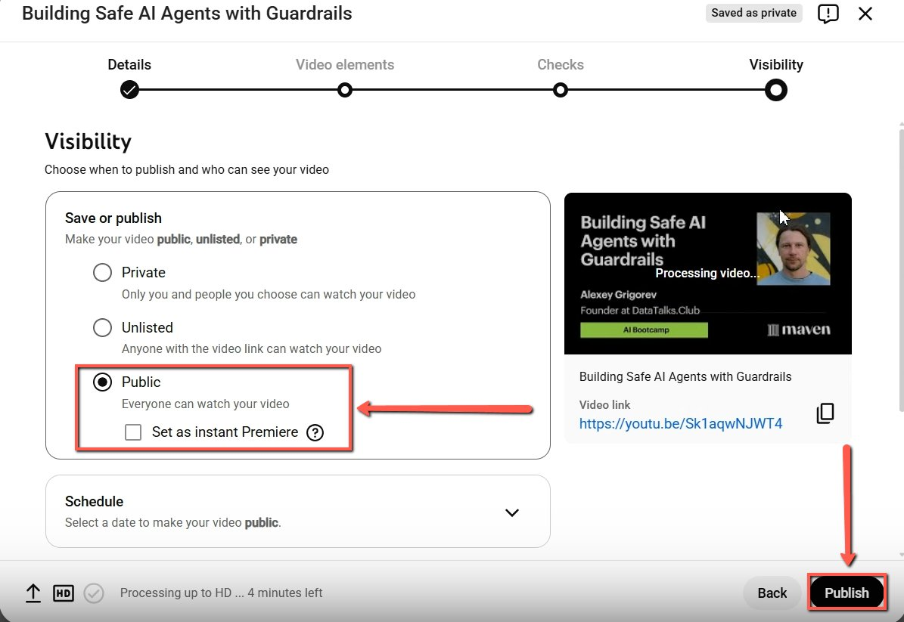
    <!-- sop-caption-start -->
    This screenshot matters for confirming the upload, publishing, or scheduling state before it becomes user-facing; look for the highlighted area or visible control labeled Public. Use that match to verify the screen state, then complete the step described above.
    <!-- sop-caption-end -->
    <!-- sop-screenshot-end -->
<!-- sop-step-end -->
<!-- sop-section-end -->

<!-- sop-section-start: validation -->
## Validation

-
<!-- sop-section-end -->

<!-- sop-section-start: troubleshooting -->
## Troubleshooting

-
<!-- sop-section-end -->

<!-- sop-section-start: references -->
## References

-
<!-- sop-section-end -->
