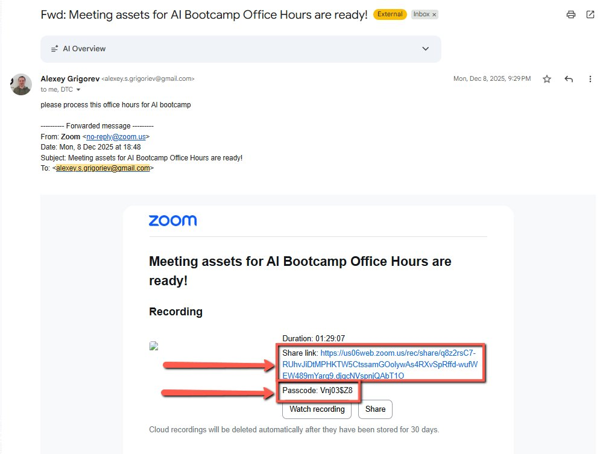
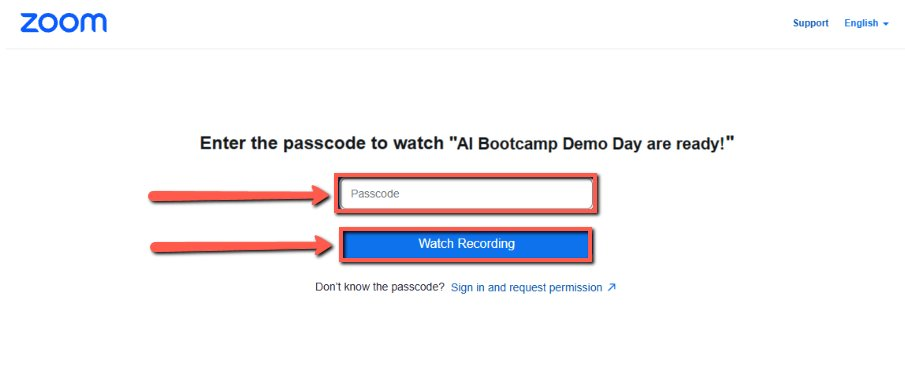
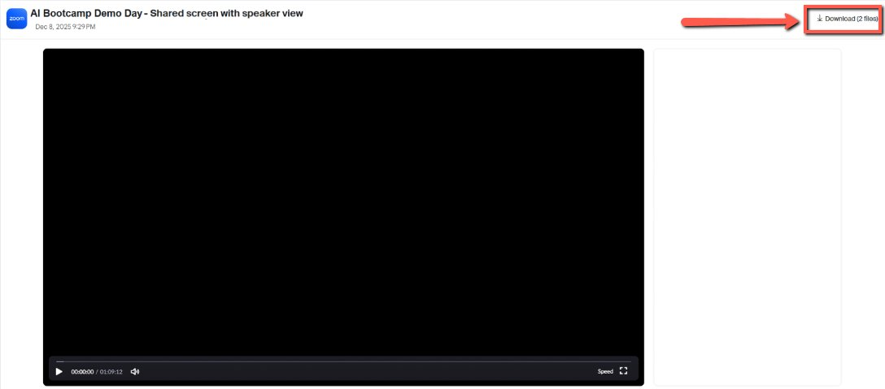
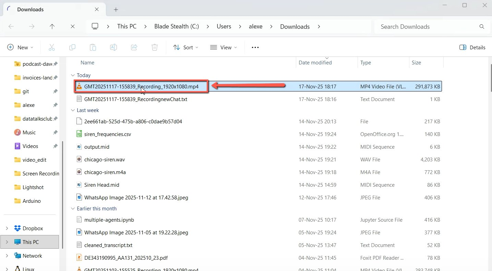
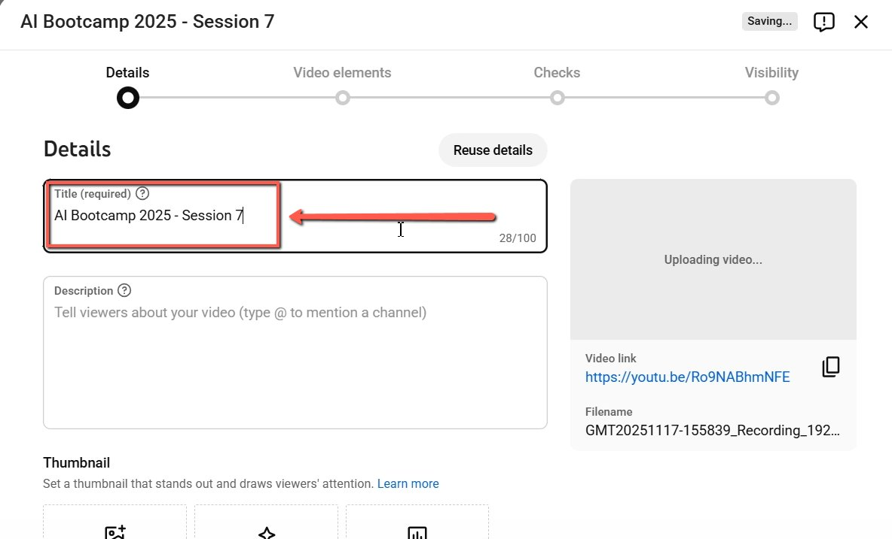
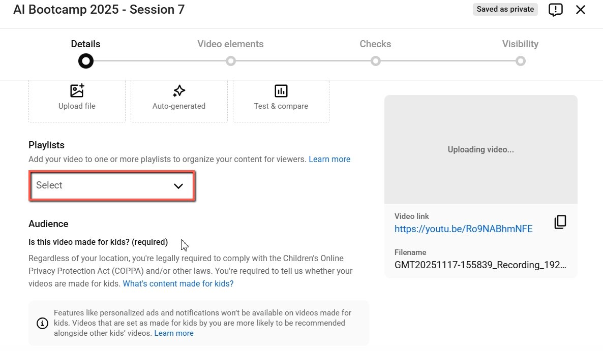
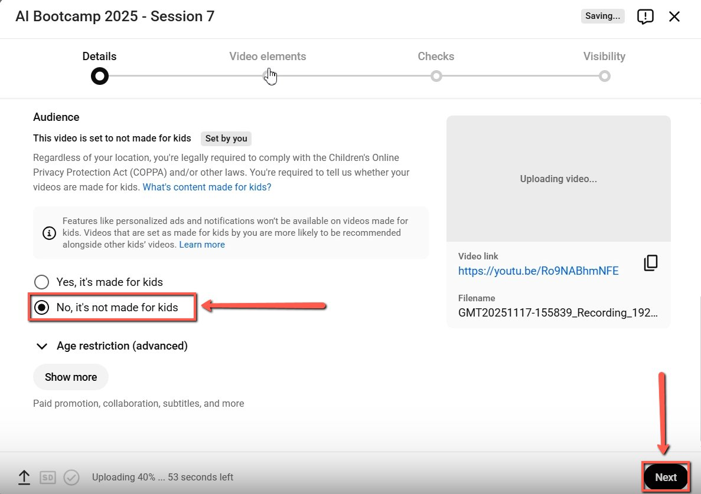
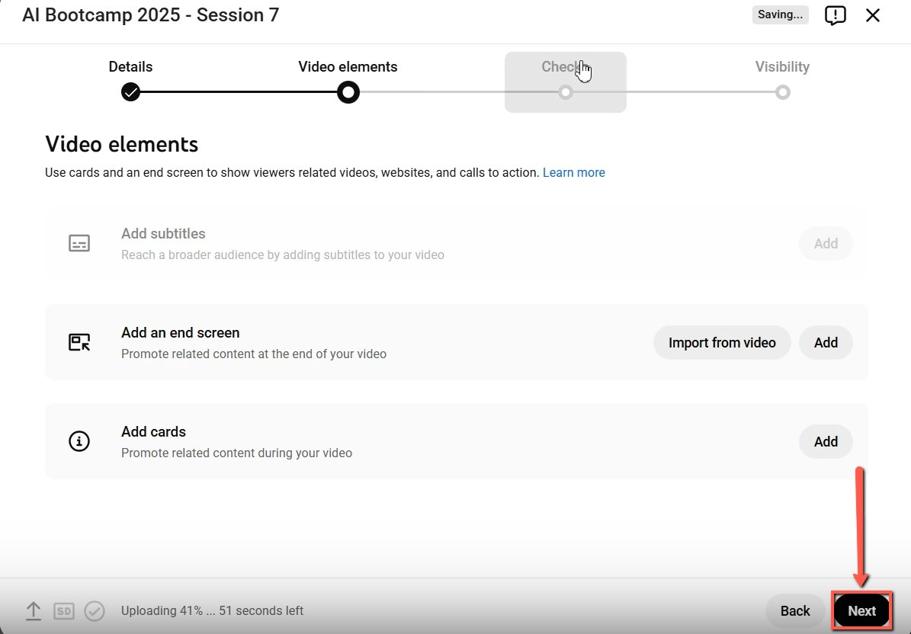
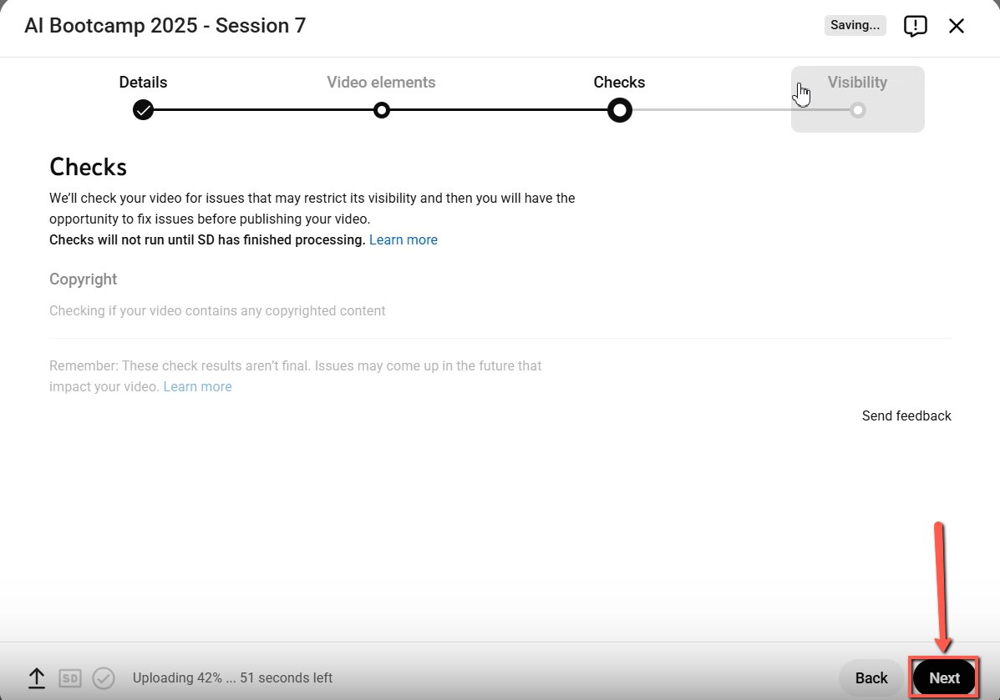
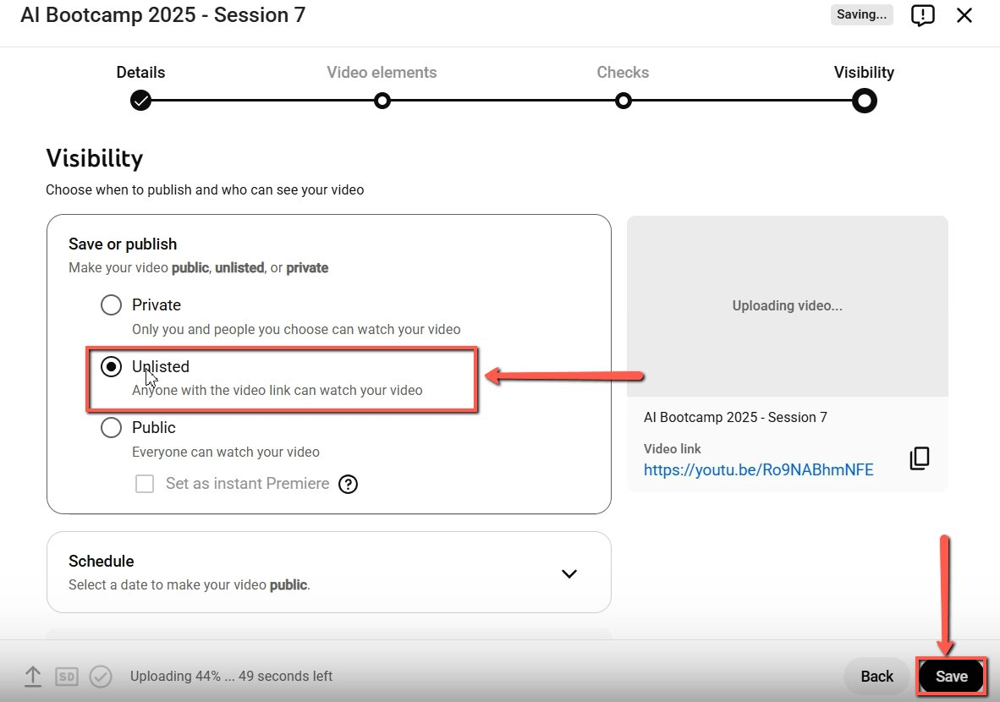

# Downloading and Uploading Office Hours Videos for YouTube

<!-- sop-section-start: summary -->
## Summary

- Purpose: Download office hours recordings and upload them to YouTube.
- Outcome: The office hours video is uploaded with the correct title and settings.
- Trigger: An office hours Zoom recording link is available.
- Frequency: After each office hours session.
<!-- sop-section-end -->

<!-- sop-section-start: prerequisites -->
## Prerequisites

- Access: Recording link, Zoom recording password, and YouTube upload access.
- Tools: Zoom recording page, file manager, and YouTube Studio.
- Inputs: Recording URL, password, video title, and downloaded video file.
<!-- sop-section-end -->

<!-- sop-section-start: procedure -->
## Procedure

<!-- sop-prose-start -->
Downloading and Uploading Office Hours Videos for YouTube
This procedure will show you the steps on how to Download and Upload Office Hours Videos for YouTube.

Step-by-step Instructions
<!-- sop-prose-end -->

<!-- sop-step-start id=1 -->
1.  Go to the email and check the link forwarded by Alexey. Click the link, and use the password to log in and access the Zoom video link then click “Watch Recording”.

    Note: Office Hours are similar to open source spotlight processes. Alexey will mention that the link is for Office Hours either it’s for a class or a lesson.

    <!-- sop-screenshot-start -->
    
    <!-- sop-caption-start -->
    This screenshot anchors the step about office Hours are similar to open source spotlight processes. Alexey will mention that the link is for Office Hours either... so you can match the documented UI before acting. Look for the link, copy, or paste target shown there, then use it to confirm you are in the correct place before continuing.
    <!-- sop-caption-end -->
    <!-- sop-screenshot-end -->

    <!-- sop-screenshot-start -->
    
    <!-- sop-caption-start -->
    This screenshot anchors the step about office Hours are similar to open source spotlight processes. Alexey will mention that the link is for Office Hours either... so you can match the documented UI before acting. Look for the link, copy, or paste target shown there, then use it to confirm you are in the correct place before continuing.
    <!-- sop-caption-end -->
    <!-- sop-screenshot-end -->
<!-- sop-step-end -->

<!-- sop-step-start id=2 -->
2.  Click “Download” at the upper part of the screen. Wait for the download to finish completely before moving to the next step.

    <!-- sop-screenshot-start -->
    
    <!-- sop-caption-start -->
    This screenshot anchors the step to click “Download” at the upper part of the screen. Wait for the download to finish completely before moving to the next step so you can match the documented UI before acting. Look for “Download”, then use that cue to complete or verify the step before continuing.
    <!-- sop-caption-end -->
    <!-- sop-screenshot-end -->
<!-- sop-step-end -->

<!-- sop-step-start id=3 -->
3.  Log in to Alexey’s personal youtube channel account. Click “Select files”.

    Note: Ensure you are uploading to the Personal Channel, NOT the DataTalks.Club channel. You can also use a different browser in using his personal account

    <!-- sop-screenshot-start -->
    
    <!-- sop-caption-start -->
    This screenshot anchors the step about log in to Alexey’s personal youtube channel account. Click “Select files” so you can match the documented UI before acting. Look for “Select files”, then use that cue to complete or verify the step before continuing.
    <!-- sop-caption-end -->
    <!-- sop-screenshot-end -->
<!-- sop-step-end -->

<!-- sop-step-start id=4 -->
4.  Select the downloaded video from your File manager.

    <!-- sop-screenshot-start -->
    
    <!-- sop-caption-start -->
    This screenshot anchors the step to select the downloaded video from your File manager so you can match the documented UI before acting. Look for the file transfer or file picker state shown there, then use it to confirm you are in the correct place before continuing.
    <!-- sop-caption-end -->
    <!-- sop-screenshot-end -->
<!-- sop-step-end -->

<!-- sop-step-start id=5 -->
5.  In the Title section,type in the Title that Alexey provided. For this example, we are using AI Bootcamp 2025 - Session 7.

    Note: For the succeeding Office Hours videos, we’ll continue with Session 8, Session 9, and so on. However, when a new lesson begins with a new title, we will start again at Session 1 for that lesson.

    <!-- sop-screenshot-start -->
    
    <!-- sop-caption-start -->
    This screenshot anchors the step about in the Title section,type in the Title that Alexey provided. For this example, we are using AI Bootcamp 2025 - Session 7 so you can match the documented UI before acting. Look for the relevant screen area shown there, then use it to confirm you are in the correct place before continuing.
    <!-- sop-caption-end -->
    <!-- sop-screenshot-end -->
<!-- sop-step-end -->

<!-- sop-step-start id=6 -->
6.  Scroll down and leave the playlist field blank, as we don’t add this to any playlist.

    <!-- sop-screenshot-start -->
    
    <!-- sop-caption-start -->
    This screenshot anchors the step to scroll down and leave the playlist field blank, as we don’t add this to any playlist so you can match the documented UI before acting. Look for the relevant screen area shown there, then use it to confirm you are in the correct place before continuing.
    <!-- sop-caption-end -->
    <!-- sop-screenshot-end -->
<!-- sop-step-end -->

<!-- sop-step-start id=7 -->
7.  Scroll down and check “No, it’s not made for kids”, then click the “Next” button.

    <!-- sop-screenshot-start -->
    
    <!-- sop-caption-start -->
    This screenshot anchors the step to scroll down and check “No, it’s not made for kids”, then click the “Next” button so you can match the documented UI before acting. Look for “No, it’s not made for kids” and “Next”, then use those cues to complete or verify the step before continuing.
    <!-- sop-caption-end -->
    <!-- sop-screenshot-end -->
<!-- sop-step-end -->

<!-- sop-step-start id=8 -->
8.  Click on “Next” for the Video elements.

    <!-- sop-screenshot-start -->
    
    <!-- sop-caption-start -->
    This screenshot anchors the step to click on “Next” for the Video elements so you can match the documented UI before acting. Look for “Next”, then use that cue to complete or verify the step before continuing.
    <!-- sop-caption-end -->
    <!-- sop-screenshot-end -->
<!-- sop-step-end -->

<!-- sop-step-start id=9 -->
9.  Click on “Next” for checks.

    <!-- sop-screenshot-start -->
    
    <!-- sop-caption-start -->
    This screenshot anchors the step to click on “Next” for checks so you can match the documented UI before acting. Look for “Next”, then use that cue to complete or verify the step before continuing.
    <!-- sop-caption-end -->
    <!-- sop-screenshot-end -->
<!-- sop-step-end -->

<!-- sop-step-start id=10 -->
10. In Visibility, select “Unlisted”, once everything is good click on the “Save” button.

    Note: Now the video is being uploaded. It may take a few hours for the transcripts to be generated and we will be using that for the next step.

    <!-- sop-screenshot-start -->
    
    <!-- sop-caption-start -->
    This screenshot anchors the step about in Visibility, select “Unlisted”, once everything is good click on the “Save” button so you can match the documented UI before acting. Look for “Unlisted” and “Save”, then use those cues to complete or verify the step before continuing.
    <!-- sop-caption-end -->
    <!-- sop-screenshot-end -->
<!-- sop-step-end -->
<!-- sop-section-end -->

<!-- sop-section-start: validation -->
## Validation

-
<!-- sop-section-end -->

<!-- sop-section-start: troubleshooting -->
## Troubleshooting

-
<!-- sop-section-end -->

<!-- sop-section-start: references -->
## References

-
<!-- sop-section-end -->
