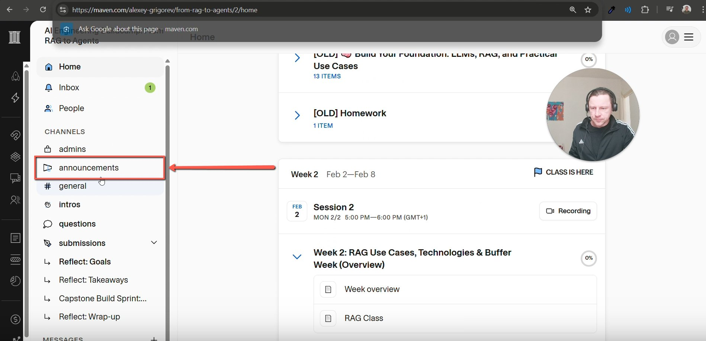
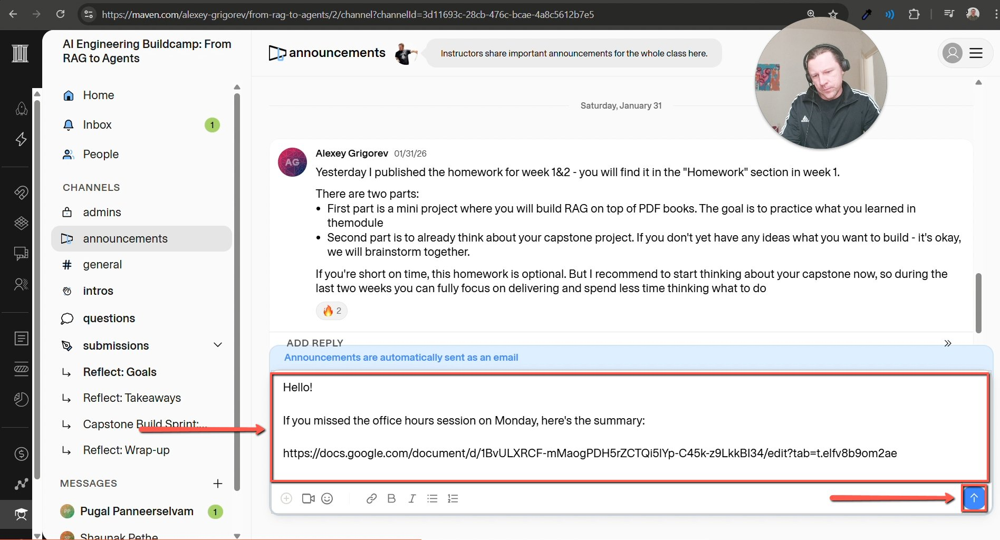

# Making announcements in Maven

<!-- sop-section-start: summary -->
## Summary

- Purpose: Share office hours summaries with course participants in Maven.
- Outcome: A Maven announcement links learners to the office hours summary.
- Trigger: An office hours summary is ready to share.
- Frequency: After each office hours summary is prepared.
<!-- sop-section-end -->

<!-- sop-section-start: prerequisites -->
## Prerequisites

- Access: Maven course admin access.
- Tools: Maven announcements.
- Inputs: Course cohort and office hours summary document link.
<!-- sop-section-end -->

<!-- sop-section-start: procedure -->
## Procedure

<!-- sop-prose-start -->
Making announcements in Maven
This procedure will show you the steps on how to make announcements in Maven.

Step-by-step Instructions
<!-- sop-prose-end -->

<!-- sop-step-start id=1 -->
1.  Go to Maven. In the course navigation, on the left sidebar of your screen, click Announcements.

    Note: in going to Maven Link, add /2 at the end of the URL for Cohort 2. Example: /3 for Cohort 3, /4 for Cohort 4, and so on.

    <!-- sop-screenshot-start -->
    
    <!-- sop-caption-start -->
    This screenshot anchors the step about in going to Maven Link, add /2 at the end of the URL for Cohort 2. Example: /3 for Cohort 3, /4 for Cohort 4, and so on so you can match the documented UI before acting. Look for the link, copy, or paste target shown there, then use it to confirm you are in the correct place before continuing.
    <!-- sop-caption-end -->
    <!-- sop-screenshot-end -->
<!-- sop-step-end -->

<!-- sop-step-start id=2 -->
2.  In the text field, type in:

    “ Hello!
    If you missed the office hours session on Monday, here’s the summary:
    (Link to the Office hours document)* ”
    Then click the send button.
    <!-- sop-screenshot-start -->
    
    <!-- sop-caption-start -->
    This screenshot anchors the step to click the send button so you can match the documented UI before acting. Look for the reporting value or action control shown there, then use it to confirm you are in the correct place before continuing.
    <!-- sop-caption-end -->
    <!-- sop-screenshot-end -->
<!-- sop-step-end -->
<!-- sop-section-end -->

<!-- sop-section-start: validation -->
## Validation

-
<!-- sop-section-end -->

<!-- sop-section-start: troubleshooting -->
## Troubleshooting

-
<!-- sop-section-end -->

<!-- sop-section-start: references -->
## References

-
<!-- sop-section-end -->
