# Summarizing Video Transcripts For Office Hours

<!-- sop-section-start: summary -->
## Summary

- Purpose: Create summaries from office hours video transcripts.
- Outcome: A course summary document contains the video link and generated summary.
- Trigger: An office hours video transcript is available on YouTube.
- Frequency: After each office hours video is processed.
<!-- sop-section-end -->

<!-- sop-section-start: prerequisites -->
## Prerequisites

- Access: Course Drive folder and YouTube transcript.
- Tools: Google Docs, YouTube transcript, and a summarization tool.
- Inputs: Office hours video, transcript, session title, week number, and recording date.
<!-- sop-section-end -->

<!-- sop-section-start: procedure -->
## Procedure

<!-- sop-prose-start -->
Summarizing Video Transcripts For Office Hours
This procedure will show you the steps on how to Summarize Video Transcripts for Office Hours.

Step-by-step Instructions
<!-- sop-prose-end -->

<!-- sop-step-start id=1 -->
1.  Once the video is processed, the transcript will appear on YouTube. Open the [Course Drive](https://drive.google.com/drive/folders/1tCEfVNn_6bihbunByaKQcXE8tkTClQ1V) where all summary documents for our courses are stored. For this example, we are in AI Bootcamp – Cohort 1, Session 7.

    Note: This is where we create and store the summaries generated from the videos, so we can keep track of all key points and discussions. This structure is used for all current and upcoming courses, so future sessions and cohorts will follow the same format.

    - *Each course has its own folder in the drive.*

    - *Each document contains tabs for each week’s office hours with dates and headings.*

    - *Each tab represents a week, with the tab name formatted as: Week \[Number\] - \[Date\].*
    - *Inside each tab are summaries generated from previous videos.*

    <!-- sop-screenshot-start -->
    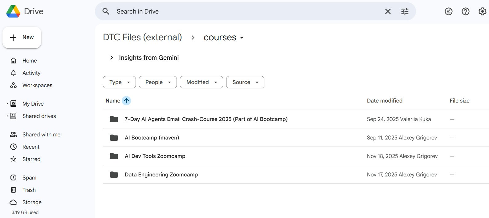
    <!-- sop-caption-start -->
    This screenshot anchors the step about *Inside each tab are summaries generated from previous videos.* so you can match the documented UI before acting. Look for the relevant screen area shown there, then use it to confirm you are in the correct place before continuing.
    <!-- sop-caption-end -->
    <!-- sop-screenshot-end -->

    <!-- sop-screenshot-start -->
    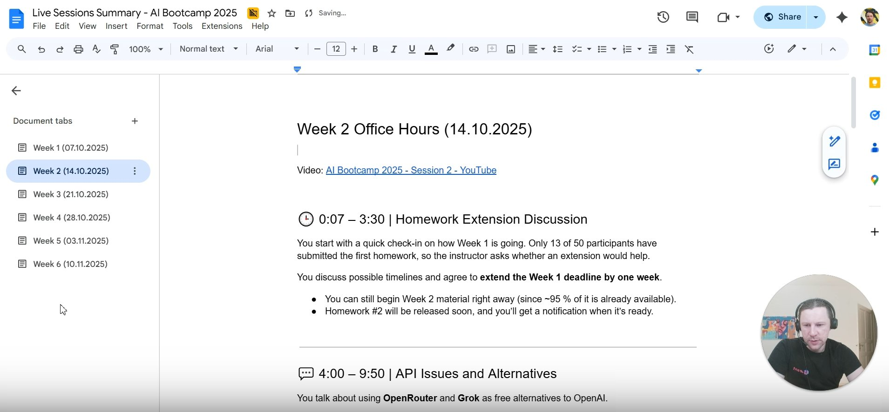
    <!-- sop-caption-start -->
    This screenshot anchors the step about *Inside each tab are summaries generated from previous videos.* so you can match the documented UI before acting. Look for the relevant screen area shown there, then use it to confirm you are in the correct place before continuing.
    <!-- sop-caption-end -->
    <!-- sop-screenshot-end -->
<!-- sop-step-end -->

<!-- sop-step-start id=2 -->
2.  In the document tabs, click the “+” icon to add a new tab.

    <!-- sop-screenshot-start -->
    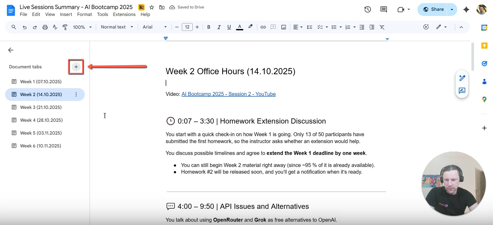
    <!-- sop-caption-start -->
    This screenshot anchors the step about in the document tabs, click the “+” icon to add a new tab so you can match the documented UI before acting. Look for “+”, then use that cue to complete or verify the step before continuing.
    <!-- sop-caption-end -->
    <!-- sop-screenshot-end -->
<!-- sop-step-end -->

<!-- sop-step-start id=3 -->
3.  Rename the new tab using the format: Week \[Number\] - \[Date\]. Then inside the document, type the session title in the following format: Week \# Office Hours (DD.MM.YYYY).

    Note: The date should reflect when the video was recorded.

    <!-- sop-screenshot-start -->
    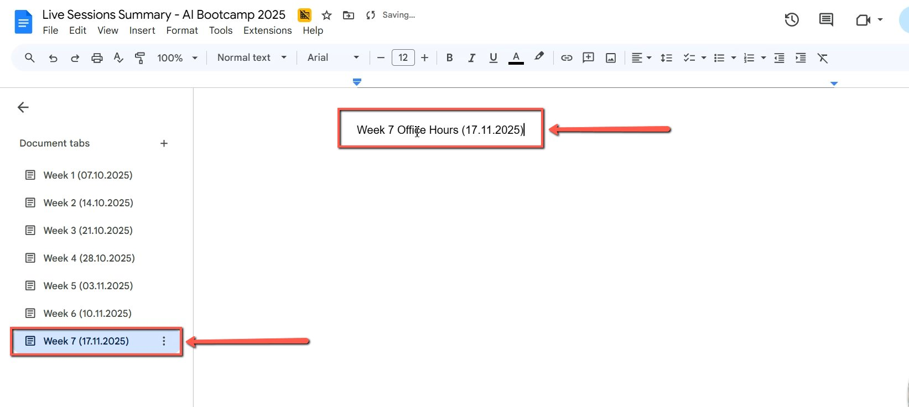
    <!-- sop-caption-start -->
    This screenshot anchors the step to rename the new tab using the format: Week [Number] - [Date]. Then inside the document, type the session title in the follo... so you can match the documented UI before acting. Look for the schedule or date control shown there, then use it to confirm you are in the correct place before continuing.
    <!-- sop-caption-end -->
    <!-- sop-screenshot-end -->
<!-- sop-step-end -->

<!-- sop-step-start id=4 -->
4.  Highlight the title text. In the top menu, click the Text style dropdown then select “Heading 1”

    <!-- sop-screenshot-start -->
    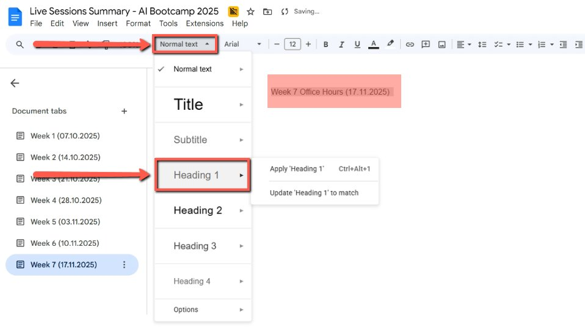
    <!-- sop-caption-start -->
    This screenshot anchors the step to highlight the title text. In the top menu, click the Text style dropdown then select “Heading 1” so you can match the documented UI before acting. Look for “Heading 1”, then use that cue to complete or verify the step before continuing.
    <!-- sop-caption-end -->
    <!-- sop-screenshot-end -->
<!-- sop-step-end -->

<!-- sop-step-start id=5 -->
5.  Type in “Video:” then the Office hours youtube title and hyperlink the youtube video.

    <!-- sop-screenshot-start -->
    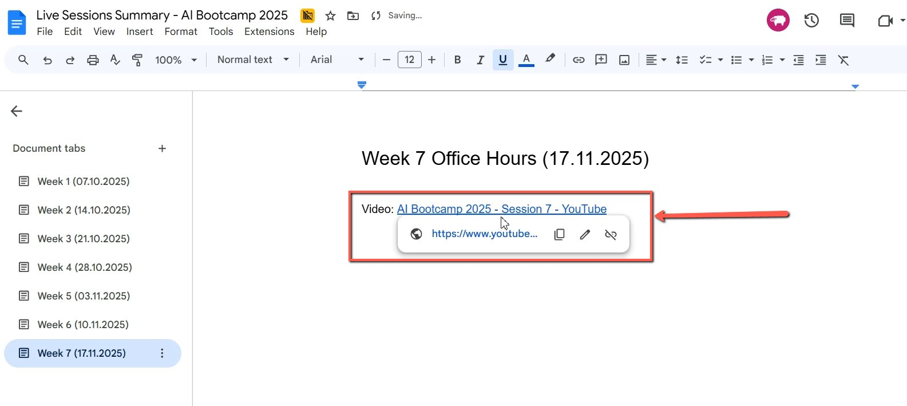
    <!-- sop-caption-start -->
    This screenshot anchors the step about type in “Video:” then the Office hours youtube title and hyperlink the youtube video so you can match the documented UI before acting. Look for “Video:”, then use that cue to complete or verify the step before continuing.
    <!-- sop-caption-end -->
    <!-- sop-screenshot-end -->
<!-- sop-step-end -->

<!-- sop-step-start id=6 -->
6.  Go to [Office Hours Prompt](../../prompts/office-hours-prompt.md) and copy the prompt.

    <!-- sop-screenshot-start -->
    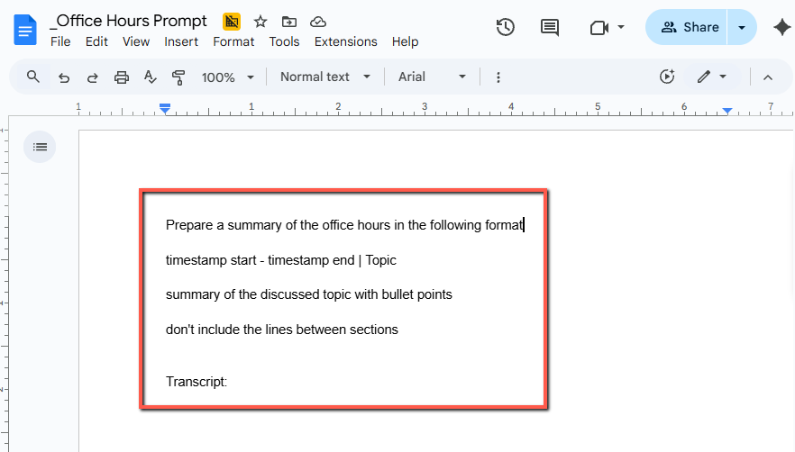
    <!-- sop-caption-start -->
    This screenshot anchors the step to go to Office Hours Prompt and copy the prompt so you can match the documented UI before acting. Look for the link, copy, or paste target shown there, then use it to confirm you are in the correct place before continuing.
    <!-- sop-caption-end -->
    <!-- sop-screenshot-end -->
<!-- sop-step-end -->

<!-- sop-step-start id=7 -->
7.  Go to chatGpt or Gemini and Paste it.

    <!-- sop-screenshot-start -->
    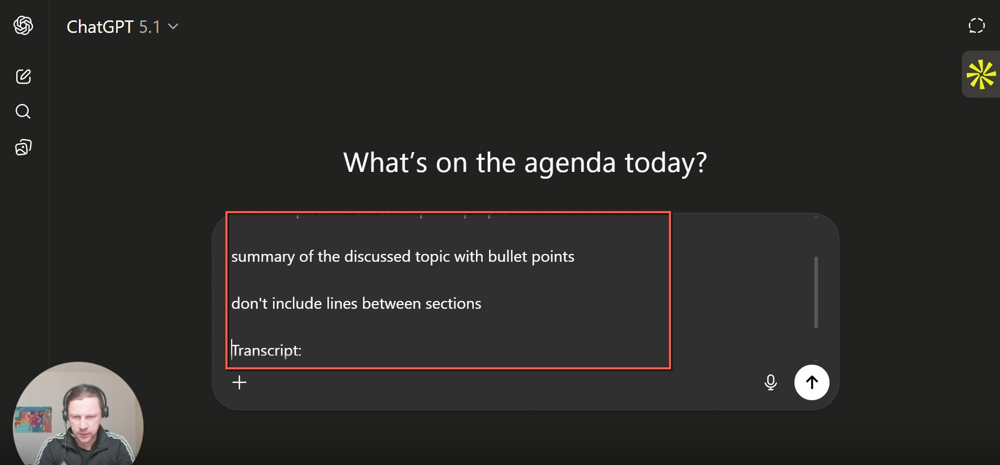
    <!-- sop-caption-start -->
    This screenshot anchors the step to go to chatGpt or Gemini and Paste it so you can match the documented UI before acting. Look for the link, copy, or paste target shown there, then use it to confirm you are in the correct place before continuing.
    <!-- sop-caption-end -->
    <!-- sop-screenshot-end -->
<!-- sop-step-end -->

<!-- sop-step-start id=8 -->
8.  Go to the youtube video and scroll down to description and click “Show transcript”.

    <!-- sop-screenshot-start -->
    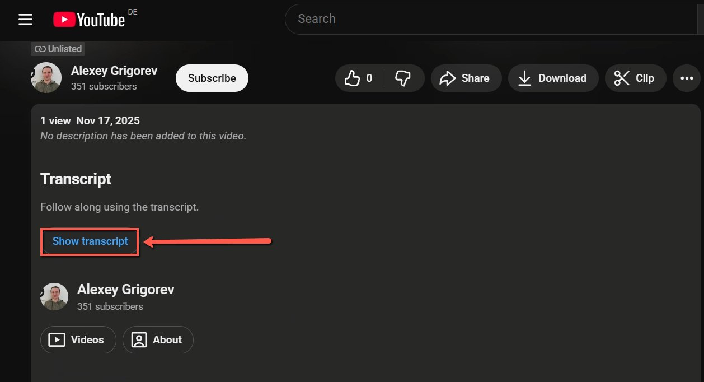
    <!-- sop-caption-start -->
    This screenshot anchors the step to go to the youtube video and scroll down to description and click “Show transcript” so you can match the documented UI before acting. Look for “Show transcript”, then use that cue to complete or verify the step before continuing.
    <!-- sop-caption-end -->
    <!-- sop-screenshot-end -->
<!-- sop-step-end -->

<!-- sop-step-start id=9 -->
9.  Copy the entire transcript.

    <!-- sop-screenshot-start -->
    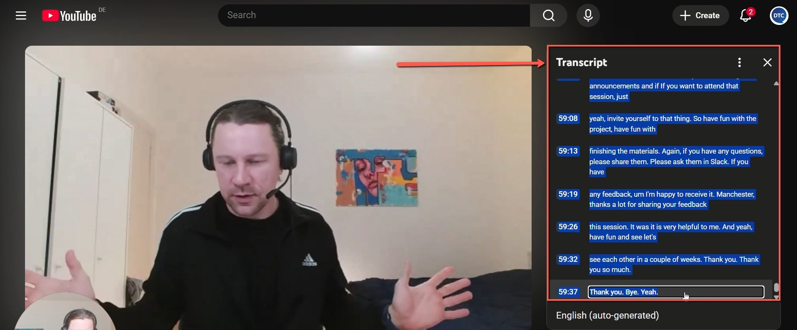
    <!-- sop-caption-start -->
    This screenshot anchors the step to copy the entire transcript so you can match the documented UI before acting. Look for the link, copy, or paste target shown there, then use it to confirm you are in the correct place before continuing.
    <!-- sop-caption-end -->
    <!-- sop-screenshot-end -->
<!-- sop-step-end -->

<!-- sop-step-start id=10 -->
10. Go back to Chatgpt and paste the transcript then click enter.

    <!-- sop-screenshot-start -->
    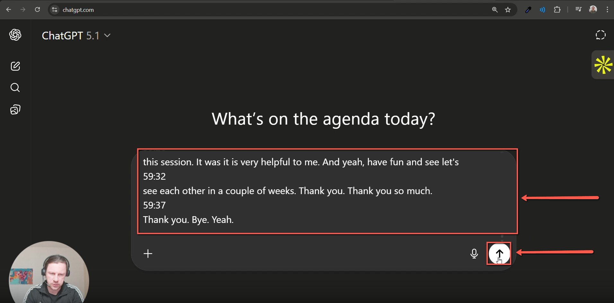
    <!-- sop-caption-start -->
    This screenshot anchors the step to go back to Chatgpt and paste the transcript then click enter so you can match the documented UI before acting. Look for the link, copy, or paste target shown there, then use it to confirm you are in the correct place before continuing.
    <!-- sop-caption-end -->
    <!-- sop-screenshot-end -->
<!-- sop-step-end -->

<!-- sop-step-start id=11 -->
11. Copy the generated Summary and paste it to the document.

    <!-- sop-screenshot-start -->
    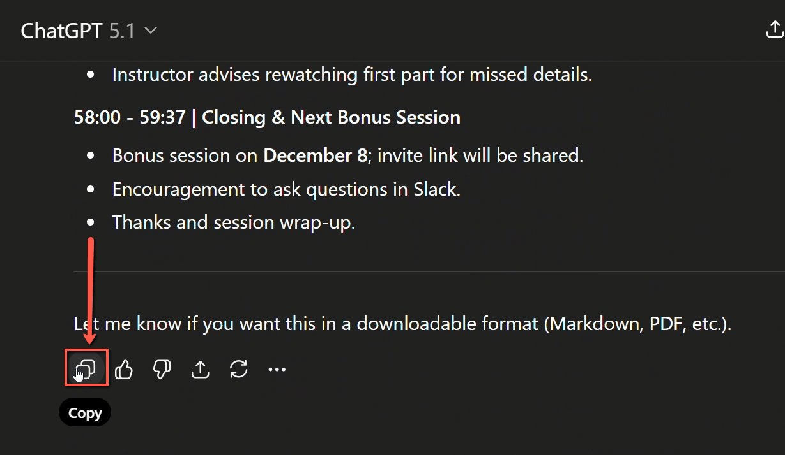
    <!-- sop-caption-start -->
    This screenshot anchors the step to copy the generated Summary and paste it to the document so you can match the documented UI before acting. Look for the link, copy, or paste target shown there, then use it to confirm you are in the correct place before continuing.
    <!-- sop-caption-end -->
    <!-- sop-screenshot-end -->
<!-- sop-step-end -->

<!-- sop-step-start id=12 -->
12. Arrange the format by removing the line breaks.
    For each summary title, highlight the text then open the Text style dropdown, and select Heading 1, or press Ctrl + Alt + 2.
    <!-- sop-screenshot-start -->
    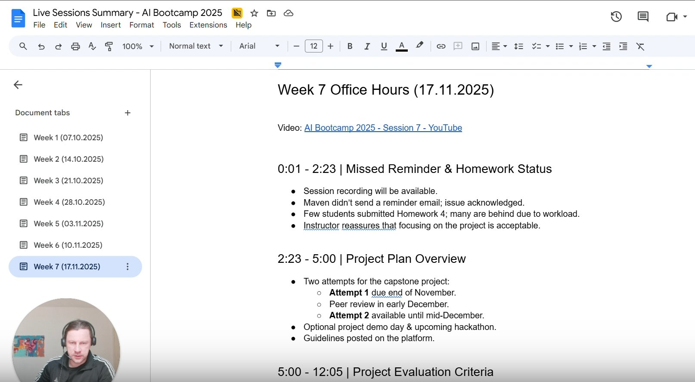
    <!-- sop-caption-start -->
    This screenshot anchors the step about for each summary title, highlight the text then open the Text style dropdown, and select Heading 1, or press Ctrl + Alt + 2 so you can match the documented UI before acting. Look for the relevant screen area shown there, then use it to confirm you are in the correct place before continuing.
    <!-- sop-caption-end -->
    <!-- sop-screenshot-end -->

    Loom Links:
<!-- sop-step-end -->
<!-- sop-section-end -->

<!-- sop-section-start: validation -->
## Validation

-
<!-- sop-section-end -->

<!-- sop-section-start: troubleshooting -->
## Troubleshooting

-
<!-- sop-section-end -->

<!-- sop-section-start: references -->
## References

-
<!-- sop-section-end -->
