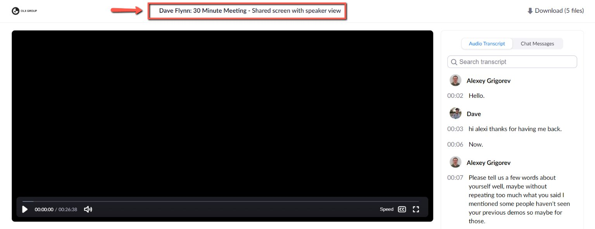
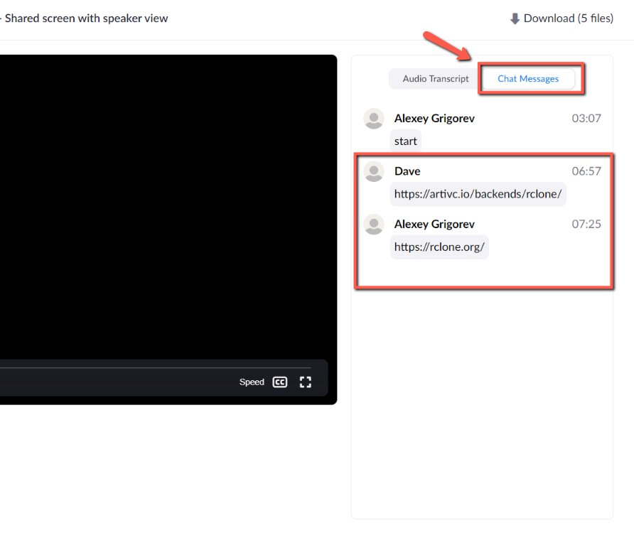
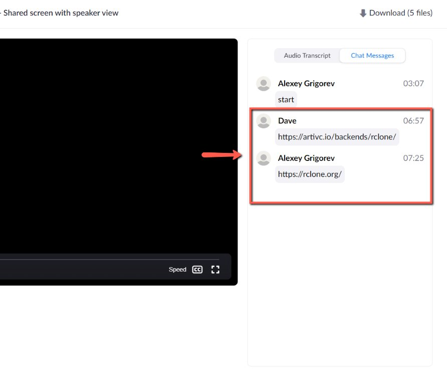
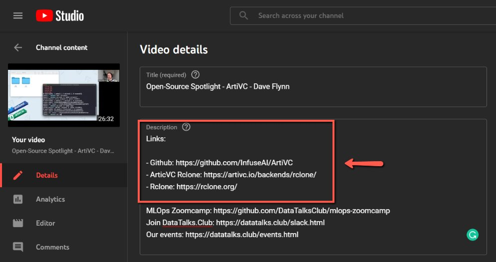

# Adding links from the Zoom chat

<!-- sop-section-start: summary -->
## Summary

- Purpose:
- Outcome:
- Trigger:
- Frequency:
<!-- sop-section-end -->

<!-- sop-section-start: prerequisites -->
## Prerequisites

- Access:
- Tools:
- Inputs:
<!-- sop-section-end -->

<!-- sop-section-start: procedure -->
## Procedure

<!-- sop-prose-start -->
How to add links from the Zoom chat
This procedure will show you the steps on how to add links from the Zoom chat.

Step-by-step Instructions
<!-- sop-prose-end -->

<!-- sop-step-start id=1 -->
1.  The first thing you need to do is open the Zoom recording.

    <!-- sop-screenshot-start -->
    
    <!-- sop-caption-start -->
    This screenshot matters for confirming the process is on the expected screen before the next action; look for the highlighted area or visible control labeled Zoom recording. Use that match to verify the screen state, then complete the step described above.
    <!-- sop-caption-end -->
    <!-- sop-screenshot-end -->
<!-- sop-step-end -->

<!-- sop-step-start id=2 -->
2.  And then, click “Chat Messages” on the upper right of your screen

    <!-- sop-screenshot-start -->
    
    <!-- sop-caption-start -->
    This screenshot matters for confirming the communication step before sending or recording outreach; look for the highlighted area or visible control labeled Chat Messages. Use that match to verify the screen state, then complete the step described above.
    <!-- sop-caption-end -->
    <!-- sop-screenshot-end -->
<!-- sop-step-end -->

<!-- sop-step-start id=3 -->
3.  After, copy the links in the chat messages.

    <!-- sop-screenshot-start -->
    
    <!-- sop-caption-start -->
    This screenshot matters for capturing or placing the correct link information; look for the highlighted area or visible control labeled links in the chat messages. Use that match to verify the screen state, then complete the step described above.
    <!-- sop-caption-end -->
    <!-- sop-screenshot-end -->
<!-- sop-step-end -->

<!-- sop-step-start id=4 -->
4.  And then, paste the links into the “Details” tab.

    <!-- sop-screenshot-start -->
    
    <!-- sop-caption-start -->
    This screenshot matters for capturing or placing the correct link information; look for the highlighted area or visible control labeled Details. Use that match to verify the screen state, then complete the step described above.
    <!-- sop-caption-end -->
    <!-- sop-screenshot-end -->
<!-- sop-step-end -->
<!-- sop-section-end -->

<!-- sop-section-start: validation -->
## Validation

-
<!-- sop-section-end -->

<!-- sop-section-start: troubleshooting -->
## Troubleshooting

-
<!-- sop-section-end -->

<!-- sop-section-start: references -->
## References

-
<!-- sop-section-end -->
