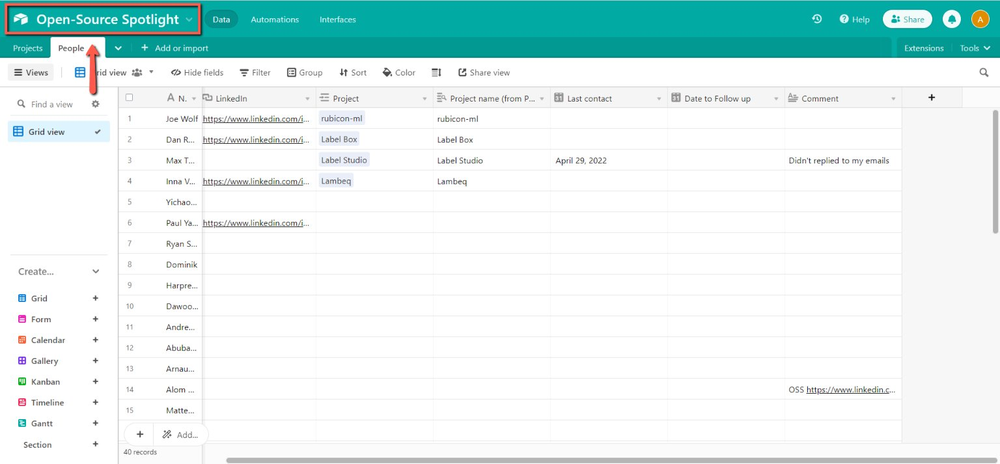
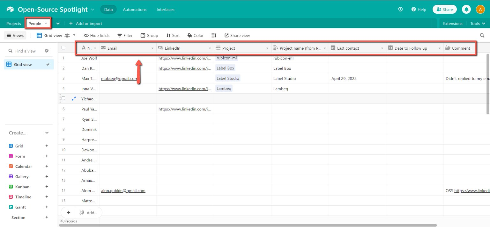
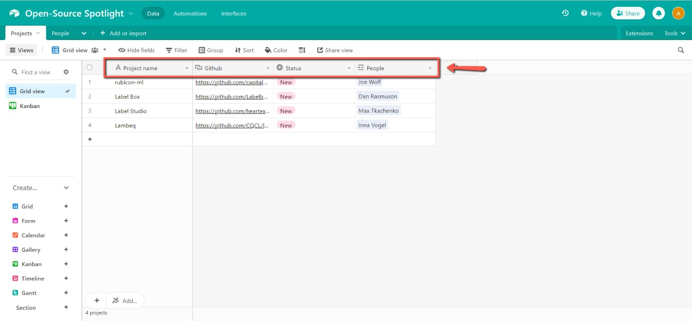

# Filling in the Open-Source Spotlight Airtable database

<!-- sop-section-start: summary -->
## Summary

- Purpose: Record Open-Source Spotlight people and project leads in Airtable.
- Outcome: The Airtable database has the author, project, contact, status, and follow-up details.
- Trigger: A new Open-Source Spotlight lead or project needs tracking.
- Frequency: Per lead or project update.
<!-- sop-section-end -->

<!-- sop-section-start: prerequisites -->
## Prerequisites

- Access: Open-Source Spotlight Airtable database.
- Tools: Airtable, GitHub, browser.
- Inputs: Author name, contact links, project name, GitHub repo, status, dates, and notes.
<!-- sop-section-end -->

<!-- sop-section-start: procedure -->
## Procedure

<!-- sop-prose-start -->
How to Fill in the Open-Source Spotlight Airtable Database
This procedure will show you the steps on how to Fill in the Open-Source Spotlight Airtable Database.

Step-by-step Instructions
<!-- sop-prose-end -->

<!-- sop-step-start id=1 -->
1.  The first thing you need to do is open the [OSS Airtable Database](https://airtable.com/appCKS2tBfAEGK4Dm/tblhhMttRZ6HlswWB/viwlvkcIW9iOHE97X?blocks=hide).

    <!-- sop-screenshot-start -->
    
    <!-- sop-caption-start -->
    This screenshot matters for confirming the correct record, field, or status before updating the workflow; look for the highlighted area or visible control labeled OSS Airtable Database. Use that match to verify the screen state, then complete the step described above.
    <!-- sop-caption-end -->
    <!-- sop-screenshot-end -->
<!-- sop-step-end -->

<!-- sop-step-start id=2 -->
2.  After, in the “People” tab, fill in the the name of the Author, LinkedIn account, Name of the Project; Add the date when you last contacted the author, date to follow up; and if there are notes or comments, add it on the ‘Comments column”

    <!-- sop-screenshot-start -->
    
    <!-- sop-caption-start -->
    This screenshot matters for capturing or placing the correct link information; look for the highlighted area or visible control labeled People. Use that match to verify the screen state, then complete the step described above.
    <!-- sop-caption-end -->
    <!-- sop-screenshot-end -->
<!-- sop-step-end -->

<!-- sop-step-start id=3 -->
3.  Next, click the “Projects’ tab and enter the Project name, Link of the Github repo, the status, and the name of the author or people who contributed to the tool.

    Note: For the status, here are some descriptions.

    New - New lead or author need to be reached out via email or LinkedIn

    In Progress - Authors are contacted via Email or LinkedIn
    Done - The demo is done with Alexey.
    <!-- sop-screenshot-start -->
    
    <!-- sop-caption-start -->
    This screenshot matters for confirming the process is on the expected screen before the next action; look for the highlighted area or matching UI state shown in the image. Use it to verify the screen state, then complete the step described above.
    <!-- sop-caption-end -->
    <!-- sop-screenshot-end -->
<!-- sop-step-end -->
<!-- sop-section-end -->

<!-- sop-section-start: validation -->
## Validation

-
<!-- sop-section-end -->

<!-- sop-section-start: troubleshooting -->
## Troubleshooting

-
<!-- sop-section-end -->

<!-- sop-section-start: references -->
## References

-
<!-- sop-section-end -->
