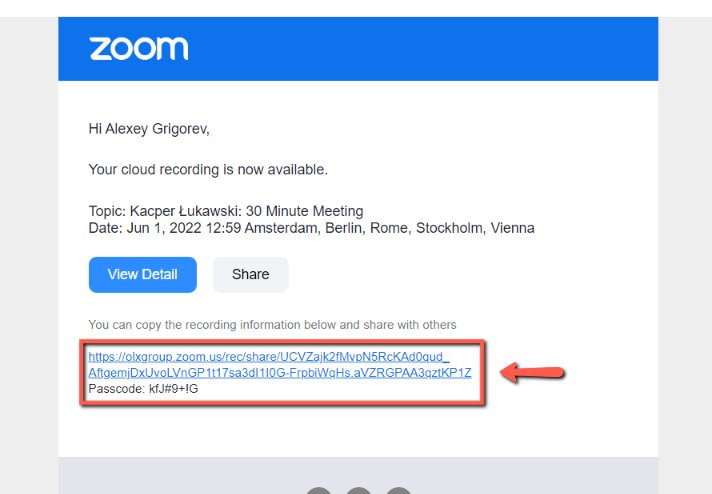
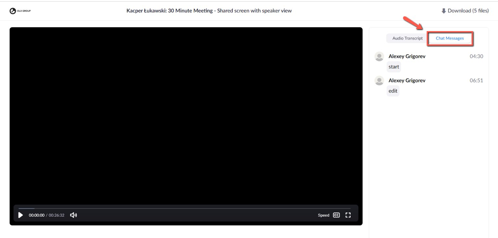
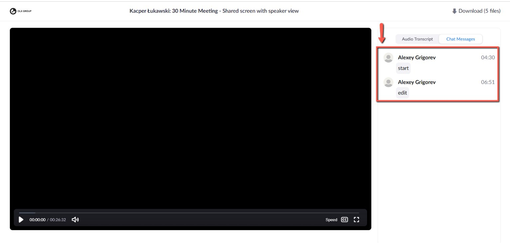
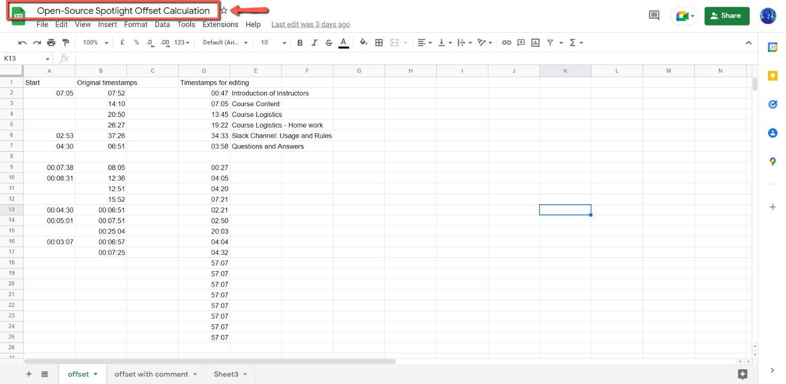
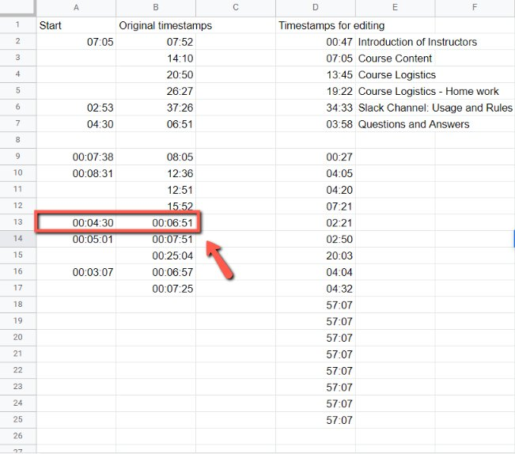
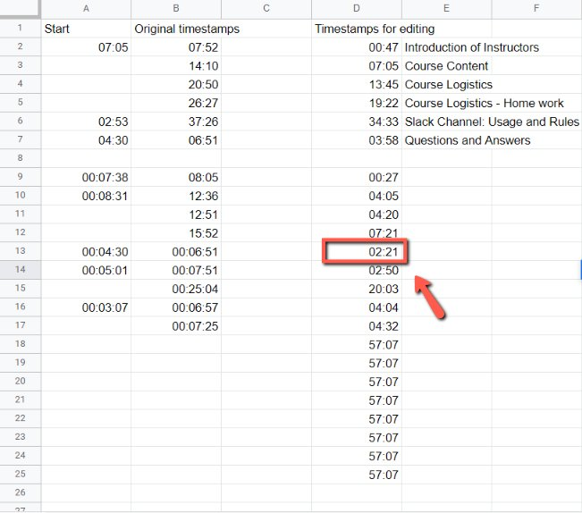

# Find timestamps for editing

<!-- sop-section-start: summary -->
## Summary

- Purpose: Convert Zoom chat timestamps into edit timestamps for the YouTube editor.
- Outcome: The video editor has the correct adjusted timestamps for cuts.
- Trigger: An Open-Source Spotlight recording has chat timestamps that need editing.
- Frequency: Per recording that needs edits.
<!-- sop-section-end -->

<!-- sop-section-start: prerequisites -->
## Prerequisites

- Access: Zoom recording, chat messages, offset calculation spreadsheet, and YouTube Studio.
- Tools: Zoom, Google Sheets, YouTube editor.
- Inputs: Chat timestamps, recording start offset, and target YouTube video.
<!-- sop-section-end -->

<!-- sop-section-start: procedure -->
## Procedure

<!-- sop-prose-start -->
How to find timestamps for editing
This procedure will show you the steps on how to find timestamps for editing.

Step-by-step Instructions
<!-- sop-prose-end -->

<!-- sop-step-start id=1 -->
1.  The first thing you need to do is open the zoom recorded video from Alexey.

    <!-- sop-screenshot-start -->
    
    <!-- sop-caption-start -->
    This screenshot matters for confirming the process is on the expected screen before the next action; look for the highlighted area or visible control labeled zoom recorded video from Alexey. Use that match to verify the screen state, then complete the step described above.
    <!-- sop-caption-end -->
    <!-- sop-screenshot-end -->
<!-- sop-step-end -->

<!-- sop-step-start id=2 -->
2.  Once done, click on “Chat Messages” on the upper right of your screen.

    <!-- sop-screenshot-start -->
    
    <!-- sop-caption-start -->
    This screenshot matters for confirming the communication step before sending or recording outreach; look for the highlighted area or visible control labeled Chat Messages. Use that match to verify the screen state, then complete the step described above.
    <!-- sop-caption-end -->
    <!-- sop-screenshot-end -->
<!-- sop-step-end -->

<!-- sop-step-start id=3 -->
3.  Here, you can now see the different timestamps to be edited. But before that, you need to do some offset calculations.

    <!-- sop-screenshot-start -->
    
    <!-- sop-caption-start -->
    This screenshot matters for checking the editing, transcript, or timestamp workflow at this point; look for the highlighted area or matching UI state shown in the image. Use it to verify the screen state, then complete the step described above.
    <!-- sop-caption-end -->
    <!-- sop-screenshot-end -->
<!-- sop-step-end -->

<!-- sop-step-start id=4 -->
4.  To proceed, open the offset calculation [spreadsheet](https://docs.google.com/spreadsheets/d/1MDJUjRur6wPYkPP6N7JzQw3kuUIaA82_gIBwbGi1t04/edit#gid=1793309730).

    <!-- sop-screenshot-start -->
    
    <!-- sop-caption-start -->
    This screenshot matters for confirming the process is on the expected screen before the next action; look for the highlighted area or visible control labeled offset calculation spreadsheet. Use that match to verify the screen state, then complete the step described above.
    <!-- sop-caption-end -->
    <!-- sop-screenshot-end -->
<!-- sop-step-end -->

<!-- sop-step-start id=5 -->
5.  And then, enter the timecodes that need to be edited.

    <!-- sop-screenshot-start -->
    
    <!-- sop-caption-start -->
    This screenshot matters for checking the editing, transcript, or timestamp workflow at this point; look for the highlighted area or visible control labeled timecodes that need to be edited. Use that match to verify the screen state, then complete the step described above.
    <!-- sop-caption-end -->
    <!-- sop-screenshot-end -->
<!-- sop-step-end -->

<!-- sop-step-start id=6 -->
6.  After, use the timecode calculated to edit the video in the YouTube editor.

    <!-- sop-screenshot-start -->
    
    <!-- sop-caption-start -->
    This screenshot matters for checking the editing, transcript, or timestamp workflow at this point; look for the highlighted area or visible control labeled video in the YouTube editor. Use that match to verify the screen state, then complete the step described above.
    <!-- sop-caption-end -->
    <!-- sop-screenshot-end -->
<!-- sop-step-end -->
<!-- sop-section-end -->

<!-- sop-section-start: validation -->
## Validation

-
<!-- sop-section-end -->

<!-- sop-section-start: troubleshooting -->
## Troubleshooting

-
<!-- sop-section-end -->

<!-- sop-section-start: references -->
## References

-
<!-- sop-section-end -->
