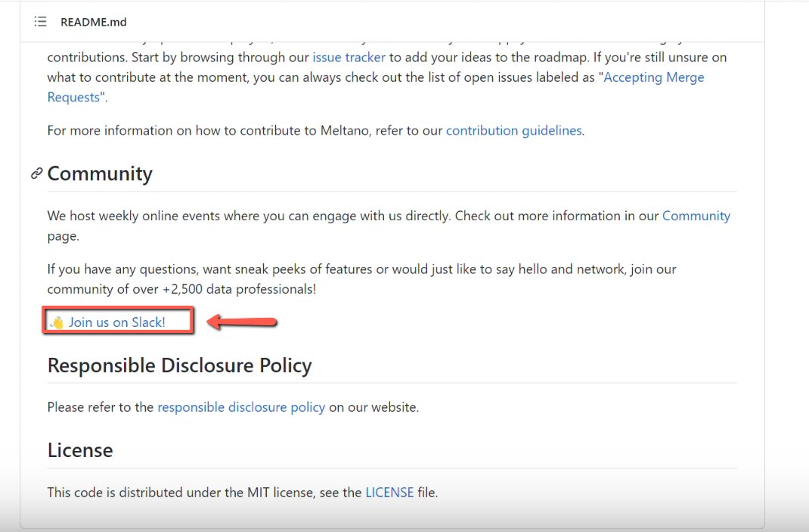
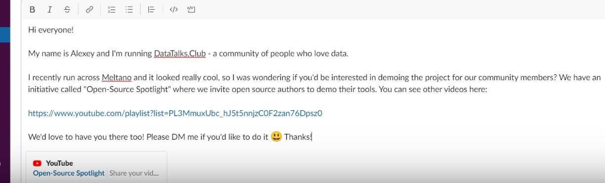

# Joining Open-Source Project Communities and Asking for OSS demos there

<!-- sop-section-start: summary -->
## Summary

- Purpose: Find project communities and ask maintainers to do Open-Source Spotlight demos.
- Outcome: A demo request is posted or sent through the project community channel.
- Trigger: A project needs outreach beyond direct email or LinkedIn.
- Frequency: Per Open-Source Spotlight project lead.
<!-- sop-section-end -->

<!-- sop-section-start: prerequisites -->
## Prerequisites

- Access: Project GitHub repo and its community channel.
- Tools: GitHub, Slack or other community platform, outreach template.
- Inputs: Project repo, community link, maintainer details, and demo request template.
<!-- sop-section-end -->

<!-- sop-section-start: procedure -->
## Procedure

<!-- sop-prose-start -->
How to Join Open-Source Project Communities and Asking for OSS demos there
This procedure will show you the steps on How to Join Open-Source Project Communities and Asking for OSS demos there

Step-by-step Instructions
<!-- sop-prose-end -->

<!-- sop-step-start id=1 -->
1.  The first thing you need to do is check if the Open-Source has a Slack community. Usually, it can be found on the bottom page of the github repo. Once you found it, click the link to the slack community.

    <!-- sop-screenshot-start -->
    
    <!-- sop-caption-start -->
    This screenshot matters for confirming the process is on the expected screen before the next action; look for the highlighted area or matching UI state shown in the image. Use it to verify the screen state, then complete the step described above.
    <!-- sop-caption-end -->
    <!-- sop-screenshot-end -->
<!-- sop-step-end -->

<!-- sop-step-start id=2 -->
2.  Next, reach out to the authors via their channels. Use this [template](https://docs.google.com/document/d/1zr4JAHc4HYo3BKeJEf2Bv7wUZPsTmN6Sq20wzivyZdE/edit?usp=sharing)

    Note: In this example, we are reaching through them in their \#introduction channel.

    <!-- sop-screenshot-start -->
    
    <!-- sop-caption-start -->
    This screenshot matters for confirming the process is on the expected screen before the next action; look for the highlighted area or matching UI state shown in the image. Use it to verify the screen state, then complete the step described above.
    <!-- sop-caption-end -->
    <!-- sop-screenshot-end -->
<!-- sop-step-end -->
<!-- sop-section-end -->

<!-- sop-section-start: validation -->
## Validation

-
<!-- sop-section-end -->

<!-- sop-section-start: troubleshooting -->
## Troubleshooting

-
<!-- sop-section-end -->

<!-- sop-section-start: references -->
## References

-
<!-- sop-section-end -->
