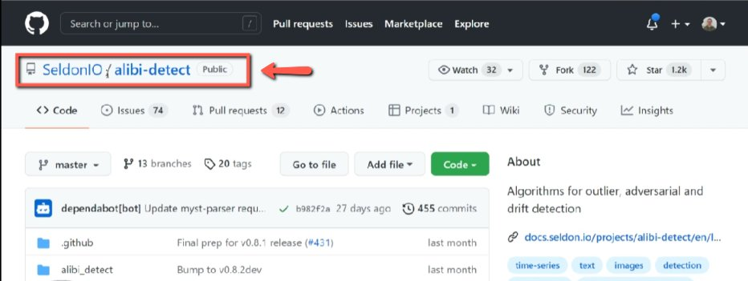
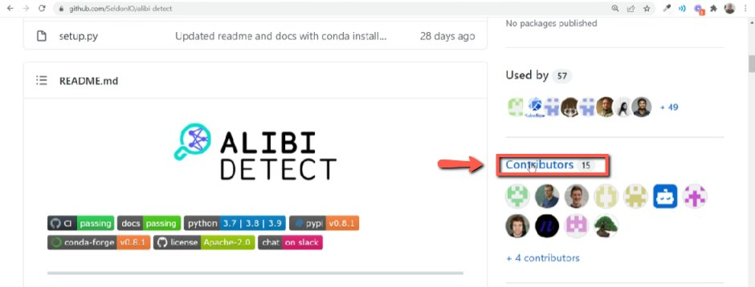
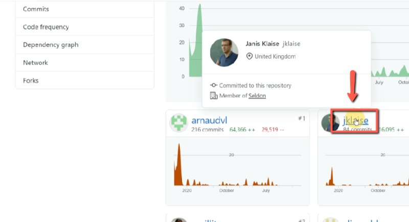
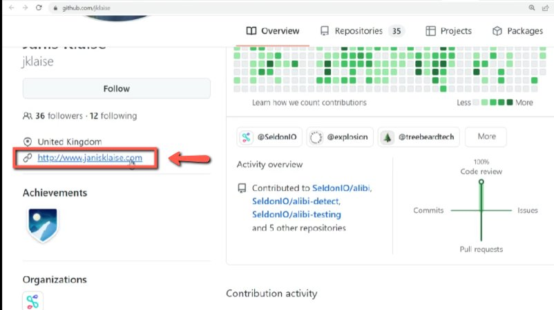
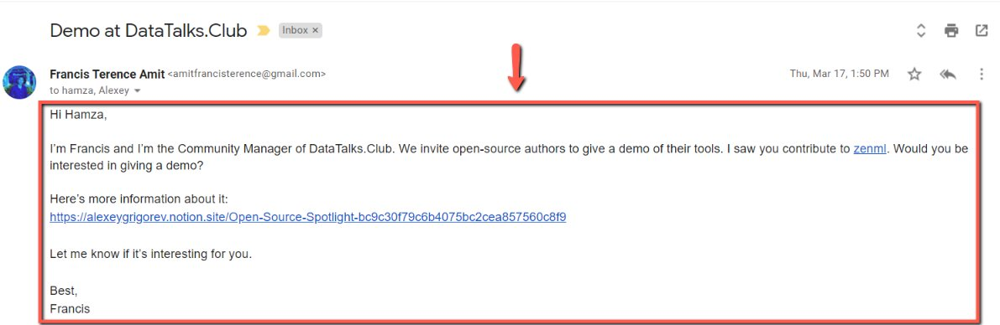

# Reach out to open-source spotlight guests

<!-- sop-section-start: summary -->
## Summary

- Purpose: Find contributor contact details and invite them to an Open-Source Spotlight demo.
- Outcome: A contributor receives an outreach message with the event information.
- Trigger: A tool or project is selected for Open-Source Spotlight outreach.
- Frequency: Per potential guest.
<!-- sop-section-end -->

<!-- sop-section-start: prerequisites -->
## Prerequisites

- Access: Project GitHub repo, contributor profiles, and outreach template.
- Tools: GitHub, browser, email or LinkedIn.
- Inputs: Project link, contributor profile, contact information, and Notion/event information.
<!-- sop-section-end -->

<!-- sop-section-start: procedure -->
## Procedure

<!-- sop-prose-start -->
How to reach out to open-source spotlight guests
This procedure will show you the steps on how to reach out to open-source spotlight guests.

Step-by-step Instructions
<!-- sop-prose-end -->

<!-- sop-step-start id=1 -->
1.  The first thing to do is visit the GitHub library of the tool.

    <!-- sop-screenshot-start -->
    
    <!-- sop-caption-start -->
    This screenshot matters for confirming the process is on the expected screen before the next action; look for the highlighted area or matching UI state shown in the image. Use it to verify the screen state, then complete the step described above.
    <!-- sop-caption-end -->
    <!-- sop-screenshot-end -->
<!-- sop-step-end -->

<!-- sop-step-start id=2 -->
2.  After, scroll down and click on the "Contributors" tab

    <!-- sop-screenshot-start -->
    
    <!-- sop-caption-start -->
    This screenshot matters for confirming the process is on the expected screen before the next action; look for the highlighted area or visible control labeled Contributors. Use that match to verify the screen state, then complete the step described above.
    <!-- sop-caption-end -->
    <!-- sop-screenshot-end -->
<!-- sop-step-end -->

<!-- sop-step-start id=3 -->
3.  And once you are inside, click on the Contributors profile.

    Note: Make sure that the COntributor should has contact information. This includes their website, email, LinkedIn profile, etc.

    <!-- sop-screenshot-start -->
    
    <!-- sop-caption-start -->
    This screenshot matters for capturing or placing the correct link information; look for the highlighted area or matching UI state shown in the image. Use it to verify the screen state, then complete the step described above.
    <!-- sop-caption-end -->
    <!-- sop-screenshot-end -->
<!-- sop-step-end -->

<!-- sop-step-start id=4 -->
4.  And then find the contact information of the guest speaker.

    <!-- sop-screenshot-start -->
    
    <!-- sop-caption-start -->
    This screenshot matters for checking the editing, transcript, or timestamp workflow at this point; look for the highlighted area or matching UI state shown in the image. Use it to verify the screen state, then complete the step described above.
    <!-- sop-caption-end -->
    <!-- sop-screenshot-end -->
<!-- sop-step-end -->

<!-- sop-step-start id=5 -->
5.  Once you find his/her contact information, [reach out to them](https://docs.google.com/document/d/1GsbVYm_ddIjZIVMA49PZLmTcI8tZzeQSwsaGkc5MOyk/edit?usp=sharing) and ask if they are interested in doing a demo of their tool.

    Note: Don't forget to add the link to the Notion for more information about the event.

    <!-- sop-screenshot-start -->
    
    <!-- sop-caption-start -->
    This screenshot matters for capturing or placing the correct link information; look for the highlighted area or matching UI state shown in the image. Use it to verify the screen state, then complete the step described above.
    <!-- sop-caption-end -->
    <!-- sop-screenshot-end -->
<!-- sop-step-end -->
<!-- sop-section-end -->

<!-- sop-section-start: validation -->
## Validation

-
<!-- sop-section-end -->

<!-- sop-section-start: troubleshooting -->
## Troubleshooting

-
<!-- sop-section-end -->

<!-- sop-section-start: references -->
## References

-
<!-- sop-section-end -->
