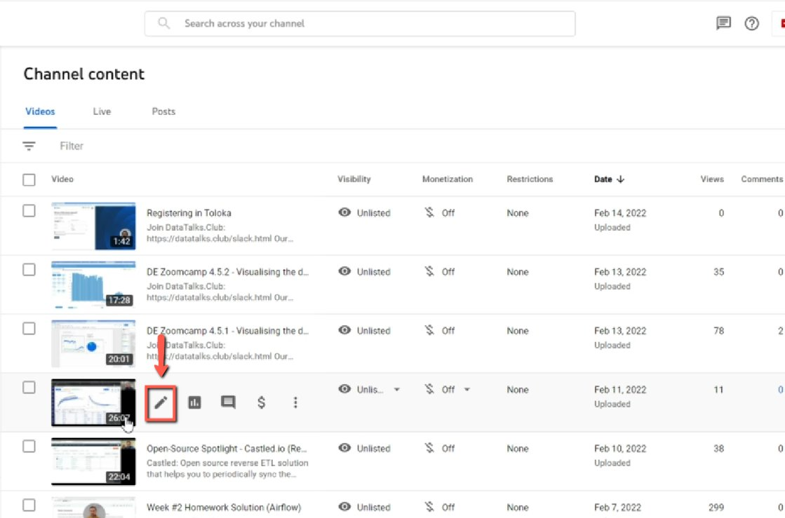
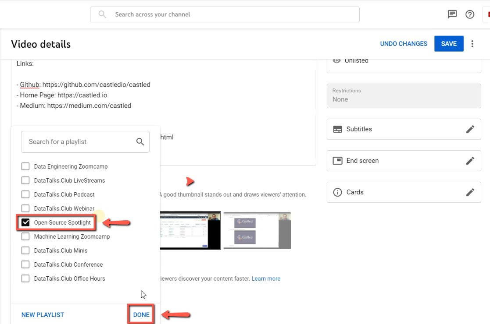
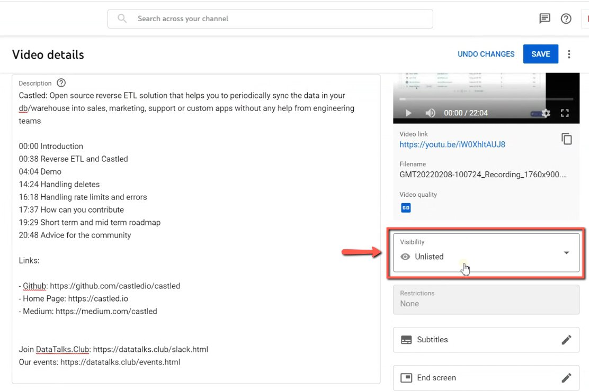
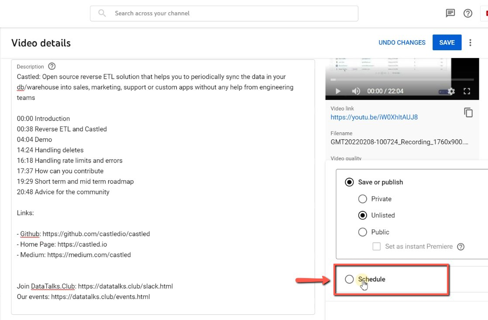
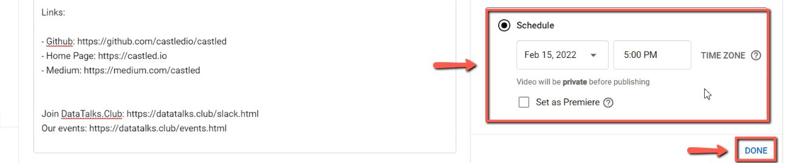
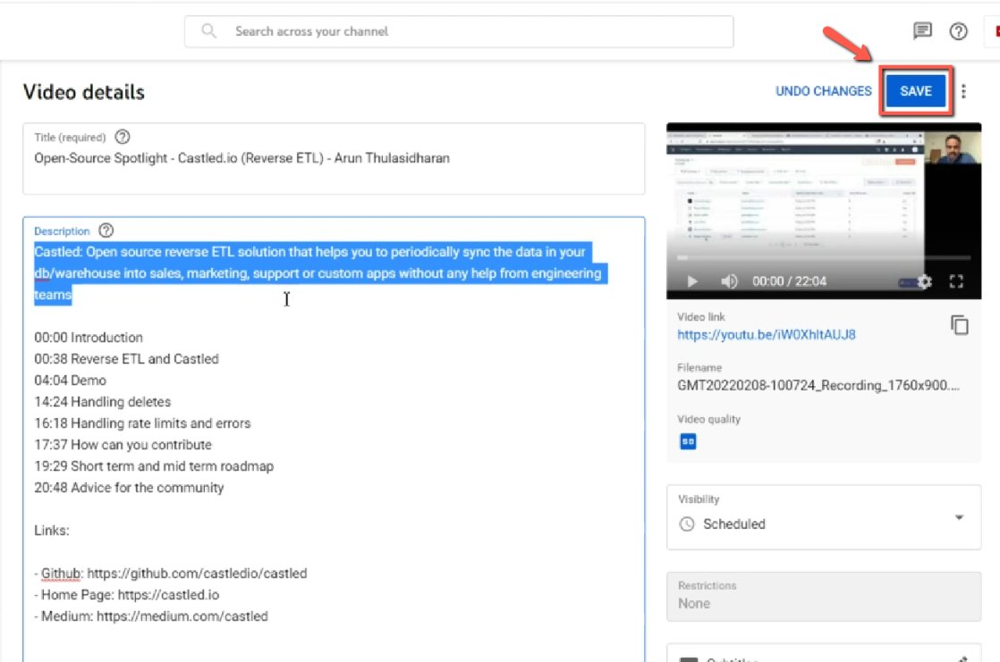

# Schedule Open-Source Spotlight YouTube videos

<!-- sop-section-start: summary -->
## Summary

- Purpose: Schedule an Open-Source Spotlight video for publication on YouTube.
- Outcome: The video is scheduled, saved, and added to the Open-Source Spotlight playlist.
- Trigger: An Open-Source Spotlight video is uploaded and ready to publish.
- Frequency: Per Open-Source Spotlight video.
<!-- sop-section-end -->

<!-- sop-section-start: prerequisites -->
## Prerequisites

- Access: DataTalks.Club YouTube Studio and Open-Source Spotlight playlist.
- Tools: YouTube Studio.
- Inputs: Uploaded video, playlist, publication date, and publication time.
<!-- sop-section-end -->

<!-- sop-section-start: procedure -->
## Procedure

<!-- sop-prose-start -->
How to schedule YouTube videos
This procedure will show you the steps on how to schedule YouTube videos.

Step-by-step Instructions
<!-- sop-prose-end -->

<!-- sop-step-start id=1 -->
1.  The first thing you need to do is select the pen tool icon on the video you want to schedule and upload it on YouTube.

    <!-- sop-screenshot-start -->
    
    <!-- sop-caption-start -->
    This screenshot matters for confirming the upload, publishing, or scheduling state before it becomes user-facing; look for the highlighted area or matching UI state shown in the image. Use it to verify the screen state, then complete the step described above.
    <!-- sop-caption-end -->
    <!-- sop-screenshot-end -->
<!-- sop-step-end -->

<!-- sop-step-start id=2 -->
2.  In the video details, select the playlist.

    <!-- sop-screenshot-start -->
    
    <!-- sop-caption-start -->
    This screenshot matters for confirming the process is on the expected screen before the next action; look for the highlighted area or visible control labeled playlist. Use that match to verify the screen state, then complete the step described above.
    <!-- sop-caption-end -->
    <!-- sop-screenshot-end -->
<!-- sop-step-end -->

<!-- sop-step-start id=3 -->
3.  And on the right side of your screen, click "Visibility"

    <!-- sop-screenshot-start -->
    
    <!-- sop-caption-start -->
    This screenshot matters for confirming the process is on the expected screen before the next action; look for the highlighted area or visible control labeled Visibility. Use that match to verify the screen state, then complete the step described above.
    <!-- sop-caption-end -->
    <!-- sop-screenshot-end -->
<!-- sop-step-end -->

<!-- sop-step-start id=4 -->
4.  After, select "Schedule"

    <!-- sop-screenshot-start -->
    
    <!-- sop-caption-start -->
    This screenshot matters for confirming the upload, publishing, or scheduling state before it becomes user-facing; look for the highlighted area or visible control labeled Schedule. Use that match to verify the screen state, then complete the step described above.
    <!-- sop-caption-end -->
    <!-- sop-screenshot-end -->
<!-- sop-step-end -->

<!-- sop-step-start id=5 -->
5.  Now you can enter the date and time when will the video be uploaded and select "Done"

    Note: Typically, Open-Source Spotlight videos are scheduled on Wednesdays at 5:00 PM for Europe/Berlin timezone (GMT 2+).

    Once you have scheduled the video, add it to the OSS playlist.
    <!-- sop-screenshot-start -->
    
    <!-- sop-caption-start -->
    This screenshot matters for confirming the upload, publishing, or scheduling state before it becomes user-facing; look for the highlighted area or visible control labeled it to the OSS playlist. Use that match to verify the screen state, then complete the step described above.
    <!-- sop-caption-end -->
    <!-- sop-screenshot-end -->
<!-- sop-step-end -->

<!-- sop-step-start id=6 -->
6.  Lastly, click "Save"

    <!-- sop-screenshot-start -->
    
    <!-- sop-caption-start -->
    This screenshot matters for confirming the download or export step is using the right option; look for the highlighted area or visible control labeled Save. Use that match to verify the screen state, then complete the step described above.
    <!-- sop-caption-end -->
    <!-- sop-screenshot-end -->
<!-- sop-step-end -->
<!-- sop-section-end -->

<!-- sop-section-start: validation -->
## Validation

-
<!-- sop-section-end -->

<!-- sop-section-start: troubleshooting -->
## Troubleshooting

-
<!-- sop-section-end -->

<!-- sop-section-start: references -->
## References

-
<!-- sop-section-end -->
