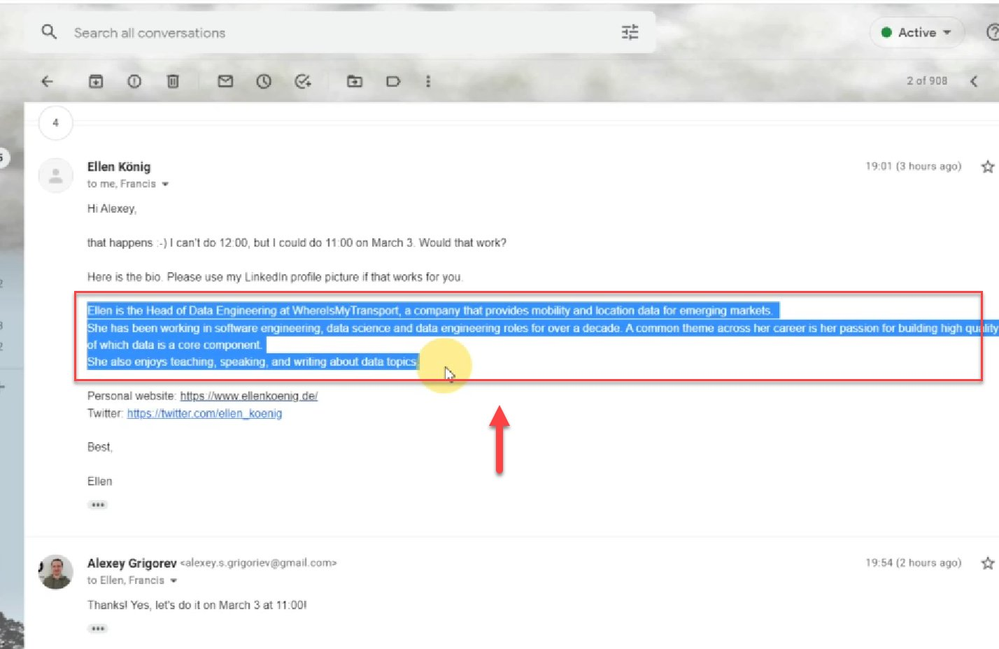
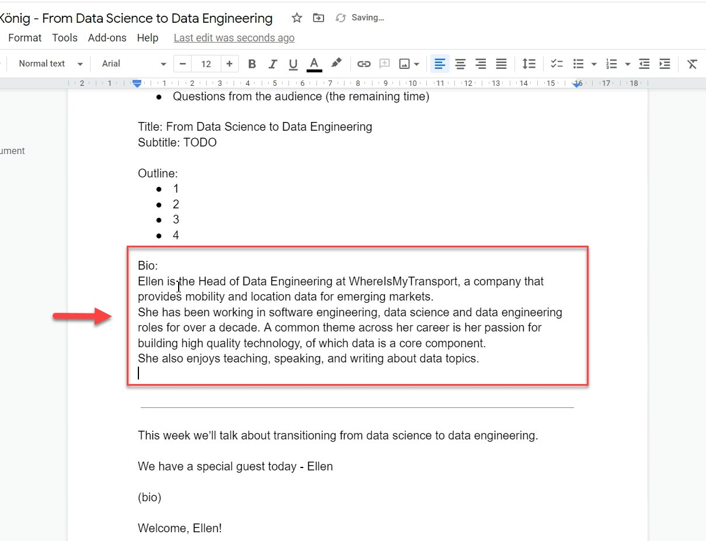

# Add a guest bio to the podcast document

<!-- sop-section-start: summary -->
## Summary

- Purpose: Add the guest bio to the podcast document.
- Outcome: The podcast document has the guest bio in the Bio section and introduction text.
- Trigger: The guest sends their bio.
- Frequency: Per podcast guest.
<!-- sop-section-end -->

<!-- sop-section-start: prerequisites -->
## Prerequisites

- Access: Podcast document and guest communication channel.
- Tools: Google Docs, email or messaging.
- Inputs: Guest bio and podcast document link.
<!-- sop-section-end -->

<!-- sop-section-start: procedure -->
## Procedure

<!-- sop-prose-start -->
This procedure will show you the steps on \<insert title only capitalizing proper nouns\>.

Step-by-step Instructions
<!-- sop-prose-end -->

<!-- sop-step-start id=1 -->
1.  The first thing to do is ask the speaker for their bio and once he/she sent the video, copy it.

    <!-- sop-screenshot-start -->
    
    <!-- sop-caption-start -->
    This screenshot matters for capturing or placing the correct link information; look for the highlighted area or visible control labeled it. Use that match to verify the screen state, then complete the step described above.
    <!-- sop-caption-end -->
    <!-- sop-screenshot-end -->
<!-- sop-step-end -->

<!-- sop-step-start id=2 -->
2.  And, open the podcast document of the guest and paste the bio of the speaker under "Bio:" and also later under “WE have a special guest today – \<NAME\>”

    <!-- sop-screenshot-start -->
    
    <!-- sop-caption-start -->
    This screenshot matters for capturing or placing the correct link information; look for the highlighted area or visible control labeled Bio:. Use that match to verify the screen state, then complete the step described above.
    <!-- sop-caption-end -->
    <!-- sop-screenshot-end -->
<!-- sop-step-end -->
<!-- sop-section-end -->

<!-- sop-section-start: validation -->
## Validation

-
<!-- sop-section-end -->

<!-- sop-section-start: troubleshooting -->
## Troubleshooting

-
<!-- sop-section-end -->

<!-- sop-section-start: references -->
## References

-
<!-- sop-section-end -->
