# Add a podcast episode via Airtable form

<!-- sop-section-start: summary -->
## Summary

- Purpose: Submitting a form for creating a dedicated page for a podcast episode on the DataTalks website.
- Outcome: Our website will then pull this information and show it for everyone.
- Trigger: after a podcast episode (audio only) is published on Spotify and Apple Podcasts via Spotify for Podcasters.
- Frequency: Per published podcast episode.
<!-- sop-section-end -->

<!-- sop-section-start: prerequisites -->
## Prerequisites

- Access: Airtable podcast episode form, schedule spreadsheet, Spotify for Podcasters, Apple Podcasts, YouTube Studio, and transcript files.
- Tools: Airtable, Spotify for Podcasters, Apple Podcasts, YouTube Studio, GitHub.
- Inputs: Season and episode numbers, transcript docx, Spotify link, Apple Podcasts link, YouTube link, title, description, and image.
<!-- sop-section-end -->

<!-- sop-section-start: procedure -->
## Procedure

<!-- sop-group-start: "Airtable Form" -->
### Airtable Form

<!-- sop-step-start id=1 -->
1.  The first thing you need to do is open the Airtable form for "[Adding a podcast episode](https://airtable.com/app7NCWvFj6Wz0ASm/shriRxLKwB1CyxhEy)"

    [https://airtable.com/app7NCWvFj6Wz0ASm/shriRxLKwB1CyxhEy](https://airtable.com/app7NCWvFj6Wz0ASm/shriRxLKwB1CyxhEy)

    <!-- sop-screenshot-start -->
    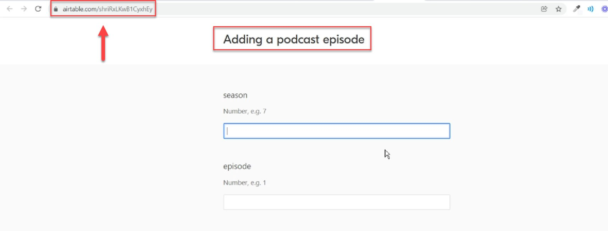
    <!-- sop-caption-start -->
    This screenshot matters for confirming the correct record, field, or status before updating the workflow; look for the highlighted area or visible control labeled Adding a podcast episode. Use that match to verify the screen state, then complete the step described above.
    <!-- sop-caption-end -->
    <!-- sop-screenshot-end -->
<!-- sop-step-end -->

<!-- sop-step-start id=2 -->
2.  Next, enter the season and episode of the podcast.
    You can find them in the [DataTalks.Club schedule document](https://docs.google.com/spreadsheets/d/1-T8qkmShlFUrT2NmkI8Pi1NgUS9IunP6wO5-L79xe2s/edit), columns S and T:

    <!-- sop-screenshot-start -->
    
    <!-- sop-caption-start -->
    This screenshot matters for confirming the upload, publishing, or scheduling state before it becomes user-facing; look for the highlighted area or visible control labeled document. Use that match to verify the screen state, then complete the step described above.
    <!-- sop-caption-end -->
    <!-- sop-screenshot-end -->

    Put them to the form:
    <!-- sop-screenshot-start -->
    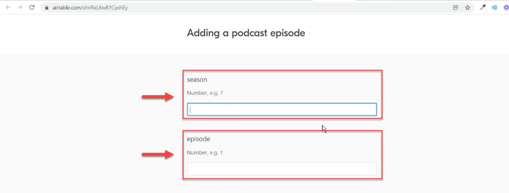
    <!-- sop-caption-start -->
    This screenshot matters for confirming the correct record, field, or status before updating the workflow; look for the highlighted area or matching UI state shown in the image. Use it to verify the screen state, then complete the step described above.
    <!-- sop-caption-end -->
    <!-- sop-screenshot-end -->
<!-- sop-step-end -->

<!-- sop-group-end -->

<!-- sop-group-start: "Transcript" -->
### Transcript

<!-- sop-step-start id=3 -->
3.  Next, upload the transcript file (.docx).

    Typically, you can find the transcript file here: [https://github.com/alexeygrigorev/transcript-utils/tree/main/docs](https://github.com/alexeygrigorev/transcript-utils/tree/main/docs)

    If we don’t have a transcript file yet, we skip it and add the transcript later following this process: TODO

    Once you have the relevant transcript file, click “Attach file”.
    <!-- sop-screenshot-start -->
    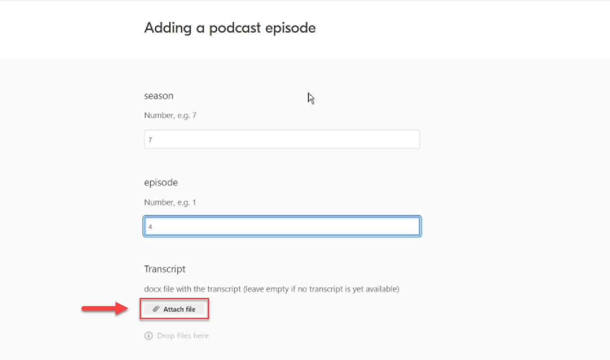
    <!-- sop-caption-start -->
    This screenshot matters for checking the editing, transcript, or timestamp workflow at this point; look for the highlighted area or visible control labeled Attach file. Use that match to verify the screen state, then complete the step described above.
    <!-- sop-caption-end -->
    <!-- sop-screenshot-end -->

    And drag your file and "Upload" (Make sure it’s a .docx file).

    <!-- sop-screenshot-start -->
    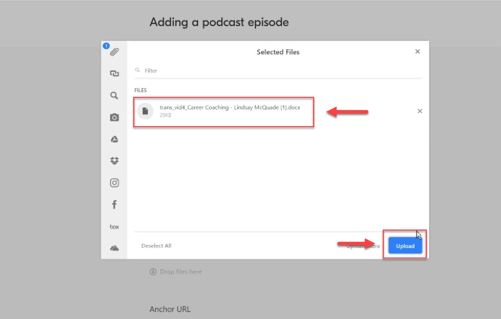
    <!-- sop-caption-start -->
    This screenshot matters for confirming the upload, publishing, or scheduling state before it becomes user-facing; look for the highlighted area or visible control labeled Upload. Use that match to verify the screen state, then complete the step described above.
    <!-- sop-caption-end -->
    <!-- sop-screenshot-end -->
<!-- sop-step-end -->

<!-- sop-group-end -->

<!-- sop-group-start: "Spotify for Podcasters link" -->
### Spotify for Podcasters link

<!-- sop-step-start id=4 -->
4.  To paste the link from Spotify for Podcasters (“Anchor URL” in the form), open Spotify for Podcasters

    [https://podcasters.spotify.com/pod/show/datatalksclub](https://podcasters.spotify.com/pod/show/datatalksclub)

    You can find this link if you open our podcast page: [https://datatalks.club/podcast.html](https://datatalks.club/podcast.html) and click “Listen on Anchor”

    <!-- sop-screenshot-start -->
    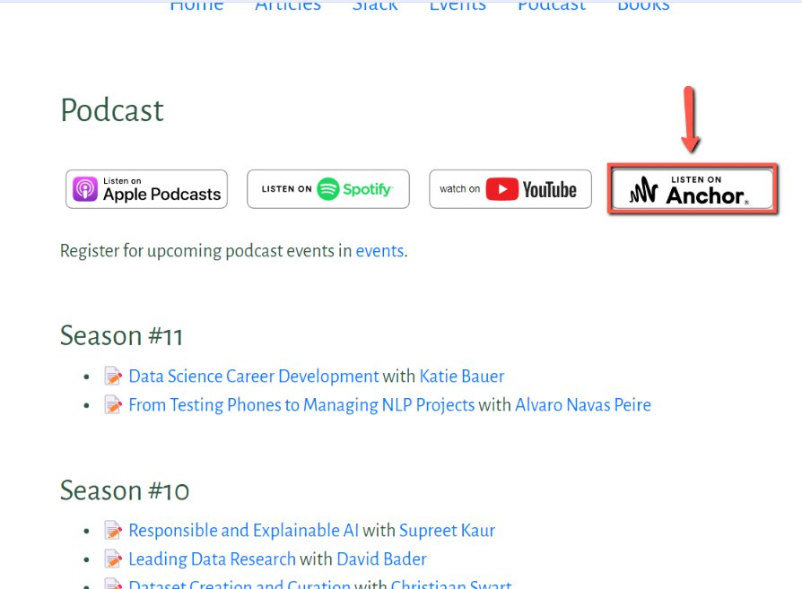
    <!-- sop-caption-start -->
    This screenshot matters for capturing or placing the correct link information; look for the highlighted area or visible control labeled Listen on Anchor. Use that match to verify the screen state, then complete the step described above.
    <!-- sop-caption-end -->
    <!-- sop-screenshot-end -->
<!-- sop-step-end -->

<!-- sop-step-start id=5 -->
5.  On Spotify for Podcasters, navigate to the relevant podcast episode, do the right click, and then select “Copy link address”:

    <!-- sop-screenshot-start -->
    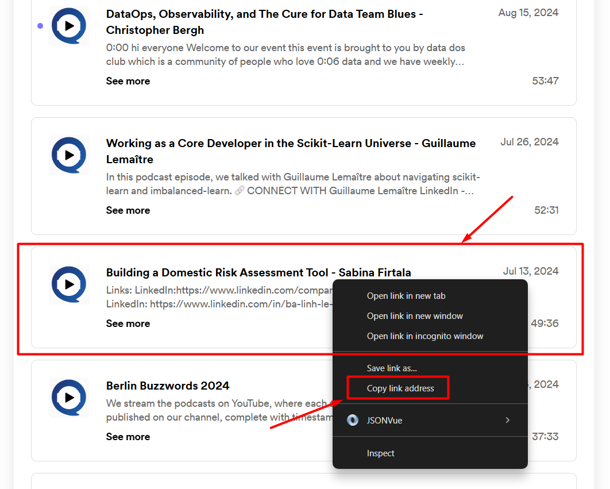
    <!-- sop-caption-start -->
    This screenshot matters for capturing or placing the correct link information; look for the highlighted area or visible control labeled Copy link address. Use that match to verify the screen state, then complete the step described above.
    <!-- sop-caption-end -->
    <!-- sop-screenshot-end -->

    The link will look like that: [https://podcasters.spotify.com/pod/show/datatalksclub/episodes/Building-a-Domestic-Risk-Assessment-Tool---Sabina-Firtala-e2lr92i](https://podcasters.spotify.com/pod/show/datatalksclub/episodes/Building-a-Domestic-Risk-Assessment-Tool---Sabina-Firtala-e2lr92i)

    https://creators.spotify.com/pod/show/datatalksclub/episodes/AI-in-Industry-Trust--Return-on-Investment-and-Future---Maria-Sukhareva-e2rp9f8
<!-- sop-step-end -->

<!-- sop-step-start id=6 -->
6.  Paste it in the podcast form, Anchor URL field.

    <!-- sop-screenshot-start -->
    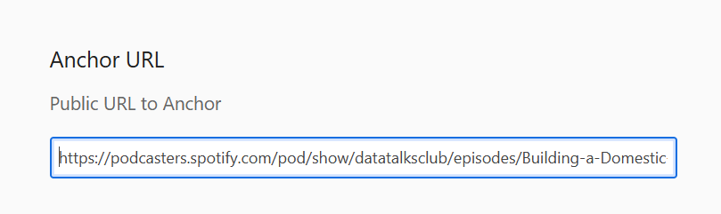
    <!-- sop-caption-start -->
    This screenshot matters for capturing or placing the correct link information; look for the highlighted area or visible control labeled it in the podcast form. Use that match to verify the screen state, then complete the step described above.
    <!-- sop-caption-end -->
    <!-- sop-screenshot-end -->
<!-- sop-step-end -->

<!-- sop-group-end -->

<!-- sop-group-start: "YouTube URL" -->
### YouTube URL

<!-- sop-step-start id=7 -->
7.  After, copy the YouTube URL of the podcast episode.

    (You should have it in the Trello card. If you don’t, you can [find it on our YouTube channel](https://www.youtube.com/c/datatalksclub) - and then put it to the card)

    Make sure to use the correct link: remove the lines after the symbol “&”:

    Wrong link: [https://www.youtube.com/watch?v=i1NHRroQClQ&t=151s](https://www.youtube.com/watch?v=i1NHRroQClQ&t=151s)

    Wrong link: [https://www.youtube.com/live/](https://www.youtube.com/live/HzGpIxV8HtA?si=PYW873aUDpWcZpIE)[i1NHRroQClQ](https://www.youtube.com/watch?v=i1NHRroQClQ&t=151s)[?si=PYW873aUDpWcZpIE](https://www.youtube.com/live/HzGpIxV8HtA?si=PYW873aUDpWcZpIE)

    Correct link: [https://www.youtube.com/watch?v=i1NHRroQClQ](https://www.youtube.com/watch?v=i1NHRroQClQ&t=151s)
    If the link has “live” in it, replace it: [https://www.youtube.com/live/](https://www.youtube.com/live/HzGpIxV8HtA?si=PYW873aUDpWcZpIE)[i1NHRroQClQ](https://www.youtube.com/watch?v=i1NHRroQClQ&t=151s)[?si=PYW873aUDpWcZpI](https://www.youtube.com/live/HzGpIxV8HtA?si=PYW873aUDpWcZpIE) =\> [https://www.youtube.com/watch?v=i1NHRroQClQ](https://www.youtube.com/watch?v=i1NHRroQClQ)

    Next, put it to the “YouTube URL” field:
    <!-- sop-screenshot-start -->
    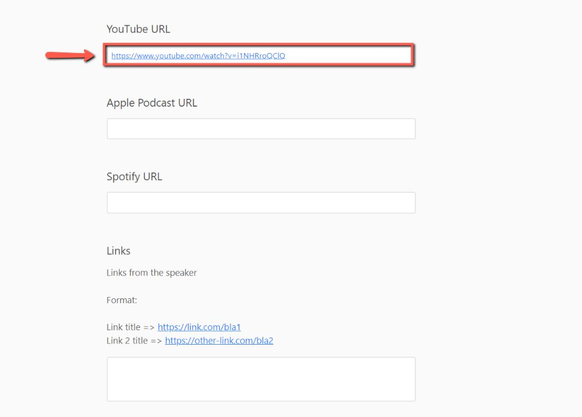
    <!-- sop-caption-start -->
    This screenshot matters for capturing or placing the correct link information; look for the highlighted area or visible control labeled YouTube URL. Use that match to verify the screen state, then complete the step described above.
    <!-- sop-caption-end -->
    <!-- sop-screenshot-end -->
<!-- sop-step-end -->

<!-- sop-step-start id=8 -->
8.  Make sure that there’s an event with this YouTube ID in the events.yaml file of our website:

    [https://github.com/DataTalksClub/datatalksclub.github.io/blob/main/\_data/events.yaml](https://github.com/DataTalksClub/datatalksclub.github.io/blob/main/_data/events.yaml)

    Press Ctrl+F in the browser to open the search box and put the YouTube ID there:

    <!-- sop-screenshot-start -->
    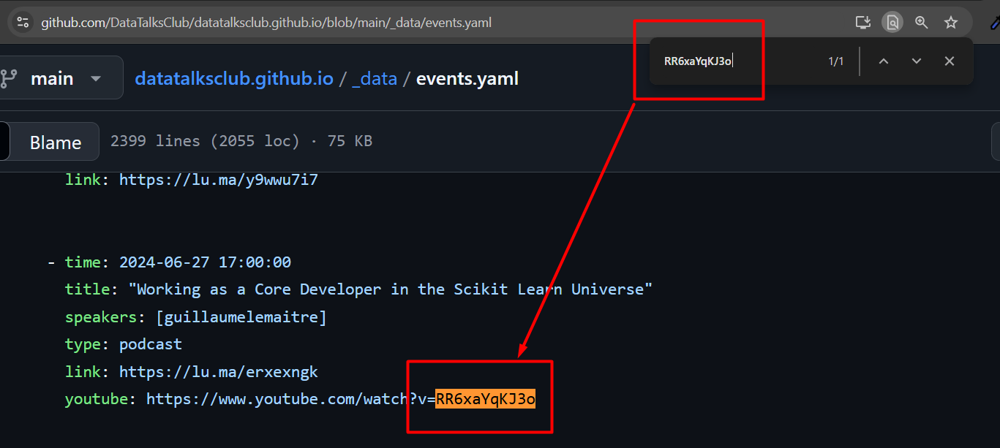
    <!-- sop-caption-start -->
    This screenshot matters for confirming the process is on the expected screen before the next action; look for the highlighted area or matching UI state shown in the image. Use it to verify the screen state, then complete the step described above.
    <!-- sop-caption-end -->
    <!-- sop-screenshot-end -->

    Add it if it’s missing by following this process document: TODO
<!-- sop-step-end -->

<!-- sop-group-end -->

<!-- sop-group-start: "Apple Podcasts" -->
### Apple Podcasts

<!-- sop-step-start id=9 -->
9.  Next, we add the Apple Podcasts link: [https://podcasts.apple.com/us/podcast/datatalks-club/id1541710331](https://podcasts.apple.com/us/podcast/datatalks-club/id1541710331)

    You can find it on the DataTalks.Club podcast page under the “Apple Podcasts” button

    <!-- sop-screenshot-start -->
    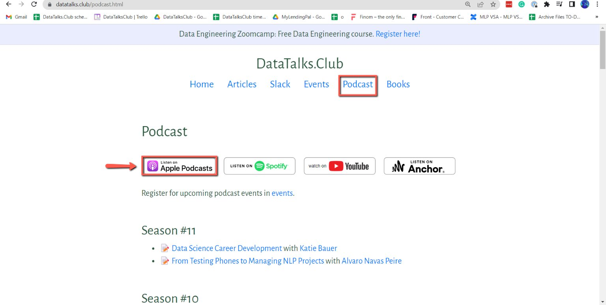
    <!-- sop-caption-start -->
    This screenshot matters for confirming the process is on the expected screen before the next action; look for the highlighted area or visible control labeled Apple Podcasts. Use that match to verify the screen state, then complete the step described above.
    <!-- sop-caption-end -->
    <!-- sop-screenshot-end -->
<!-- sop-step-end -->

<!-- sop-step-start id=10 -->
10. Then, select the podcast episode.

    <!-- sop-screenshot-start -->
    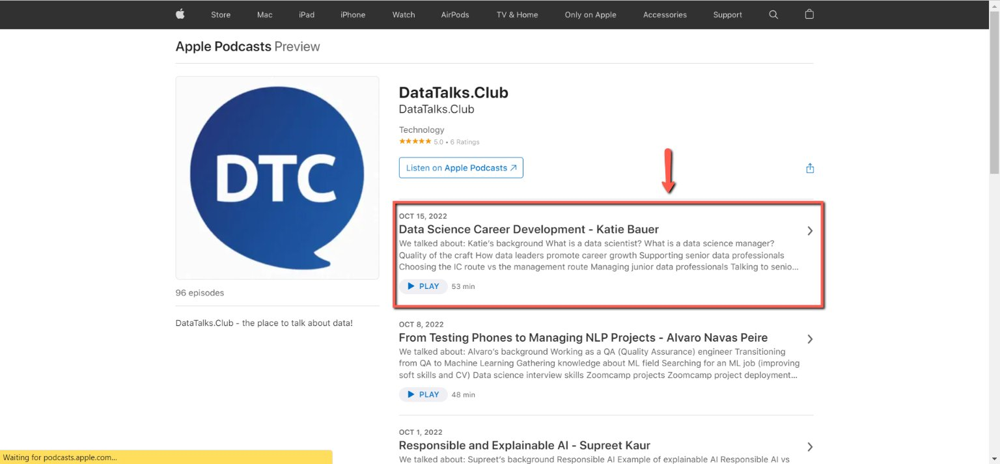
    <!-- sop-caption-start -->
    This screenshot matters for confirming the process is on the expected screen before the next action; look for the highlighted area or visible control labeled podcast episode. Use that match to verify the screen state, then complete the step described above.
    <!-- sop-caption-end -->
    <!-- sop-screenshot-end -->
<!-- sop-step-end -->

<!-- sop-step-start id=11 -->
11. After, copy the URL and paste it on the table.

    <!-- sop-screenshot-start -->
    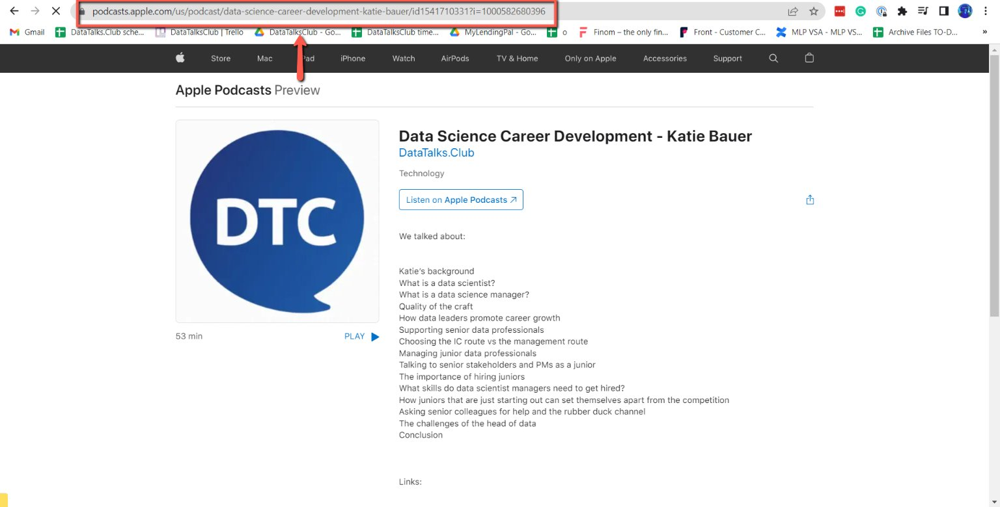
    <!-- sop-caption-start -->
    This screenshot matters for capturing or placing the correct link information; look for the highlighted area or visible control labeled URL and paste it on the table. Use that match to verify the screen state, then complete the step described above.
    <!-- sop-caption-end -->
    <!-- sop-screenshot-end -->
<!-- sop-step-end -->

<!-- sop-group-end -->

<!-- sop-group-start: "Spotify" -->
### Spotify

<!-- sop-step-start id=12 -->
12. For spotify, open Spotify’s page: [https://open.spotify.com/show/0pck8zuiXdI0OrCg86DAPy](https://open.spotify.com/show/0pck8zuiXdI0OrCg86DAPy)

    You can find it on the DataTalks.Club podcast page under the “Listen on Spotify” button

    <!-- sop-screenshot-start -->
    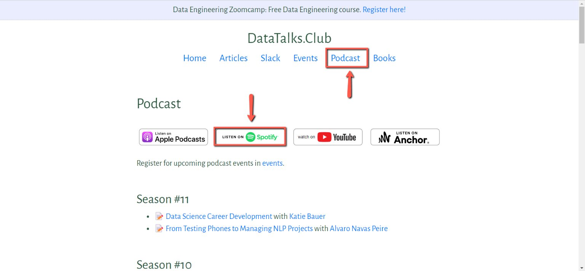
    <!-- sop-caption-start -->
    This screenshot matters for confirming the process is on the expected screen before the next action; look for the highlighted area or visible control labeled Listen on Spotify. Use that match to verify the screen state, then complete the step described above.
    <!-- sop-caption-end -->
    <!-- sop-screenshot-end -->
<!-- sop-step-end -->

<!-- sop-group-end -->

<!-- sop-group-start: "Links" -->
### Links

<!-- sop-step-start id=13 -->
13. Finally, we need to insert the links from the guest

    You can find these links in YouTube's video description. Open the YouTube link and click on “Edit the video”:

    <!-- sop-screenshot-start -->
    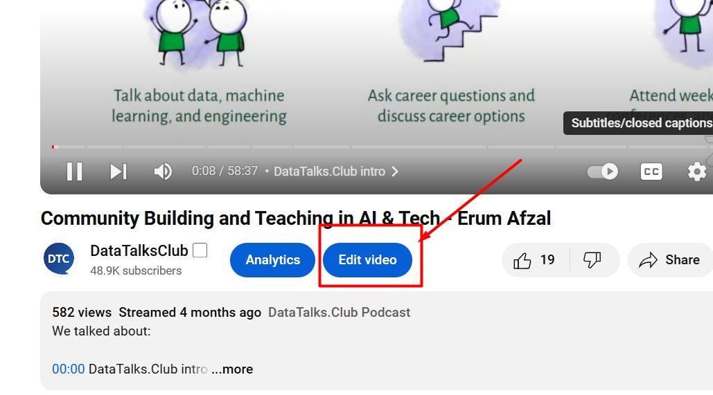
    <!-- sop-caption-start -->
    This screenshot matters for capturing or placing the correct link information; look for the highlighted area or visible control labeled Edit the video. Use that match to verify the screen state, then complete the step described above.
    <!-- sop-caption-end -->
    <!-- sop-screenshot-end -->

    Find the links:
    <!-- sop-screenshot-start -->
    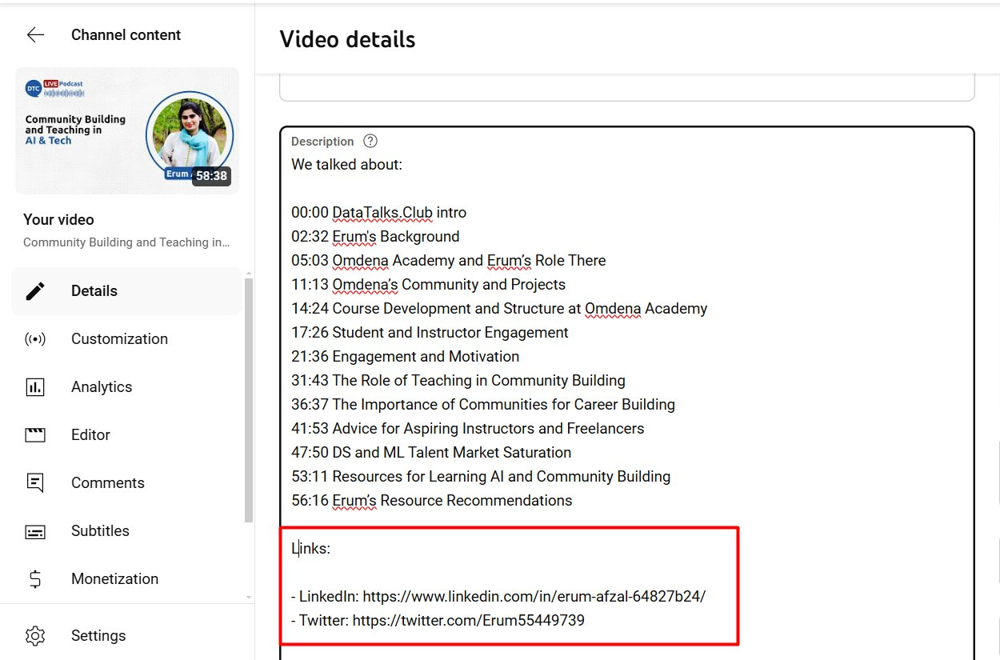
    <!-- sop-caption-start -->
    This screenshot matters for capturing or placing the correct link information; look for the highlighted area or matching UI state shown in the image. Use it to verify the screen state, then complete the step described above.
    <!-- sop-caption-end -->
    <!-- sop-screenshot-end -->

    Copy them and change the format: remove “- “ and replace “: “ with “ =\> “:

    \- LinkedIn: https://www.linkedin.com/in/erum-afzal-64827b24/

    \- Twitter: https://twitter.com/Erum55449739

    Becomes

    LinkedIn =\> https://www.linkedin.com/in/erum-afzal-64827b24/

    Twitter =\> https://twitter.com/Erum55449739
<!-- sop-step-end -->

<!-- sop-step-start id=14 -->
14. Put the links to the “Links” box:

    <!-- sop-screenshot-start -->
    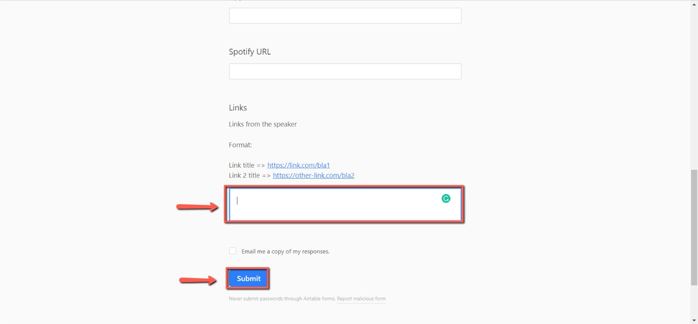
    <!-- sop-caption-start -->
    This screenshot matters for capturing or placing the correct link information; look for the highlighted area or visible control labeled Links. Use that match to verify the screen state, then complete the step described above.
    <!-- sop-caption-end -->
    <!-- sop-screenshot-end -->
<!-- sop-step-end -->

<!-- sop-step-start id=15 -->
15. Click submit. The data is now ready and the podcast episode can be published (see here)
<!-- sop-step-end -->

<!-- sop-group-end -->
<!-- sop-section-end -->

<!-- sop-section-start: validation -->
## Validation

-
<!-- sop-section-end -->

<!-- sop-section-start: troubleshooting -->
## Troubleshooting

-
<!-- sop-section-end -->

<!-- sop-section-start: references -->
## References

-
<!-- sop-section-end -->
