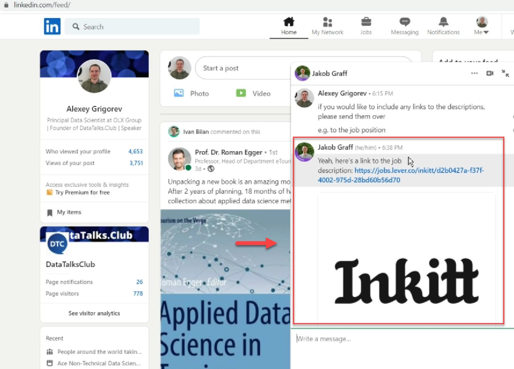
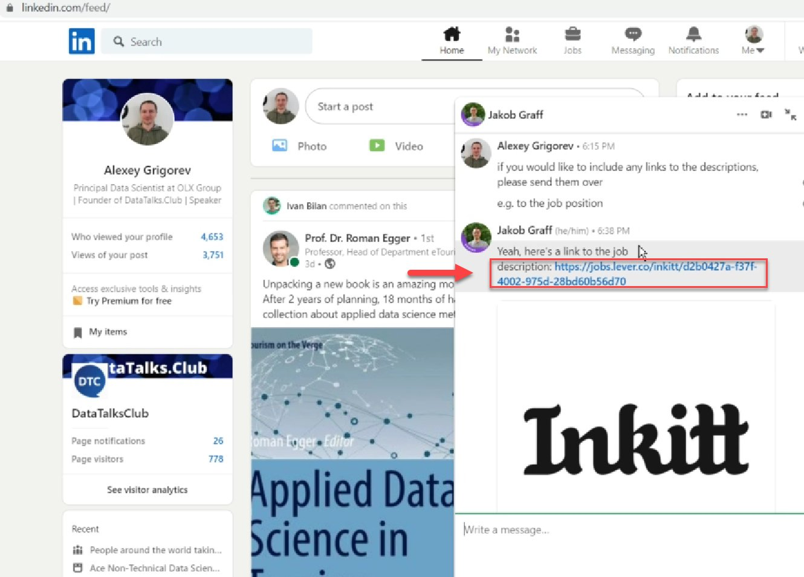
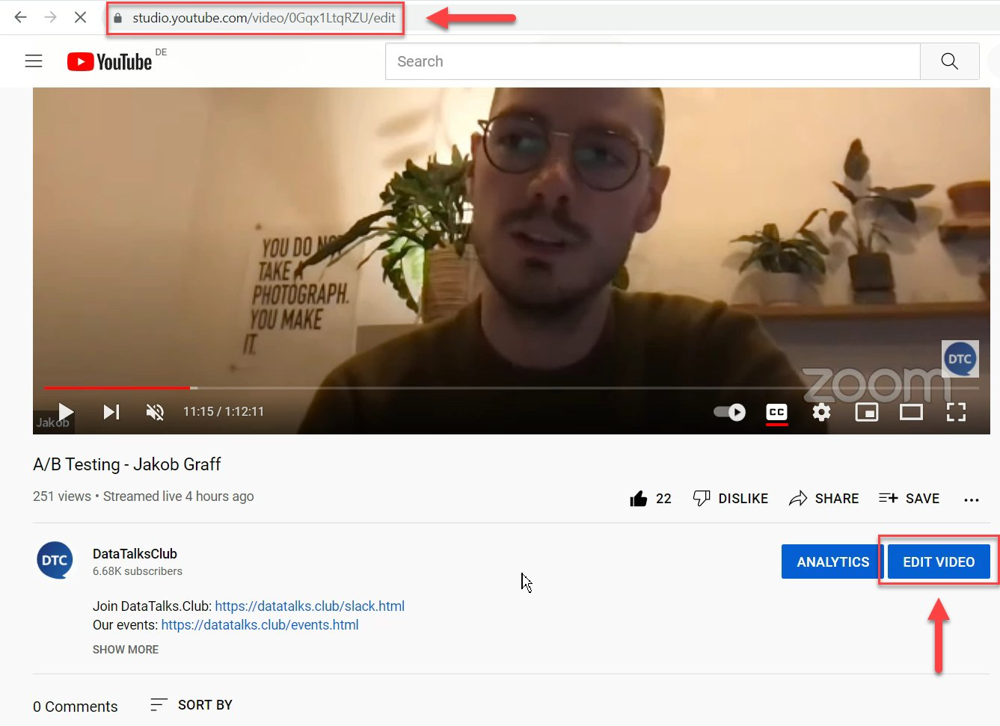
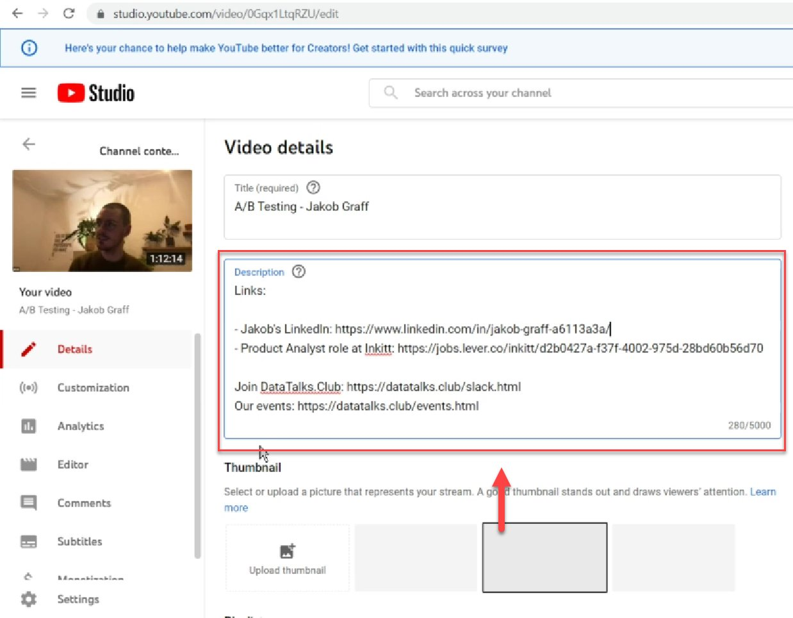
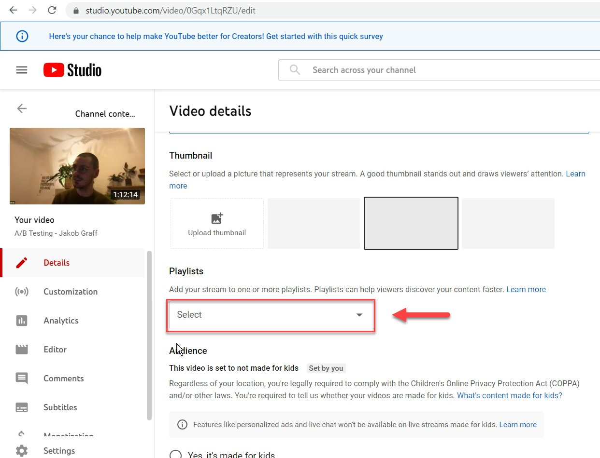
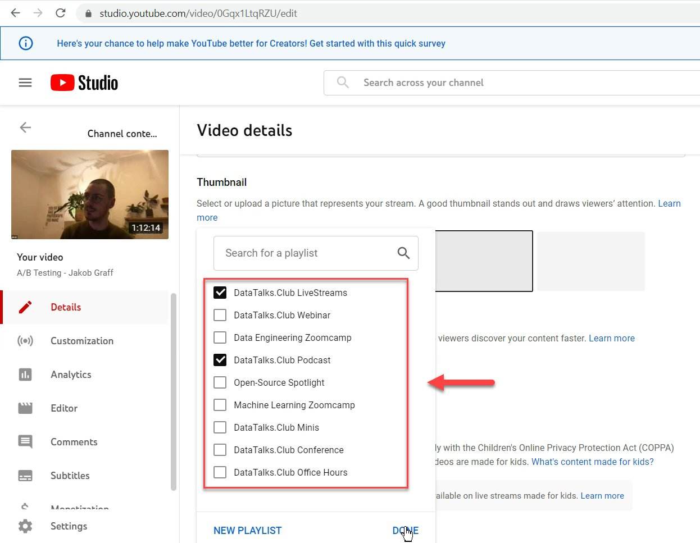
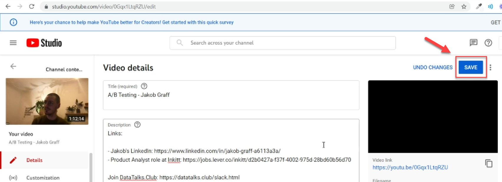

# Add links to YouTube after the stream is over

<!-- sop-section-start: summary -->
## Summary

- Purpose: Collect guest links and add them to the YouTube video description after the stream.
- Outcome: The YouTube description contains the guest links and the video is added to the right playlists.
- Trigger: A podcast stream is over and guest links need to be added.
- Frequency: Per podcast stream.
<!-- sop-section-end -->

<!-- sop-section-start: prerequisites -->
## Prerequisites

- Access: Guest communication channel and DataTalks.Club YouTube Studio.
- Tools: Email or messaging, YouTube Studio.
- Inputs: Guest links, target YouTube video, link template, and playlist choices.

How to add links after the stream is over
This procedure will show you the steps on how to add links if the stream is over

TODO:

- Update screenshots: instead of linkedin, use gmail in the instructions below

- Create a separate process doc for updating the playlist
<!-- sop-section-end -->

<!-- sop-section-start: procedure -->
## Procedure

<!-- sop-group-start: "Requesting the links after the stream" -->
### Requesting the links after the stream

<!-- sop-step-start id=1 -->
1.  The first thing you will need to do is reach out to the guest and ask for links that he wants to include.
    Template: [Podcast - Links after the event is over](https://docs.google.com/document/d/1tsuI291-eJ8CxK5MHajEKK3ODZ_TOHfX-XZ-csAFX8Y/edit)

    Note: Links might include: Job position, LinkedIn, etc.

    <!-- sop-screenshot-start -->
    
    <!-- sop-caption-start -->
    This screenshot matters for capturing or placing the correct link information; look for the highlighted area or matching UI state shown in the image. Use it to verify the screen state, then complete the step described above.
    <!-- sop-caption-end -->
    <!-- sop-screenshot-end -->
<!-- sop-step-end -->

<!-- sop-step-start id=2 -->
2.  After, copy the link that the guest provided.

    <!-- sop-screenshot-start -->
    
    <!-- sop-caption-start -->
    This screenshot matters for capturing or placing the correct link information; look for the highlighted area or visible control labeled link that the guest provided. Use that match to verify the screen state, then complete the step described above.
    <!-- sop-caption-end -->
    <!-- sop-screenshot-end -->
<!-- sop-step-end -->

<!-- sop-group-end -->

<!-- sop-group-start: "Adding the links to the description" -->
### Adding the links to the description

<!-- sop-step-start id=3 -->
3.  Next, open the youtube video and click on "Edit Video"

    <!-- sop-screenshot-start -->
    
    <!-- sop-caption-start -->
    This screenshot matters for checking the editing, transcript, or timestamp workflow at this point; look for the highlighted area or visible control labeled Edit Video. Use that match to verify the screen state, then complete the step described above.
    <!-- sop-caption-end -->
    <!-- sop-screenshot-end -->
<!-- sop-step-end -->

<!-- sop-step-start id=4 -->
4.  And then, paste the link you copied a while ago under "Description"

    Note: The format should be

    “- Title: [https://datatalks.club](https://datatalks.club)”

    Example:

    \- Jakob’s LinkedIn: [https://www.linkedin.com/jakob-graff](https://www.linkedin.com/jakob-graff)

    Follow proper spacing.
    <!-- sop-screenshot-start -->
    
    <!-- sop-caption-start -->
    This screenshot matters for confirming the process is on the expected screen before the next action; look for the highlighted area or matching UI state shown in the image. Use it to verify the screen state, then complete the step described above.
    <!-- sop-caption-end -->
    <!-- sop-screenshot-end -->
<!-- sop-step-end -->

<!-- sop-group-end -->

<!-- sop-group-start: "Adding the video to playlists" -->
### Adding the video to playlists

<!-- sop-step-start id=5 -->
5.  After, select the drag down button under "Playlists"

    <!-- sop-screenshot-start -->
    
    <!-- sop-caption-start -->
    This screenshot matters for confirming the process is on the expected screen before the next action; look for the highlighted area or visible control labeled Playlists. Use that match to verify the screen state, then complete the step described above.
    <!-- sop-caption-end -->
    <!-- sop-screenshot-end -->
<!-- sop-step-end -->

<!-- sop-step-start id=6 -->
6.  And check the playlist that this stream belongs to and click "Done"
    - For podcasts: DataTalks.Club Podcast

    - For webinars: DataTalks.Club Webinar

    - Workshops categorized by these:

      1.  For regular workshops: Community Workshop

      2.  For Sponsored workshops: DataTalks.Club Workshop

      3.  For Alexey's workshops: Workshops by Alexey

    - For all: DataTalks.Club LiveStreams

    <!-- sop-screenshot-start -->
    
    <!-- sop-caption-start -->
    This screenshot matters for confirming the process is on the expected screen before the next action; look for the highlighted area or matching UI state shown in the image. Use it to verify the screen state, then complete the step described above.
    <!-- sop-caption-end -->
    <!-- sop-screenshot-end -->
<!-- sop-step-end -->

<!-- sop-group-end -->

<!-- sop-group-start: "Save" -->
### Save

<!-- sop-step-start id=7 -->
7.  Lastly, click "Save" on the top right of your screen

    <!-- sop-screenshot-start -->
    
    <!-- sop-caption-start -->
    This screenshot matters for confirming the download or export step is using the right option; look for the highlighted area or visible control labeled Save. Use that match to verify the screen state, then complete the step described above.
    <!-- sop-caption-end -->
    <!-- sop-screenshot-end -->
<!-- sop-step-end -->

<!-- sop-group-end -->
<!-- sop-section-end -->

<!-- sop-section-start: validation -->
## Validation

-
<!-- sop-section-end -->

<!-- sop-section-start: troubleshooting -->
## Troubleshooting

-
<!-- sop-section-end -->

<!-- sop-section-start: references -->
## References

-
<!-- sop-section-end -->
