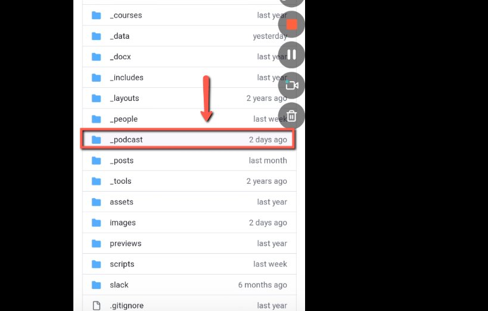
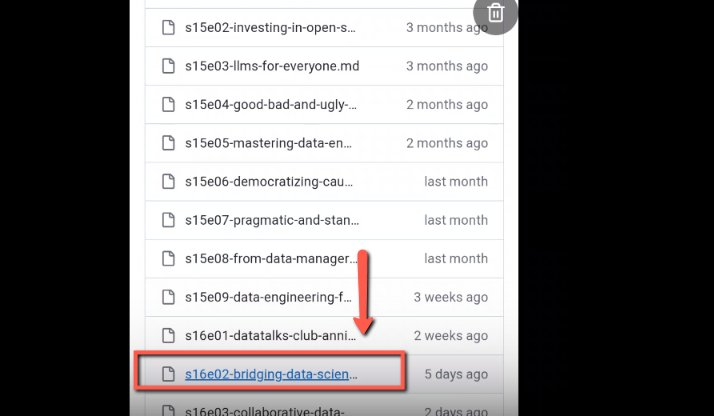
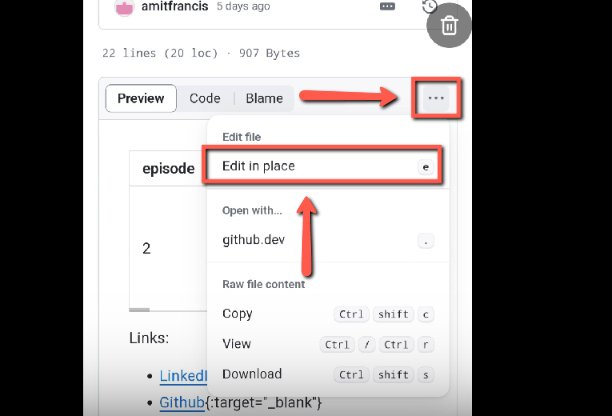
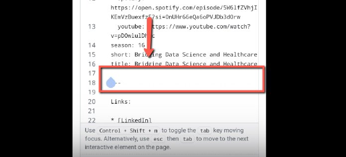
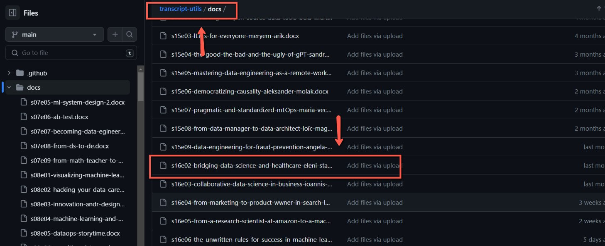
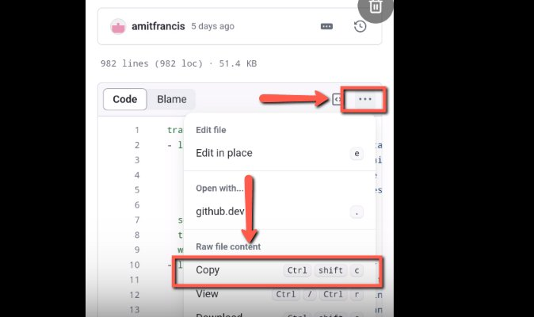
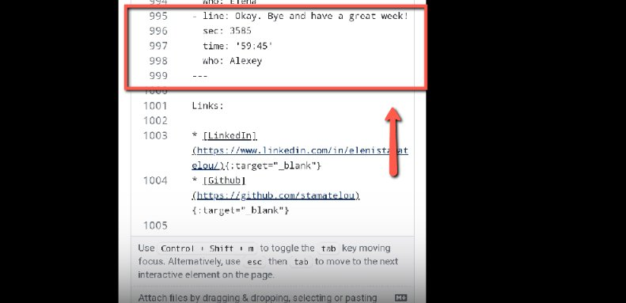
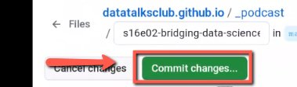

# Adding transcripts to already published podcast pages

<!-- sop-section-start: summary -->
## Summary

- Purpose: Adding transcripts to podcast episodes
- Outcome: We want to add a transcript to our podcast episode
- Trigger: We didn’t add the transcript to an already published podcast episode
- Frequency: As needed for already published podcast pages.
<!-- sop-section-end -->

<!-- sop-section-start: prerequisites -->
## Prerequisites

- Access: DataTalksClub website GitHub repository and transcript-utils repository.
- Tools: GitHub editor.
- Inputs: Podcast page, transcript file or transcript text, and related episode details.

TODO:

- Update screenshots from mobile to the actual screenshots from desktop
<!-- sop-section-end -->

<!-- sop-section-start: procedure -->
## Procedure

<!-- sop-group-start: "Locate the podcast page" -->
### Locate the podcast page

<!-- sop-step-start id=1 -->
1.  First, open the “\_podcast” folder in the [datatalksclub.github.io](https://github.com/DataTalksClub/datatalksclub.github.io/tree/main/_podcast) github repo:

    [https://github.com/DataTalksClub/datatalksclub.github.io/tree/main/\_podcast](https://github.com/DataTalksClub/datatalksclub.github.io/tree/main/_podcast)
    <!-- sop-screenshot-start -->
    
    <!-- sop-caption-start -->
    This screenshot matters for confirming the process is on the expected screen before the next action; look for the highlighted area or visible control labeled podcast. Use that match to verify the screen state, then complete the step described above.
    <!-- sop-caption-end -->
    <!-- sop-screenshot-end -->
<!-- sop-step-end -->

<!-- sop-step-start id=2 -->
2.  After, select the podcast you want to update.

    <!-- sop-screenshot-start -->
    
    <!-- sop-caption-start -->
    This screenshot matters for confirming the process is on the expected screen before the next action; look for the highlighted area or visible control labeled podcast you want to update. Use that match to verify the screen state, then complete the step described above.
    <!-- sop-caption-end -->
    <!-- sop-screenshot-end -->
<!-- sop-step-end -->

<!-- sop-step-start id=3 -->
3.  Next, click the three-dotted button and select “Edit and Place”

    <!-- sop-screenshot-start -->
    
    <!-- sop-caption-start -->
    This screenshot matters for checking the editing, transcript, or timestamp workflow at this point; look for the highlighted area or visible control labeled Edit and Place. Use that match to verify the screen state, then complete the step described above.
    <!-- sop-caption-end -->
    <!-- sop-screenshot-end -->
<!-- sop-step-end -->

<!-- sop-step-start id=4 -->
4.  Now, add the transcript before the “--” in the code.

    <!-- sop-screenshot-start -->
    
    <!-- sop-caption-start -->
    This screenshot matters for checking the editing, transcript, or timestamp workflow at this point; look for the highlighted area or visible control labeled --. Use that match to verify the screen state, then complete the step described above.
    <!-- sop-caption-end -->
    <!-- sop-screenshot-end -->
<!-- sop-step-end -->

<!-- sop-group-end -->

<!-- sop-group-start: "Find the transcript" -->
### Find the transcript

<!-- sop-step-start id=5 -->
5.  To add the transcript, go to the [transcription’s GitHub repository](https://github.com/alexeygrigorev/transcript-utils/tree/main/docs) and find the uploaded file.
    We have created this file as a part of the [Generate Timecodes from docx Transcriptions](generate-timecodes-from-docx-transcriptions.md) process
    <!-- sop-screenshot-start -->
    
    <!-- sop-caption-start -->
    This screenshot matters for checking the editing, transcript, or timestamp workflow at this point; look for the highlighted area or matching UI state shown in the image. Use it to verify the screen state, then complete the step described above.
    <!-- sop-caption-end -->
    <!-- sop-screenshot-end -->
<!-- sop-step-end -->

<!-- sop-step-start id=6 -->
6.  After, click the three-dotted line and select “Copy”

    <!-- sop-screenshot-start -->
    
    <!-- sop-caption-start -->
    This screenshot matters for capturing or placing the correct link information; look for the highlighted area or visible control labeled Copy. Use that match to verify the screen state, then complete the step described above.
    <!-- sop-caption-end -->
    <!-- sop-screenshot-end -->
<!-- sop-step-end -->

<!-- sop-step-start id=7 -->
7.  And then, paste the copied transcription

    <!-- sop-screenshot-start -->
    
    <!-- sop-caption-start -->
    This screenshot matters for capturing or placing the correct link information; look for the highlighted area or visible control labeled copied transcription. Use that match to verify the screen state, then complete the step described above.
    <!-- sop-caption-end -->
    <!-- sop-screenshot-end -->
<!-- sop-step-end -->

<!-- sop-step-start id=8 -->
8.  Once done, scroll up and click “Commit Changes”

    <!-- sop-screenshot-start -->
    
    <!-- sop-caption-start -->
    This screenshot matters for confirming the process is on the expected screen before the next action; look for the highlighted area or visible control labeled Commit Changes. Use that match to verify the screen state, then complete the step described above.
    <!-- sop-caption-end -->
    <!-- sop-screenshot-end -->
<!-- sop-step-end -->

<!-- sop-group-end -->
<!-- sop-section-end -->

<!-- sop-section-start: validation -->
## Validation

-
<!-- sop-section-end -->

<!-- sop-section-start: troubleshooting -->
## Troubleshooting

-
<!-- sop-section-end -->

<!-- sop-section-start: references -->
## References

-
<!-- sop-section-end -->
