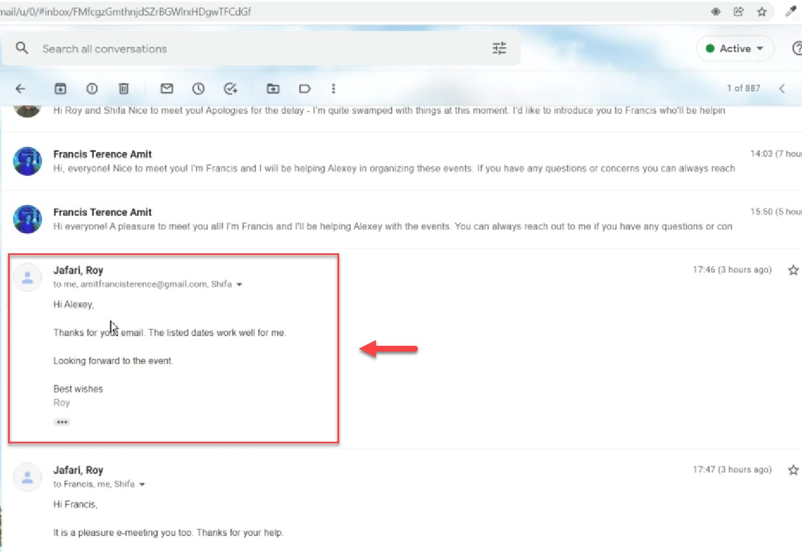
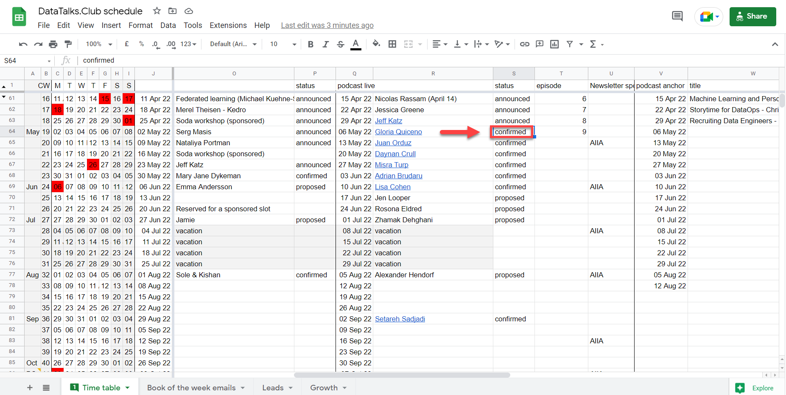
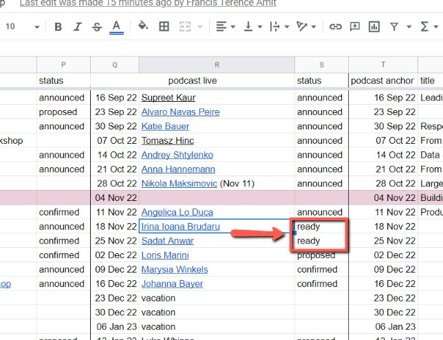

# Change the status to confirmed

<!-- sop-section-start: summary -->
## Summary

- Purpose: Update an event status after a guest confirms the proposed date.
- Outcome: The schedule reflects the confirmed or ready status and follow-up tasks are clear.
- Trigger: The guest agrees to the proposed date.
- Frequency: Per confirmed event.
<!-- sop-section-end -->

<!-- sop-section-start: prerequisites -->
## Prerequisites

- Access: DataTalks.Club schedule spreadsheet and calendar event.
- Tools: Google Sheets, Google Calendar.
- Inputs: Guest confirmation, proposed event row, podcast document link, and readiness state.
<!-- sop-section-end -->

<!-- sop-section-start: procedure -->
## Procedure

<!-- sop-prose-start -->
How to change the status to “confirmed”
This procedure will show you the steps on how to change the status of “confirmed.”

Step-by-step Instructions
<!-- sop-prose-end -->

<!-- sop-step-start id=1 -->
1.  The guest agrees to the previously proposed date email or LinkedIn.

    Note: For podcasts, if the guest is from CET or earlier and can do the podcast at noon, we should offer them noon, otherwise 17 pm

    <!-- sop-screenshot-start -->
    
    <!-- sop-caption-start -->
    This screenshot matters for confirming the process is on the expected screen before the next action; look for the highlighted area or matching UI state shown in the image. Use it to verify the screen state, then complete the step described above.
    <!-- sop-caption-end -->
    <!-- sop-screenshot-end -->
<!-- sop-step-end -->

<!-- sop-step-start id=2 -->
2.  Next is to open the [DataTalks.Club schedule](https://docs.google.com/spreadsheets/d/1-T8qkmShlFUrT2NmkI8Pi1NgUS9IunP6wO5-L79xe2s/edit#gid=0) and change "proposed date" to "confirmed"

    Note: If the status of the gesture newsletter promotion is still pending, add a “(?)” right before the name.

    <!-- sop-screenshot-start -->
    
    <!-- sop-caption-start -->
    This screenshot matters for confirming the correct record, field, or status before updating the workflow; look for the highlighted area or visible control labeled (?). Use that match to verify the screen state, then complete the step described above.
    <!-- sop-caption-end -->
    <!-- sop-screenshot-end -->
<!-- sop-step-end -->

<!-- sop-step-start id=3 -->
3.  For podcast event, change “confirmed” to ready if the questions/doc is ready to be announced.

    Note: Description of the states:
    Proposed - You’re proposing a date to the speaker

    Confirmed - The speaker agreed on the date

    Ready - The podcast document/questions are ready to be announced

    Announced - The event is announced across platforms such as Meetup, Luma, and LinkedIn.

    <!-- sop-screenshot-start -->
    
    <!-- sop-caption-start -->
    This screenshot matters for capturing or placing the correct link information; look for the highlighted area or matching UI state shown in the image. Use it to verify the screen state, then complete the step described above.
    <!-- sop-caption-end -->
    <!-- sop-screenshot-end -->

    After this is done, you will need to

    - [Create a document with questions for the podcast](https://docs.google.com/document/d/1-mrkUrADjMBYDrk2AS3-s604_Vc8prTPKlpWb4cd6U0/edit)

    - [Insert podcast document link to the podcast cell](https://docs.google.com/document/d/1N4nVUm9OR6WE_OYzSCKQwyLYD-my38sKgkGlWXiluWE/edit)
<!-- sop-step-end -->
<!-- sop-section-end -->

<!-- sop-section-start: validation -->
## Validation

-
<!-- sop-section-end -->

<!-- sop-section-start: troubleshooting -->
## Troubleshooting

-
<!-- sop-section-end -->

<!-- sop-section-start: references -->
## References

-
<!-- sop-section-end -->
