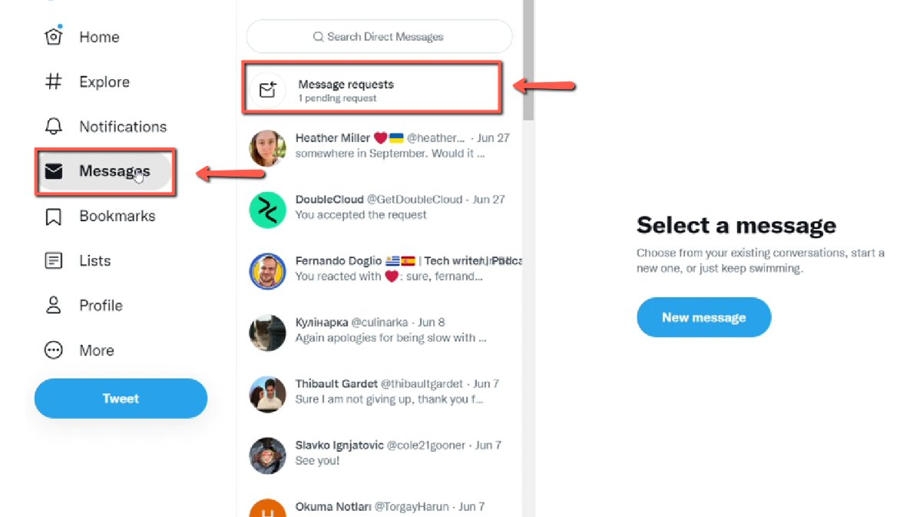
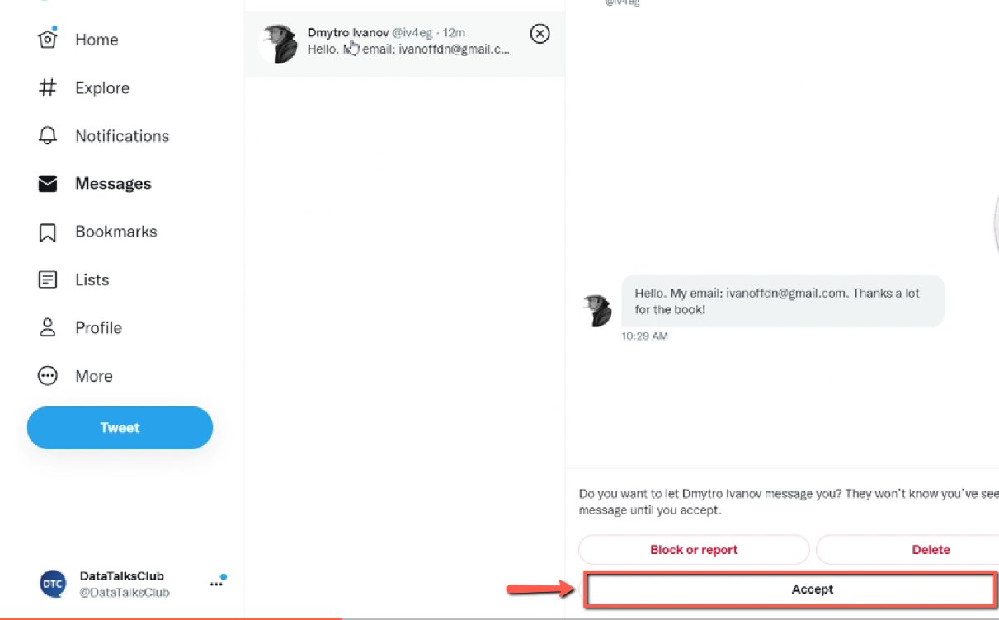
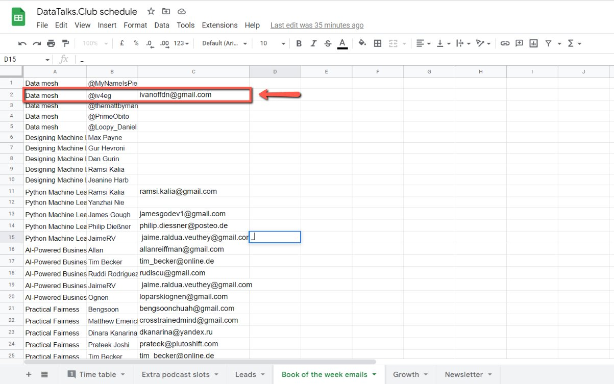
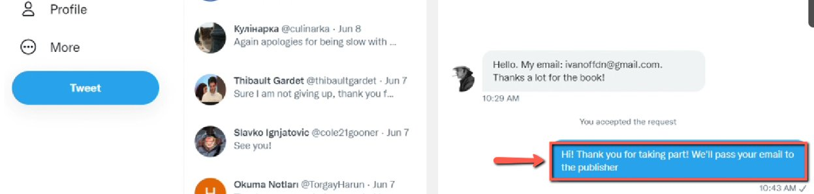

# Collecting Emails of the Giveaway Campaign Winners

<!-- sop-section-start: summary -->
## Summary

- Purpose: Collect verified winner emails for a giveaway campaign.
- Outcome: Winner emails are recorded and can be sent to the publisher contact.
- Trigger: Giveaway winners respond with their email addresses.
- Frequency: Per giveaway campaign.
<!-- sop-section-end -->

<!-- sop-section-start: prerequisites -->
## Prerequisites

- Access: Social media messages, winner spreadsheet, and publisher contact information.
- Tools: Social media inbox, Google Sheets, email.
- Inputs: Winner announcement, winner names, submitted emails, and publisher contact.
<!-- sop-section-end -->

<!-- sop-section-start: procedure -->
## Procedure

<!-- sop-prose-start -->
How to Collect Emails of the Giveaway Campaign Winners
This procedure will show you the steps on how to Collect Emails from the Giveaway Campaign Winners.

Step-by-step Instructions
<!-- sop-prose-end -->

<!-- sop-step-start id=1 -->
1.  The first thing you need to do is select “Messages” and click “Message Requests”

    <!-- sop-screenshot-start -->
    
    <!-- sop-caption-start -->
    This screenshot matters for confirming the communication step before sending or recording outreach; look for the highlighted area or visible control labeled Messages. Use that match to verify the screen state, then complete the step described above.
    <!-- sop-caption-end -->
    <!-- sop-screenshot-end -->
<!-- sop-step-end -->

<!-- sop-step-start id=2 -->
2.  Then, click “Accept” to accept the message request of the person.

    Note: Before you accept the message request of the person, make sure to double-check if he/she really won the giveaway. His/her name should be the same as the one you tweeted on the announcement.

    <!-- sop-screenshot-start -->
    
    <!-- sop-caption-start -->
    This screenshot matters for confirming the communication step before sending or recording outreach; look for the highlighted area or matching UI state shown in the image. Use it to verify the screen state, then complete the step described above.
    <!-- sop-caption-end -->
    <!-- sop-screenshot-end -->
<!-- sop-step-end -->

<!-- sop-step-start id=3 -->
3.  After confirming that he/she is the winner, copy his/her email and paste it into the [DataTalks.Club’s spreadsheet book of the week winner](https://docs.google.com/spreadsheets/d/1-T8qkmShlFUrT2NmkI8Pi1NgUS9IunP6wO5-L79xe2s/edit#gid=805910618).

    <!-- sop-screenshot-start -->
    
    <!-- sop-caption-start -->
    This screenshot matters for capturing or placing the correct link information; look for the highlighted area or visible control labeled his/her email and paste it into the DataTalks. Use that match to verify the screen state, then complete the step described above.
    <!-- sop-caption-end -->
    <!-- sop-screenshot-end -->
<!-- sop-step-end -->

<!-- sop-step-start id=4 -->
4.  Don’t forget to reply to the winner of the book.

    Note: After you collected all the emails of the winners, send them to the [book publisher’s contact](https://docs.google.com/spreadsheets/d/1PBO4QJdNkh6n7oqvLT_Eimwum2amuL1hVJef_lkYzCE/edit?usp=sharing) via email.

    <!-- sop-screenshot-start -->
    
    <!-- sop-caption-start -->
    This screenshot matters for confirming the upload, publishing, or scheduling state before it becomes user-facing; look for the highlighted area or matching UI state shown in the image. Use it to verify the screen state, then complete the step described above.
    <!-- sop-caption-end -->
    <!-- sop-screenshot-end -->
<!-- sop-step-end -->
<!-- sop-section-end -->

<!-- sop-section-start: validation -->
## Validation

-
<!-- sop-section-end -->

<!-- sop-section-start: troubleshooting -->
## Troubleshooting

-
<!-- sop-section-end -->

<!-- sop-section-start: references -->
## References

-
<!-- sop-section-end -->
