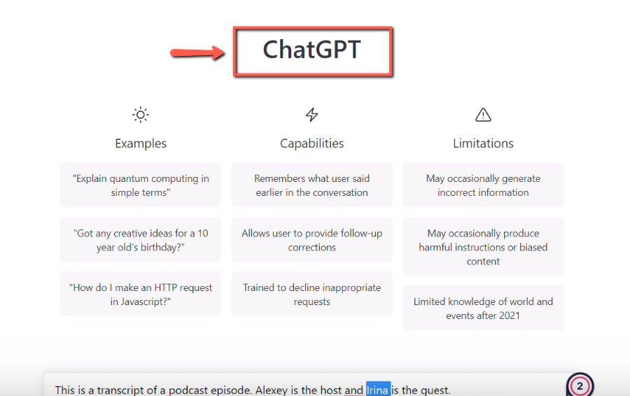
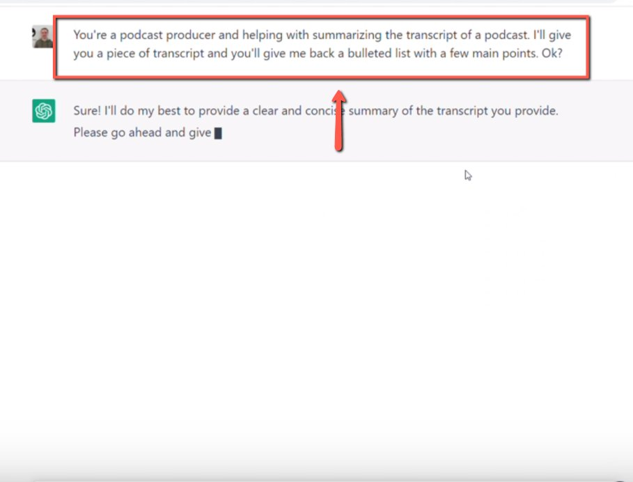
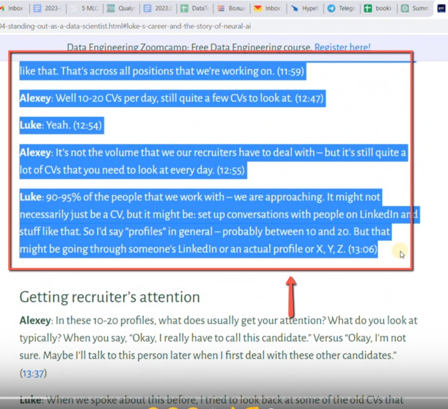
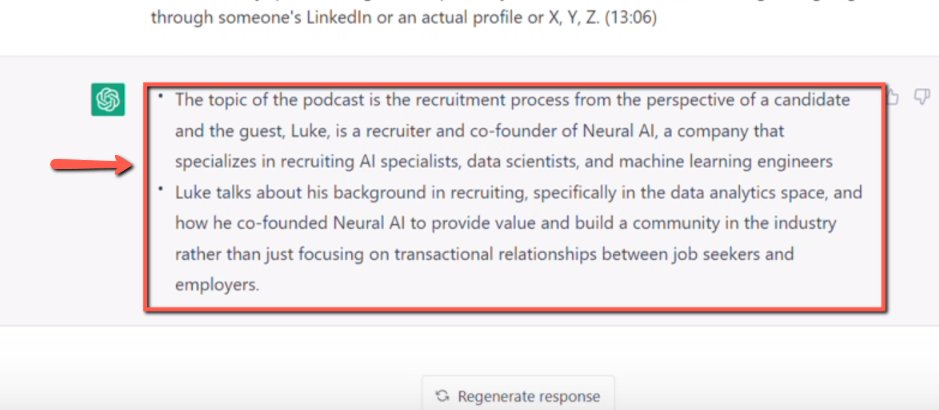
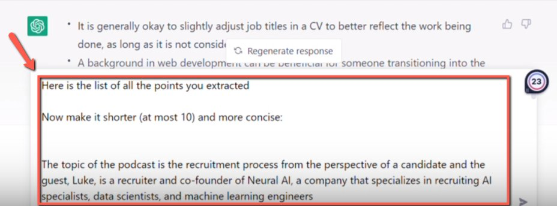

# Creating Podcast Transcript Summary with ChatGPT

<!-- sop-section-start: summary -->
## Summary

- Purpose: Use ChatGPT to summarize podcast transcript sections.
- Outcome: A cleaned summary is ready for the podcast page or related publishing workflow.
- Trigger: A podcast transcript is available and needs a summary.
- Frequency: Per podcast transcript.
<!-- sop-section-end -->

<!-- sop-section-start: prerequisites -->
## Prerequisites


- Access: ChatGPT and the podcast transcript document.
- Tools: ChatGPT, Google Docs.
- Inputs: Podcast transcript sections and summary prompt.
<!-- sop-section-end -->

<!-- sop-section-start: procedure -->
## Procedure

<!-- sop-prose-start -->
How to Create Podcast Transcript Summary with ChatGPT
This procedure will show you the steps on how to Create Podcast Transcript Summary with ChatGPT.

Step-by-step Instructions
<!-- sop-prose-end -->

<!-- sop-step-start id=1 -->
1.  The first thing you need to do is open the website [ChatGPT](https://chat.openai.com/chat).

    <!-- sop-screenshot-start -->
    
    <!-- sop-caption-start -->
    This screenshot matters for confirming the communication step before sending or recording outreach; look for the highlighted area or visible control labeled website ChatGPT. Use that match to verify the screen state, then complete the step described above.
    <!-- sop-caption-end -->
    <!-- sop-screenshot-end -->
<!-- sop-step-end -->

<!-- sop-step-start id=2 -->
2.  And then enter this text on the chat box,

    ```text
    You're a podcast producer and helping with summarizing the transcript of a podcast. I'll give you a piece of transcript and you'll give me back a bulleted list with a few main points. Ok?

    =======

    Give a list with two main points from this text:

    \<TEXT\>
    ```

    <!-- sop-screenshot-start -->
    
    <!-- sop-caption-start -->
    This screenshot matters for confirming the process is on the expected screen before the next action; look for the highlighted area or matching UI state shown in the image. Use it to verify the screen state, then complete the step described above.
    <!-- sop-caption-end -->
    <!-- sop-screenshot-end -->
<!-- sop-step-end -->

<!-- sop-step-start id=3 -->
3.  After, copy one section in the podcast transcription and paste into the text box.

    <!-- sop-screenshot-start -->
    
    <!-- sop-caption-start -->
    This screenshot matters for capturing or placing the correct link information; look for the highlighted area or matching UI state shown in the image. Use it to verify the screen state, then complete the step described above.
    <!-- sop-caption-end -->
    <!-- sop-screenshot-end -->
<!-- sop-step-end -->

<!-- sop-step-start id=4 -->
4.  Once the AI replied, copy the reply and reserve it for later.

    Note: Do it for the rest of the sections of the podcast transcription.
    <!-- sop-screenshot-start -->
    
    <!-- sop-caption-start -->
    This screenshot matters for checking the editing, transcript, or timestamp workflow at this point; look for the highlighted area or matching UI state shown in the image. Use it to verify the screen state, then complete the step described above.
    <!-- sop-caption-end -->
    <!-- sop-screenshot-end -->
<!-- sop-step-end -->

<!-- sop-step-start id=5 -->
5.  Once the AI is done generating all of the sections of the podcast, copy the generated text and add this prompt

    ```text
    Here is the list of all the points you extracted

    Now make it shorter (at most 10) and more concise:

    \<GENERATED TEXTS OF THE AI\>
    ```

    <!-- sop-screenshot-start -->
    
    <!-- sop-caption-start -->
    This screenshot matters for confirming the process is on the expected screen before the next action; look for the highlighted area or matching UI state shown in the image. Use it to verify the screen state, then complete the step described above.
    <!-- sop-caption-end -->
    <!-- sop-screenshot-end -->
<!-- sop-step-end -->
<!-- sop-section-end -->

<!-- sop-section-start: validation -->
## Validation


-
<!-- sop-section-end -->

<!-- sop-section-start: troubleshooting -->
## Troubleshooting


-
<!-- sop-section-end -->

<!-- sop-section-start: references -->
## References


-
<!-- sop-section-end -->
