# Creating podcast transcription document

<!-- sop-section-start: summary -->
## Summary

- Purpose: Use an automated tool to transcribe podcast episodes, generate transcripts, and edit them using ChatGPT.
- Outcome: We need transcripts for our podcast episodes – we publish them on our website. The tool we describe here makes the process simple.
- Trigger: a new podcast episode needs to be transcribed and edited for creating a docx file and publishing on our website.
- Frequency: Per podcast episode that needs a transcript.
<!-- sop-section-end -->

<!-- sop-section-start: prerequisites -->
## Prerequisites

- Access: YouTube Studio, Google Drive podcast audio folder, transcription tool, and ChatGPT.
- Tools: YouTube Studio, VLC, Google Drive, transcription tool, ChatGPT.
- Inputs: YouTube video ID, downloaded video, extracted audio, podcast title, and transcript text.
<!-- sop-section-end -->

<!-- sop-section-start: procedure -->
## Procedure

<!-- sop-group-start: "Getting the audio file" -->
### Getting the audio file

<!-- sop-step-start id=1 -->
1.  Open the Youtube video for the podcast (You can find it in the trello board) and click “Edit video” under the video

    You can also skip this step by putting the YouTube ID for the video to this link: [https://studio.youtube.com/video/YOUTUBE_ID/edit](https://studio.youtube.com/video/YOUTUBE_ID/edit) (replace YOUTUBE_ID with the actual ID)

    <!-- sop-screenshot-start -->
    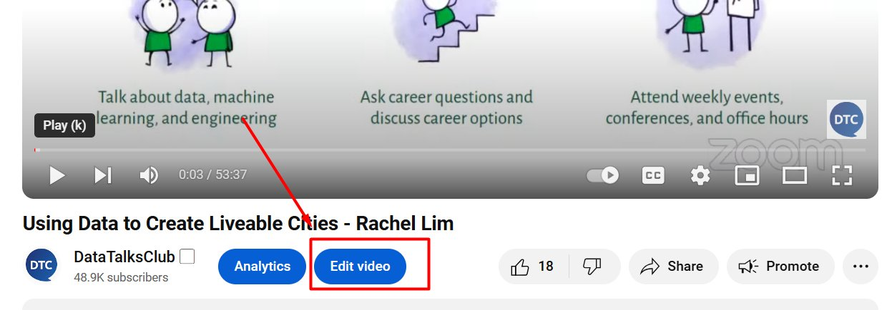
    <!-- sop-caption-start -->
    This screenshot matters for capturing or placing the correct link information; look for the highlighted area or matching UI state shown in the image. Use it to verify the screen state, then complete the step described above.
    <!-- sop-caption-end -->
    <!-- sop-screenshot-end -->
<!-- sop-step-end -->

<!-- sop-step-start id=2 -->
2.  Take a note of the YouTube video ID - you will need it throughout this task
<!-- sop-step-end -->

<!-- sop-step-start id=3 -->
3.  Click on the 3 dots and select “Download” to download the video

    <!-- sop-screenshot-start -->
    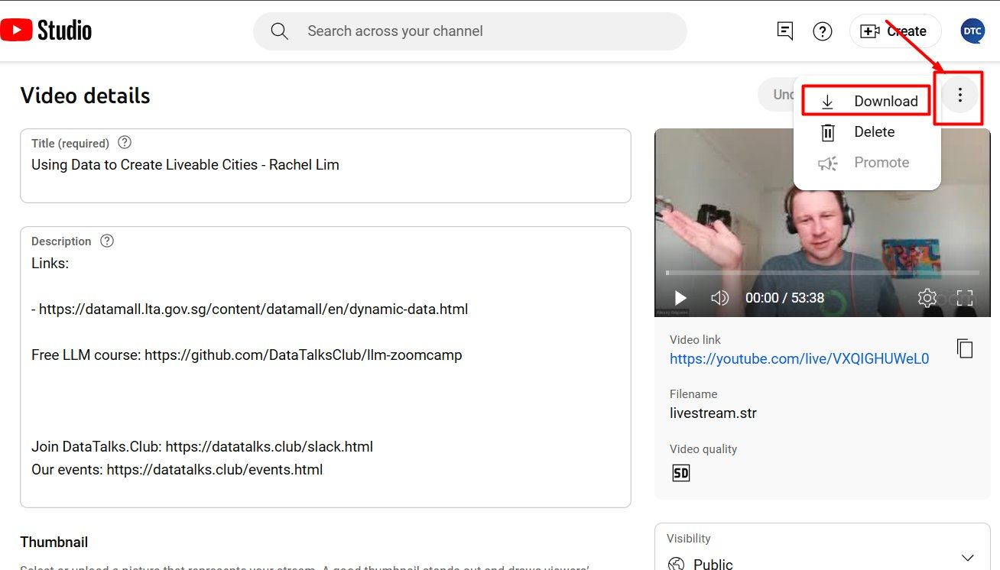
    <!-- sop-caption-start -->
    This screenshot matters for confirming the download or export step is using the right option; look for the highlighted area or visible control labeled Download. Use that match to verify the screen state, then complete the step described above.
    <!-- sop-caption-end -->
    <!-- sop-screenshot-end -->
<!-- sop-step-end -->

<!-- sop-step-start id=4 -->
4.  Use VLC to extract the audio track from the video: TODO
<!-- sop-step-end -->

<!-- sop-step-start id=5 -->
5.  Upload the audio to the [podcast-raw-audio folder](https://drive.google.com/drive/u/1/folders/1lk5r7T1Ggs54lf0KI4_0bY5WQVkjuczT) in the Files Google Drive

    For that, you can drag-and-drop the file or right click on the empty space and select “File Upload”
    <!-- sop-screenshot-start -->
    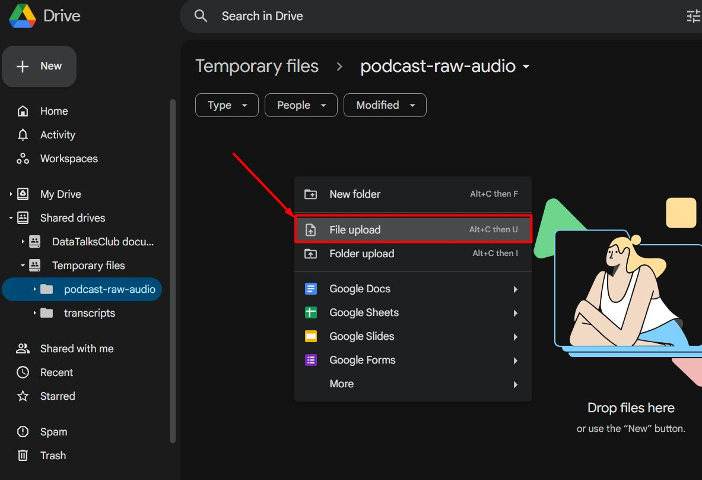
    <!-- sop-caption-start -->
    This screenshot matters for confirming the upload, publishing, or scheduling state before it becomes user-facing; look for the highlighted area or visible control labeled File Upload. Use that match to verify the screen state, then complete the step described above.
    <!-- sop-caption-end -->
    <!-- sop-screenshot-end -->
<!-- sop-step-end -->

<!-- sop-step-start id=6 -->
6.  Open the file by double-clicking on it

    <!-- sop-screenshot-start -->
    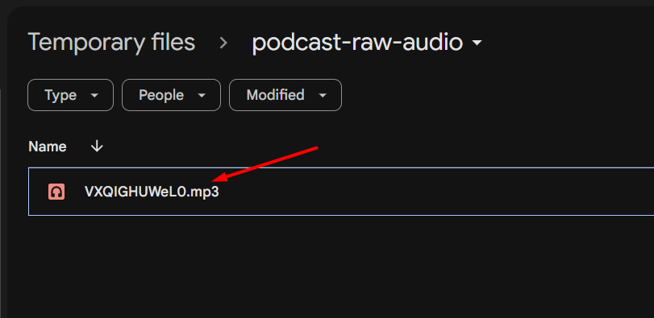
    <!-- sop-caption-start -->
    This screenshot matters for confirming the process is on the expected screen before the next action; look for the highlighted area or visible control labeled file by double-clicking on it. Use that match to verify the screen state, then complete the step described above.
    <!-- sop-caption-end -->
    <!-- sop-screenshot-end -->
<!-- sop-step-end -->

<!-- sop-step-start id=7 -->
7.  Click on the “Share” button in the right top corner

    <!-- sop-screenshot-start -->
    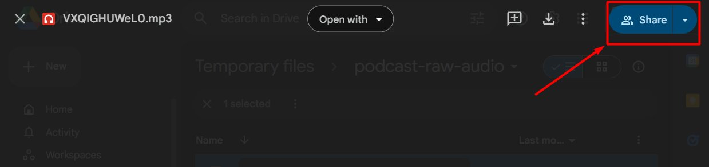
    <!-- sop-caption-start -->
    This screenshot matters for confirming the process is on the expected screen before the next action; look for the highlighted area or visible control labeled Share. Use that match to verify the screen state, then complete the step described above.
    <!-- sop-caption-end -->
    <!-- sop-screenshot-end -->
<!-- sop-step-end -->

<!-- sop-step-start id=8 -->
8.  Click on “General Access” (dropdown list with “Restricted”) and select “Anyone with the link”

    <!-- sop-screenshot-start -->
    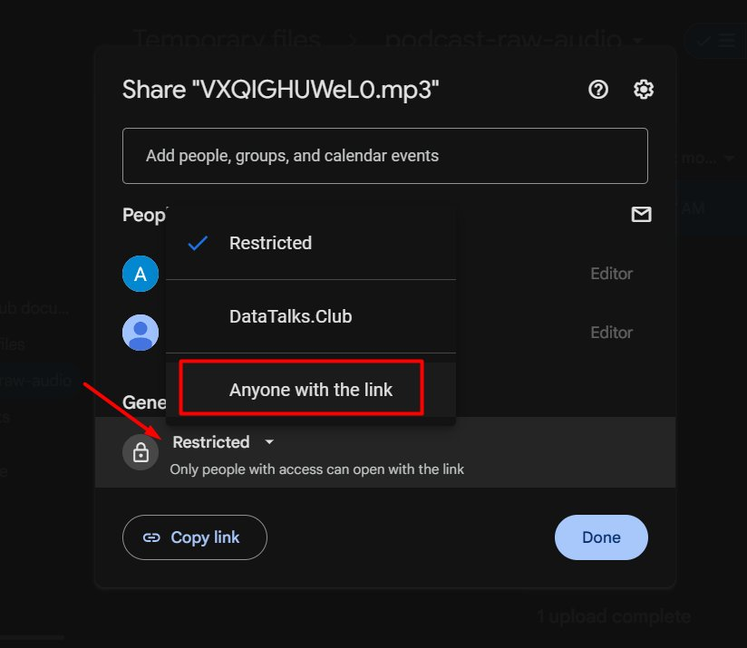
    <!-- sop-caption-start -->
    This screenshot matters for capturing or placing the correct link information; look for the highlighted area or visible control labeled General Access. Use that match to verify the screen state, then complete the step described above.
    <!-- sop-caption-end -->
    <!-- sop-screenshot-end -->
<!-- sop-step-end -->

<!-- sop-step-start id=9 -->
9.  Then click “Copy Link”

    <!-- sop-screenshot-start -->
    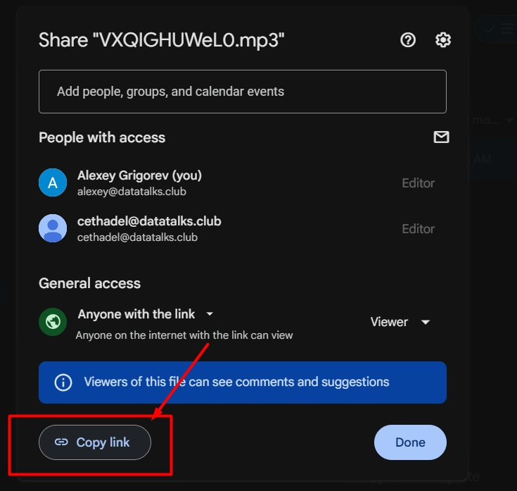
    <!-- sop-caption-start -->
    This screenshot matters for capturing or placing the correct link information; look for the highlighted area or visible control labeled Copy Link. Use that match to verify the screen state, then complete the step described above.
    <!-- sop-caption-end -->
    <!-- sop-screenshot-end -->

    You will get a link that looks like that:

    [https://drive.google.com/file/d/1cRh8yiLURL-xXNke2p0T7FaccOumF1YV/view?usp=sharing](https://drive.google.com/file/d/1cRh8yiLURL-xXNke2p0T7FaccOumF1YV/view?usp=sharing)
<!-- sop-step-end -->

<!-- sop-step-start id=10 -->
10. Note the File ID: it’s the content between /d/ and /view
    For link

    [https://drive.google.com/file/d/1cRh8yiLURL-xXNke2p0T7FaccOumF1YV/view?usp=sharing](https://drive.google.com/file/d/1cRh8yiLURL-xXNke2p0T7FaccOumF1YV/view?usp=sharing)

    The File ID is

    1cRh8yiLURL-xXNke2p0T7FaccOumF1YV

    11lnh2GoZwCyEU-O1d2rq2vBOZHxDp8Y0

    11lnh2GoZwCyEU-O1d2rq2vBOZHxDp8Y0
    11lnh2GoZwCyEU-O1d2rq2vBOZHxDp8Y0

    11lnh2GoZwCyEU-O1d2rq2vBOZHxDp8Y0

    Now we’re ready to submit a transcription job.

    Go to [https://github.com/alexeygrigorev/podcast-transcriber/](https://github.com/alexeygrigorev/podcast-transcriber/)
<!-- sop-step-end -->

<!-- sop-step-start id=11 -->
11. Access GitHub Actions. Go to the GitHub repository and click on the "Actions" tab.

    <!-- sop-screenshot-start -->
    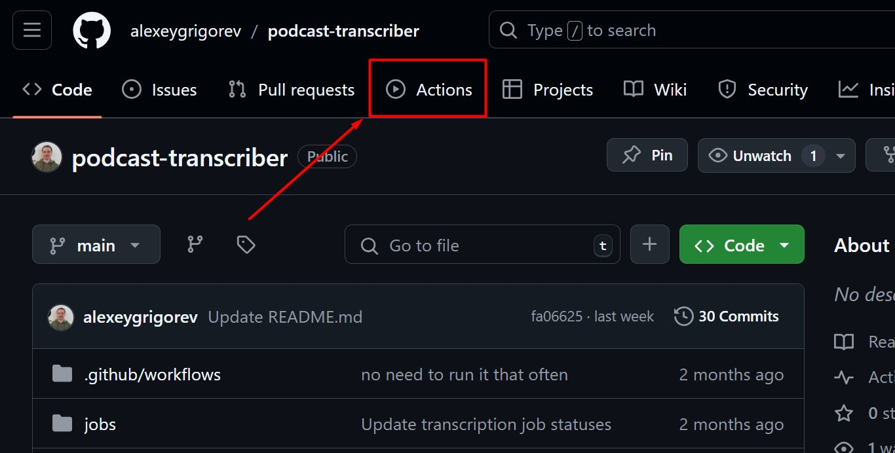
    <!-- sop-caption-start -->
    This screenshot matters for confirming the process is on the expected screen before the next action; look for the highlighted area or visible control labeled Actions. Use that match to verify the screen state, then complete the step described above.
    <!-- sop-caption-end -->
    <!-- sop-screenshot-end -->
<!-- sop-step-end -->

<!-- sop-step-start id=12 -->
12. There are multiple actions available: Click on the "Submit Drive MP3 Transaction Job" action.

    <!-- sop-screenshot-start -->
    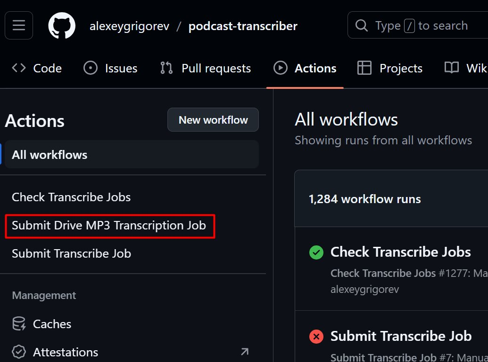
    <!-- sop-caption-start -->
    This screenshot matters for confirming the process is on the expected screen before the next action; look for the highlighted area or visible control labeled Submit Drive MP3 Transaction Job. Use that match to verify the screen state, then complete the step described above.
    <!-- sop-caption-end -->
    <!-- sop-screenshot-end -->
<!-- sop-step-end -->

<!-- sop-step-start id=13 -->
13. Submit a Transcription Job. Click on "Run workflow" under the "Submit Transcribe Job" action.

    <!-- sop-screenshot-start -->
    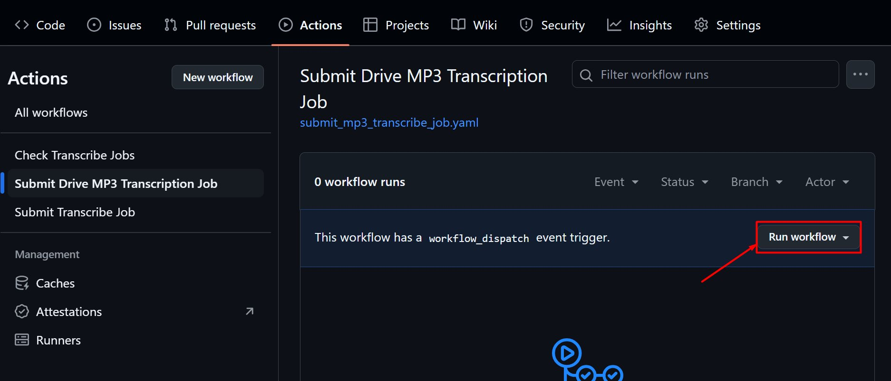
    <!-- sop-caption-start -->
    This screenshot matters for checking the editing, transcript, or timestamp workflow at this point; look for the highlighted area or visible control labeled Run workflow. Use that match to verify the screen state, then complete the step described above.
    <!-- sop-caption-end -->
    <!-- sop-screenshot-end -->
<!-- sop-step-end -->

<!-- sop-step-start id=14 -->
14. Enter the YouTube video ID and the File ID (from Google drive) to the form and click “Run workflow”

    <!-- sop-screenshot-start -->
    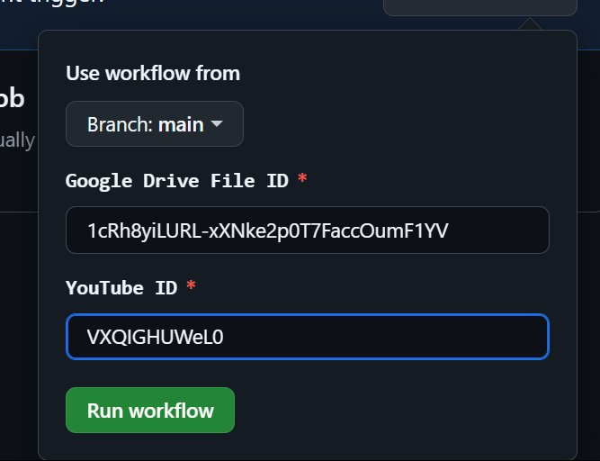
    <!-- sop-caption-start -->
    This screenshot matters for confirming the correct record, field, or status before updating the workflow; look for the highlighted area or visible control labeled Run workflow. Use that match to verify the screen state, then complete the step described above.
    <!-- sop-caption-end -->
    <!-- sop-screenshot-end -->
<!-- sop-step-end -->

<!-- sop-step-start id=15 -->
15. You will see the submitted job is running

    <!-- sop-screenshot-start -->
    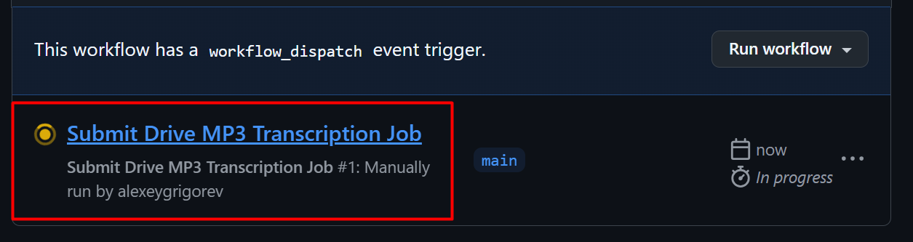
    <!-- sop-caption-start -->
    This screenshot matters for confirming the process is on the expected screen before the next action; look for the highlighted area or matching UI state shown in the image. Use it to verify the screen state, then complete the step described above.
    <!-- sop-caption-end -->
    <!-- sop-screenshot-end -->

    Wait till it’s successful:

    <!-- sop-screenshot-start -->
    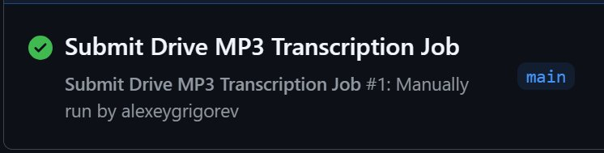
    <!-- sop-caption-start -->
    This screenshot matters for confirming the process is on the expected screen before the next action; look for the highlighted area or matching UI state shown in the image. Use it to verify the screen state, then complete the step described above.
    <!-- sop-caption-end -->
    <!-- sop-screenshot-end -->
<!-- sop-step-end -->

<!-- sop-step-start id=16 -->
16. Now we submitted a transcription job. It typically requires 10-15 minutes to complete, so we need to wait.
<!-- sop-step-end -->

<!-- sop-group-end -->

<!-- sop-group-start: "Getting the transcription" -->
### Getting the transcription

<!-- sop-step-start id=17 -->
17. After 10-15 minutes are over, we can check the status of the transcription job, and if it’s ready, pull the results.

    For that, let’s navigate to the “Check Transcribe Jobs” action
    <!-- sop-screenshot-start -->
    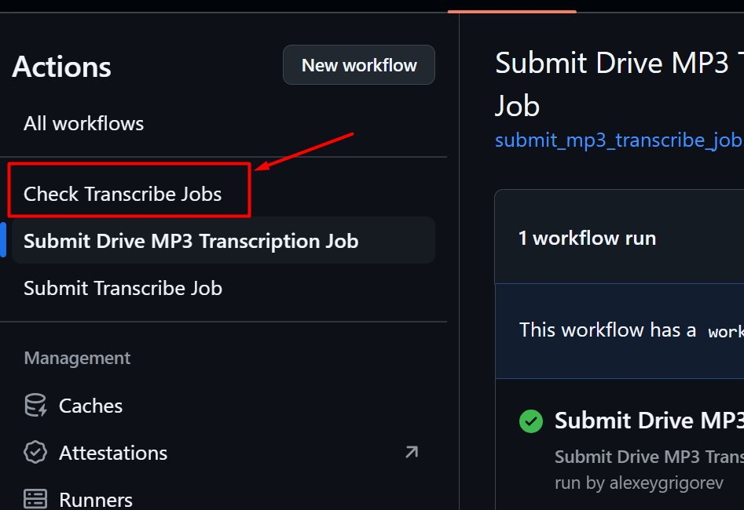
    <!-- sop-caption-start -->
    This screenshot matters for confirming the process is on the expected screen before the next action; look for the highlighted area or visible control labeled Check Transcribe Jobs. Use that match to verify the screen state, then complete the step described above.
    <!-- sop-caption-end -->
    <!-- sop-screenshot-end -->
<!-- sop-step-end -->

<!-- sop-step-start id=18 -->
18. Trigger it by clicking “Run workflow”

    <!-- sop-screenshot-start -->
    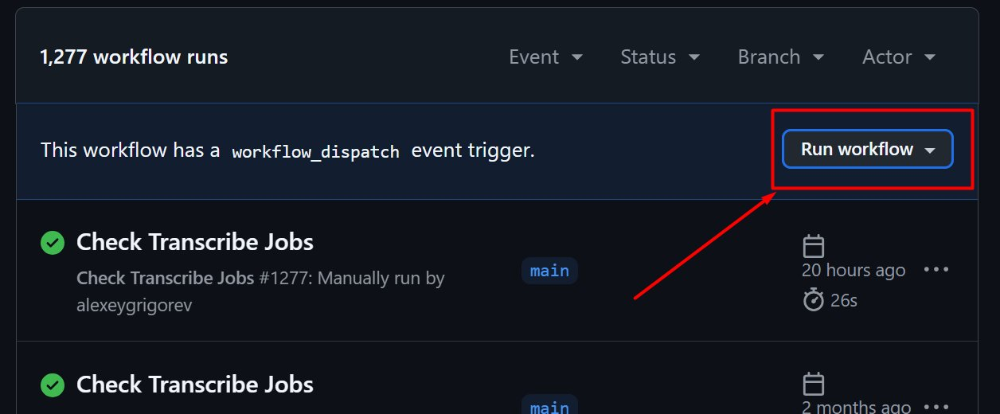
    <!-- sop-caption-start -->
    This screenshot matters for confirming the process is on the expected screen before the next action; look for the highlighted area or visible control labeled Run workflow. Use that match to verify the screen state, then complete the step described above.
    <!-- sop-caption-end -->
    <!-- sop-screenshot-end -->

    And then clicking “Run workflow
    <!-- sop-screenshot-start -->
    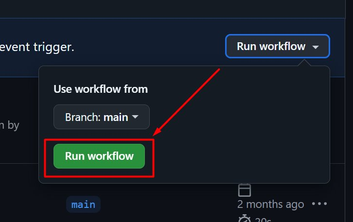
    <!-- sop-caption-start -->
    This screenshot matters for confirming the process is on the expected screen before the next action; look for the highlighted area or matching UI state shown in the image. Use it to verify the screen state, then complete the step described above.
    <!-- sop-caption-end -->
    <!-- sop-screenshot-end -->

    Give it 10-20 seconds to finish
<!-- sop-step-end -->

<!-- sop-step-start id=19 -->
19. Go to the transcriber repository ([https://github.com/alexeygrigorev/podcast-transcriber/](https://github.com/alexeygrigorev/podcast-transcriber/)).

    If the job is completed, you will see “now” (or a few minutes ago – depending on how much time you waited) in the “transcript/raw” folder
    <!-- sop-screenshot-start -->
    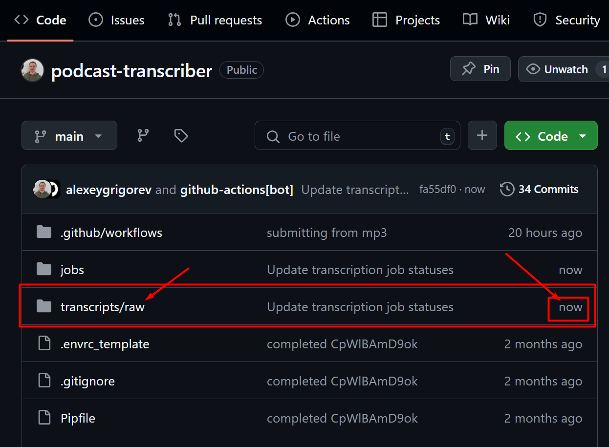
    <!-- sop-caption-start -->
    This screenshot matters for checking the editing, transcript, or timestamp workflow at this point; look for the highlighted area or visible control labeled now. Use that match to verify the screen state, then complete the step described above.
    <!-- sop-caption-end -->
    <!-- sop-screenshot-end -->
<!-- sop-step-end -->

<!-- sop-step-start id=20 -->
20. Go to this [“transcripts/raw”](https://github.com/alexeygrigorev/podcast-transcriber/tree/main/transcripts/raw) folder, and open the file with our YouTube ID by clicking on it

    It should have “Now” or a few minutes ago in the “Last commit date” column
    <!-- sop-screenshot-start -->
    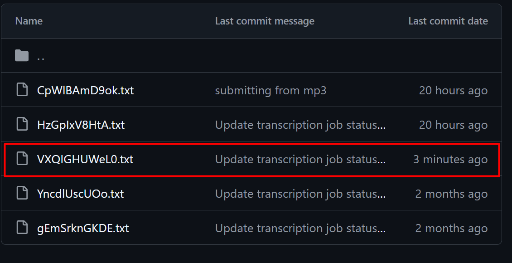
    <!-- sop-caption-start -->
    This screenshot matters for confirming the process is on the expected screen before the next action; look for the highlighted area or visible control labeled Now. Use that match to verify the screen state, then complete the step described above.
    <!-- sop-caption-end -->
    <!-- sop-screenshot-end -->
<!-- sop-step-end -->

<!-- sop-step-start id=21 -->
21. Keep the tab with the content open. We will later use it
<!-- sop-step-end -->

<!-- sop-group-end -->

<!-- sop-group-start: "Prepare the transcript document" -->
### Prepare the transcript document

<!-- sop-step-start id=22 -->
22. Go to Google Drive, go to the Files drive, the transcripts folder

    [https://drive.google.com/drive/folders/1khibztKmYTdyMBRjaQeiaNHXuE0A2HUw](https://drive.google.com/drive/folders/1khibztKmYTdyMBRjaQeiaNHXuE0A2HUw)
    <!-- sop-screenshot-start -->
    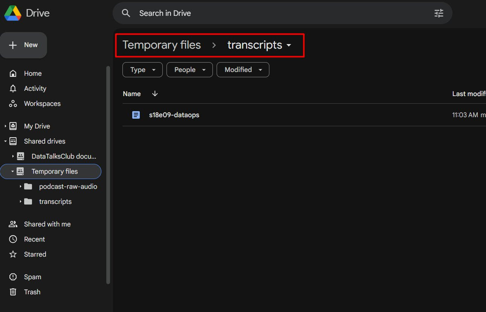
    <!-- sop-caption-start -->
    This screenshot matters for checking the editing, transcript, or timestamp workflow at this point; look for the highlighted area or visible control labeled Google Drive. Use that match to verify the screen state, then complete the step described above.
    <!-- sop-caption-end -->
    <!-- sop-screenshot-end -->
<!-- sop-step-end -->

<!-- sop-step-start id=23 -->
23. Create a new Google Document. Click “New”

    <!-- sop-screenshot-start -->
    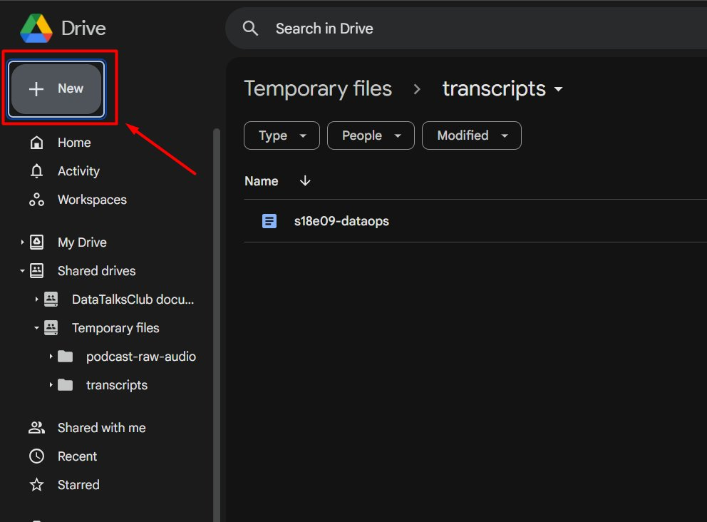
    <!-- sop-caption-start -->
    This screenshot matters for confirming the process is on the expected screen before the next action; look for the highlighted area or visible control labeled New. Use that match to verify the screen state, then complete the step described above.
    <!-- sop-caption-end -->
    <!-- sop-screenshot-end -->

    And then “Google Docs”
    <!-- sop-screenshot-start -->
    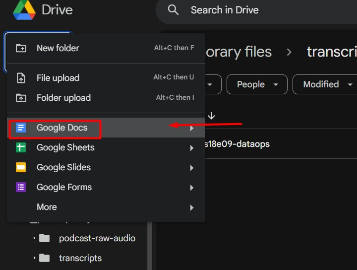
    <!-- sop-caption-start -->
    This screenshot matters for confirming the process is on the expected screen before the next action; look for the highlighted area or visible control labeled Google Docs. Use that match to verify the screen state, then complete the step described above.
    <!-- sop-caption-end -->
    <!-- sop-screenshot-end -->
<!-- sop-step-end -->

<!-- sop-step-start id=24 -->
24. Rename it (File → Rename)

    The name should follow this pattern:

    s10e07-short-name, where s10 is the podcast season, e07 is the episode number

    You can find the season and the episode in the [DataTalks.Club schedule document](https://docs.google.com/spreadsheets/d/1-T8qkmShlFUrT2NmkI8Pi1NgUS9IunP6wO5-L79xe2s/edit), columns S and T:
    <!-- sop-screenshot-start -->
    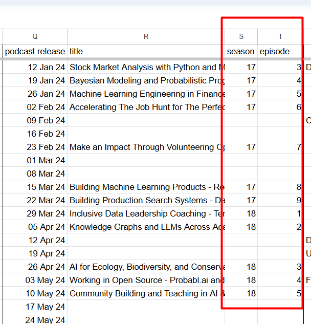
    <!-- sop-caption-start -->
    This screenshot matters for confirming the upload, publishing, or scheduling state before it becomes user-facing; look for the highlighted area or visible control labeled document. Use that match to verify the screen state, then complete the step described above.
    <!-- sop-caption-end -->
    <!-- sop-screenshot-end -->

    So, for “Using Data to Create Liveable Cities - Rachel Lim”, it’ll be “s19e01-livable-cities”.
<!-- sop-step-end -->

<!-- sop-step-start id=25 -->
25. Keep the tab with this document open, we will need it later
<!-- sop-step-end -->

<!-- sop-group-end -->

<!-- sop-group-start: "Edit the transcription with ChatGPT" -->
### Edit the transcription with ChatGPT

<!-- sop-step-start id=26 -->
26. Open ChatGPT ([https://chatgpt.com/](https://chatgpt.com/))

    Note: Make sure you use ChatGPT 4o, not 4o-mini
<!-- sop-step-end -->

<!-- sop-step-start id=27 -->
27. There’s a prompts.md file in the transcriber repository. We need the “Prompt for correcting” from there. It’s accessible using this link:

    [https://github.com/alexeygrigorev/podcast-transcriber/blob/main/prompt.md#prompt-for-correcting](https://github.com/alexeygrigorev/podcast-transcriber/blob/main/prompt.md#prompt-for-correcting)

    Copy this prompt to your clipboard. You can either manually select the prompt or click on the “copy” icon

    <!-- sop-screenshot-start -->
    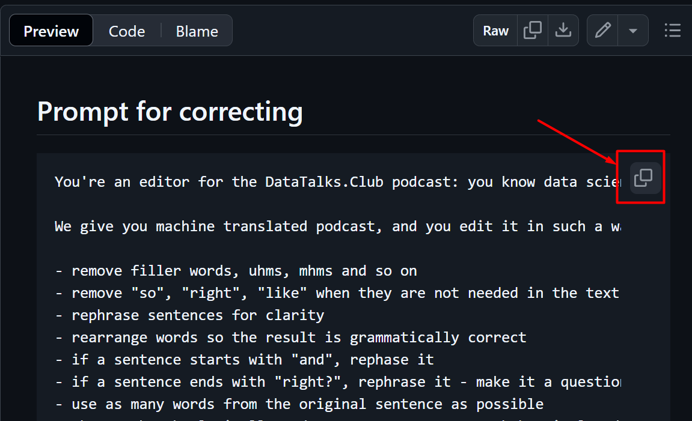
    <!-- sop-caption-start -->
    This screenshot matters for capturing or placing the correct link information; look for the highlighted area or visible control labeled copy. Use that match to verify the screen state, then complete the step described above.
    <!-- sop-caption-end -->
    <!-- sop-screenshot-end -->
<!-- sop-step-end -->

<!-- sop-step-start id=28 -->
28. Paste the prompt to ChatGPT, but don’t execute it yet. We need to replace a few placeholders there. We have two: {GUEST_NAME} and {QUESTIONS}

    First, replace the placeholder “{GUEST_NAME}” with the first name of the guest. E.g. for “Rachel Lim” it’s “Rachel”
    <!-- sop-screenshot-start -->
    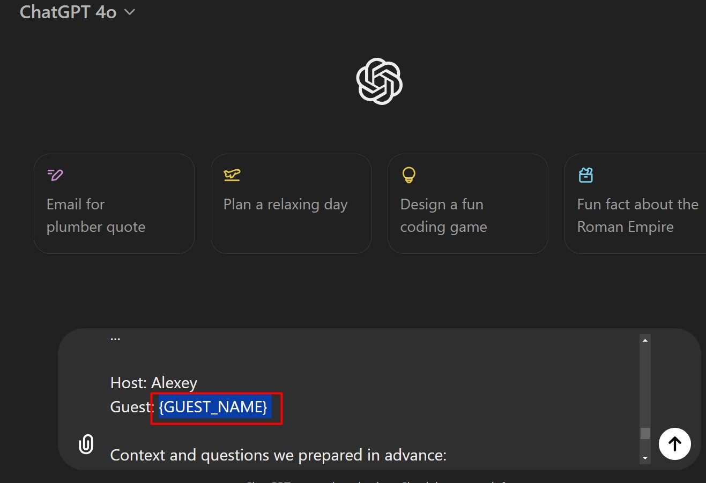
    <!-- sop-caption-start -->
    This screenshot matters for confirming the process is on the expected screen before the next action; look for the highlighted area or visible control labeled {GUESTNAME}. Use that match to verify the screen state, then complete the step described above.
    <!-- sop-caption-end -->
    <!-- sop-screenshot-end -->
<!-- sop-step-end -->

<!-- sop-step-start id=29 -->
29. Next, we need to replace the {QUESTIONS} placeholder.

    <!-- sop-screenshot-start -->
    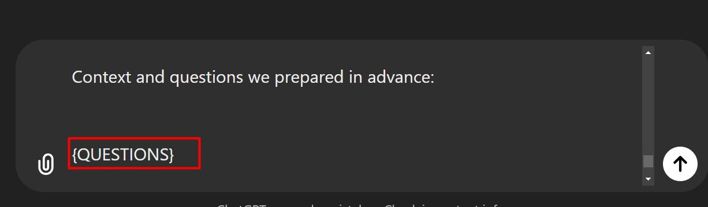
    <!-- sop-caption-start -->
    This screenshot matters for confirming the process is on the expected screen before the next action; look for the highlighted area or matching UI state shown in the image. Use it to verify the screen state, then complete the step described above.
    <!-- sop-caption-end -->
    <!-- sop-screenshot-end -->
<!-- sop-step-end -->

<!-- sop-step-start id=30 -->
30. Locate the podcast document for this particular podcast interview, copy the entire content of this document to the clipboard and paste it replacing the {QUESTIONS} placeholder

    <!-- sop-screenshot-start -->
    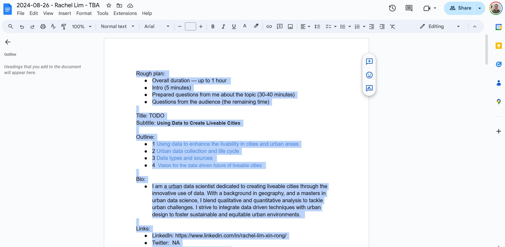
    <!-- sop-caption-start -->
    This screenshot matters for capturing or placing the correct link information; look for the highlighted area or matching UI state shown in the image. Use it to verify the screen state, then complete the step described above.
    <!-- sop-caption-end -->
    <!-- sop-screenshot-end -->
<!-- sop-step-end -->

<!-- sop-step-start id=31 -->
31. Click on Run button

    <!-- sop-screenshot-start -->
    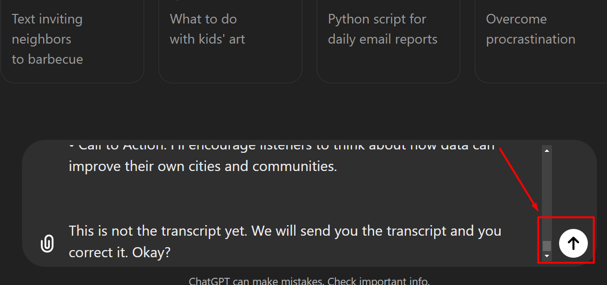
    <!-- sop-caption-start -->
    This screenshot matters for confirming the process is on the expected screen before the next action; look for the highlighted area or visible control labeled Run button. Use that match to verify the screen state, then complete the step described above.
    <!-- sop-caption-end -->
    <!-- sop-screenshot-end -->

    It will acknowledge the task and ask for the transcript.(The exact wording may be different)
    <!-- sop-screenshot-start -->
    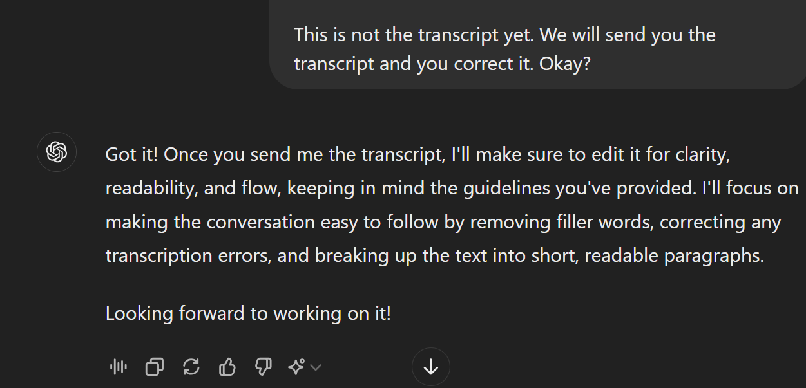
    <!-- sop-caption-start -->
    This screenshot matters for checking the editing, transcript, or timestamp workflow at this point; look for the highlighted area or matching UI state shown in the image. Use it to verify the screen state, then complete the step described above.
    <!-- sop-caption-end -->
    <!-- sop-screenshot-end -->
<!-- sop-step-end -->

<!-- sop-step-start id=32 -->
32. Now let’s copy the transcript into ChatGPT for editing. We will do it in chunks

    First, copy roughly 20 minutes of the transcript and make sure that the last phrase is from the guest (unless it’s the last phrase of the transcript)
    <!-- sop-screenshot-start -->
    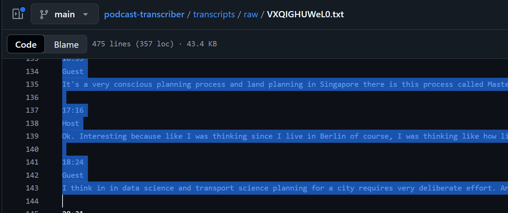
    <!-- sop-caption-start -->
    This screenshot matters for capturing or placing the correct link information; look for the highlighted area or matching UI state shown in the image. Use it to verify the screen state, then complete the step described above.
    <!-- sop-caption-end -->
    <!-- sop-screenshot-end -->

    And paste to ChatGPT. Click Run
    <!-- sop-screenshot-start -->
    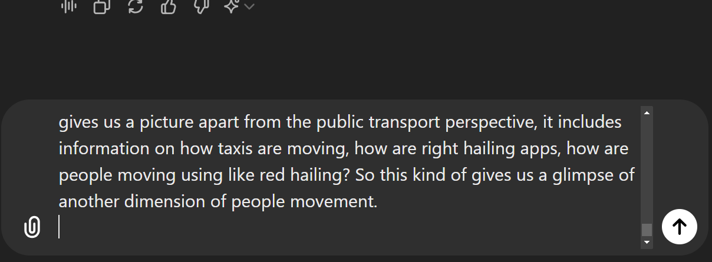
    <!-- sop-caption-start -->
    This screenshot matters for capturing or placing the correct link information; look for the highlighted area or visible control labeled ChatGPT. Use that match to verify the screen state, then complete the step described above.
    <!-- sop-caption-end -->
    <!-- sop-screenshot-end -->
<!-- sop-step-end -->

<!-- sop-step-start id=33 -->
33. Sometimes it will stop midway. In this case, click “Continue generating”.

    <!-- sop-screenshot-start -->
    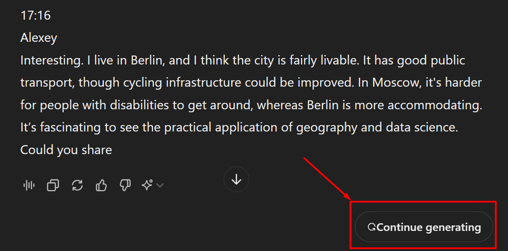
    <!-- sop-caption-start -->
    This screenshot matters for confirming the process is on the expected screen before the next action; look for the highlighted area or visible control labeled Continue generating. Use that match to verify the screen state, then complete the step described above.
    <!-- sop-caption-end -->
    <!-- sop-screenshot-end -->
<!-- sop-step-end -->

<!-- sop-step-start id=34 -->
34. Select the output and copy it to the clipboard

    <!-- sop-screenshot-start -->
    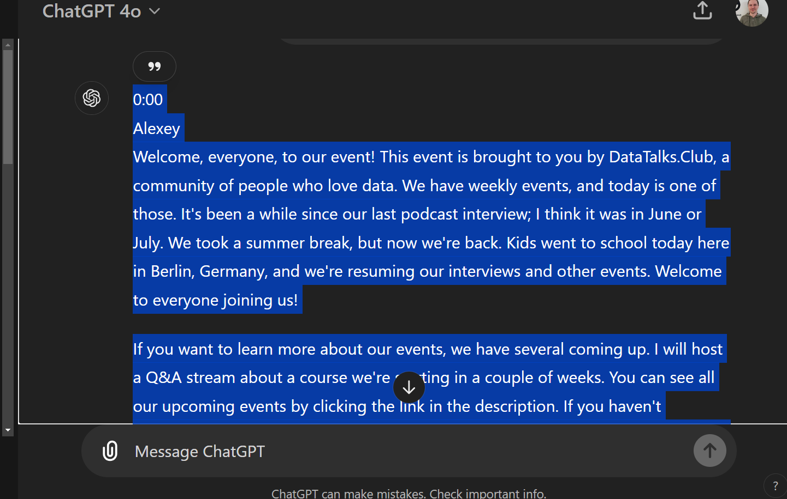
    <!-- sop-caption-start -->
    This screenshot matters for capturing or placing the correct link information; look for the highlighted area or visible control labeled output and copy it to the clipboard. Use that match to verify the screen state, then complete the step described above.
    <!-- sop-caption-end -->
    <!-- sop-screenshot-end -->

    Paste it to the Google document with the transcript
    <!-- sop-screenshot-start -->
    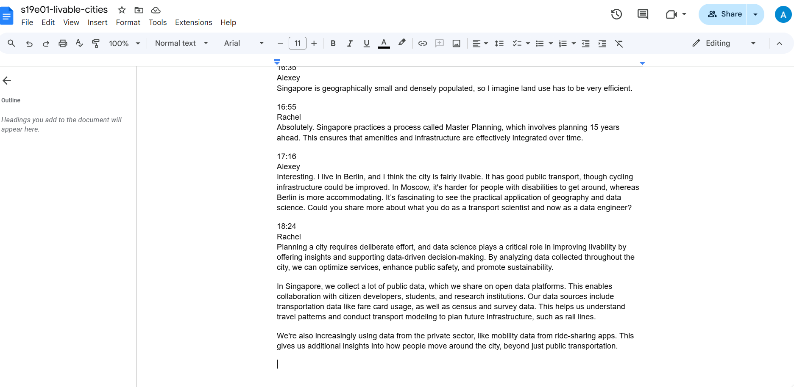
    <!-- sop-caption-start -->
    This screenshot matters for capturing or placing the correct link information; look for the highlighted area or visible control labeled it to the Google document with the transcript. Use that match to verify the screen state, then complete the step described above.
    <!-- sop-caption-end -->
    <!-- sop-screenshot-end -->
<!-- sop-step-end -->

<!-- sop-step-start id=35 -->
35. Continue this with chunks of ~20 minutes each until the entire transcript is edited with ChatGPT and copied to the Google document. Typically you’ll need to do it 3 times: 0-20, 20-40 and 40-60 minutes
<!-- sop-step-end -->

<!-- sop-group-end -->

<!-- sop-group-start: "Editing the document" -->
### Editing the document

<!-- sop-step-start id=36 -->
36. The document is ready and we need to do a few manual edits. First, we remove the introduction part
    It’s usually the same in all our podcast interviews – it’s all the content before “This week, we’ll talk about …”

    So remove the intro:
    <!-- sop-screenshot-start -->
    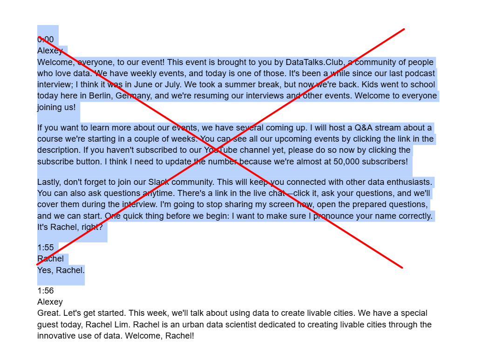
    <!-- sop-caption-start -->
    This screenshot matters for confirming the process is on the expected screen before the next action; look for the highlighted area or matching UI state shown in the image. Use it to verify the screen state, then complete the step described above.
    <!-- sop-caption-end -->
    <!-- sop-screenshot-end -->

    And if the first remaining paragraph contains things before “this week we’ll” that are irrelevant to the interview, remove them too:
    <!-- sop-screenshot-start -->
    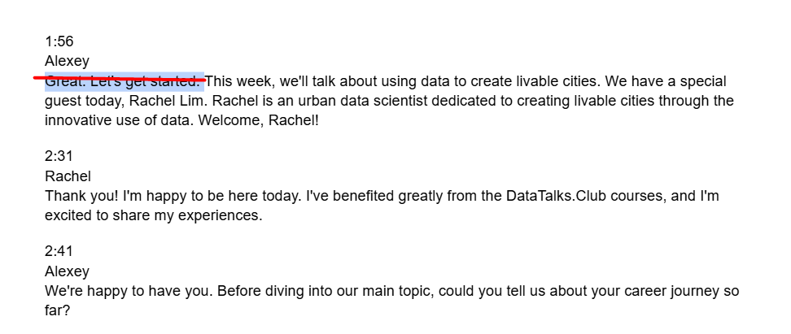
    <!-- sop-caption-start -->
    This screenshot matters for confirming the process is on the expected screen before the next action; look for the highlighted area or visible control labeled this week we’ll. Use that match to verify the screen state, then complete the step described above.
    <!-- sop-caption-end -->
    <!-- sop-screenshot-end -->
<!-- sop-step-end -->

<!-- sop-step-start id=37 -->
37. Finally, add spaces around dashes.

    Press Ctrl+H (or click Edit → Search and replace) and put (without quotes)

    Find: “(?\<!\s)—(?!\s)”
    Replace: “ — “
    Check “Use regular expressions”

    <!-- sop-screenshot-start -->
    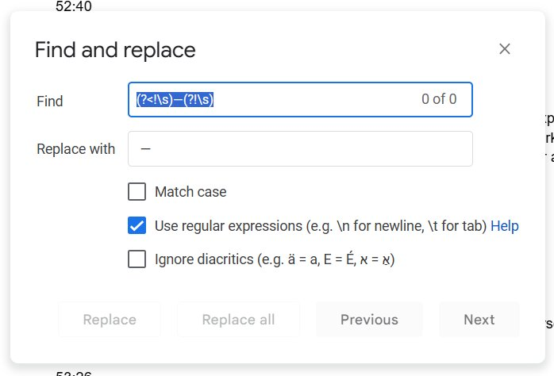
    <!-- sop-caption-start -->
    This screenshot matters for confirming the process is on the expected screen before the next action; look for the highlighted area or visible control labeled Use regular expressions. Use that match to verify the screen state, then complete the step described above.
    <!-- sop-caption-end -->
    <!-- sop-screenshot-end -->

    Then click “Replace all”
<!-- sop-step-end -->

<!-- sop-group-end -->

<!-- sop-group-start: "Adding sections" -->
### Adding sections

<!-- sop-step-start id=38 -->
38. Now we will use ChatGPT again to add sections.

    We need the “Prompt for titles” from the prompts.md file. It’s accessible using this link:

    [https://github.com/alexeygrigorev/podcast-transcriber/blob/main/prompt.md#prompt-for-titles](https://github.com/alexeygrigorev/podcast-transcriber/blob/main/prompt.md#prompt-for-titles)

    Copy this prompt to your clipboard. You can either manually select the prompt or click on the “copy” icon

    <!-- sop-screenshot-start -->
    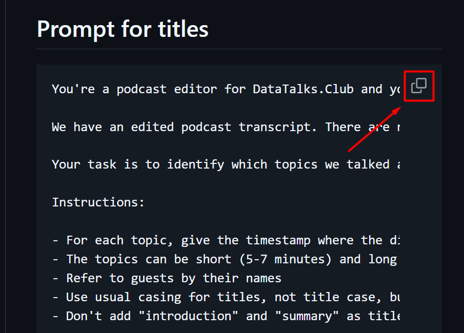
    <!-- sop-caption-start -->
    This screenshot matters for capturing or placing the correct link information; look for the highlighted area or visible control labeled copy. Use that match to verify the screen state, then complete the step described above.
    <!-- sop-caption-end -->
    <!-- sop-screenshot-end -->
<!-- sop-step-end -->

<!-- sop-step-start id=39 -->
39. Run the prompt. It will respond with acknowledging the task

    <!-- sop-screenshot-start -->
    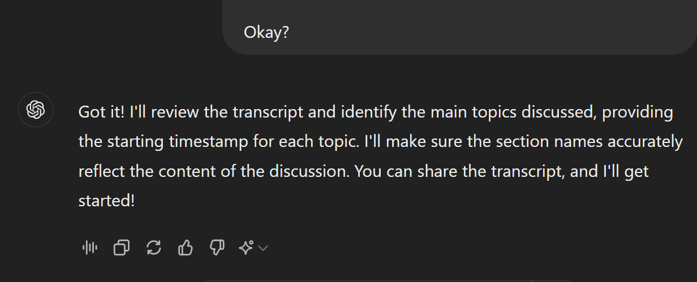
    <!-- sop-caption-start -->
    This screenshot matters for confirming the process is on the expected screen before the next action; look for the highlighted area or matching UI state shown in the image. Use it to verify the screen state, then complete the step described above.
    <!-- sop-caption-end -->
    <!-- sop-screenshot-end -->
<!-- sop-step-end -->

<!-- sop-step-start id=40 -->
40. Copy the entire transcript to ChatGPT and click Run

    <!-- sop-screenshot-start -->
    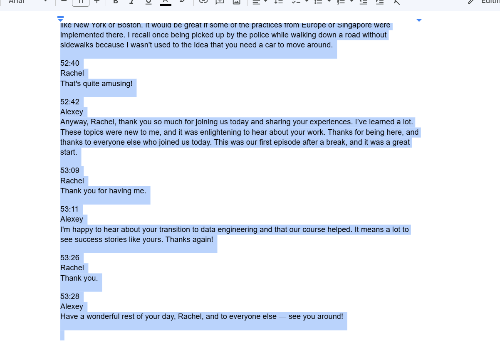
    <!-- sop-caption-start -->
    This screenshot matters for capturing or placing the correct link information; look for the highlighted area or visible control labeled entire transcript to ChatGPT and click Run. Use that match to verify the screen state, then complete the step described above.
    <!-- sop-caption-end -->
    <!-- sop-screenshot-end -->

    <!-- sop-screenshot-start -->
    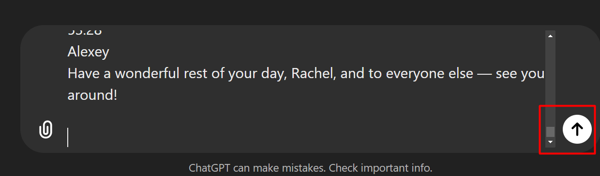
    <!-- sop-caption-start -->
    This screenshot matters for capturing or placing the correct link information; look for the highlighted area or visible control labeled entire transcript to ChatGPT and click Run. Use that match to verify the screen state, then complete the step described above.
    <!-- sop-caption-end -->
    <!-- sop-screenshot-end -->
<!-- sop-step-end -->

<!-- sop-step-start id=41 -->
41. Wait till it finishes. You’ll get output that looks like this:

    <!-- sop-screenshot-start -->
    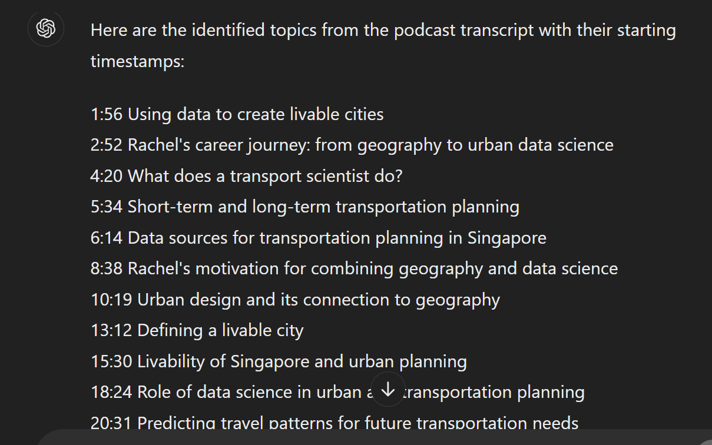
    <!-- sop-caption-start -->
    This screenshot matters for confirming the process is on the expected screen before the next action; look for the highlighted area or matching UI state shown in the image. Use it to verify the screen state, then complete the step described above.
    <!-- sop-caption-end -->
    <!-- sop-screenshot-end -->
<!-- sop-step-end -->

<!-- sop-step-start id=42 -->
42. Now we need to put each chapter back to the transcript document.

    The first chapter is easy, so we will take the second one as the example:

    2:52 Rachel's career journey: from geography to urban data science
    Find the “2:52” timestamp in the document

    <!-- sop-screenshot-start -->
    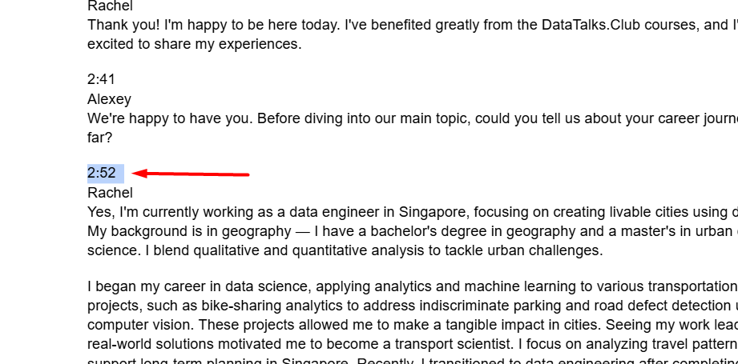
    <!-- sop-caption-start -->
    This screenshot matters for checking the editing, transcript, or timestamp workflow at this point; look for the highlighted area or visible control labeled 2:52. Use that match to verify the screen state, then complete the step described above.
    <!-- sop-caption-end -->
    <!-- sop-screenshot-end -->

    Put the name “Rachel's career journey: from geography to urban data science” right before this timestamp (Don’t include the timestamp):

    <!-- sop-screenshot-start -->
    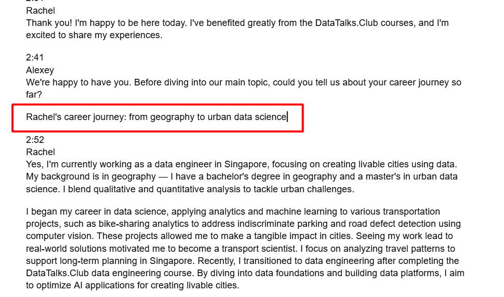
    <!-- sop-caption-start -->
    This screenshot matters for checking the editing, transcript, or timestamp workflow at this point; look for the highlighted area or matching UI state shown in the image. Use it to verify the screen state, then complete the step described above.
    <!-- sop-caption-end -->
    <!-- sop-screenshot-end -->

    Make it a header 2: select the text and press Ctrl+Alt+2:
    <!-- sop-screenshot-start -->
    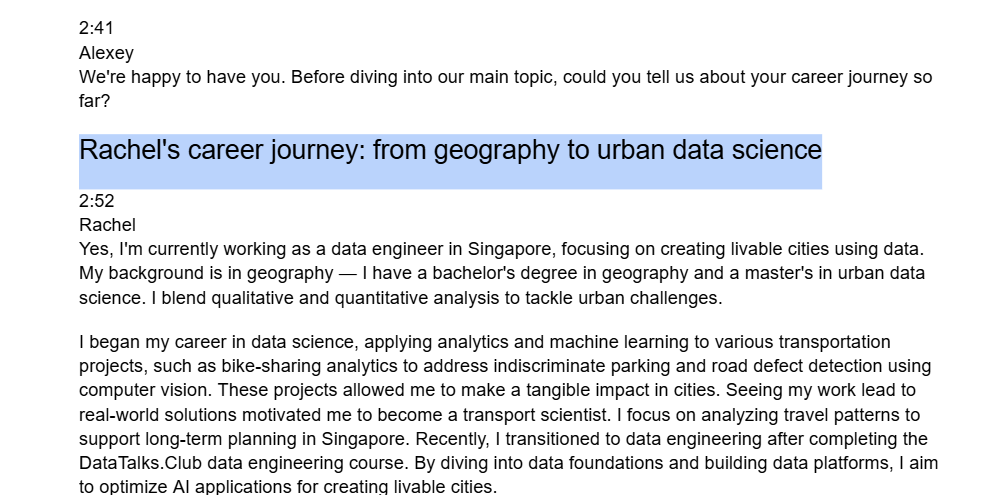
    <!-- sop-caption-start -->
    This screenshot matters for confirming the process is on the expected screen before the next action; look for the highlighted area or visible control labeled text and press Ctrl+Alt+2. Use that match to verify the screen state, then complete the step described above.
    <!-- sop-caption-end -->
    <!-- sop-screenshot-end -->
<!-- sop-step-end -->

<!-- sop-step-start id=43 -->
43. Sometimes the timestamps aren’t correct. Often this happens when the timestamp points to the answer, not a question

    For example, for “30:09 Data analysis for transportation policies”, we’d put the title at the 30:09 timestamp:
    <!-- sop-screenshot-start -->
    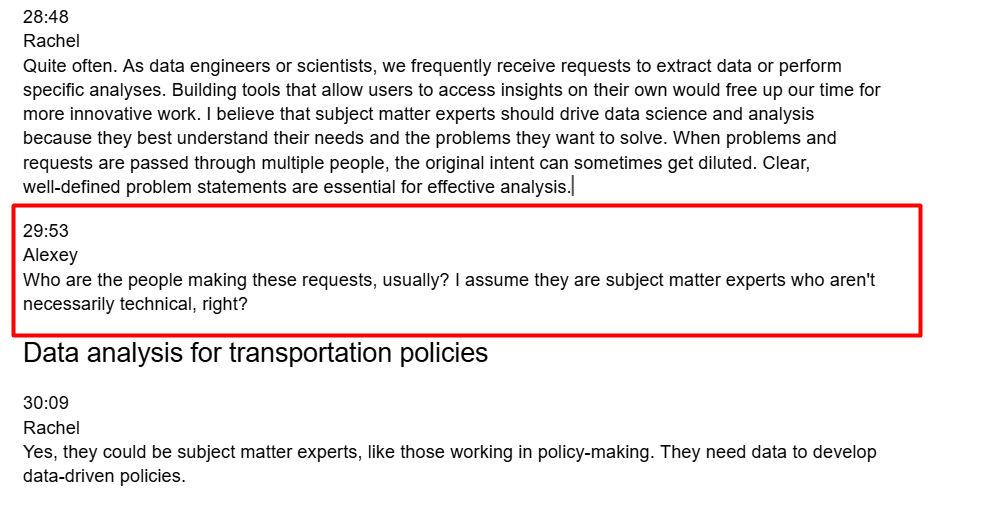
    <!-- sop-caption-start -->
    This screenshot matters for checking the editing, transcript, or timestamp workflow at this point; look for the highlighted area or matching UI state shown in the image. Use it to verify the screen state, then complete the step described above.
    <!-- sop-caption-end -->
    <!-- sop-screenshot-end -->

    But it’s the answer to the question that is asked before 30:09. So we need to move it to the question:
    <!-- sop-screenshot-start -->
    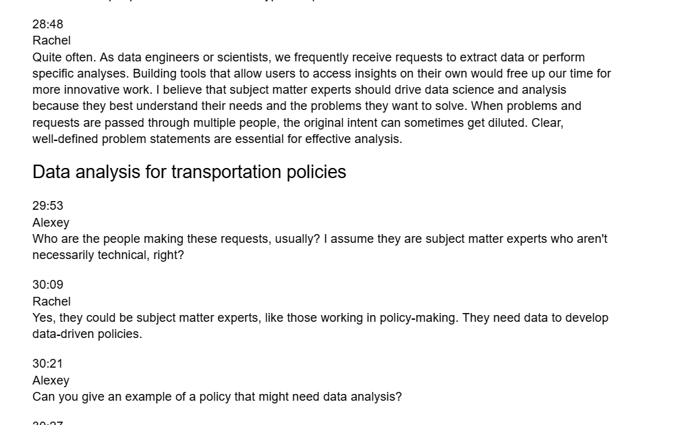
    <!-- sop-caption-start -->
    This screenshot matters for confirming the process is on the expected screen before the next action; look for the highlighted area or matching UI state shown in the image. Use it to verify the screen state, then complete the step described above.
    <!-- sop-caption-end -->
    <!-- sop-screenshot-end -->
<!-- sop-step-end -->

<!-- sop-step-start id=44 -->
44. Repeat it for all the headers.
<!-- sop-step-end -->

<!-- sop-step-start id=45 -->
45. The document is ready! Put the link to it to the trello card.

    <!-- sop-screenshot-start -->
    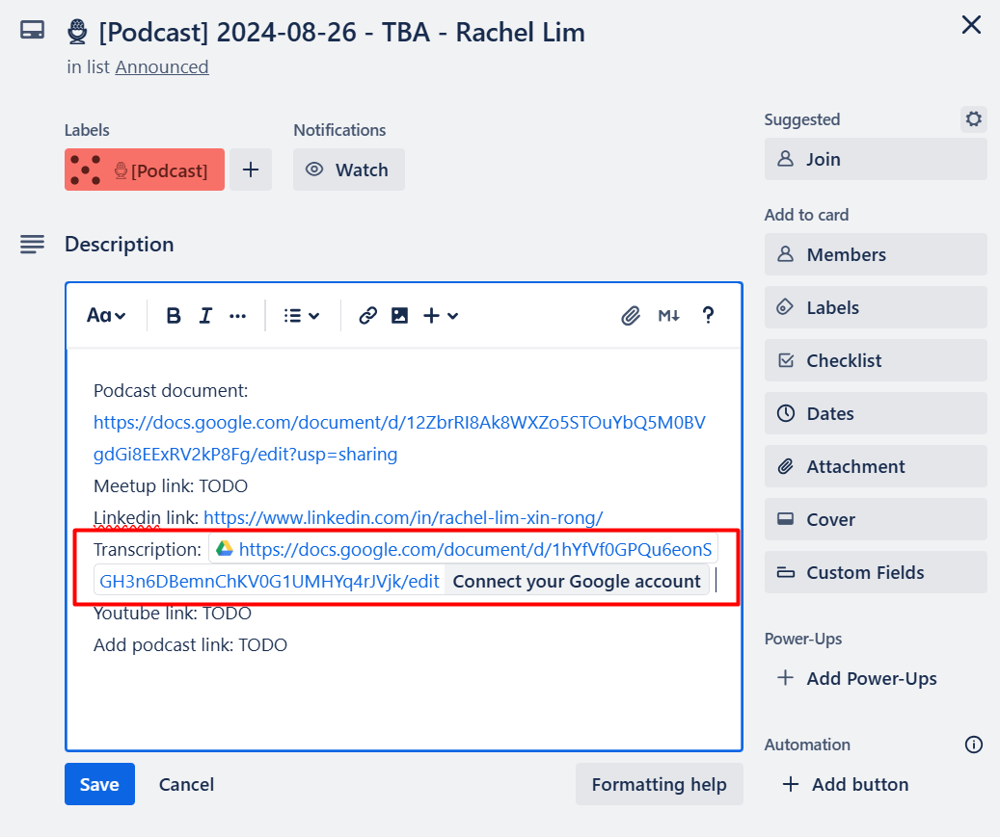
    <!-- sop-caption-start -->
    This screenshot matters for capturing or placing the correct link information; look for the highlighted area or matching UI state shown in the image. Use it to verify the screen state, then complete the step described above.
    <!-- sop-caption-end -->
    <!-- sop-screenshot-end -->
<!-- sop-step-end -->

<!-- sop-step-start id=46 -->
46. We can now download as docx:

    File → Download → Microsoft Word (.docx)
    <!-- sop-screenshot-start -->
    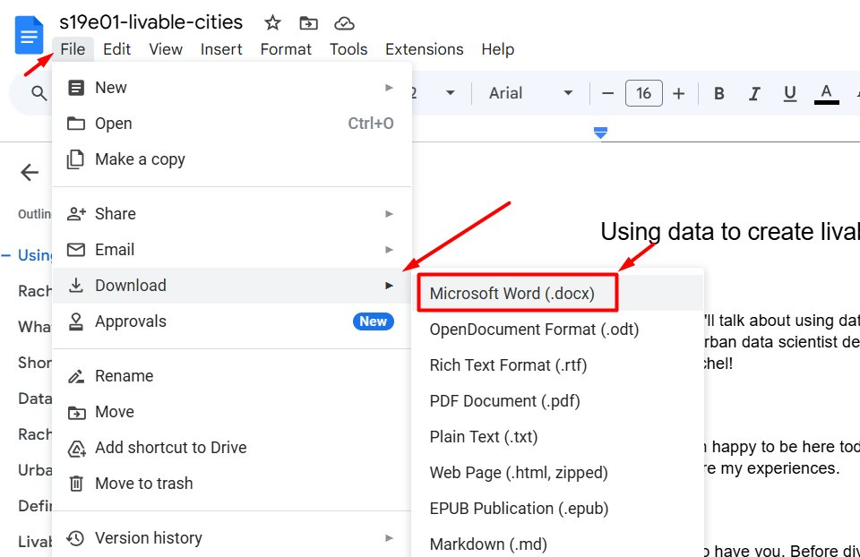
    <!-- sop-caption-start -->
    This screenshot matters for confirming the download or export step is using the right option; look for the highlighted area or visible control labeled → Microsoft Word (. Use that match to verify the screen state, then complete the step described above.
    <!-- sop-caption-end -->
    <!-- sop-screenshot-end -->
<!-- sop-step-end -->

<!-- sop-step-start id=47 -->
47. We can now use it for other tasks – TODO
<!-- sop-step-end -->

<!-- sop-group-end -->

<!-- sop-group-start: "Cleaning" -->
### Cleaning

<!-- sop-step-start id=48 -->
48. Delete the audio file from the drive.

    Go to the “Files \> podcast-raw-audio” folder:

    [https://drive.google.com/drive/folders/1lk5r7T1Ggs54lf0KI4_0bY5WQVkjuczT](https://drive.google.com/drive/folders/1lk5r7T1Ggs54lf0KI4_0bY5WQVkjuczT)

    And delete the file we uploaded earlier:

    right click on the file → Move to trash

    <!-- sop-screenshot-start -->
    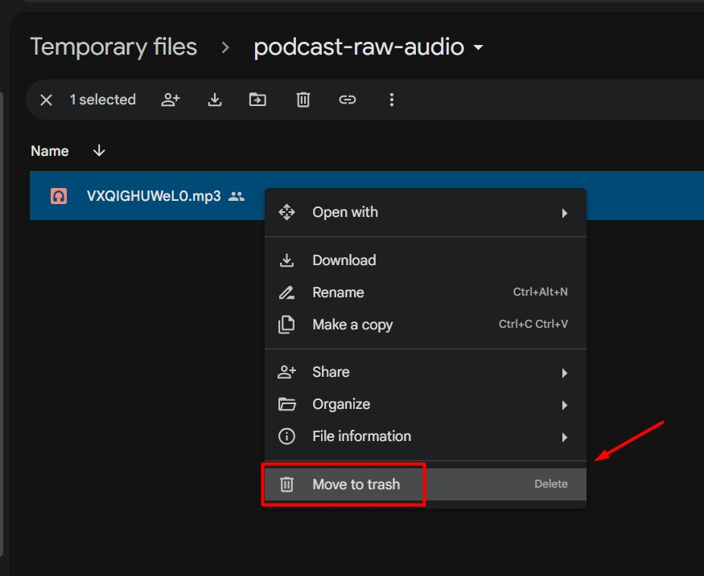
    <!-- sop-caption-start -->
    This screenshot matters for confirming the process is on the expected screen before the next action; look for the highlighted area or visible control labeled the file → Move to trash. Use that match to verify the screen state, then complete the step described above.
    <!-- sop-caption-end -->
    <!-- sop-screenshot-end -->
<!-- sop-step-end -->

<!-- sop-step-start id=49 -->
49. Move the raw transcript we created on github

    Go to the “transcripts/raw” folder in the transcriber github repository:

    [https://github.com/alexeygrigorev/podcast-transcriber/tree/main/transcripts/raw](https://github.com/alexeygrigorev/podcast-transcriber/tree/main/transcripts/raw)

    And open the transcript (you should still have this tab open if you haven’t closed it)

    Now click on “Edit this file” (icon with Pencil)
    <!-- sop-screenshot-start -->
    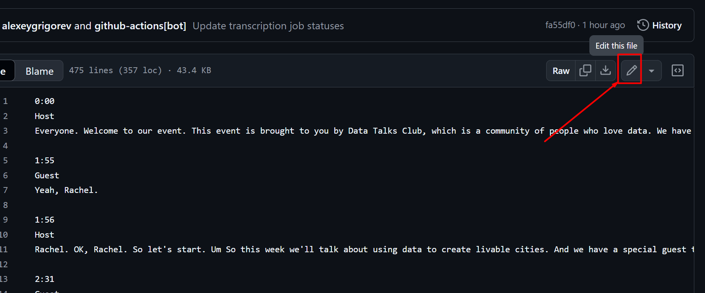
    <!-- sop-caption-start -->
    This screenshot matters for checking the editing, transcript, or timestamp workflow at this point; look for the highlighted area or visible control labeled Edit this file. Use that match to verify the screen state, then complete the step described above.
    <!-- sop-caption-end -->
    <!-- sop-screenshot-end -->

    Type “processed/” before the file name
    <!-- sop-screenshot-start -->
    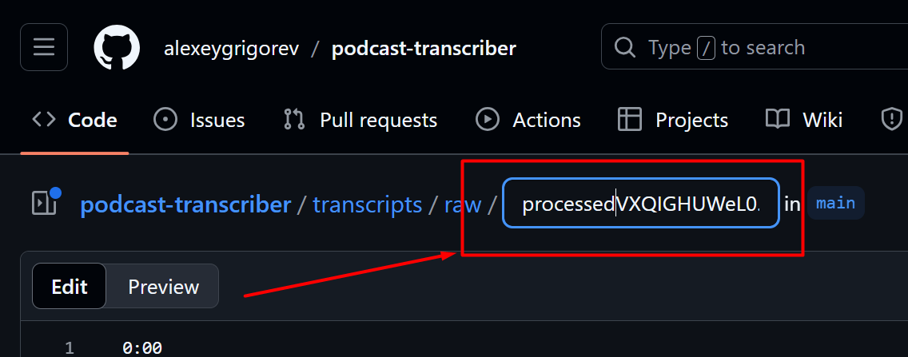
    <!-- sop-caption-start -->
    This screenshot matters for confirming the process is on the expected screen before the next action; look for the highlighted area or visible control labeled processed/. Use that match to verify the screen state, then complete the step described above.
    <!-- sop-caption-end -->
    <!-- sop-screenshot-end -->

    Once you add “/” after “processed”, it becomes a directory:
    <!-- sop-screenshot-start -->
    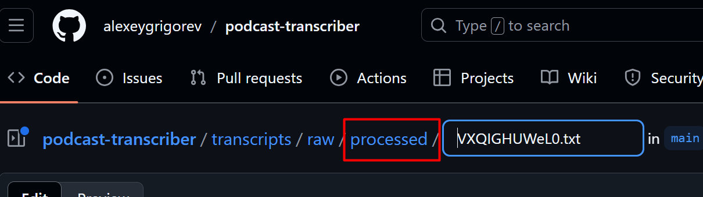
    <!-- sop-caption-start -->
    This screenshot matters for confirming the process is on the expected screen before the next action; look for the highlighted area or visible control labeled after. Use that match to verify the screen state, then complete the step described above.
    <!-- sop-caption-end -->
    <!-- sop-screenshot-end -->

    Now click “Commit changes”
    <!-- sop-screenshot-start -->
    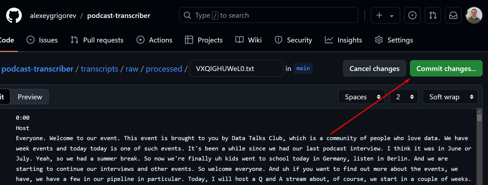
    <!-- sop-caption-start -->
    This screenshot matters for confirming the process is on the expected screen before the next action; look for the highlighted area or visible control labeled Commit changes. Use that match to verify the screen state, then complete the step described above.
    <!-- sop-caption-end -->
    <!-- sop-screenshot-end -->

    And confirm the commit by clicking “Commit changes”:
    <!-- sop-screenshot-start -->
    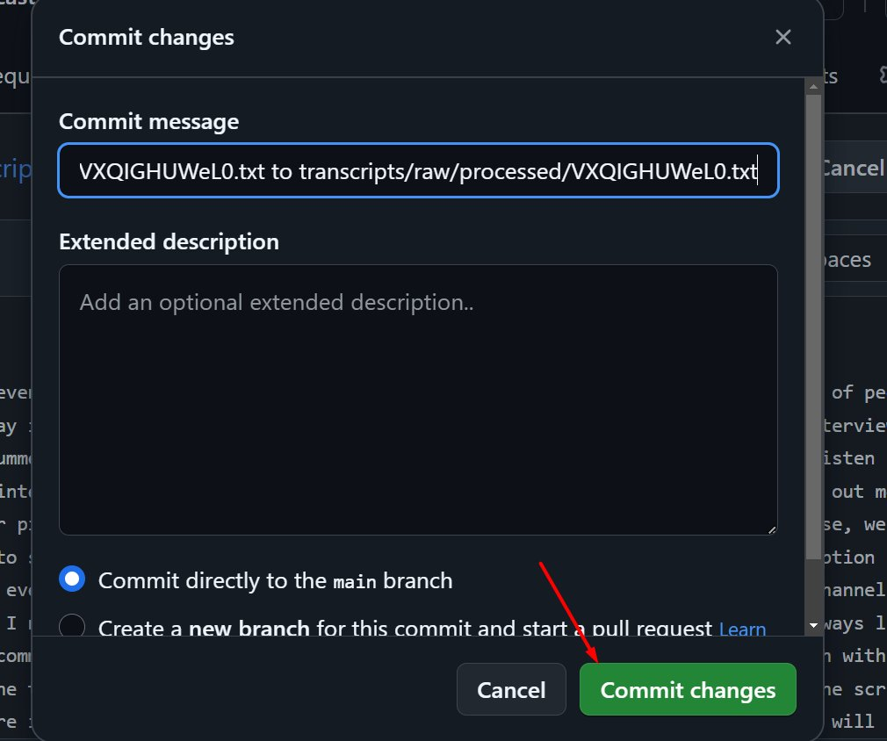
    <!-- sop-caption-start -->
    This screenshot matters for confirming the process is on the expected screen before the next action; look for the highlighted area or visible control labeled Commit changes. Use that match to verify the screen state, then complete the step described above.
    <!-- sop-caption-end -->
    <!-- sop-screenshot-end -->

    The file should be now in the “processed” folder:
    <!-- sop-screenshot-start -->
    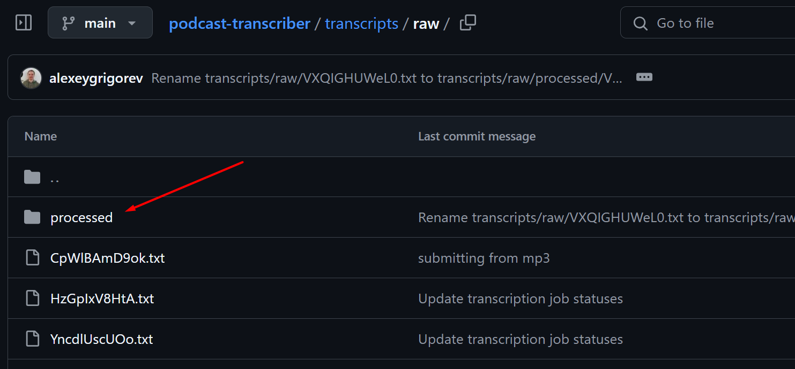
    <!-- sop-caption-start -->
    This screenshot matters for confirming the process is on the expected screen before the next action; look for the highlighted area or visible control labeled processed. Use that match to verify the screen state, then complete the step described above.
    <!-- sop-caption-end -->
    <!-- sop-screenshot-end -->

    Loom links:
<!-- sop-step-end -->

<!-- sop-group-end -->
<!-- sop-section-end -->

<!-- sop-section-start: validation -->
## Validation

-
<!-- sop-section-end -->

<!-- sop-section-start: troubleshooting -->
## Troubleshooting

-
<!-- sop-section-end -->

<!-- sop-section-start: references -->
## References

-
<!-- sop-section-end -->
