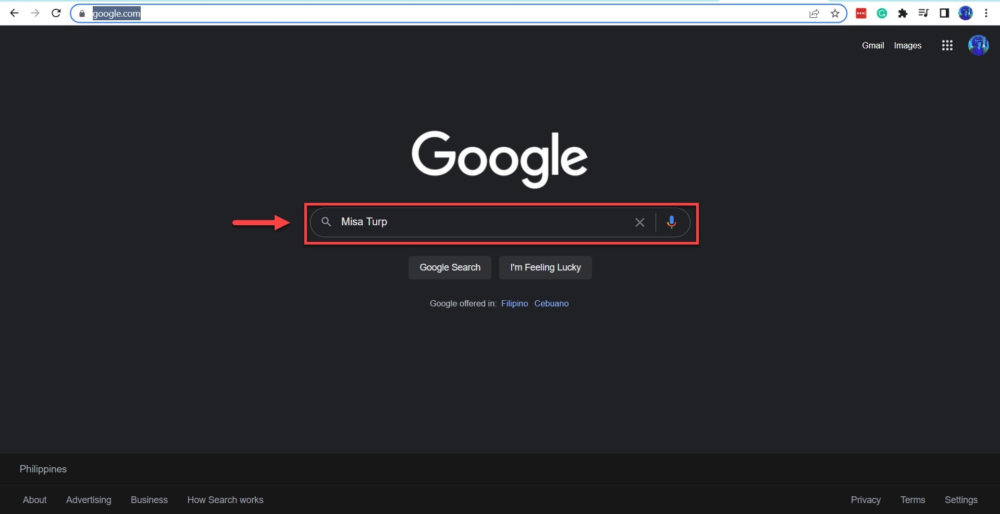
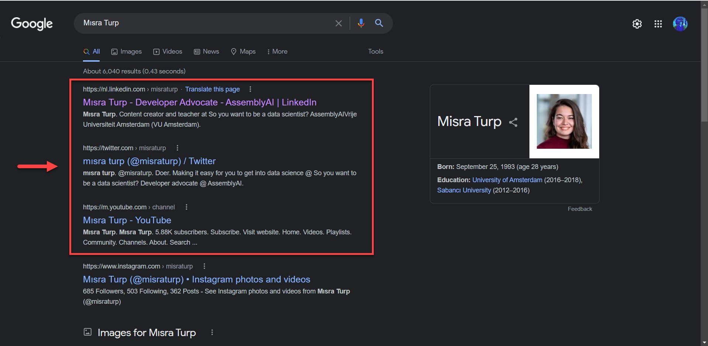
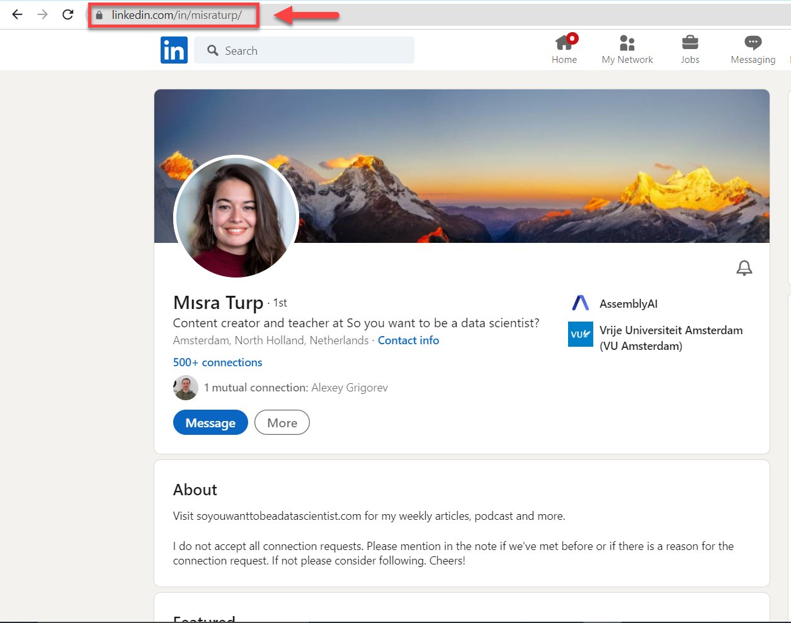
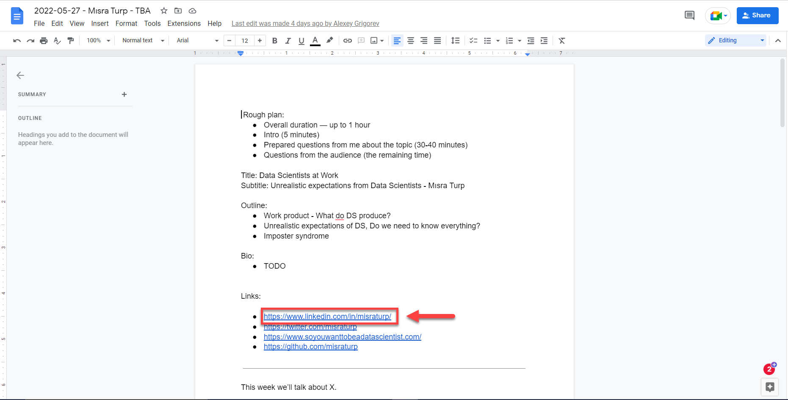

# Find speaker's link in Google and pasting into the podcast document

<!-- sop-section-start: summary -->
## Summary

- Purpose: Find speaker links online and add them to the podcast document.
- Outcome: The podcast document includes the speaker social and website links that can be found.
- Trigger: A podcast document needs guest links.
- Frequency: Per podcast guest.
<!-- sop-section-end -->

<!-- sop-section-start: prerequisites -->
## Prerequisites

- Access: Google search and the podcast document.
- Tools: Google, browser, Google Docs.
- Inputs: Guest name, target link types, and podcast document link.
<!-- sop-section-end -->

<!-- sop-section-start: procedure -->
## Procedure

<!-- sop-prose-start -->
How to find speaker’s link in Google
This procedure will show you the steps on how to find the speaker’s link in Google.

Step-by-step Instructions
<!-- sop-prose-end -->

<!-- sop-step-start id=1 -->
1.  The first thing you need to do is open [Google.com](https://www.google.com/) and search for the name of the guest.

    Note: In this example, the name of the guest is “Mısra Turp” You can also specify what contact details you want to find.

    For example: \< Name of the Guest \> \< Social Media platform \>
    \< Mısra Turp \> \< LinkedIn\>

    <!-- sop-screenshot-start -->
    
    <!-- sop-caption-start -->
    This screenshot matters for capturing or placing the correct link information; look for the highlighted area or matching UI state shown in the image. Use it to verify the screen state, then complete the step described above.
    <!-- sop-caption-end -->
    <!-- sop-screenshot-end -->
<!-- sop-step-end -->

<!-- sop-step-start id=2 -->
2.  After searching for the name of the guest, you can now click his/her links. This includes her LinkedIn, Twitter, Github, and website.

    <!-- sop-screenshot-start -->
    
    <!-- sop-caption-start -->
    This screenshot matters for capturing or placing the correct link information; look for the highlighted area or visible control labeled his/her links. Use that match to verify the screen state, then complete the step described above.
    <!-- sop-caption-end -->
    <!-- sop-screenshot-end -->
<!-- sop-step-end -->

<!-- sop-step-start id=3 -->
3.  In this example, copy the LinkedIn link

    <!-- sop-screenshot-start -->
    
    <!-- sop-caption-start -->
    This screenshot matters for capturing or placing the correct link information; look for the highlighted area or visible control labeled LinkedIn link. Use that match to verify the screen state, then complete the step described above.
    <!-- sop-caption-end -->
    <!-- sop-screenshot-end -->
<!-- sop-step-end -->

<!-- sop-step-start id=4 -->
4.  And then, paste the copied link into the podcast document.

    Note: This is also true for other links (Twitter, Github, etc…) If you can’t find his/her contact details, you can ask for them through email.

    <!-- sop-screenshot-start -->
    
    <!-- sop-caption-start -->
    This screenshot matters for capturing or placing the correct link information; look for the highlighted area or matching UI state shown in the image. Use it to verify the screen state, then complete the step described above.
    <!-- sop-caption-end -->
    <!-- sop-screenshot-end -->
<!-- sop-step-end -->
<!-- sop-section-end -->

<!-- sop-section-start: validation -->
## Validation

-
<!-- sop-section-end -->

<!-- sop-section-start: troubleshooting -->
## Troubleshooting

-
<!-- sop-section-end -->

<!-- sop-section-start: references -->
## References

-
<!-- sop-section-end -->
