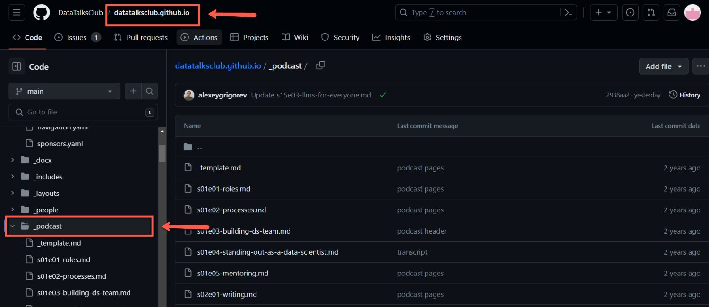
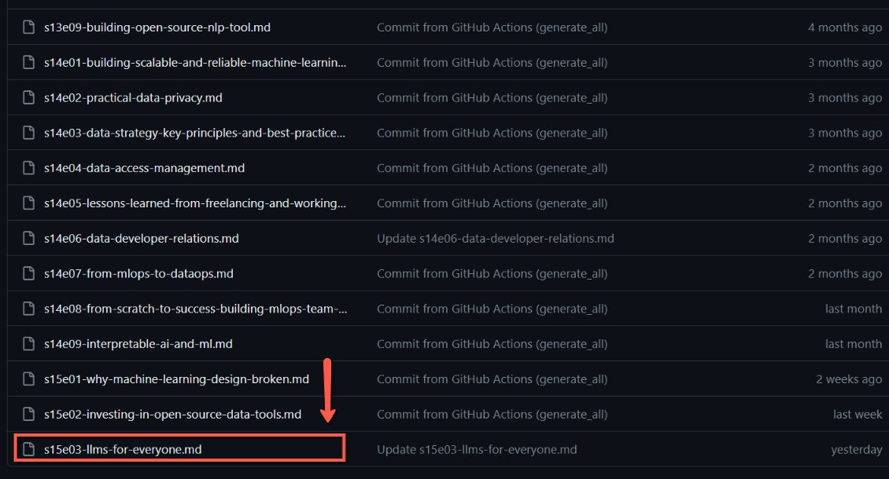
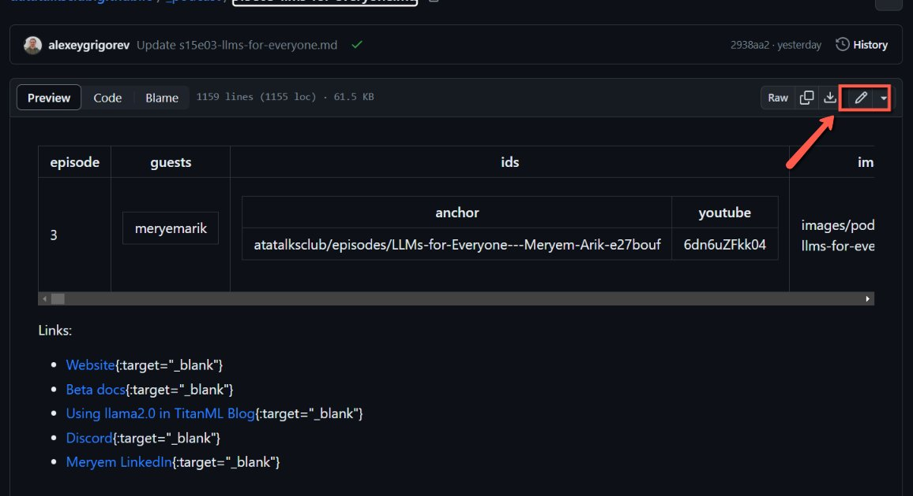
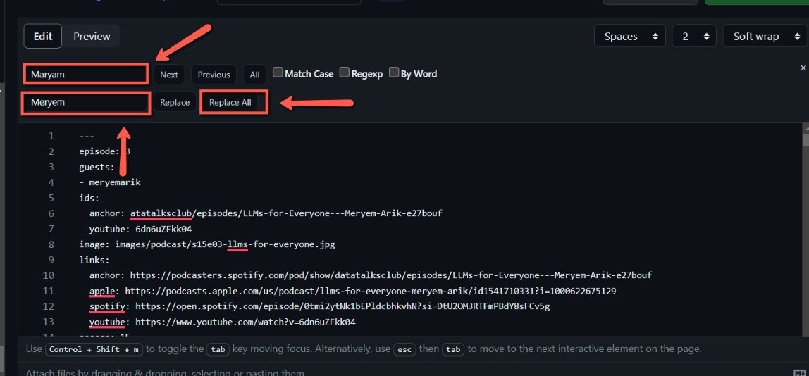
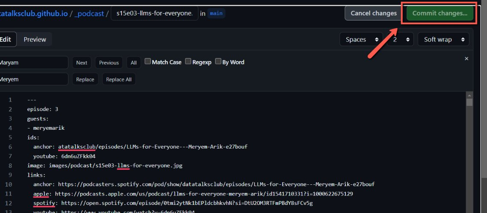

# Fixing a Typo in the Podcast Transcript

<!-- sop-section-start: summary -->
## Summary

- Purpose: Correct a typo in a published podcast transcript.
- Outcome: The podcast transcript page is updated and committed in GitHub.
- Trigger: A typo or incorrect spelling is found in a podcast transcript.
- Frequency: As needed.
<!-- sop-section-end -->

<!-- sop-section-start: prerequisites -->
## Prerequisites

- Access: DataTalksClub website GitHub repository.
- Tools: GitHub editor, browser find and replace.
- Inputs: Podcast page, incorrect text, and replacement text.
<!-- sop-section-end -->

<!-- sop-section-start: procedure -->
## Procedure

<!-- sop-prose-start -->
How to Fix a Typo in the Podcast Transcript
This procedure will show you the steps on how to Fix a Typo in the Podcast Transcript.

Step-by-step Instructions
<!-- sop-prose-end -->

<!-- sop-step-start id=1 -->
1.  The first thing you need to do is visit DataTalksClub’ github repository, and select “podcast”

    Note: You can also visit this* [*link*](https://github.com/DataTalksClub/datatalksclub.github.io/tree/main/_podcast) *directly.

    <!-- sop-screenshot-start -->
    
    <!-- sop-caption-start -->
    This screenshot matters for capturing or placing the correct link information; look for the highlighted area or matching UI state shown in the image. Use it to verify the screen state, then complete the step described above.
    <!-- sop-caption-end -->
    <!-- sop-screenshot-end -->
<!-- sop-step-end -->

<!-- sop-step-start id=2 -->
2.  And then, navigate and click the podcast episode you want to change or update.

    <!-- sop-screenshot-start -->
    
    <!-- sop-caption-start -->
    This screenshot matters for confirming the process is on the expected screen before the next action; look for the highlighted area or visible control labeled podcast episode you want to change or update. Use that match to verify the screen state, then complete the step described above.
    <!-- sop-caption-end -->
    <!-- sop-screenshot-end -->
<!-- sop-step-end -->

<!-- sop-step-start id=3 -->
3.  After, click the pen icon to edit the podcast episode.

    <!-- sop-screenshot-start -->
    
    <!-- sop-caption-start -->
    This screenshot matters for checking the editing, transcript, or timestamp workflow at this point; look for the highlighted area or visible control labeled pen icon to edit the podcast episode. Use that match to verify the screen state, then complete the step described above.
    <!-- sop-caption-end -->
    <!-- sop-screenshot-end -->
<!-- sop-step-end -->

<!-- sop-step-start id=4 -->
4.  Once done, press “Ctrl +F” on your keyboard and add the word on the “Find” section, and the word you want to chage/replace in the “Replace” section. After, click “Replace All” to update the word.

    Note: In this example, we want to change “Maryam” to “Meryem”

    <!-- sop-screenshot-start -->
    
    <!-- sop-caption-start -->
    This screenshot matters for confirming the process is on the expected screen before the next action; look for the highlighted area or visible control labeled Maryam. Use that match to verify the screen state, then complete the step described above.
    <!-- sop-caption-end -->
    <!-- sop-screenshot-end -->
<!-- sop-step-end -->

<!-- sop-step-start id=5 -->
5.  Finally, click “Commit changes” to save the update you’ve made on the repo.

    <!-- sop-screenshot-start -->
    
    <!-- sop-caption-start -->
    This screenshot matters for confirming the download or export step is using the right option; look for the highlighted area or visible control labeled Commit changes. Use that match to verify the screen state, then complete the step described above.
    <!-- sop-caption-end -->
    <!-- sop-screenshot-end -->
<!-- sop-step-end -->
<!-- sop-section-end -->

<!-- sop-section-start: validation -->
## Validation

-
<!-- sop-section-end -->

<!-- sop-section-start: troubleshooting -->
## Troubleshooting

-
<!-- sop-section-end -->

<!-- sop-section-start: references -->
## References

-
<!-- sop-section-end -->
