# Generate Timecodes from docx Transcriptions

<!-- sop-section-start: summary -->
## Summary

- Purpose: generating timecodes from a document with transcriptions
- Outcome: Podcast timecodes are generated from the transcript document.
- Trigger: after the the transcript document is created
- Frequency: Per podcast transcript that needs timecodes.
<!-- sop-section-end -->

<!-- sop-section-start: prerequisites -->
## Prerequisites

- Access: Transcript Google Drive folder and transcript-utils GitHub repository.
- Tools: Google Drive, GitHub, transcript-utils.
- Inputs: Podcast transcript docx file, episode title, and season or episode identifier.

TODO:

- Move the anchor.fm part in a separate document and update it for Spotify for Podcasters. In the new document, link this one
<!-- sop-section-end -->

<!-- sop-section-start: procedure -->
## Procedure

<!-- sop-group-start: "Download the file" -->
### Download the file

<!-- sop-step-start id=1 -->
1.  The first thing you need to do is open the transcript document – it should be in the trello card and in the [transcripts](https://drive.google.com/drive/folders/1khibztKmYTdyMBRjaQeiaNHXuE0A2HUw) folder.

    <!-- sop-screenshot-start -->
    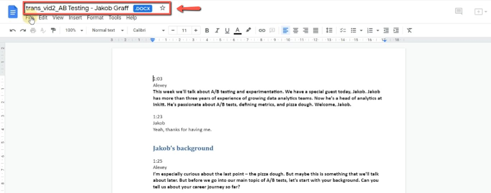
    <!-- sop-caption-start -->
    This screenshot matters for checking the editing, transcript, or timestamp workflow at this point; look for the highlighted area or matching UI state shown in the image. Use it to verify the screen state, then complete the step described above.
    <!-- sop-caption-end -->
    <!-- sop-screenshot-end -->
<!-- sop-step-end -->

<!-- sop-step-start id=2 -->
2.  Download the transcript, click on "File" and click "Download- Microsoft word (.docx)”\]

    <!-- sop-screenshot-start -->
    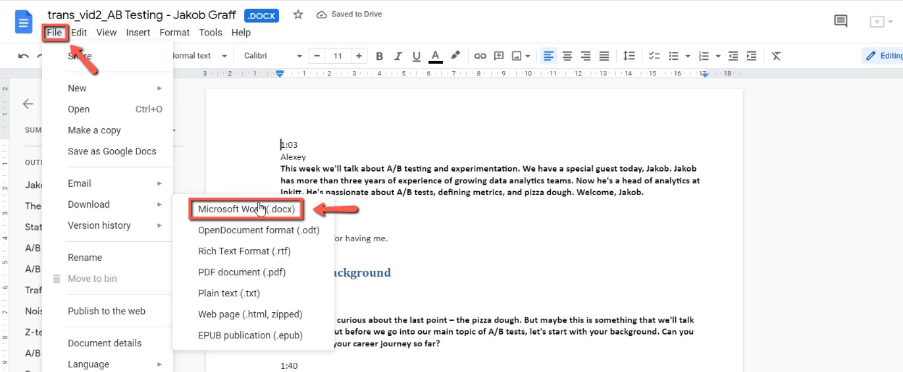
    <!-- sop-caption-start -->
    This screenshot matters for confirming the download or export step is using the right option; look for the highlighted area or visible control labeled File. Use that match to verify the screen state, then complete the step described above.
    <!-- sop-caption-end -->
    <!-- sop-screenshot-end -->
<!-- sop-step-end -->

<!-- sop-step-start id=3 -->
3.  If relevant, rename the document.
    Note: when renaming, you must follow the format: "SeasonEpisode-Title”,

    e.g “s07e07-ab-tests”. There should be no spaces in between the words and make all letters lowercase and don’t add “-” at the end.

    Incorrect file name:

    - s08e09-From-Academia-to-Data-Analytics-and-Engineering-.docx

    - S08e09- From-Academia-to-Data- Analytics-and- Engineering-.docx

    Correct filename:

    - s08e09-from-academia-to-data-analytics-and-engineering.docx

    <!-- sop-screenshot-start -->
    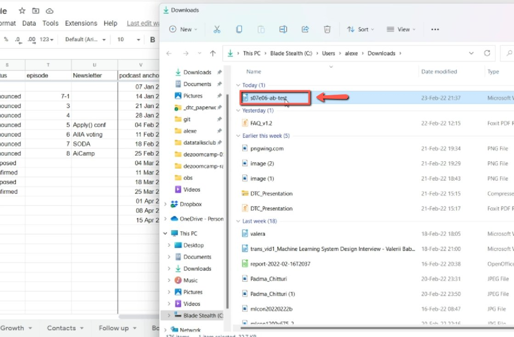
    <!-- sop-caption-start -->
    This screenshot matters for confirming the process is on the expected screen before the next action; look for the highlighted area or matching UI state shown in the image. Use it to verify the screen state, then complete the step described above.
    <!-- sop-caption-end -->
    <!-- sop-screenshot-end -->
<!-- sop-step-end -->

<!-- sop-group-end -->

<!-- sop-group-start: "Extract timecodes" -->
### Extract timecodes

<!-- sop-step-start id=4 -->
4.  To proceed, open [transcript-utils/docs](https://github.com/alexeygrigorev/transcript-utils/tree/main) on GitHub

    <!-- sop-screenshot-start -->
    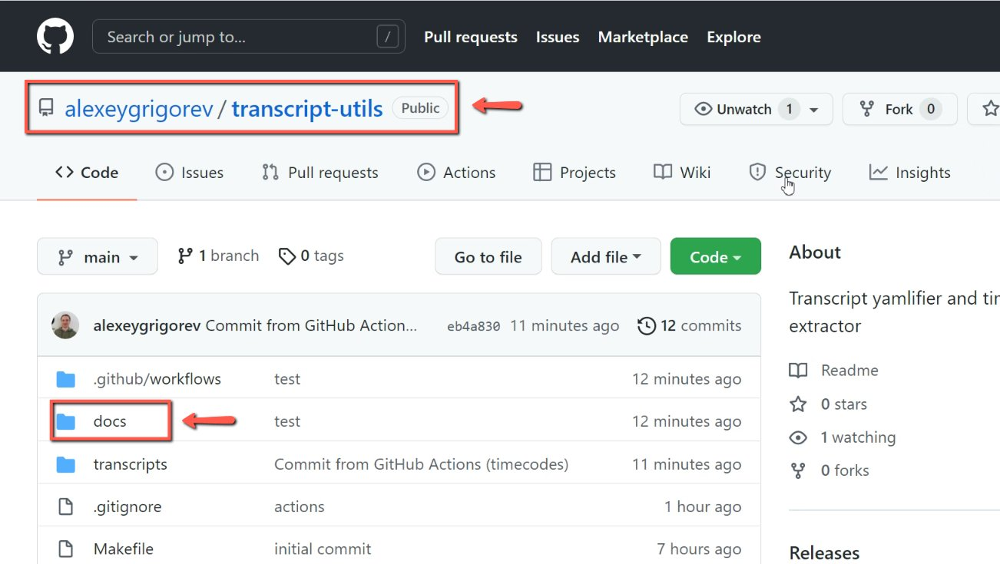
    <!-- sop-caption-start -->
    This screenshot matters for checking the editing, transcript, or timestamp workflow at this point; look for the highlighted area or visible control labeled transcript-utils/docs on GitHub. Use that match to verify the screen state, then complete the step described above.
    <!-- sop-caption-end -->
    <!-- sop-screenshot-end -->
<!-- sop-step-end -->

<!-- sop-step-start id=5 -->
5.  On the top right of your screen, click "Add file" and select "Upload files"

    <!-- sop-screenshot-start -->
    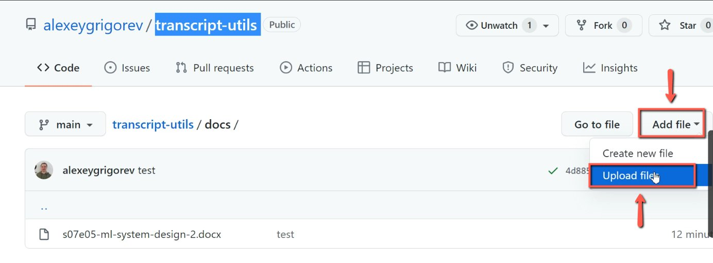
    <!-- sop-caption-start -->
    This screenshot matters for confirming the upload, publishing, or scheduling state before it becomes user-facing; look for the highlighted area or visible control labeled Add file. Use that match to verify the screen state, then complete the step described above.
    <!-- sop-caption-end -->
    <!-- sop-screenshot-end -->
<!-- sop-step-end -->

<!-- sop-step-start id=6 -->
6.  And then, click "choose your files" or you may drag the file.

    <!-- sop-screenshot-start -->
    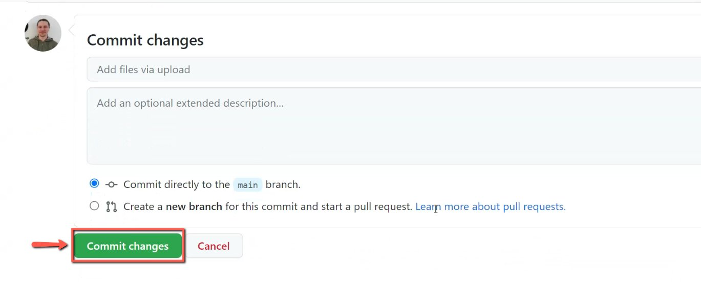
    <!-- sop-caption-start -->
    This screenshot matters for confirming the process is on the expected screen before the next action; look for the highlighted area or visible control labeled choose your files. Use that match to verify the screen state, then complete the step described above.
    <!-- sop-caption-end -->
    <!-- sop-screenshot-end -->
<!-- sop-step-end -->

<!-- sop-step-start id=7 -->
7.  After dragging or selecting your file, click "Commit changes"

    Note: Wait for a few seconds before the uploading will be completed. To check the progress, click on "Actions”

    <!-- sop-screenshot-start -->
    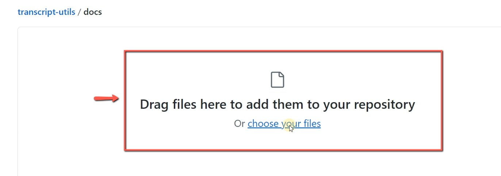
    <!-- sop-caption-start -->
    This screenshot matters for confirming the upload, publishing, or scheduling state before it becomes user-facing; look for the highlighted area or visible control labeled Actions. Use that match to verify the screen state, then complete the step described above.
    <!-- sop-caption-end -->
    <!-- sop-screenshot-end -->
<!-- sop-step-end -->

<!-- sop-step-start id=8 -->
8.  And after the file has been uploaded, click on "transcripts"

    <!-- sop-screenshot-start -->
    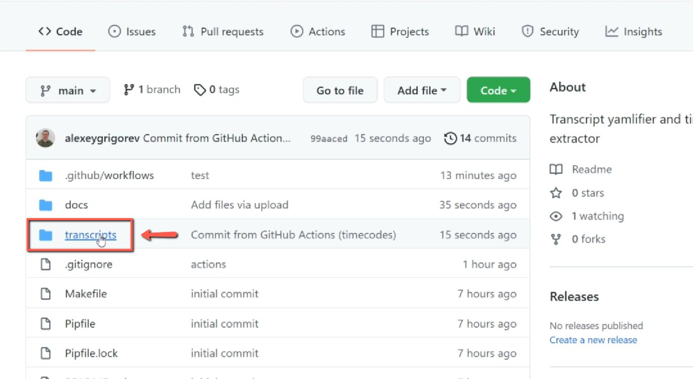
    <!-- sop-caption-start -->
    This screenshot matters for confirming the upload, publishing, or scheduling state before it becomes user-facing; look for the highlighted area or visible control labeled transcripts. Use that match to verify the screen state, then complete the step described above.
    <!-- sop-caption-end -->
    <!-- sop-screenshot-end -->
<!-- sop-step-end -->

<!-- sop-step-start id=9 -->
9.  Once done, the uploaded transcript will appear. Click on the transcript

    Note: In this example, the name of the transcript is "s07s06-ab-test.txt"

    <!-- sop-screenshot-start -->
    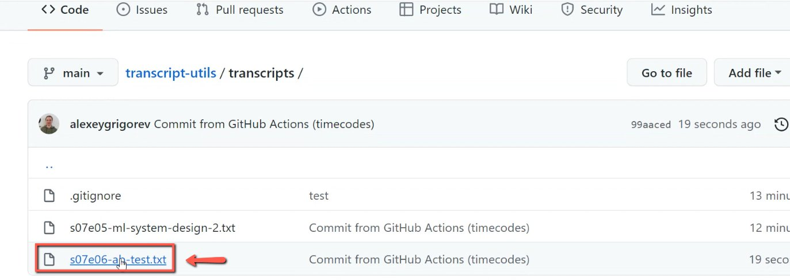
    <!-- sop-caption-start -->
    This screenshot matters for checking the editing, transcript, or timestamp workflow at this point; look for the highlighted area or visible control labeled s07s06-ab-test.txt. Use that match to verify the screen state, then complete the step described above.
    <!-- sop-caption-end -->
    <!-- sop-screenshot-end -->
<!-- sop-step-end -->

<!-- sop-step-start id=10 -->
10. Then, copy the transcript with the timecodes provided.

    <!-- sop-screenshot-start -->
    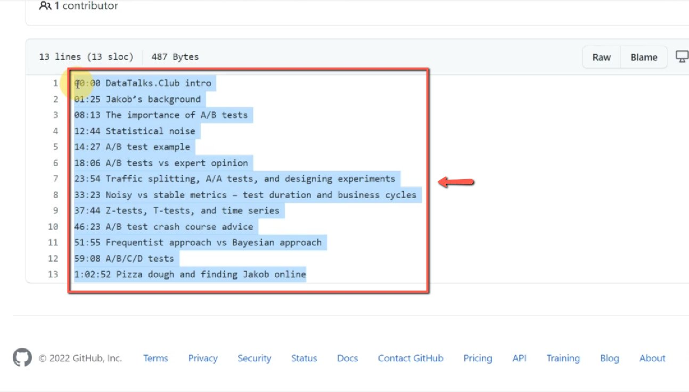
    <!-- sop-caption-start -->
    This screenshot matters for capturing or placing the correct link information; look for the highlighted area or visible control labeled transcript with the timecodes provided. Use that match to verify the screen state, then complete the step described above.
    <!-- sop-caption-end -->
    <!-- sop-screenshot-end -->

    Note that it also creates the transcript – see [Adding Transcripts to Podcast Episodes](https://docs.google.com/document/d/1wMjTuAtHWf4ibuqqUyPs0kgJqio1Acq4BvbqknKCJC0/edit) to add it to the website
<!-- sop-step-end -->

<!-- sop-step-start id=11 -->
11. Afterward, go to DataTalks.Club's YouTube channel and select the podcast video.

    <!-- sop-screenshot-start -->
    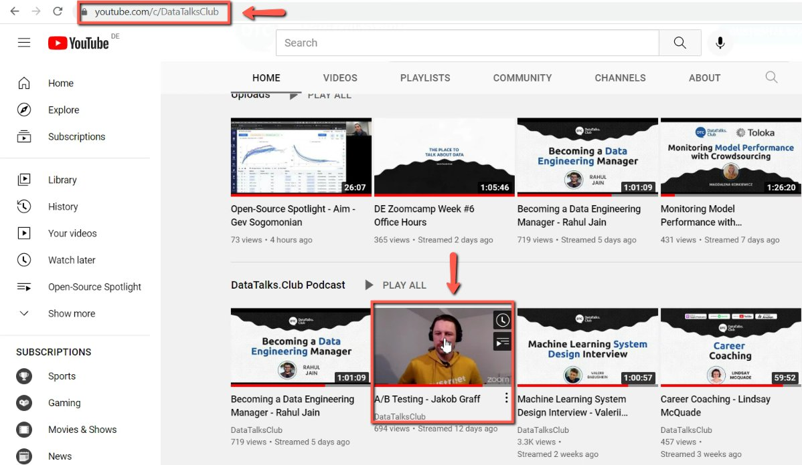
    <!-- sop-caption-start -->
    This screenshot matters for confirming the process is on the expected screen before the next action; look for the highlighted area or visible control labeled DataTalks. Use that match to verify the screen state, then complete the step described above.
    <!-- sop-caption-end -->
    <!-- sop-screenshot-end -->
<!-- sop-step-end -->

<!-- sop-step-start id=12 -->
12. Click on "Edit Video" under the YouTube video beside "Analytics"

    <!-- sop-screenshot-start -->
    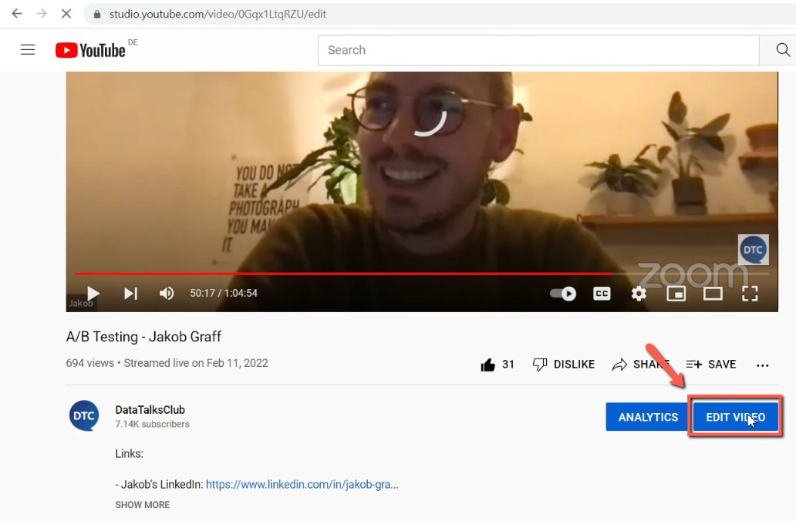
    <!-- sop-caption-start -->
    This screenshot matters for checking the editing, transcript, or timestamp workflow at this point; look for the highlighted area or visible control labeled Edit Video. Use that match to verify the screen state, then complete the step described above.
    <!-- sop-caption-end -->
    <!-- sop-screenshot-end -->
<!-- sop-step-end -->

<!-- sop-step-start id=13 -->
13. And then, paste the timecodes of the podcast event

    <!-- sop-screenshot-start -->
    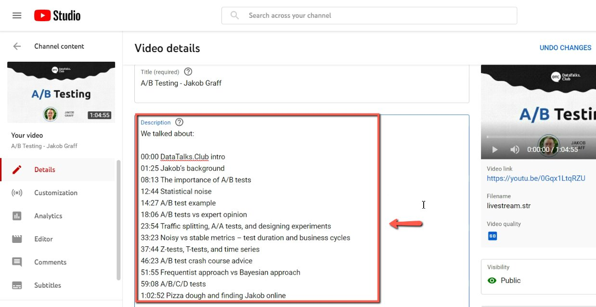
    <!-- sop-caption-start -->
    This screenshot matters for capturing or placing the correct link information; look for the highlighted area or visible control labeled timecodes of the podcast event. Use that match to verify the screen state, then complete the step described above.
    <!-- sop-caption-end -->
    <!-- sop-screenshot-end -->
<!-- sop-step-end -->

<!-- sop-group-end -->

<!-- sop-group-start: "Spotify for podcasters" -->
### Spotify for podcasters

<!-- sop-prose-start -->
TODO:

- This should go to a separate document. And instead of update, we should describe how to create an event with these timestamps
<!-- sop-prose-end -->

<!-- sop-step-start id=14 -->
14. To add the outline on the Anchor podcast, open [anchor. fm](https://anchor.fm/) and click on "Episodes"

    <!-- sop-screenshot-start -->
    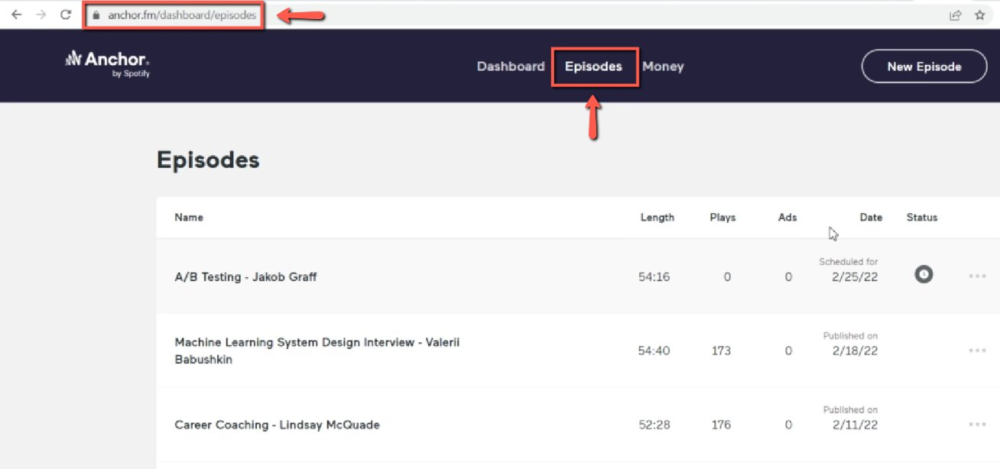
    <!-- sop-caption-start -->
    This screenshot matters for confirming the process is on the expected screen before the next action; look for the highlighted area or visible control labeled Episodes. Use that match to verify the screen state, then complete the step described above.
    <!-- sop-caption-end -->
    <!-- sop-screenshot-end -->
<!-- sop-step-end -->

<!-- sop-step-start id=15 -->
15. After, click the podcast episode.

    <!-- sop-screenshot-start -->
    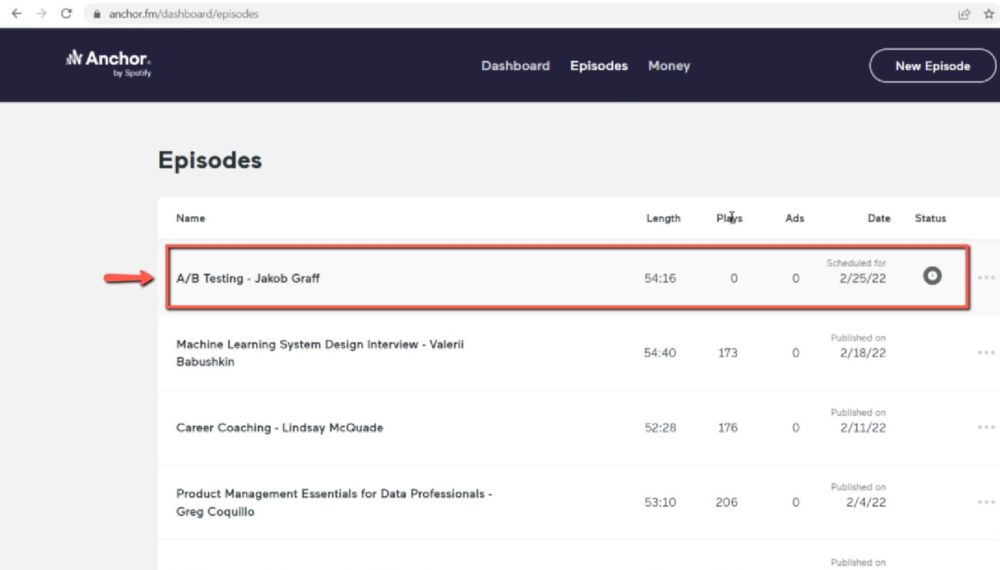
    <!-- sop-caption-start -->
    This screenshot matters for confirming the process is on the expected screen before the next action; look for the highlighted area or visible control labeled podcast episode. Use that match to verify the screen state, then complete the step described above.
    <!-- sop-caption-end -->
    <!-- sop-screenshot-end -->
<!-- sop-step-end -->

<!-- sop-step-start id=16 -->
16. Once you are in the podcast episode, tap on the pen tool icon.

    <!-- sop-screenshot-start -->
    
    <!-- sop-caption-start -->
    This screenshot matters for confirming the process is on the expected screen before the next action; look for the highlighted area or matching UI state shown in the image. Use it to verify the screen state, then complete the step described above.
    <!-- sop-caption-end -->
    <!-- sop-screenshot-end -->
<!-- sop-step-end -->

<!-- sop-step-start id=17 -->
17. After tapping, you can now paste the outline of the podcast and click

    <!-- sop-screenshot-start -->
    
    <!-- sop-caption-start -->
    This screenshot matters for capturing or placing the correct link information; look for the highlighted area or visible control labeled outline of the podcast and click. Use that match to verify the screen state, then complete the step described above.
    <!-- sop-caption-end -->
    <!-- sop-screenshot-end -->
<!-- sop-step-end -->

<!-- sop-step-start id=18 -->
18. After reviewing the necessary changes and edits, click on "Update episode"

    <!-- sop-screenshot-start -->
    
    <!-- sop-caption-start -->
    This screenshot matters for checking the editing, transcript, or timestamp workflow at this point; look for the highlighted area or visible control labeled Update episode. Use that match to verify the screen state, then complete the step described above.
    <!-- sop-caption-end -->
    <!-- sop-screenshot-end -->
<!-- sop-step-end -->

<!-- sop-group-end -->
<!-- sop-section-end -->

<!-- sop-section-start: validation -->
## Validation

-
<!-- sop-section-end -->

<!-- sop-section-start: troubleshooting -->
## Troubleshooting

-
<!-- sop-section-end -->

<!-- sop-section-start: references -->
## References

-
<!-- sop-section-end -->
