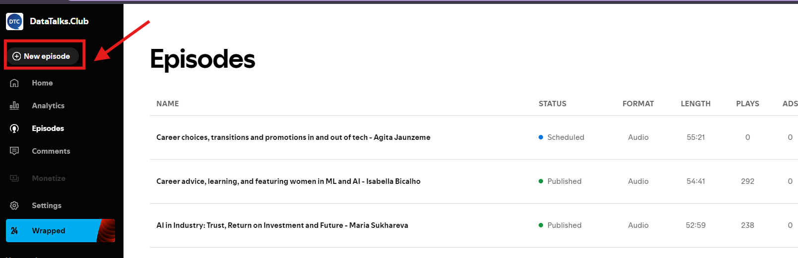
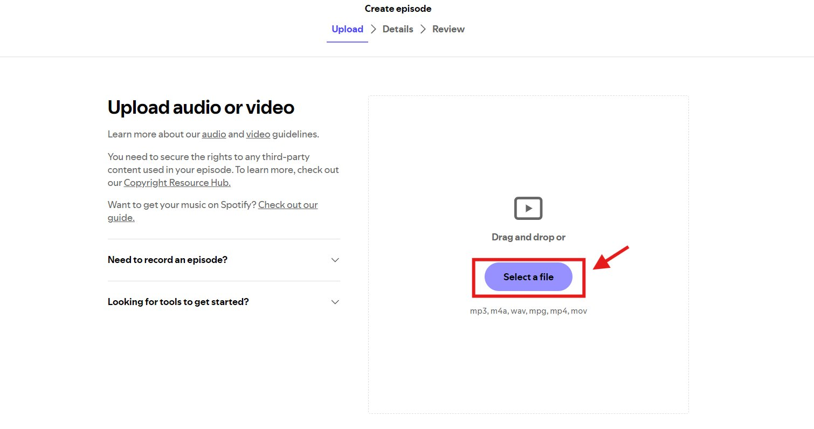
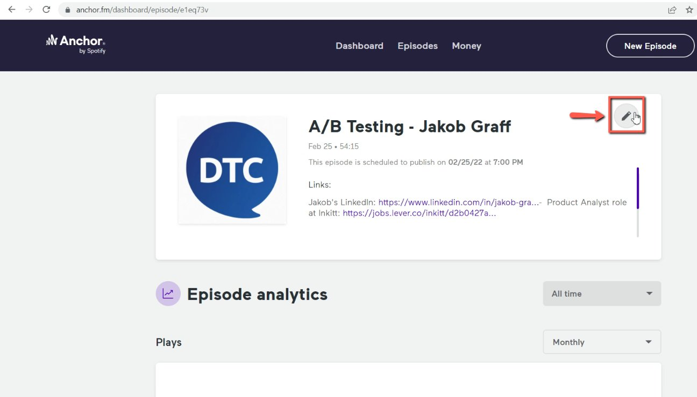
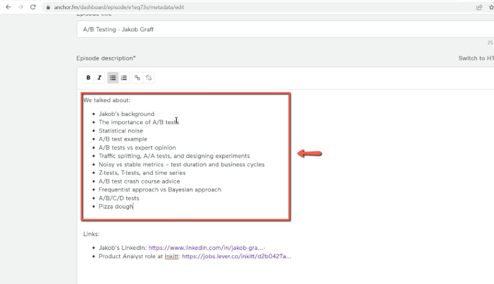
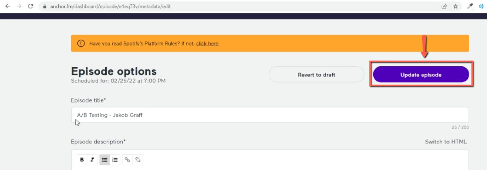

# How to create an episode on Spotify for Podcasters

<!-- sop-section-start: summary -->
## Summary

- Purpose: Create or update a podcast episode in Spotify for Podcasters.
- Outcome: The episode audio and outline are added and the episode is updated.
- Trigger: An edited podcast audio file is ready for Spotify.
- Frequency: Per podcast episode.
<!-- sop-section-end -->

<!-- sop-section-start: prerequisites -->
## Prerequisites

- Access: Spotify for Podcasters and Dropbox.
- Tools: Spotify for Podcasters, Dropbox.
- Inputs: Edited audio file, episode outline, title, and description.

TODO:

- Move the anchor.fm part in a separate document and update it for Spotify for Podcasters. In the new document, link this one
<!-- sop-section-end -->

<!-- sop-section-start: procedure -->
## Procedure

<!-- sop-group-start: "Spotify for podcasters" -->
### Spotify for podcasters

<!-- sop-prose-start -->
TODO:

- This should go to a separate document. And instead of update, we should describe how to create an event with these timestamps
<!-- sop-prose-end -->

<!-- sop-step-start id=1 -->
1.  To add the outline on the Spotify podcast, open [https://creators.spotify.com/pod/dashboard/episodes](https://creators.spotify.com/pod/dashboard/episodes) and click on "New Episode"

    <!-- sop-screenshot-start -->
    
    <!-- sop-caption-start -->
    This screenshot matters for confirming the process is on the expected screen before the next action; look for the highlighted area or visible control labeled New Episode. Use that match to verify the screen state, then complete the step described above.
    <!-- sop-caption-end -->
    <!-- sop-screenshot-end -->
<!-- sop-step-end -->

<!-- sop-step-start id=2 -->
2.  After, download the edited podcast on [dropbox](https://www.dropbox.com/home) and upload the file on spotify.

    <!-- sop-screenshot-start -->
    
    <!-- sop-caption-start -->
    This screenshot matters for confirming the download or export step is using the right option; look for the highlighted area or matching UI state shown in the image. Use it to verify the screen state, then complete the step described above.
    <!-- sop-caption-end -->
    <!-- sop-screenshot-end -->
<!-- sop-step-end -->

<!-- sop-step-start id=3 -->
3.  Once you are in the podcast episode, tap on the pen tool icon.

    <!-- sop-screenshot-start -->
    
    <!-- sop-caption-start -->
    This screenshot matters for confirming the process is on the expected screen before the next action; look for the highlighted area or matching UI state shown in the image. Use it to verify the screen state, then complete the step described above.
    <!-- sop-caption-end -->
    <!-- sop-screenshot-end -->
<!-- sop-step-end -->

<!-- sop-step-start id=4 -->
4.  After tapping, you can now paste the outline of the podcast and click

    <!-- sop-screenshot-start -->
    
    <!-- sop-caption-start -->
    This screenshot matters for capturing or placing the correct link information; look for the highlighted area or visible control labeled outline of the podcast and click. Use that match to verify the screen state, then complete the step described above.
    <!-- sop-caption-end -->
    <!-- sop-screenshot-end -->
<!-- sop-step-end -->

<!-- sop-step-start id=5 -->
5.  After reviewing the necessary changes and edits, click on "Update episode"

    <!-- sop-screenshot-start -->
    
    <!-- sop-caption-start -->
    This screenshot matters for checking the editing, transcript, or timestamp workflow at this point; look for the highlighted area or visible control labeled Update episode. Use that match to verify the screen state, then complete the step described above.
    <!-- sop-caption-end -->
    <!-- sop-screenshot-end -->
<!-- sop-step-end -->

<!-- sop-group-end -->
<!-- sop-section-end -->

<!-- sop-section-start: validation -->
## Validation

-
<!-- sop-section-end -->

<!-- sop-section-start: troubleshooting -->
## Troubleshooting

-
<!-- sop-section-end -->

<!-- sop-section-start: references -->
## References

-
<!-- sop-section-end -->
