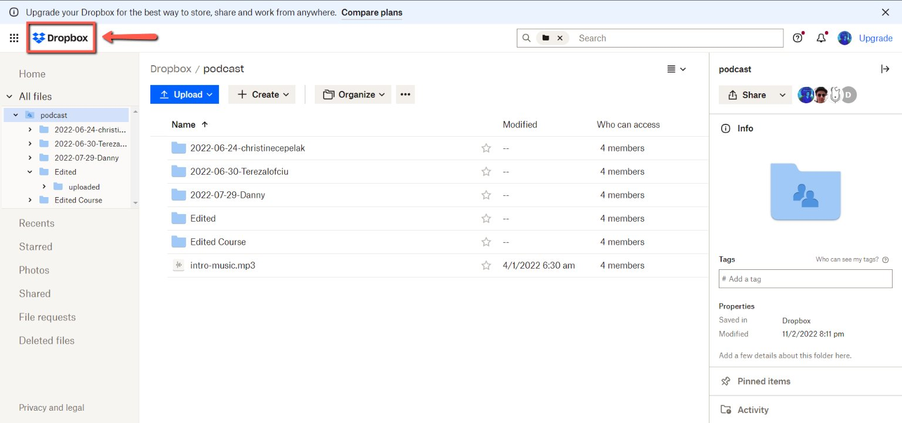
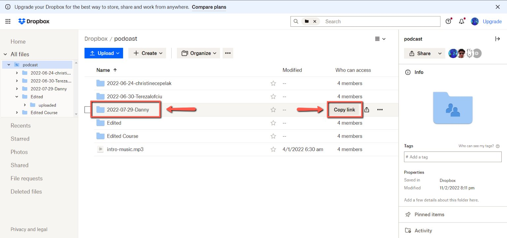
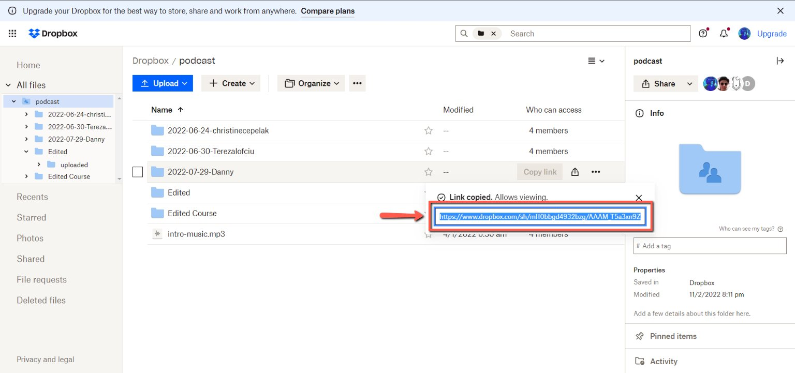

# How to send a recorded podcast episode to a freelancer for a transcription

<!-- sop-section-start: summary -->
## Summary

- Purpose: Send recorded podcast files to the transcription freelancer.
- Outcome: The freelancer receives Dropbox and YouTube links for transcription.
- Trigger: A podcast recording is edited and ready for transcription.
- Frequency: Per podcast episode needing transcription.
<!-- sop-section-end -->

<!-- sop-section-start: prerequisites -->
## Prerequisites

- Access: Podcast Dropbox folder, YouTube link, and email.
- Tools: Dropbox, email, YouTube.
- Inputs: Podcast Dropbox link, YouTube link, freelancer email, and email template.
<!-- sop-section-end -->

<!-- sop-section-start: procedure -->
## Procedure

<!-- sop-prose-start -->
How to send a recorded podcast episode to a freelancer for a transcription
This procedure will show you the steps on how to share the dropbox links with Pavel (in addition to YouTube links)

Freelancer for transcription:

- Pavel: paxaishere@gmail.com

Step-by-step Instructions
<!-- sop-prose-end -->

<!-- sop-step-start id=1 -->
1.  The first thing you need to do is open the [Dropbox podcast folder](https://www.dropbox.com/home/podcast).

    <!-- sop-screenshot-start -->
    
    <!-- sop-caption-start -->
    This screenshot matters for confirming the process is on the expected screen before the next action; look for the highlighted area or visible control labeled Dropbox podcast folder. Use that match to verify the screen state, then complete the step described above.
    <!-- sop-caption-end -->
    <!-- sop-screenshot-end -->
<!-- sop-step-end -->

<!-- sop-step-start id=2 -->
2.  Then, hover your mouse over the podcast and click the “Copy Link” button

    <!-- sop-screenshot-start -->
    
    <!-- sop-caption-start -->
    This screenshot matters for capturing or placing the correct link information; look for the highlighted area or visible control labeled Copy Link. Use that match to verify the screen state, then complete the step described above.
    <!-- sop-caption-end -->
    <!-- sop-screenshot-end -->
<!-- sop-step-end -->

<!-- sop-step-start id=3 -->
3.  After, copy the link and send it to Pavel through email, together with the YouTube Link.

    See Email [Template](https://docs.google.com/document/d/1j_Kgwfubx1kje1lwhCWp_3D7HTJkEIsdmtgVq8eogOU/edit?usp=sharing)

    Note: Make sure to send the YouTube link to Pavel after the video has been edited and processed

    You can use [scheduled emails](https://docs.google.com/document/d/1kViVB_GBHs1I4KyEmt7Y7Oi8cRFroYfykM0MRP3w6h4/edit?usp=sharing).

    <!-- sop-screenshot-start -->
    
    <!-- sop-caption-start -->
    This screenshot matters for confirming the upload, publishing, or scheduling state before it becomes user-facing; look for the highlighted area or matching UI state shown in the image. Use it to verify the screen state, then complete the step described above.
    <!-- sop-caption-end -->
    <!-- sop-screenshot-end -->
<!-- sop-step-end -->
<!-- sop-section-end -->

<!-- sop-section-start: validation -->
## Validation

-
<!-- sop-section-end -->

<!-- sop-section-start: troubleshooting -->
## Troubleshooting

-
<!-- sop-section-end -->

<!-- sop-section-start: references -->
## References

-
<!-- sop-section-end -->
