# Making Corrections to the already uploaded podcast document to Airtable

<!-- sop-section-start: summary -->
## Summary

- Purpose: Correct a podcast transcript document after the website update workflow fails because the uploaded document has formatting or content issues.
- Outcome: The corrected transcript document is re-uploaded to Airtable and the GitHub workflow can be rerun.
- Trigger: The `generate_all` GitHub workflow fails after a podcast document was uploaded to Airtable.
- Frequency: Whenever an uploaded podcast transcript causes a website update workflow error.
<!-- sop-section-end -->

<!-- sop-section-start: prerequisites -->
## Prerequisites

- Access: GitHub Actions, the podcast transcript folder, Airtable DTC workspace, and the podcast table.
- Tools: GitHub Actions, ChatGPT, Google Drive, Google Docs, Airtable.
- Inputs: Failed workflow error message, podcast transcript document, corrected `.docx` export, and the Airtable podcast record.

This process document will show you how to make corrections to the already uploaded podcast document to Airtable!
<!-- sop-section-end -->

<!-- sop-section-start: procedure -->
## Procedure

<!-- sop-step-start id=1 -->
1.  After running a [Github workflow](update-the-website-with-the-information-from-forms.md), and you encounter an error, click on the failed job to view the details.

    <!-- sop-screenshot-start -->
    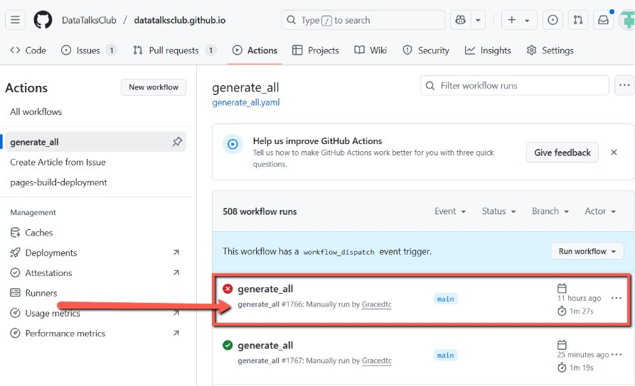
    <!-- sop-caption-start -->
    The screenshot shows the GitHub Actions workflow with a failed job. Opening the failed entry is the first step to finding which podcast transcript caused the website update error.
    <!-- sop-caption-end -->
    <!-- sop-screenshot-end -->
<!-- sop-step-end -->

<!-- sop-step-start id=2 -->
2.  Click on 'generate_all' to view the workflow details and identify what went wrong.

    <!-- sop-screenshot-start -->
    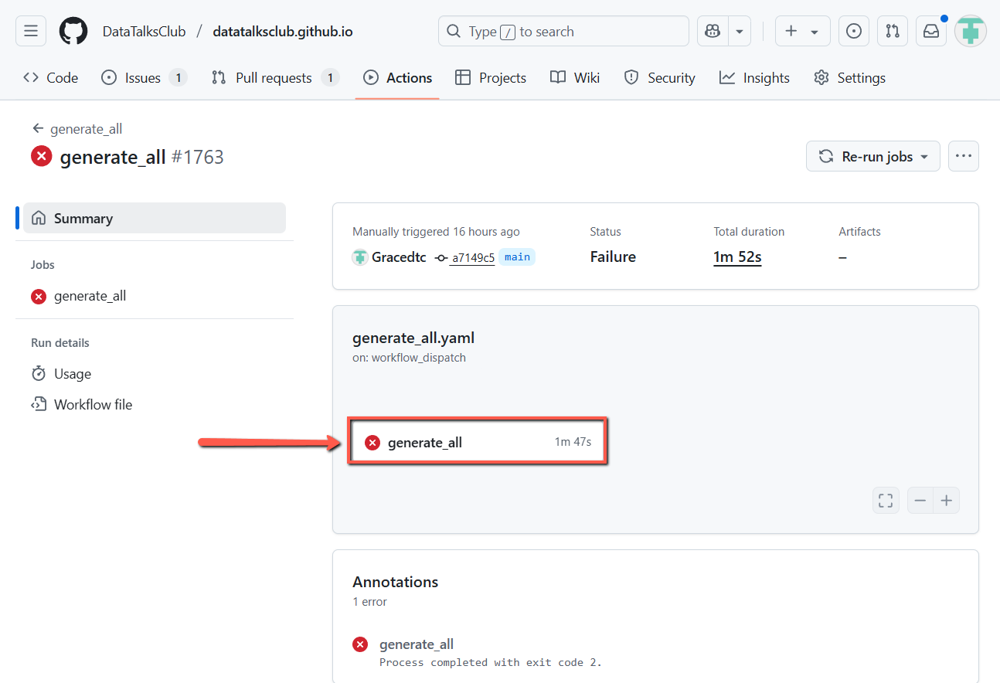
    <!-- sop-caption-start -->
    The screenshot shows the generate_all job in the workflow run. This job contains the logs needed to identify the transcript parsing or formatting failure.
    <!-- sop-caption-end -->
    <!-- sop-screenshot-end -->
<!-- sop-step-end -->

<!-- sop-step-start id=3 -->
3.  Copy the entire error message, open ChatGPT, and paste it to get an explanation of the issue.

    Note: In this error message, the issue is related to the document attached specifically, the podcast transcript.

    <!-- sop-screenshot-start -->
    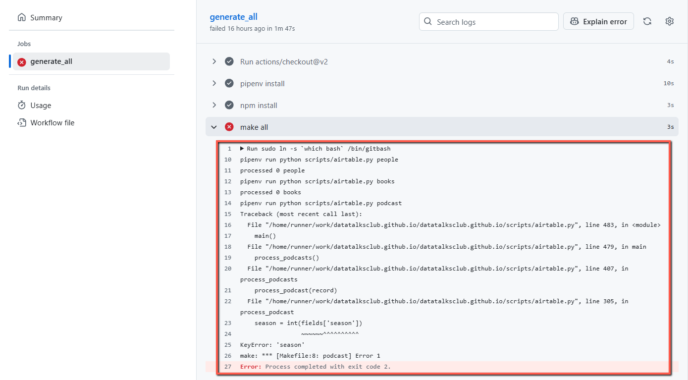
    <!-- sop-caption-start -->
    The screenshot shows the GitHub log output with the error message. Copying the full message preserves the file name and stack details needed for diagnosis.
    <!-- sop-caption-end -->
    <!-- sop-screenshot-end -->
<!-- sop-step-end -->

<!-- sop-step-start id=4 -->
4.  Go to the [transcript folder](https://drive.google.com/drive/folders/1khibztKmYTdyMBRjaQeiaNHXuE0A2HUw), find and click on the podcast transcript with the error.

    <!-- sop-screenshot-start -->
    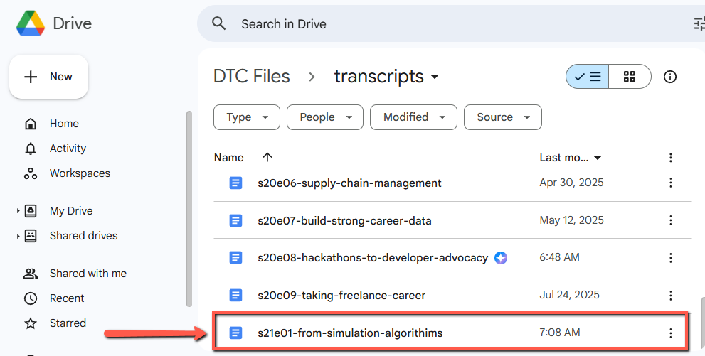
    <!-- sop-caption-start -->
    The screenshot shows the transcript folder where the problematic podcast document is stored. Use the filename from the workflow error to open the matching transcript.
    <!-- sop-caption-end -->
    <!-- sop-screenshot-end -->
<!-- sop-step-end -->

<!-- sop-step-start id=5 -->
5.  Check the formatting and font. Ensure the following are correctly formatted. Go to the "[Creating Podcast Transcription](creating-podcast-transcription-document.md)" document and recheck the transcript to make sure it follows the process.

    Timecode Titles

    Use Heading 2 for section titles, and do not include timestamps in the title line.

    ✖️ 00:00 Orell’s career and move to freelancing

    ✅ Orell’s career and move to freelancing

    Timestamps

    Speaker Name

    Transcript Content

    Note: Sometimes, ChatGPT may not follow the prompt correctly while generating the transcript. Make sure to double-check the output and ensure the formatting is followed. If needed, you can redo the transcript to meet the required format.

    <!-- sop-screenshot-start -->
    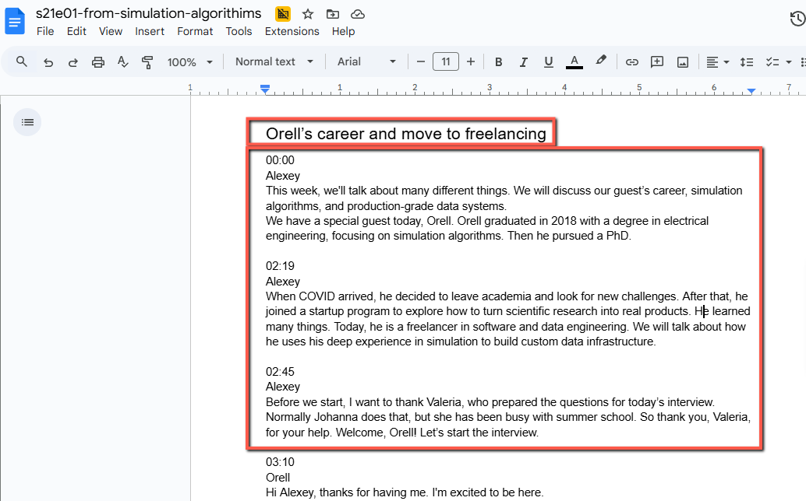
    <!-- sop-caption-start -->
    The screenshot shows the transcript document with headings, timestamps, speaker names, and transcript text. It illustrates the formatting checks needed before exporting the corrected file.
    <!-- sop-caption-end -->
    <!-- sop-screenshot-end -->
<!-- sop-step-end -->

<!-- sop-step-start id=6 -->
6.  Once done, click on “File,” then “Download,” and select “Microsoft Word (.docx).”

    <!-- sop-screenshot-start -->
    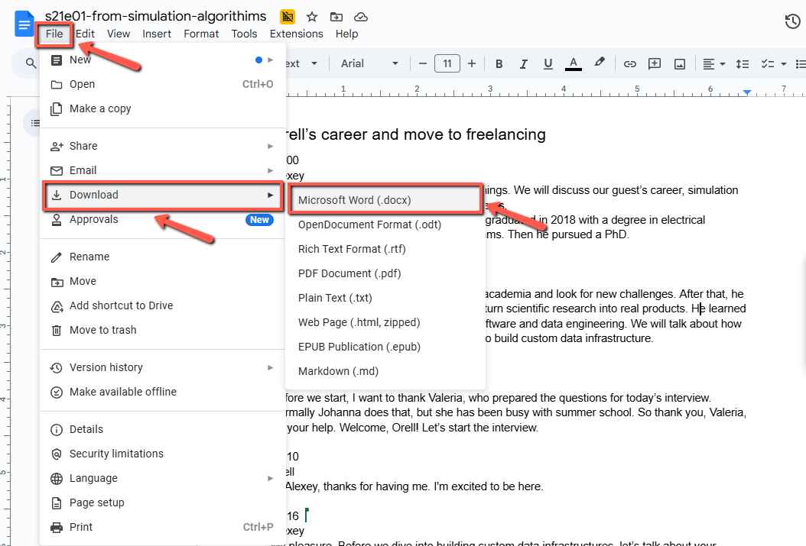
    <!-- sop-caption-start -->
    The screenshot shows the Google Docs download menu with Microsoft Word (.docx) selected. Exporting this format creates the replacement file to upload back into Airtable.
    <!-- sop-caption-end -->
    <!-- sop-screenshot-end -->
<!-- sop-step-end -->

<!-- sop-step-start id=7 -->
7.  Go and log into [Airtable.](https://airtable.com/) Click on “DTC org.”

    Note: If you don’t see it at the top, scroll down through the workspace list, it’s sorted by most recently opened, so it might be further down.

    <!-- sop-screenshot-start -->
    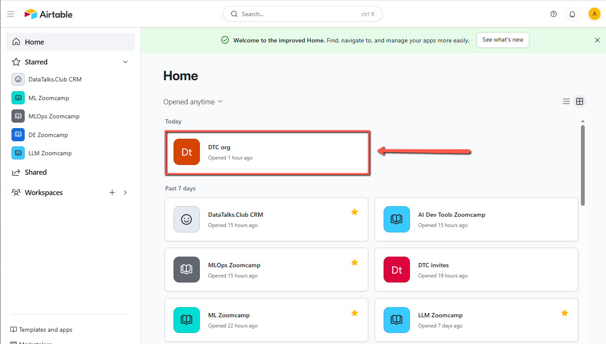
    <!-- sop-caption-start -->
    The screenshot shows the Airtable workspace list with DTC org selected. This confirms you are entering the shared base that stores podcast submissions.
    <!-- sop-caption-end -->
    <!-- sop-screenshot-end -->
<!-- sop-step-end -->

<!-- sop-step-start id=8 -->
8.  Select the “podcast” Tab.

    <!-- sop-screenshot-start -->
    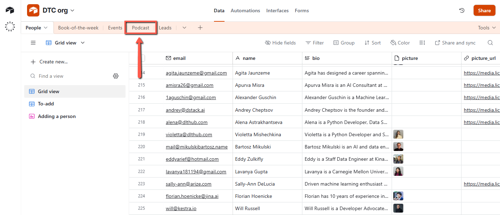
    <!-- sop-caption-start -->
    The screenshot shows the podcast table tab in Airtable. Selecting it narrows the records to podcast entries and their transcript attachments.
    <!-- sop-caption-end -->
    <!-- sop-screenshot-end -->
<!-- sop-step-end -->

<!-- sop-step-start id=9 -->
9.  Scroll down to find the podcast entry with the submitted form that has an error. Once located, use the horizontal scroll bar at the bottom to drag right and view more details in that row.

    <!-- sop-screenshot-start -->
    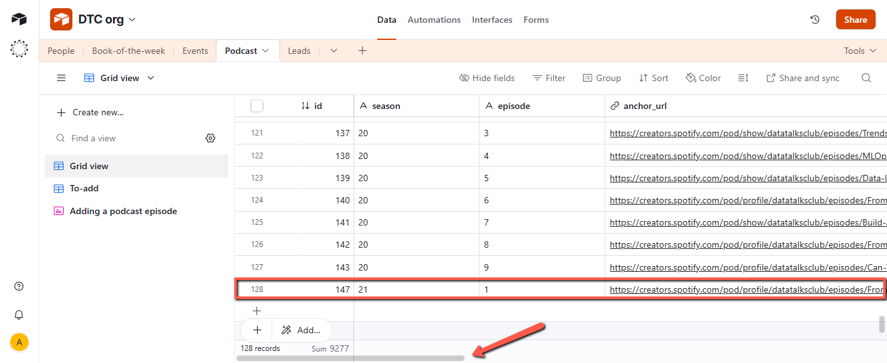
    <!-- sop-caption-start -->
    The screenshot shows the podcast table row for the submitted form and the horizontal scroll area. It helps locate the record with the transcript attachment that needs replacement.
    <!-- sop-caption-end -->
    <!-- sop-screenshot-end -->
<!-- sop-step-end -->

<!-- sop-step-start id=10 -->
10. Click on the existing transcript.

    <!-- sop-screenshot-start -->
    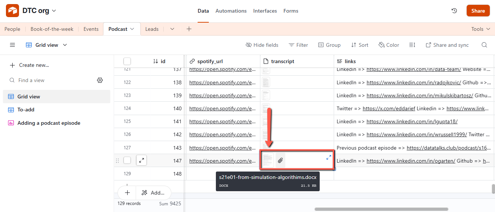
    <!-- sop-caption-start -->
    The screenshot shows the existing transcript attachment in the Airtable record. Opening it lets you manage the file before uploading the corrected version.
    <!-- sop-caption-end -->
    <!-- sop-screenshot-end -->
<!-- sop-step-end -->

<!-- sop-step-start id=11 -->
11. Remove the attachment by clicking the trash bin or delete icon.

    <!-- sop-screenshot-start -->
    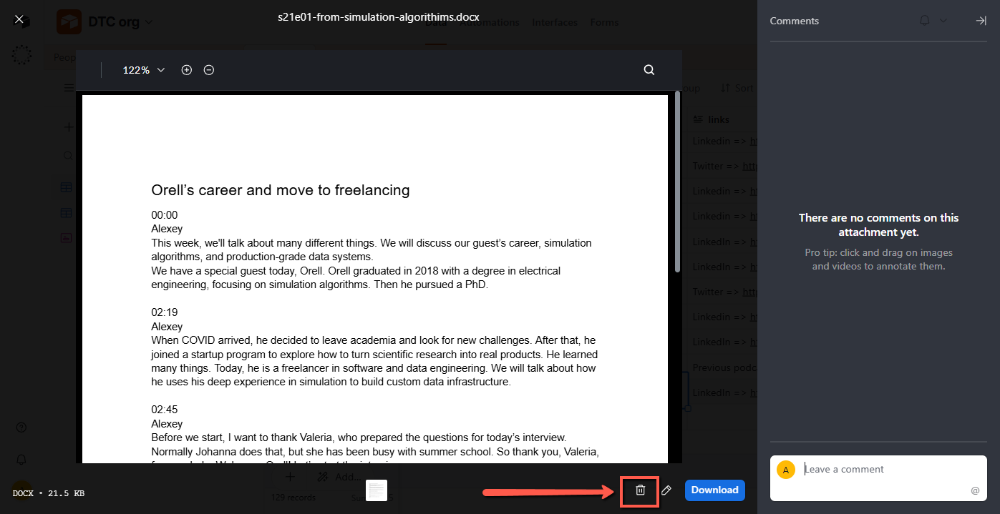
    <!-- sop-caption-start -->
    The screenshot shows the attachment preview with the delete control. Removing the old file prevents Airtable from keeping the transcript version that caused the workflow failure.
    <!-- sop-caption-end -->
    <!-- sop-screenshot-end -->
<!-- sop-step-end -->

<!-- sop-step-start id=12 -->
12. Click the attachment icon.

    <!-- sop-screenshot-start -->
    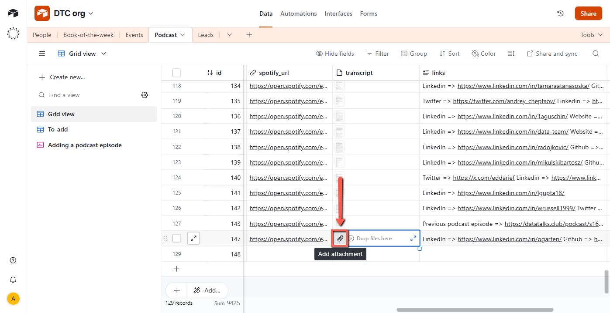
    <!-- sop-caption-start -->
    The screenshot shows the empty or editable attachment field in the Airtable podcast record. The attachment icon is where the corrected transcript upload begins.
    <!-- sop-caption-end -->
    <!-- sop-screenshot-end -->
<!-- sop-step-end -->

<!-- sop-step-start id=13 -->
13. Click "browse files”or drag the transcript Word document from your file manager into the field.

    <!-- sop-screenshot-start -->
    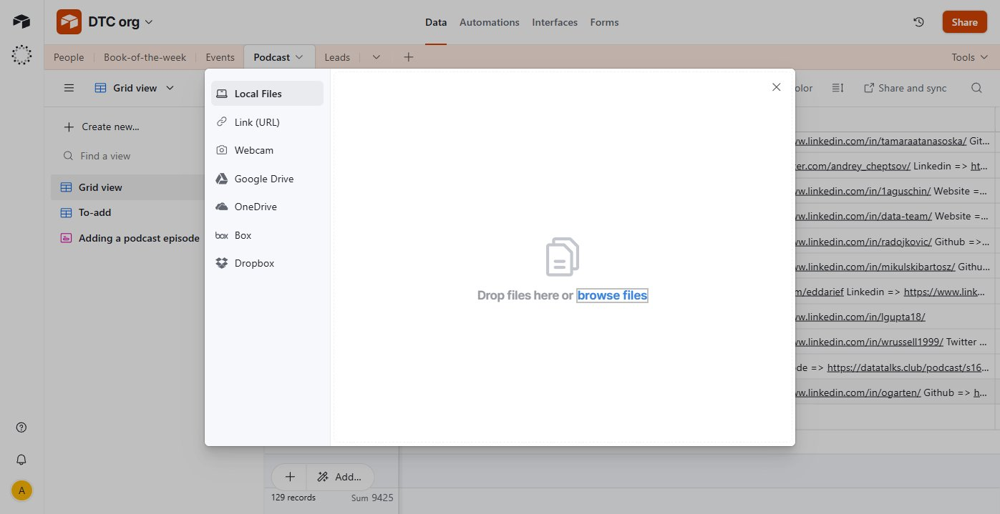
    <!-- sop-caption-start -->
    The screenshot shows Airtable's file upload dialog with the browse files option. Use it to attach the corrected .docx transcript to the podcast record.
    <!-- sop-caption-end -->
    <!-- sop-screenshot-end -->
<!-- sop-step-end -->

<!-- sop-step-start id=14 -->
14. After replacing the transcript document, go back to [GitHub](https://github.com/DataTalksClub/datatalksclub.github.io/actions) and click on "Re-run jobs", then select "Re-run all jobs".

    Note: It's best to wait a few minutes before re-running the GitHub workflow. This allows the system to register the updated transcript and ensures any background changes are fully saved before triggering the job again.

    <!-- sop-screenshot-start -->
    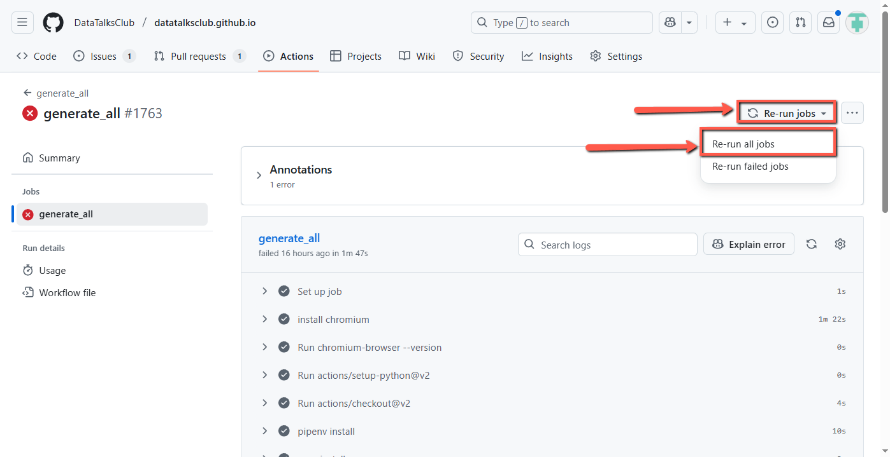
    <!-- sop-caption-start -->
    The screenshot shows GitHub Actions with the Re-run jobs menu open. Re-running all jobs checks whether the corrected Airtable attachment resolves the workflow error.
    <!-- sop-caption-end -->
    <!-- sop-screenshot-end -->

    Note: If the workflow shows a ✅ green check mark, it means everything ran successfully and no further action is needed.

    However, if it shows a ❌ error again, repeat the process from Step 1.
    If the error persists or you're unsure how to proceed, feel free to ping Alexey on Telegram to let him know and to ask for assistance.

    <!-- sop-screenshot-start -->
    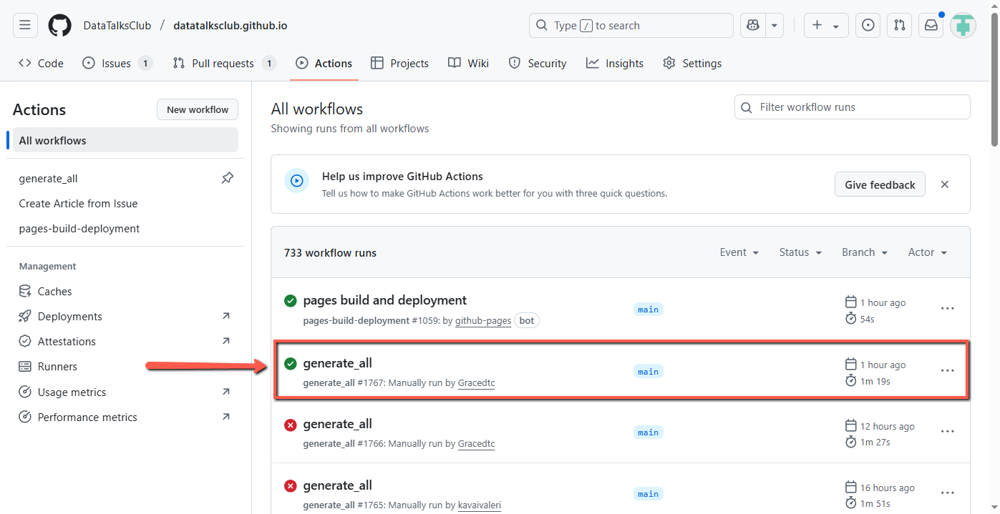
    <!-- sop-caption-start -->
    The screenshot shows the workflow status after rerunning the job. Use the green check or repeated failure state to decide whether the correction is complete or needs escalation.
    <!-- sop-caption-end -->
    <!-- sop-screenshot-end -->
<!-- sop-step-end -->
<!-- sop-section-end -->

<!-- sop-section-start: validation -->
## Validation

-
<!-- sop-section-end -->

<!-- sop-section-start: troubleshooting -->
## Troubleshooting

-
<!-- sop-section-end -->

<!-- sop-section-start: references -->
## References

-
<!-- sop-section-end -->
