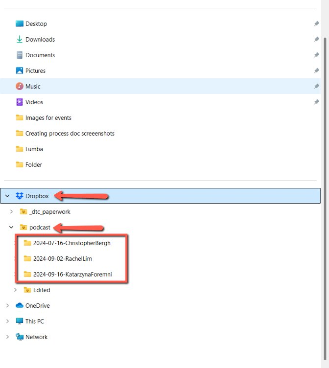
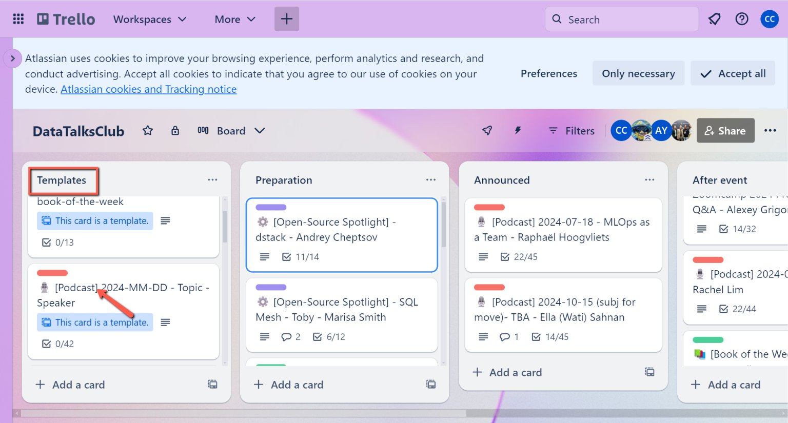
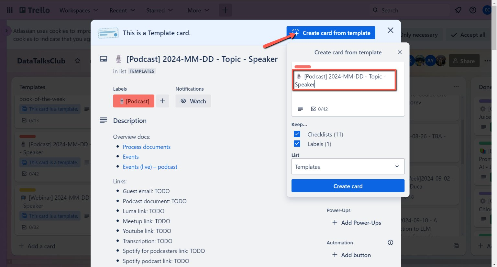

# Managing Podcast Workflow

<!-- sop-section-start: summary -->
## Summary

- Purpose:
- Outcome:
- Trigger: After the streaming of podcast
- Frequency:
<!-- sop-section-end -->

<!-- sop-section-start: prerequisites -->
## Prerequisites

- Access:
- Tools:
- Inputs:
<!-- sop-section-end -->

<!-- sop-section-start: procedure -->
## Procedure

<!-- sop-group-start: "Title 1" -->
### Title 1

<!-- sop-step-start id=1 -->
1.  During the podcast, the recording is saved on both YouTube and Alexey's computer. After the podcast ends, the recording from Alexey's computer is uploaded to Dropbox in the following location: Dropbox \> Podcast \> Speaker’s Folder.

    <!-- sop-screenshot-start -->
    
    <!-- sop-caption-start -->
    This screenshot matters for confirming the download or export step is using the right option; look for the highlighted area or matching UI state shown in the image. Use it to verify the screen state, then complete the step described above.
    <!-- sop-caption-end -->
    <!-- sop-screenshot-end -->
<!-- sop-step-end -->

<!-- sop-step-start id=2 -->
2.  When you go to the [DataTalksClub Trello](https://trello.com/b/qVB6fAUG/datatalksclub) board, you'll find all the event cards. Create a template for the podcast event and follow the checklists in order. To do that, on the left side of the screen under the “Template” column look for the “Podcast” card.

    <!-- sop-screenshot-start -->
    
    <!-- sop-caption-start -->
    This screenshot matters for confirming the correct record, field, or status before updating the workflow; look for the highlighted area or visible control labeled DataTalksClub Trello board. Use that match to verify the screen state, then complete the step described above.
    <!-- sop-caption-end -->
    <!-- sop-screenshot-end -->
<!-- sop-step-end -->

<!-- sop-step-start id=3 -->
3.  Click on the podcast template '🎙️ \[Podcast\] 2024-MM-DD - Topic - Speaker.' Select 'Create card from template,' then fill in the agreed date and the speaker's name. If the title hasn't been decided yet, you can type 'TBA' for now.

    <!-- sop-screenshot-start -->
    
    <!-- sop-caption-start -->
    This screenshot matters for checking the editing, transcript, or timestamp workflow at this point; look for the highlighted area or matching podcast template card. Use that match to verify the screen state, then complete the step described above.
    <!-- sop-caption-end -->
    <!-- sop-screenshot-end -->
<!-- sop-step-end -->

<!-- sop-step-start id=4 -->
4.  \<insert image\>
<!-- sop-step-end -->

<!-- sop-step-start id=5 -->
5.  \<insert image\>
<!-- sop-step-end -->

<!-- sop-step-start id=6 -->
6.  \<insert image\>
<!-- sop-step-end -->

<!-- sop-step-start id=7 -->
7.  \<insert image\>
<!-- sop-step-end -->

<!-- sop-group-end -->

<!-- sop-group-start: "Title 3" -->
### Title 3

<!-- sop-step-start id=8 -->
8.  \<insert image\>
<!-- sop-step-end -->

<!-- sop-step-start id=9 -->
9.  \<insert image\>
<!-- sop-step-end -->

<!-- sop-step-start id=10 -->
10. \<insert image\>
<!-- sop-step-end -->

<!-- sop-step-start id=11 -->
11. \<insert image\>
<!-- sop-step-end -->

<!-- sop-step-start id=12 -->
12. \<insert image\>
<!-- sop-step-end -->

<!-- sop-step-start id=13 -->
13. \<insert image\>
<!-- sop-step-end -->

<!-- sop-step-start id=14 -->
14. \<insert image\>
<!-- sop-step-end -->

<!-- sop-step-start id=15 -->
15. \<insert image\>
<!-- sop-step-end -->

<!-- sop-step-start id=16 -->
16. \<insert image\>
<!-- sop-step-end -->

<!-- sop-step-start id=17 -->
17. \<insert image\>
<!-- sop-step-end -->

<!-- sop-step-start id=18 -->
18. \<insert image\>
<!-- sop-step-end -->

<!-- sop-step-start id=19 -->
19. \<insert image\>
<!-- sop-step-end -->

<!-- sop-step-start id=20 -->
20. \<insert image\>

    Loom link:

    - TODO
<!-- sop-step-end -->

<!-- sop-group-end -->
<!-- sop-section-end -->

<!-- sop-section-start: validation -->
## Validation

-
<!-- sop-section-end -->

<!-- sop-section-start: troubleshooting -->
## Troubleshooting

-
<!-- sop-section-end -->

<!-- sop-section-start: references -->
## References

-
<!-- sop-section-end -->
