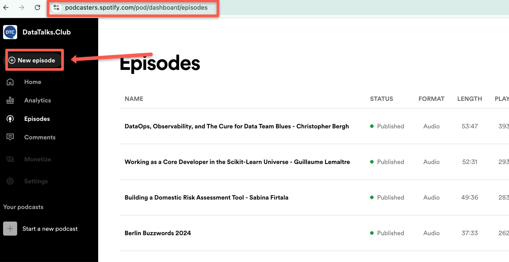
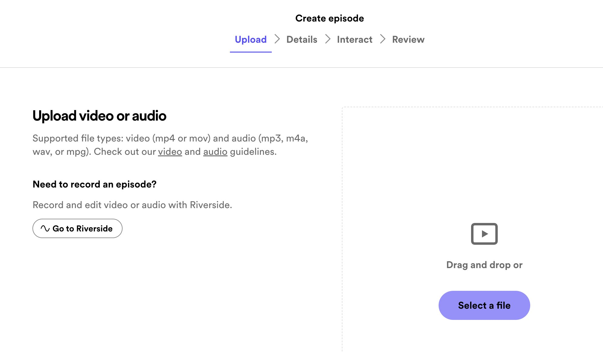
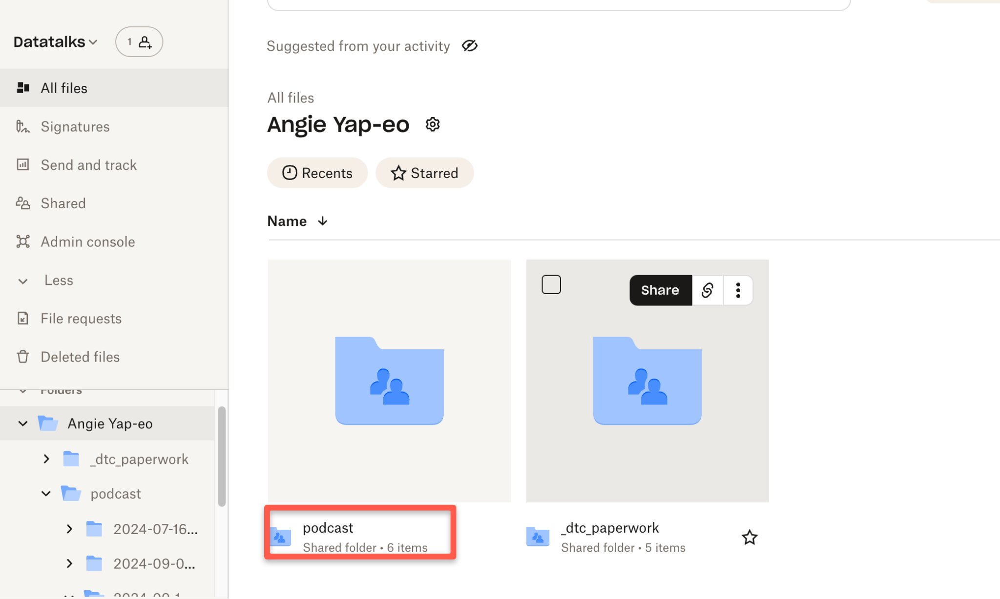
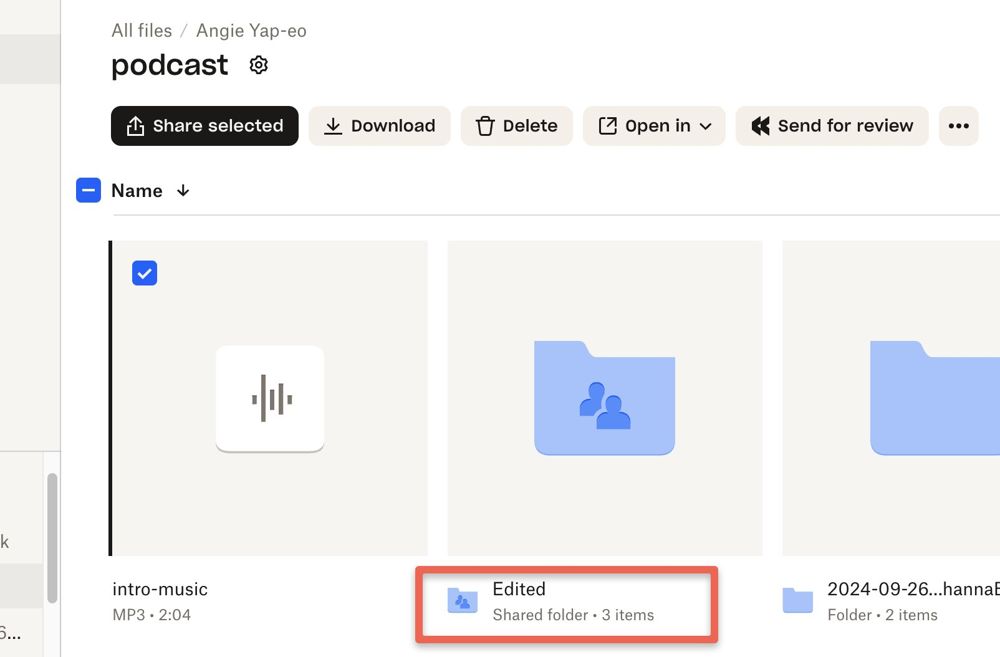
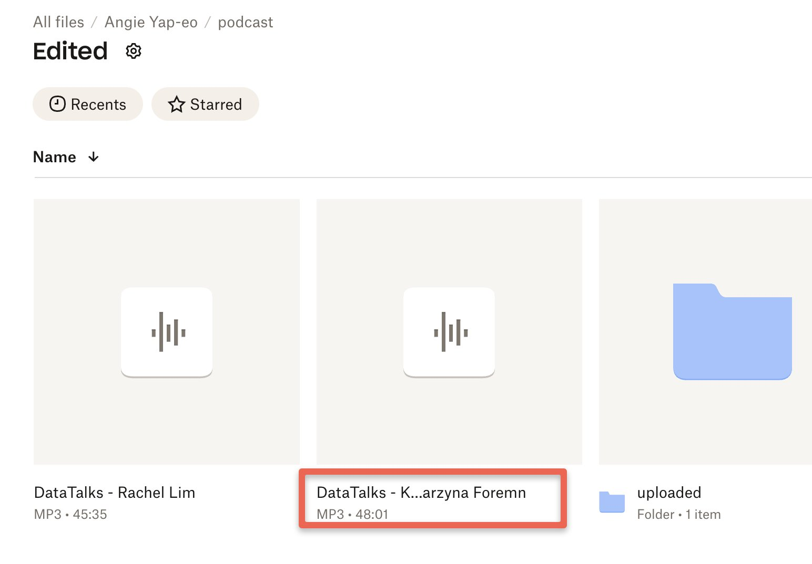
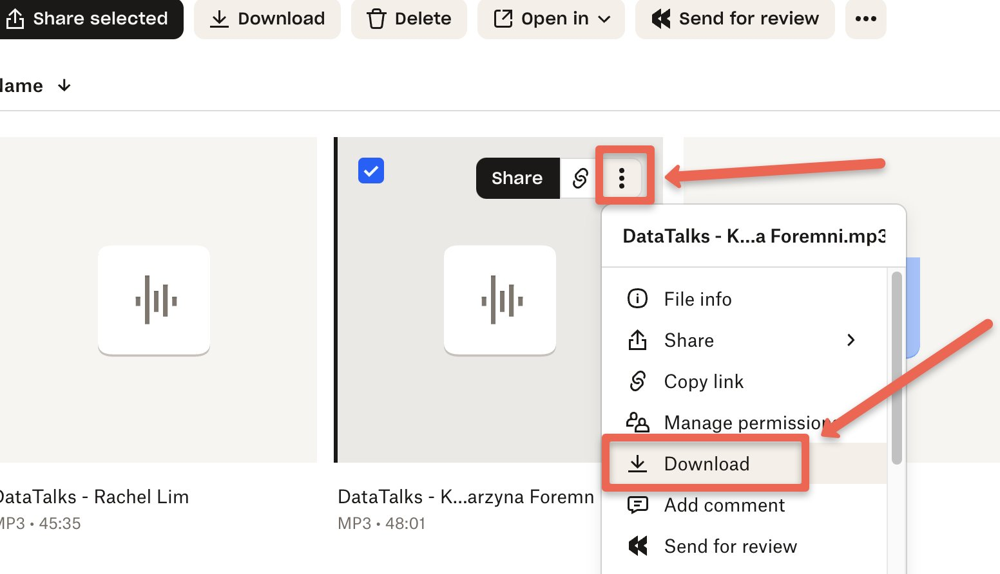
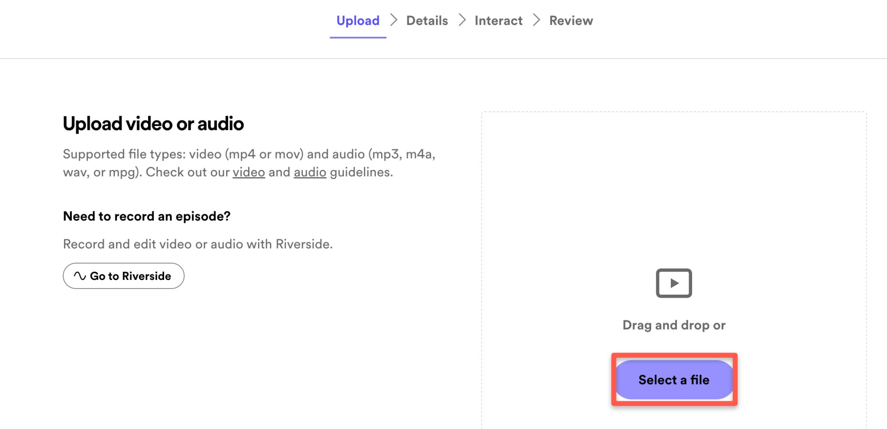
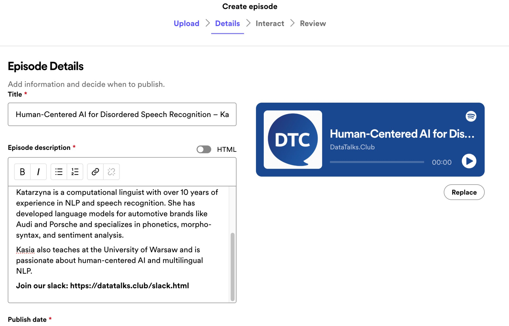
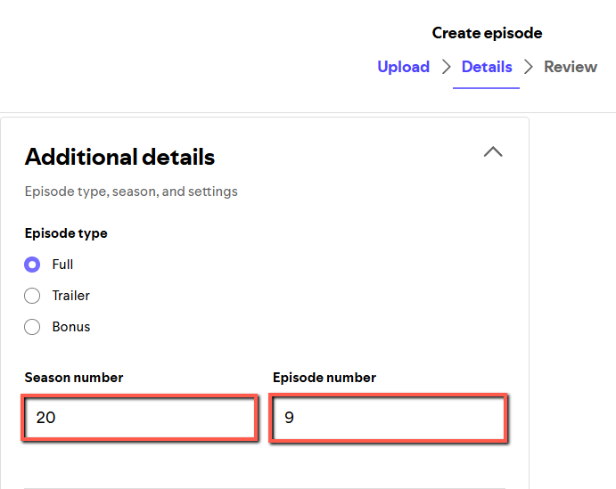
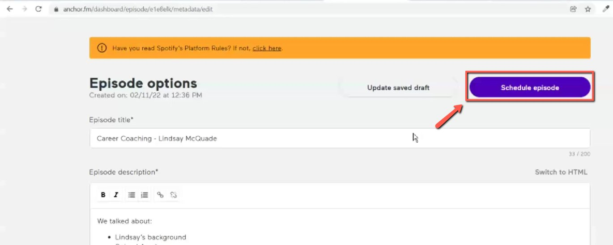

# Schedule podcast episodes with Spotify for podcaster

<!-- sop-section-start: summary -->
## Summary

- Purpose: Schedule a podcast episode in Spotify for Podcasters.
- Outcome: The edited podcast episode is uploaded and scheduled for release.
- Trigger: An edited podcast audio file is ready to publish.
- Frequency: Per podcast episode.
<!-- sop-section-end -->

<!-- sop-section-start: prerequisites -->
## Prerequisites

- Access: Spotify for Podcasters and podcast Dropbox folder.
- Tools: Spotify for Podcasters, Dropbox.
- Inputs: Edited podcast audio, title, description, cover image, and release date.
<!-- sop-section-end -->

<!-- sop-section-start: procedure -->
## Procedure

<!-- sop-prose-start -->
This procedure will show you the steps on how to schedule podcast episodes with Anchor.

TODO:

- ~~Update screenshots for spotify for podcasters~~

- Make all the steps explicit (I think some steps require clarification)

- Add the links to the dropbox folder – and if you don’t use the dropbox client, show how to use the web application for that

Step-by-step Instructions
<!-- sop-prose-end -->

<!-- sop-step-start id=1 -->
1.  The first thing you need to do is login to [Spotify for podcaster](https://anchor.fm/dashboard/analytics). Select "New episode" on the left-side menu.

    Note: Alexey invited you to Spotify during onboarding.

    <!-- sop-screenshot-start -->
    
    <!-- sop-caption-start -->
    This screenshot matters for confirming the process is on the expected screen before the next action; look for the highlighted area or matching UI state shown in the image. Use it to verify the screen state, then complete the step described above.
    <!-- sop-caption-end -->
    <!-- sop-screenshot-end -->
<!-- sop-step-end -->

<!-- sop-step-start id=2 -->
2.  It will take you to the Upload screen below.

    <!-- sop-screenshot-start -->
    
    <!-- sop-caption-start -->
    This screenshot matters for confirming the upload, publishing, or scheduling state before it becomes user-facing; look for the highlighted area or visible control labeled screen below. Use that match to verify the screen state, then complete the step described above.
    <!-- sop-caption-end -->
    <!-- sop-screenshot-end -->
<!-- sop-step-end -->

<!-- sop-step-start id=3 -->
3.  On another tab, open the DataTalks.Club's dropbox and click the "podcast" folder.

    <!-- sop-screenshot-start -->
    
    <!-- sop-caption-start -->
    This screenshot matters for confirming the process is on the expected screen before the next action; look for the highlighted area or visible control labeled podcast. Use that match to verify the screen state, then complete the step described above.
    <!-- sop-caption-end -->
    <!-- sop-screenshot-end -->
<!-- sop-step-end -->

<!-- sop-step-start id=4 -->
4.  Inside “podcast”, click "Edited".

    <!-- sop-screenshot-start -->
    
    <!-- sop-caption-start -->
    This screenshot matters for checking the editing, transcript, or timestamp workflow at this point; look for the highlighted area or visible control labeled podcast. Use that match to verify the screen state, then complete the step described above.
    <!-- sop-caption-end -->
    <!-- sop-screenshot-end -->
<!-- sop-step-end -->

<!-- sop-step-start id=5 -->
5.  In the "Edited" folder, select the podcast episode you want to post.

    Note: In this case, we’re uploading Kataryzna Foremni’s edited recording.

    <!-- sop-screenshot-start -->
    
    <!-- sop-caption-start -->
    This screenshot matters for confirming the upload, publishing, or scheduling state before it becomes user-facing; look for the highlighted area or matching UI state shown in the image. Use it to verify the screen state, then complete the step described above.
    <!-- sop-caption-end -->
    <!-- sop-screenshot-end -->
<!-- sop-step-end -->

<!-- sop-step-start id=6 -->
6.  Hover over the file to reveal the three dots on the upper right. Click the three dots and select “Download”.

    <!-- sop-screenshot-start -->
    
    <!-- sop-caption-start -->
    This screenshot matters for confirming the download or export step is using the right option; look for the highlighted area or visible control labeled Download. Use that match to verify the screen state, then complete the step described above.
    <!-- sop-caption-end -->
    <!-- sop-screenshot-end -->
<!-- sop-step-end -->

<!-- sop-step-start id=7 -->
7.  Return to Spotify and click “Select a file” and upload the downloaded file in the previous step.

    <!-- sop-screenshot-start -->
    
    <!-- sop-caption-start -->
    This screenshot matters for confirming the download or export step is using the right option; look for the highlighted area or visible control labeled Select a file. Use that match to verify the screen state, then complete the step described above.
    <!-- sop-caption-end -->
    <!-- sop-screenshot-end -->
<!-- sop-step-end -->

<!-- sop-step-start id=8 -->
8.  On the “Details” step, you can now enter information about the podcast. This includes the episode title, episode description, publish date, season and episode number, and the links of the speaker and publish the podcast episode during summertime in Germany (Friday); it's 1:00 AM (Saturday) Philippines time, and otherwise, it's 2:00 AM.

    Note: You can get the title of the podcast from the YouTube video. The description includes the extracted timecodes from the transcript (can be seen [here](https://github.com/alexeygrigorev/transcript-utils/tree/main/timecodes)) and the links (Github repositories, LinkedIn profile, job listings, etc…) In addition, to get the correct link- you must be in editor mode to copy the link. Here’s [more information](https://docs.google.com/document/d/1xMqwZfr3hiszCUzi3FUMilGTkq4OhrS5rW918IwN0J0/edit?usp=sharing).

    Description for this should be the timecodes from this doc:[Creating podcast transcription document](creating-podcast-transcription-document.md)
    <!-- sop-screenshot-start -->
    
    <!-- sop-caption-start -->
    This screenshot matters for checking the editing, transcript, or timestamp workflow at this point; look for the highlighted area or matching UI state shown in the image. Use it to verify the screen state, then complete the step described above.
    <!-- sop-caption-end -->
    <!-- sop-screenshot-end -->
<!-- sop-step-end -->

<!-- sop-step-start id=9 -->
9.  Scroll down and type in the Season Number and Episode number, check it [here](https://docs.google.com/spreadsheets/d/1-T8qkmShlFUrT2NmkI8Pi1NgUS9IunP6wO5-L79xe2s/edit?gid=604757765#gid=604757765)

    <!-- sop-screenshot-start -->
    
    <!-- sop-caption-start -->
    This screenshot matters for confirming the process is on the expected screen before the next action; look for the highlighted area or matching UI state shown in the image. Use it to verify the screen state, then complete the step described above.
    <!-- sop-caption-end -->
    <!-- sop-screenshot-end -->
<!-- sop-step-end -->

<!-- sop-step-start id=10 -->
10. Once done, click "Schedule episode". Make sure it’s scheduled on a Friday at 19:00 Berlin time.

    Note: If there are multiple podcast, schedule only one episode every friday.

    <!-- sop-screenshot-start -->
    
    <!-- sop-caption-start -->
    This screenshot matters for confirming the upload, publishing, or scheduling state before it becomes user-facing; look for the highlighted area or visible control labeled only one episode every friday. Use that match to verify the screen state, then complete the step described above.
    <!-- sop-caption-end -->
    <!-- sop-screenshot-end -->
<!-- sop-step-end -->
<!-- sop-section-end -->

<!-- sop-section-start: validation -->
## Validation

-
<!-- sop-section-end -->

<!-- sop-section-start: troubleshooting -->
## Troubleshooting

-
<!-- sop-section-end -->

<!-- sop-section-start: references -->
## References

-
<!-- sop-section-end -->
