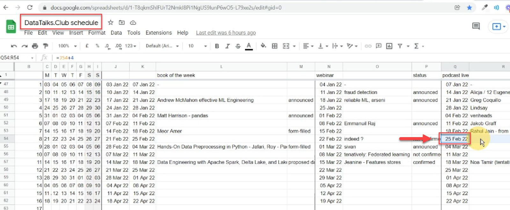
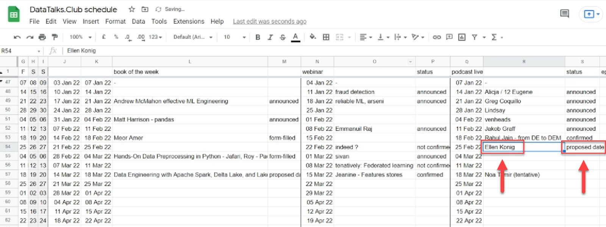
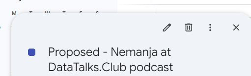
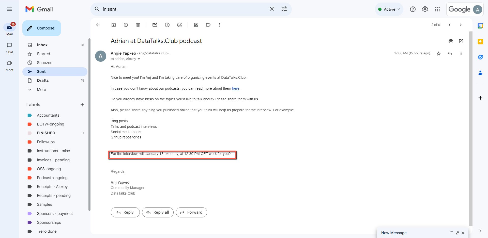

# Select and propose a date for events

<!-- sop-section-start: summary -->
## Summary

- Purpose: Selecting the date and time for the event using our [DataTalks.Club schedule](https://docs.google.com/spreadsheets/u/1/d/1-T8qkmShlFUrT2NmkI8Pi1NgUS9IunP6wO5-L79xe2s/edit) spreadsheet and [https://calendar.google.com/calendar](https://calendar.google.com/calendar)
- Outcome: We need to keep track of the dates in one place
- Trigger: When we already have the contact information of the guest (email) and need to select the date for the event
- Frequency: Per prospective event guest.
<!-- sop-section-end -->

<!-- sop-section-start: prerequisites -->
## Prerequisites

- Access: DataTalks.Club schedule spreadsheet, Google Calendar, and guest email.
- Tools: Google Sheets, Google Calendar, email.
- Inputs: Guest contact information, availability, event type, and proposed date.

Note: the communication should happen via email, not linkedin
<!-- sop-section-end -->

<!-- sop-section-start: procedure -->
## Procedure

<!-- sop-step-start id=1 -->
1.  Find a suitable date from [DataTalks.Club schedule](https://docs.google.com/spreadsheets/u/1/d/1-T8qkmShlFUrT2NmkI8Pi1NgUS9IunP6wO5-L79xe2s/edit). See [Schedule](../../../overview/reference/schedule.md) for more detail.

    <!-- sop-screenshot-start -->
    
    <!-- sop-caption-start -->
    This screenshot matters for confirming the upload, publishing, or scheduling state before it becomes user-facing; look for the highlighted area or visible control labeled more detail. Use that match to verify the screen state, then complete the step described above.
    <!-- sop-caption-end -->
    <!-- sop-screenshot-end -->
<!-- sop-step-end -->

<!-- sop-step-start id=2 -->
2.  And then

    - enter the name of the guest in the google spreadsheet

    - write "proposed" on the “status” column

    <!-- sop-screenshot-start -->
    
    <!-- sop-caption-start -->
    This screenshot matters for confirming the correct record, field, or status before updating the workflow; look for the highlighted area or visible control labeled proposed. Use that match to verify the screen state, then complete the step described above.
    <!-- sop-caption-end -->
    <!-- sop-screenshot-end -->
<!-- sop-step-end -->

<!-- sop-step-start id=3 -->
3.  Next, go to [Calendar](https://calendar.google.com/calendar/u/0/r/eventedit?state=%5Bnull%2Cnull%2Cnull%2Cnull%2C%5B13%5D%5D&pli=1) and propose the event. Follow this template [Create a calender invite for the guests speaker for an event](../../../events/calendar/sops/create-a-calender-invite-for-the-guests-speaker-for-an-event.md) but add “Proposed” in the beginning.

    Format - “Proposed - \<NAME\> at DataTalks.Club Podcast” - for podcast

    <!-- sop-screenshot-start -->
    
    <!-- sop-caption-start -->
    This screenshot matters for confirming the correct record, field, or status before updating the workflow; look for the highlighted area or visible control labeled Proposed - <NAME> at DataTalks.Club Podcast. Use that match to verify the screen state, then complete the step described above.
    <!-- sop-caption-end -->
    <!-- sop-screenshot-end -->
<!-- sop-step-end -->

<!-- sop-step-start id=4 -->
4.  Send the proposed date to the guest.
    Template: [Podcast process - First contact email, starting the process](https://docs.google.com/document/d/1wdlY9mH-rMBKW5AjFY32tjc1zTRfi7ZjvU1SxqxbekY/edit)

    <!-- sop-screenshot-start -->
    
    <!-- sop-caption-start -->
    This screenshot matters for confirming the communication step before sending or recording outreach; look for the highlighted area or matching UI state shown in the image. Use it to verify the screen state, then complete the step described above.
    <!-- sop-caption-end -->
    <!-- sop-screenshot-end -->
<!-- sop-step-end -->

<!-- sop-step-start id=5 -->
5.  If the speaker doesn’t confirm within one week, follow up.
<!-- sop-step-end -->

<!-- sop-step-start id=6 -->
6.  When the guest confirms the proposed date, update the [google spreadsheet](https://docs.google.com/spreadsheets/d/1-T8qkmShlFUrT2NmkI8Pi1NgUS9IunP6wO5-L79xe2s/edit#gid=0) and change the status from "proposed" to "confirmed”.
<!-- sop-step-end -->

<!-- sop-step-start id=7 -->
7.  Only after the date is confirmed, edit the Google calendar event you made in Step 3 and remove the word “Proposed” at the beginning.

    Loom links:
<!-- sop-step-end -->
<!-- sop-section-end -->

<!-- sop-section-start: validation -->
## Validation

-
<!-- sop-section-end -->

<!-- sop-section-start: troubleshooting -->
## Troubleshooting

-
<!-- sop-section-end -->

<!-- sop-section-start: references -->
## References

-
<!-- sop-section-end -->
