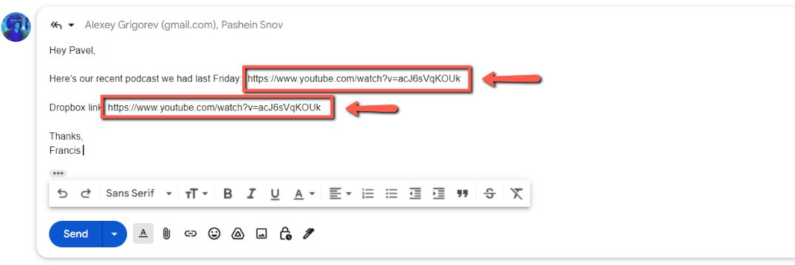
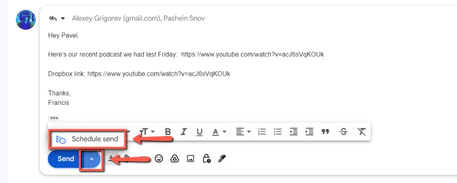
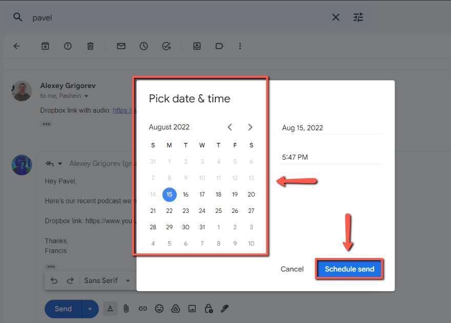

# Sending a podcast scheduled email to Pavel (after the event)

<!-- sop-section-start: summary -->
## Summary

- Purpose:
- Outcome:
- Trigger:
- Frequency:
<!-- sop-section-end -->

<!-- sop-section-start: prerequisites -->
## Prerequisites

- Access:
- Tools:
- Inputs:
<!-- sop-section-end -->

<!-- sop-section-start: procedure -->
## Procedure

<!-- sop-prose-start -->
How to Send Podcast Scheduled Email to Pavel (after the event)
This procedure will show you the steps on how to Send a Podcast Scheduled Email to Pavel

Step-by-step Instructions
<!-- sop-prose-end -->

<!-- sop-step-start id=1 -->
1.  After the recent podcast has been edited and processed, send the YouTube email and [Dropbox link](https://docs.google.com/document/d/107BmBjtOK94jJl1DIfYF3kxarzTHCUbnfyF3wFxAKLU/edit?usp=sharing) to Pavel and follow the template [here](https://docs.google.com/document/d/1j_Kgwfubx1kje1lwhCWp_3D7HTJkEIsdmtgVq8eogOU/edit?usp=sharing).

    Note: Don’t forget to add Valeriia’s email when sending the links to Pavel

    <!-- sop-screenshot-start -->
    
    <!-- sop-caption-start -->
    This screenshot matters for capturing or placing the correct link information; look for the highlighted area or visible control labeled Valeriia’s email when sending the links to Pavel. Use that match to verify the screen state, then complete the step described above.
    <!-- sop-caption-end -->
    <!-- sop-screenshot-end -->
<!-- sop-step-end -->

<!-- sop-step-start id=2 -->
2.  After, schedule the email around 12:00 CET after you edited and saved the video. To schedule an email, click the dropdown list, beside the “Send” button, and then click “Schedule Send”

    Note: Sometimes youtube takes some time to update the video.
    <!-- sop-screenshot-start -->
    
    <!-- sop-caption-start -->
    This screenshot matters for confirming the process is on the expected screen before the next action; look for the highlighted area or matching UI state shown in the image. Use it to verify the screen state, then complete the step described above.
    <!-- sop-caption-end -->
    <!-- sop-screenshot-end -->
<!-- sop-step-end -->

<!-- sop-step-start id=3 -->
3.  Finally, select a schedule and then click “Schedule Send”

    <!-- sop-screenshot-start -->
    
    <!-- sop-caption-start -->
    This screenshot matters for confirming the upload, publishing, or scheduling state before it becomes user-facing; look for the highlighted area or visible control labeled Schedule Send. Use that match to verify the screen state, then complete the step described above.
    <!-- sop-caption-end -->
    <!-- sop-screenshot-end -->
<!-- sop-step-end -->
<!-- sop-section-end -->

<!-- sop-section-start: validation -->
## Validation

-
<!-- sop-section-end -->

<!-- sop-section-start: troubleshooting -->
## Troubleshooting

-
<!-- sop-section-end -->

<!-- sop-section-start: references -->
## References

-
<!-- sop-section-end -->
