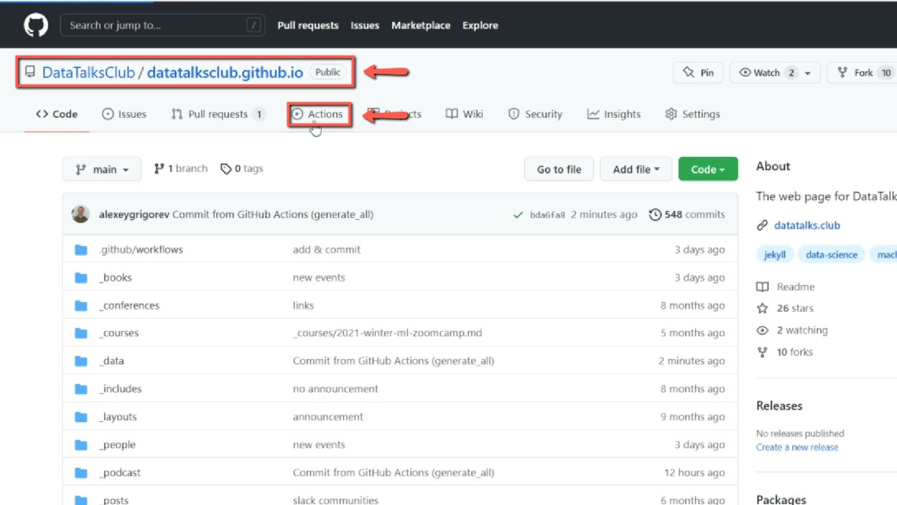
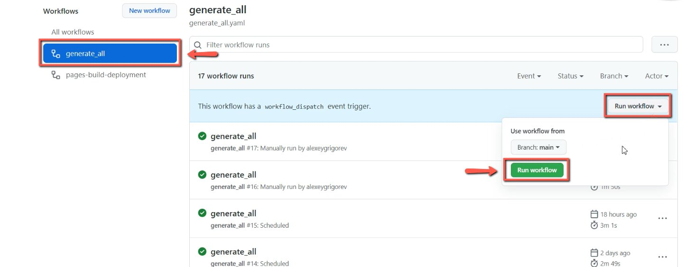
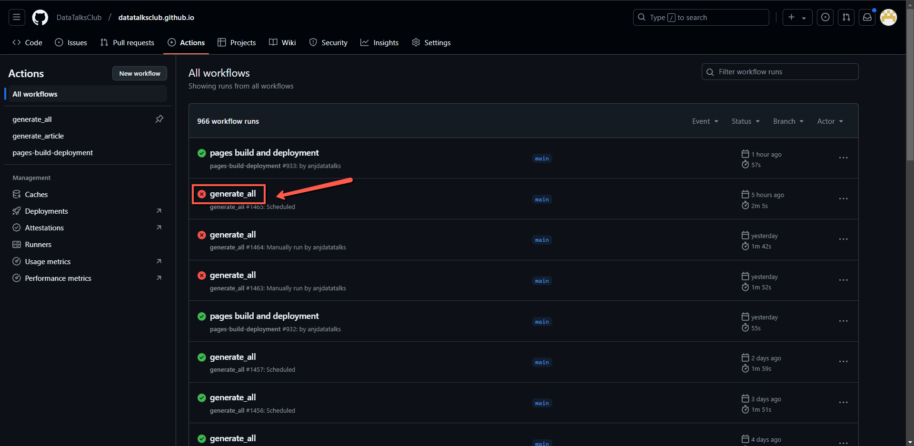

# Update the website with the information from forms

<!-- sop-section-start: summary -->
## Summary

- Purpose: executing github actions - this extracts the information from the Airtable forms and publishes on our website
- Outcome: we want to add events, speakers and podcasts to our website
- Trigger: after the fill in any airtable form and now want to publish this information
- Frequency:
<!-- sop-section-end -->

<!-- sop-section-start: prerequisites -->
## Prerequisites

- Access:
- Tools:
- Inputs:
<!-- sop-section-end -->

<!-- sop-section-start: procedure -->
## Procedure

<!-- sop-step-start id=1 -->
1.  The first thing you need to do is open [DataTalks.Club's Github website](https://github.com/DataTalksClub/datatalksclub.github.io) and click “Actions”

    <!-- sop-screenshot-start -->
    
    <!-- sop-caption-start -->
    This screenshot matters for confirming the process is on the expected screen before the next action; look for the highlighted area or visible control labeled Actions. Use that match to verify the screen state, then complete the step described above.
    <!-- sop-caption-end -->
    <!-- sop-screenshot-end -->
<!-- sop-step-end -->

<!-- sop-step-start id=2 -->
2.  After, select "generate_all" and click "Run workflow"

    <!-- sop-screenshot-start -->
    
    <!-- sop-caption-start -->
    This screenshot matters for confirming the process is on the expected screen before the next action; look for the highlighted area or visible control labeled generateall. Use that match to verify the screen state, then complete the step described above.
    <!-- sop-caption-end -->
    <!-- sop-screenshot-end -->
<!-- sop-step-end -->

<!-- sop-step-start id=3 -->
3.  Once you run the workflow for the generate all action, verify that the process is running correctly.[GitHub Guide: Common Errors and Solutions](../../../internal-admin/documentation/sops/github-guide-common-errors-and-solutions.md)

    Note: If you encounter an error, check the details in the error message to understand the issue. If it’s an issue with the Airtable forms, correct them on Airtable. If the issue is unclear or difficult to interpret, notify Alexey by sending him the screenshot and describing the error.

    <!-- sop-screenshot-start -->
    
    <!-- sop-caption-start -->
    This screenshot matters for confirming the correct record, field, or status before updating the workflow; look for the highlighted area or matching UI state shown in the image. Use it to verify the screen state, then complete the step described above.
    <!-- sop-caption-end -->
    <!-- sop-screenshot-end -->
<!-- sop-step-end -->
<!-- sop-section-end -->

<!-- sop-section-start: validation -->
## Validation

-
<!-- sop-section-end -->

<!-- sop-section-start: troubleshooting -->
## Troubleshooting

-
<!-- sop-section-end -->

<!-- sop-section-start: references -->
## References

-
<!-- sop-section-end -->
