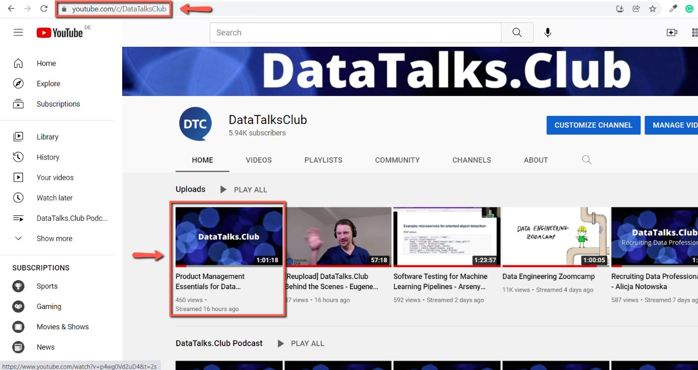
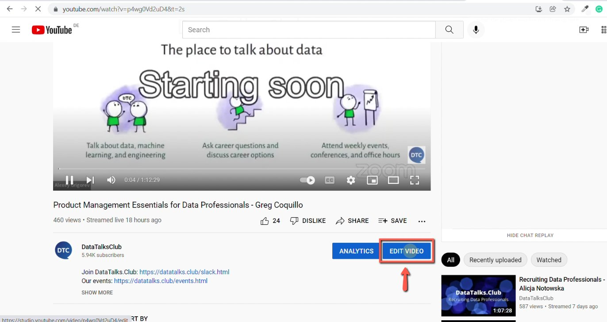
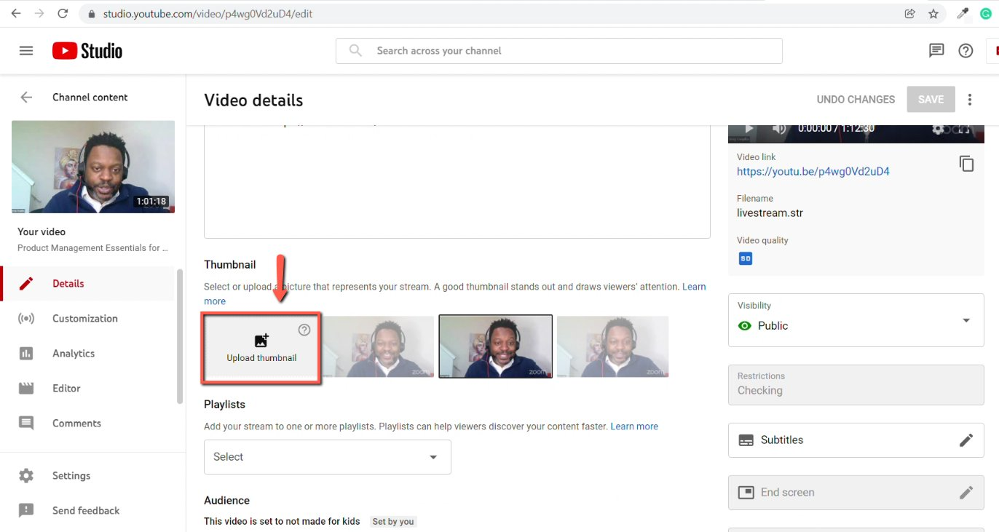
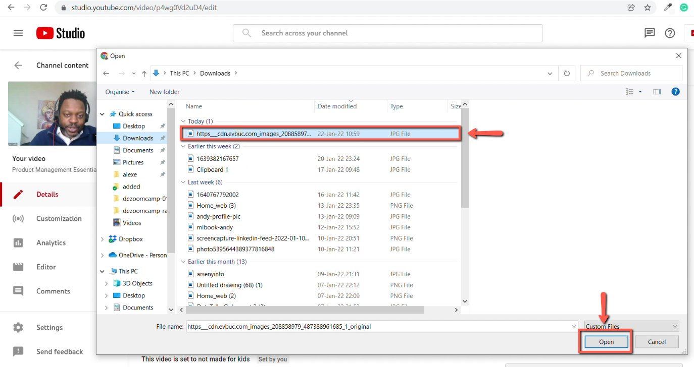
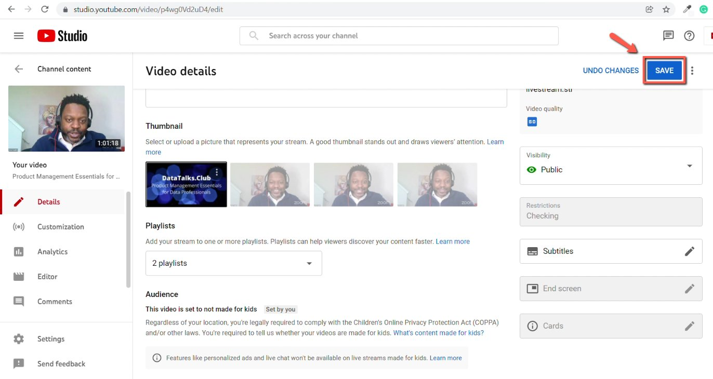

# Updating the cover of the YouTube video

<!-- sop-section-start: summary -->
## Summary

- Purpose: Updating cover for a YouTube video
- Outcome: A good cover will attract more views
- Trigger: After the live stream has happened
- Frequency: Per video that needs a thumbnail update.
<!-- sop-section-end -->

<!-- sop-section-start: prerequisites -->
## Prerequisites

- Access: DataTalks.Club YouTube Studio and cover design file.
- Tools: YouTube Studio, Figma or cover design tool.
- Inputs: Target YouTube video and prepared cover image.

How to update the cover of the YouTube video
<!-- sop-section-end -->

<!-- sop-section-start: procedure -->
## Procedure

<!-- sop-group-start: "Creating the cover" -->
### Creating the cover

<!-- sop-step-start id=1 -->
1.  Create covers for YouTube using this process document (ideally, you should have already created the cover by now when preparing the announcement)

    See [How to use Figma for creating event banners](../../../sales/sponsorship/sops/how-to-use-figma-for-creating-event-banners.md)
<!-- sop-step-end -->

<!-- sop-step-start id=2 -->
2.  This is usually done early in any event process (specifically, during the event announcement). Thus, you should not need to perform this step usually.
<!-- sop-step-end -->

<!-- sop-group-end -->

<!-- sop-group-start: "Updating the cover" -->
### Updating the cover

<!-- sop-step-start id=3 -->
3.  Open DataTalkClub's YouTube channel and select the video for which you want to update the cover.

    <!-- sop-screenshot-start -->
    
    <!-- sop-caption-start -->
    This screenshot matters for confirming the process is on the expected screen before the next action; look for the highlighted area or visible control labeled DataTalkClub's YouTube channel and select the video for. Use that match to verify the screen state, then complete the step described above.
    <!-- sop-caption-end -->
    <!-- sop-screenshot-end -->
<!-- sop-step-end -->

<!-- sop-step-start id=4 -->
4.  After selecting, click on "Edit Video"

    <!-- sop-screenshot-start -->
    
    <!-- sop-caption-start -->
    This screenshot matters for checking the editing, transcript, or timestamp workflow at this point; look for the highlighted area or visible control labeled Edit Video. Use that match to verify the screen state, then complete the step described above.
    <!-- sop-caption-end -->
    <!-- sop-screenshot-end -->
<!-- sop-step-end -->

<!-- sop-step-start id=5 -->
5.  And click "Upload thumbnail"

    <!-- sop-screenshot-start -->
    
    <!-- sop-caption-start -->
    This screenshot matters for confirming the upload, publishing, or scheduling state before it becomes user-facing; look for the highlighted area or visible control labeled Upload thumbnail. Use that match to verify the screen state, then complete the step described above.
    <!-- sop-caption-end -->
    <!-- sop-screenshot-end -->
<!-- sop-step-end -->

<!-- sop-step-start id=6 -->
6.  To proceed, select the cover you created earlier and click "Open"

    <!-- sop-screenshot-start -->
    
    <!-- sop-caption-start -->
    This screenshot matters for confirming the process is on the expected screen before the next action; look for the highlighted area or visible control labeled Open. Use that match to verify the screen state, then complete the step described above.
    <!-- sop-caption-end -->
    <!-- sop-screenshot-end -->
<!-- sop-step-end -->

<!-- sop-step-start id=7 -->
7.  Lastly, click "Save"

    <!-- sop-screenshot-start -->
    
    <!-- sop-caption-start -->
    This screenshot matters for confirming the download or export step is using the right option; look for the highlighted area or visible control labeled Save. Use that match to verify the screen state, then complete the step described above.
    <!-- sop-caption-end -->
    <!-- sop-screenshot-end -->
<!-- sop-step-end -->

<!-- sop-group-end -->
<!-- sop-section-end -->

<!-- sop-section-start: validation -->
## Validation

-
<!-- sop-section-end -->

<!-- sop-section-start: troubleshooting -->
## Troubleshooting

-
<!-- sop-section-end -->

<!-- sop-section-start: references -->
## References

-
<!-- sop-section-end -->
