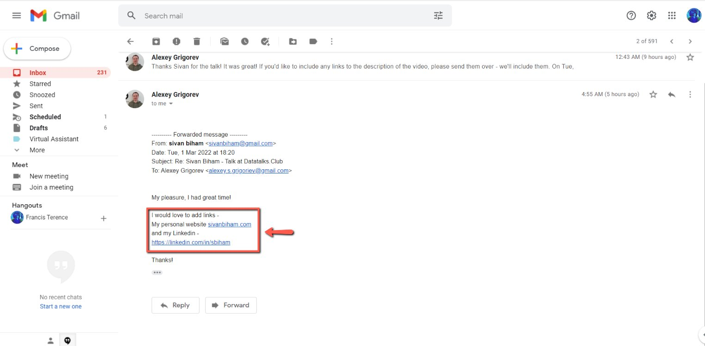
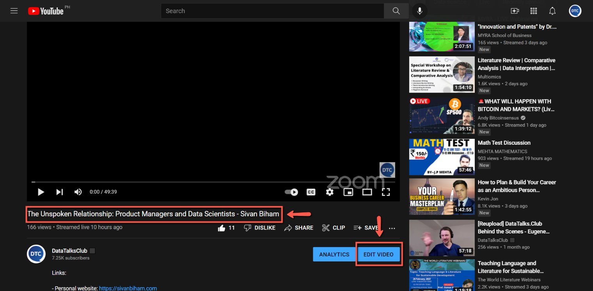
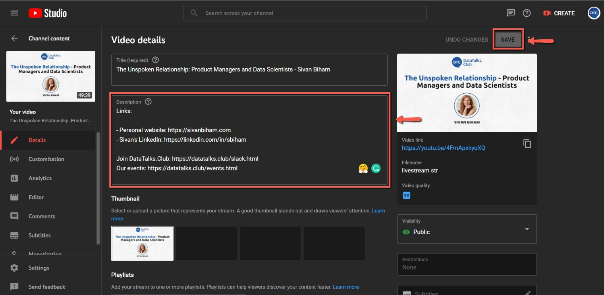

# Add links to the YouTube video

<!-- sop-section-start: summary -->
## Summary

- Purpose: Add guest or resource links to a YouTube video description.
- Outcome: The YouTube description includes correctly formatted links.
- Trigger: A YouTube video needs speaker or resource links added.
- Frequency: Per video.
<!-- sop-section-end -->

<!-- sop-section-start: prerequisites -->
## Prerequisites

- Access: DataTalks.Club YouTube Studio and link sources.
- Tools: YouTube Studio, browser.
- Inputs: Target video and links to add.
<!-- sop-section-end -->

<!-- sop-section-start: procedure -->
## Procedure

<!-- sop-prose-start -->
How to add links to the YouTube video

This procedure will show you the steps on how to add links to the YouTube video.

Step-by-step Instructions
<!-- sop-prose-end -->

<!-- sop-step-start id=1 -->
1.  The first thing you need to do is to copy the links of the guest.

    Note: Usually, the links may be their LinkedIn profiles, personal websites, Twitter and etc.

    <!-- sop-screenshot-start -->
    
    <!-- sop-caption-start -->
    This screenshot matters for capturing or placing the correct link information; look for the highlighted area or matching UI state shown in the image. Use it to verify the screen state, then complete the step described above.
    <!-- sop-caption-end -->
    <!-- sop-screenshot-end -->
<!-- sop-step-end -->

<!-- sop-step-start id=2 -->
2.  After, open the YouTube you want to add the links and select “Edit Video”

    <!-- sop-screenshot-start -->
    
    <!-- sop-caption-start -->
    This screenshot matters for capturing or placing the correct link information; look for the highlighted area or visible control labeled Edit Video. Use that match to verify the screen state, then complete the step described above.
    <!-- sop-caption-end -->
    <!-- sop-screenshot-end -->
<!-- sop-step-end -->

<!-- sop-step-start id=3 -->
3.  Under “Description”, paste the links that you copied earlier and select “Save”

    Note: In adding the links, make sure to follow the punctuation rule: separate “:” with a space after it, not before. For example LinkedIn profile: https://linkedin.com/in/sbiham

    <!-- sop-screenshot-start -->
    
    <!-- sop-caption-start -->
    This screenshot matters for capturing or placing the correct link information; look for the highlighted area or matching UI state shown in the image. Use it to verify the screen state, then complete the step described above.
    <!-- sop-caption-end -->
    <!-- sop-screenshot-end -->
<!-- sop-step-end -->
<!-- sop-section-end -->

<!-- sop-section-start: validation -->
## Validation

-
<!-- sop-section-end -->

<!-- sop-section-start: troubleshooting -->
## Troubleshooting

-
<!-- sop-section-end -->

<!-- sop-section-start: references -->
## References

-
<!-- sop-section-end -->
