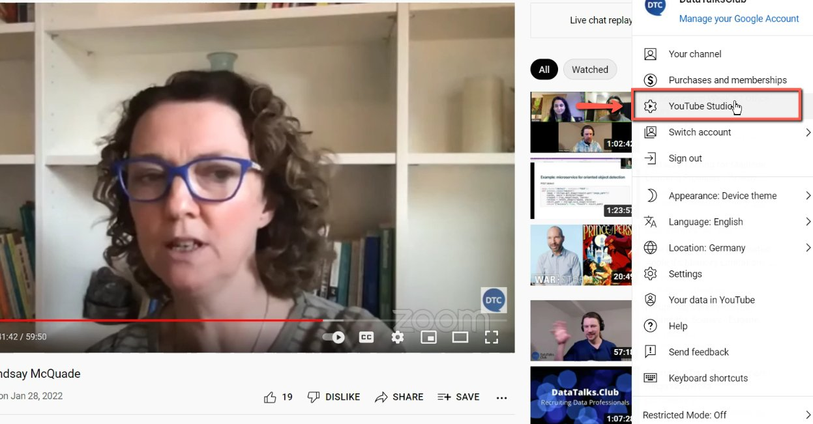
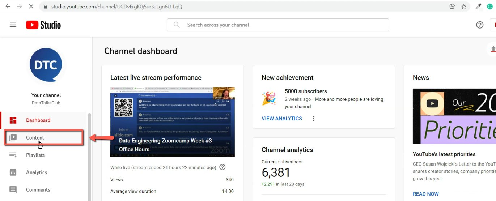
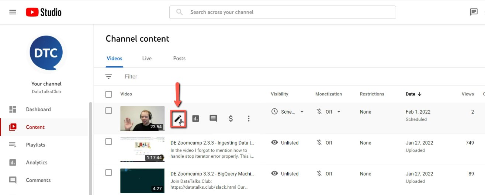
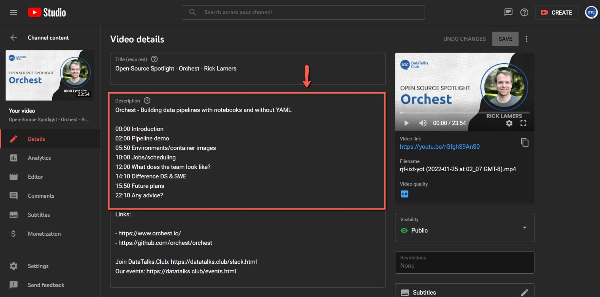
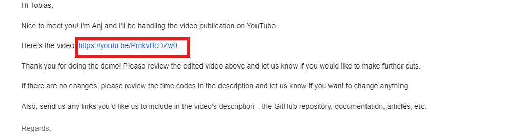
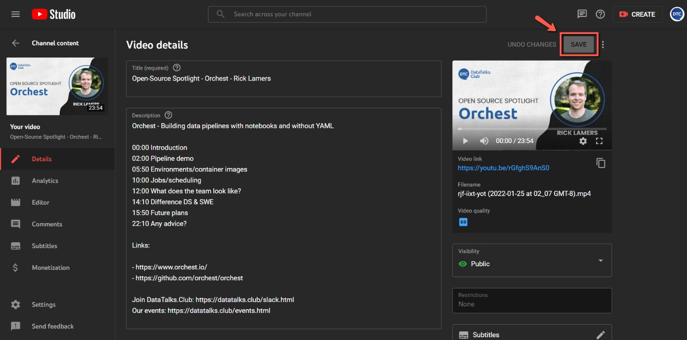

# Add timecodes to YouTube videos

<!-- sop-section-start: summary -->
## Summary

- Purpose: Add generated timecodes to a YouTube video description.
- Outcome: The YouTube description has formatted timecodes and is saved after review.
- Trigger: A video needs timecodes added to its description.
- Frequency: Per video.
<!-- sop-section-end -->

<!-- sop-section-start: prerequisites -->
## Prerequisites

- Access: DataTalks.Club YouTube Studio, description template, and guest email.
- Tools: YouTube Studio, ChatGPT, Gmail.
- Inputs: Target video, generated timecodes, description template, and guest review notes.
<!-- sop-section-end -->

<!-- sop-section-start: procedure -->
## Procedure

<!-- sop-prose-start -->
How to add timecodes to YouTube videos
This procedure will show you the steps on how to add timecodes to YouTube videos.

Step-by-step Instructions
<!-- sop-prose-end -->

<!-- sop-step-start id=1 -->
1.  Go to [How to Use YouTube Description Templates](https://docs.google.com/document/d/1nQQ0wXRuqqVJ5L4CL9xvkHnoAFDxBDld86sj3_LvZ5A/edit?tab=t.0#heading=h.jq3jzf8zxz81)and follow the template for Open Source Spotlight
<!-- sop-step-end -->

<!-- sop-step-start id=2 -->
2.  Next, open DataTalks.Club’s Youtube channel and click on “YouTube studio”

    <!-- sop-screenshot-start -->
    
    <!-- sop-caption-start -->
    This screenshot matters for confirming the process is on the expected screen before the next action; look for the highlighted area or visible control labeled YouTube studio. Use that match to verify the screen state, then complete the step described above.
    <!-- sop-caption-end -->
    <!-- sop-screenshot-end -->
<!-- sop-step-end -->

<!-- sop-step-start id=3 -->
3.  After, click “content"

    <!-- sop-screenshot-start -->
    
    <!-- sop-caption-start -->
    This screenshot matters for confirming the process is on the expected screen before the next action; look for the highlighted area or visible control labeled content. Use that match to verify the screen state, then complete the step described above.
    <!-- sop-caption-end -->
    <!-- sop-screenshot-end -->
<!-- sop-step-end -->

<!-- sop-step-start id=4 -->
4.  And then, click on the pen tool, right beside the video.

    <!-- sop-screenshot-start -->
    
    <!-- sop-caption-start -->
    This screenshot matters for confirming the process is on the expected screen before the next action; look for the highlighted area or visible control labeled the pen tool. Use that match to verify the screen state, then complete the step described above.
    <!-- sop-caption-end -->
    <!-- sop-screenshot-end -->
<!-- sop-step-end -->

<!-- sop-step-start id=5 -->
5.  Under "Description", paste the template along with the ChatGPT generated timecodes of the video.

    Note: You only need the beginning of the time. For example, instead of "00:00 - 02:00" ,

    paste only "00:00" Moreover, make sure that the timecode should start at "00:00" Leading zeros to timecodes, and remove punctuations after the timestamp.

    <!-- sop-screenshot-start -->
    
    <!-- sop-caption-start -->
    This screenshot matters for capturing or placing the correct link information; look for the highlighted area or visible control labeled 00:00. Use that match to verify the screen state, then complete the step described above.
    <!-- sop-caption-end -->
    <!-- sop-screenshot-end -->
<!-- sop-step-end -->

<!-- sop-step-start id=6 -->
6.  Copy the Youtube link and ask the guest to review the timecodes through gmail using this template [Open-source spotlight Asking for revisions, links and timecodes](https://docs.google.com/document/d/1_jJLDGSTuyRGz6fimgwJLBGyT_dVl_rfr8T50qIqwa8/edit?tab=t.0)

    <!-- sop-screenshot-start -->
    
    <!-- sop-caption-start -->
    This screenshot matters for capturing or placing the correct link information; look for the highlighted area or matching UI state shown in the image. Use it to verify the screen state, then complete the step described above.
    <!-- sop-caption-end -->
    <!-- sop-screenshot-end -->
<!-- sop-step-end -->

<!-- sop-step-start id=7 -->
7.  Lastly, make changes if needed and click "Save"

    <!-- sop-screenshot-start -->
    
    <!-- sop-caption-start -->
    This screenshot matters for confirming the download or export step is using the right option; look for the highlighted area or visible control labeled Save. Use that match to verify the screen state, then complete the step described above.
    <!-- sop-caption-end -->
    <!-- sop-screenshot-end -->
<!-- sop-step-end -->
<!-- sop-section-end -->

<!-- sop-section-start: validation -->
## Validation

-
<!-- sop-section-end -->

<!-- sop-section-start: troubleshooting -->
## Troubleshooting

-
<!-- sop-section-end -->

<!-- sop-section-start: references -->
## References

-
<!-- sop-section-end -->
