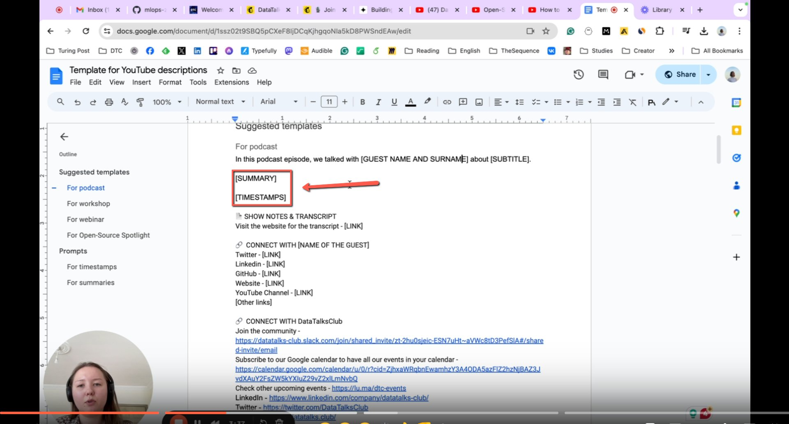
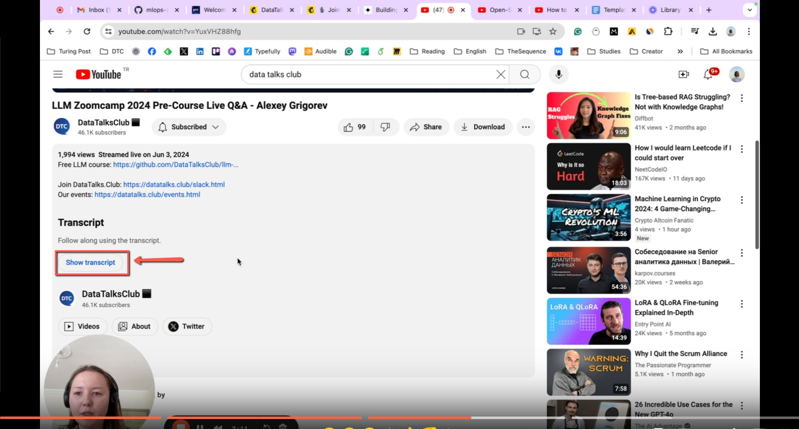
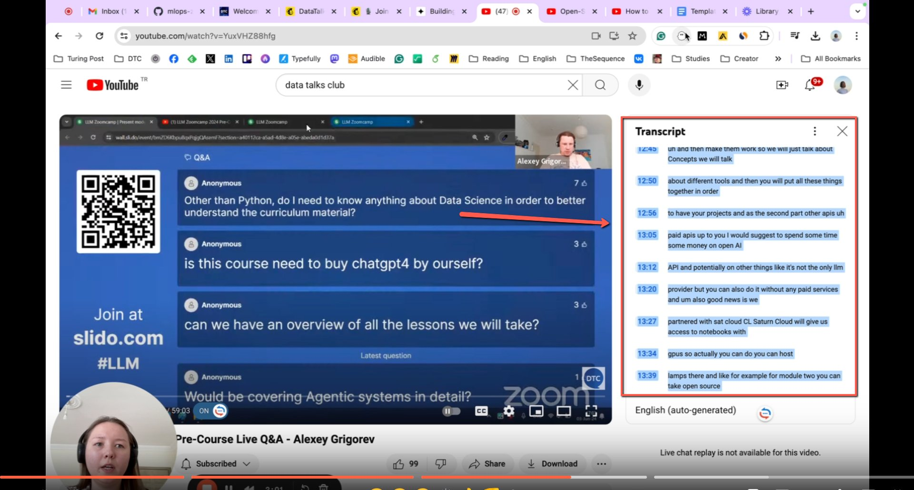
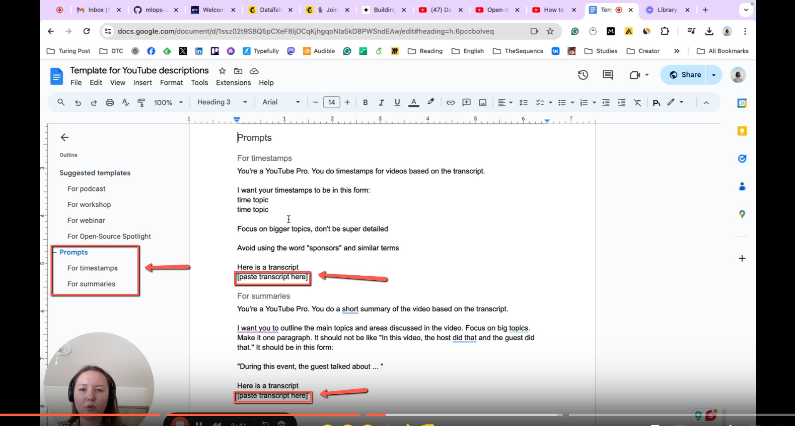
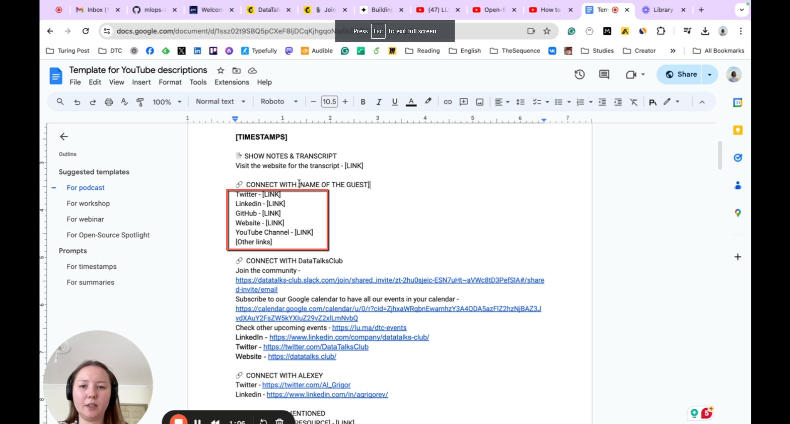
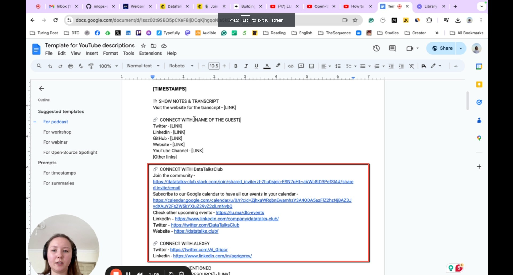
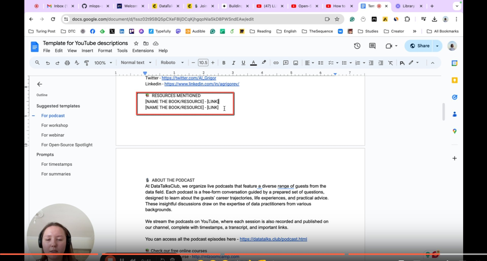

# Generate Timecodes Using Youtube Video Transcripts

<!-- sop-section-start: summary -->
## Summary

- Purpose: How to use the [Template for YouTube descriptions](https://docs.google.com/document/d/1ssz02t9SBQ5pCXeF8IjDCqKjhgqoNIa5kD8PWSndEAw/edit?tab=t.0) file template.
- Outcome: A YouTube description has a generated summary, timestamps, and supporting links.
- Trigger: Use this process document as a guide to use the template for adding Youtube Descriptions
- Frequency: Per video description update.
<!-- sop-section-end -->

<!-- sop-section-start: prerequisites -->
## Prerequisites

- Access: YouTube transcript, description template, and ChatGPT.
- Tools: YouTube, ChatGPT, Google Docs template.
- Inputs: Video transcript, guest name, title, social links, resource links, and prompt.
<!-- sop-section-end -->

<!-- sop-section-start: procedure -->
## Procedure

<!-- sop-group-start: "Generate Summary and Timestamps for Youtube Description using ChatGPT" -->
### Generate Summary and Timestamps for Youtube Description using ChatGPT

<!-- sop-step-start id=1 -->
1.  Go to [Template for YouTube descriptions](https://docs.google.com/document/d/1ssz02t9SBQ5pCXeF8IjDCqKjhgqoNIa5kD8PWSndEAw/edit?tab=t.0) and select the appropriate template for the video. Copy and Paste the first sentence for description and input \[GUEST NAME AND SURNAME\] about \[TITLE\] but for the \[SUMMARY\] and \[TIMESTAMPS\]. ChatGPT would be used to generate it.

    <!-- sop-screenshot-start -->
    
    <!-- sop-caption-start -->
    This screenshot matters for capturing or placing the correct link information; look for the highlighted area or visible control labeled Template for YouTube descriptions and select the approp. Use that match to verify the screen state, then complete the step described above.
    <!-- sop-caption-end -->
    <!-- sop-screenshot-end -->
<!-- sop-step-end -->

<!-- sop-step-start id=2 -->
2.  Once you select your video on Youtube, scroll down to the description and select “Show Transcript”

    <!-- sop-screenshot-start -->
    
    <!-- sop-caption-start -->
    This screenshot matters for checking the editing, transcript, or timestamp workflow at this point; look for the highlighted area or visible control labeled Show Transcript. Use that match to verify the screen state, then complete the step described above.
    <!-- sop-caption-end -->
    <!-- sop-screenshot-end -->
<!-- sop-step-end -->

<!-- sop-step-start id=3 -->
3.  A tab on the right side showing the transcript will appear and proceed to copy the transcript.

    <!-- sop-screenshot-start -->
    
    <!-- sop-caption-start -->
    This screenshot matters for capturing or placing the correct link information; look for the highlighted area or visible control labeled transcript. Use that match to verify the screen state, then complete the step described above.
    <!-- sop-caption-end -->
    <!-- sop-screenshot-end -->
<!-- sop-step-end -->

<!-- sop-step-start id=4 -->
4.  Go back to the template and scroll down and look for the Prompt. Paste your transcript on the “\[paste transcript here\]” and then copy the prompt into ChatGPT.

    <!-- sop-screenshot-start -->
    
    <!-- sop-caption-start -->
    This screenshot matters for capturing or placing the correct link information; look for the highlighted area or visible control labeled paste transcript here. Use that match to verify the screen state, then complete the step described above.
    These prompts would be used for the timestamps and summaries.
    <!-- sop-caption-end -->
    <!-- sop-screenshot-end -->
<!-- sop-step-end -->

<!-- sop-group-end -->

<!-- sop-group-start: "Other Resources" -->
### Other Resources

<!-- sop-step-start id=5 -->
5.  For the other details on the description, for the social media links if you're able to find it then add the \[LINK\], but if not then omit this part.

    <!-- sop-screenshot-start -->
    
    <!-- sop-caption-start -->
    This screenshot matters for capturing or placing the correct link information; look for the highlighted area or visible control labeled LINK. Use that match to verify the screen state, then complete the step described above.
    <!-- sop-caption-end -->
    <!-- sop-screenshot-end -->
<!-- sop-step-end -->

<!-- sop-step-start id=6 -->
6.  For this section, just copy it.

    <!-- sop-screenshot-start -->
    
    <!-- sop-caption-start -->
    This screenshot matters for capturing or placing the correct link information; look for the highlighted area or visible control labeled it. Use that match to verify the screen state, then complete the step described above.
    <!-- sop-caption-end -->
    <!-- sop-screenshot-end -->
<!-- sop-step-end -->

<!-- sop-step-start id=7 -->
7.  For this section, if the guest mentioned resources then add \[LINK\] here but if not then omit this part.

    <!-- sop-screenshot-start -->
    
    <!-- sop-caption-start -->
    This screenshot matters for capturing or placing the correct link information; look for the highlighted area or matching UI state shown in the image. Use it to verify the screen state, then complete the step described above.
    <!-- sop-caption-end -->
    <!-- sop-screenshot-end -->
<!-- sop-step-end -->

<!-- sop-group-end -->
<!-- sop-section-end -->

<!-- sop-section-start: validation -->
## Validation

-
<!-- sop-section-end -->

<!-- sop-section-start: troubleshooting -->
## Troubleshooting

-
<!-- sop-section-end -->

<!-- sop-section-start: references -->
## References

-
<!-- sop-section-end -->
