# Cutting Videos with FFmpeg

<!-- sop-section-start: summary -->
## Summary

- Purpose: Cut a video into multiple sections.
- Outcome: To extract and reuse the most interesting parts of event recordings, podcasts, workshops, webinars, or courses. These clips can then be shared on social media to increase engagement and promote the full content.
- Trigger: A recording has interesting segments that should be reused as clips.
- Frequency: As needed for events, podcasts, workshops, webinars, or courses.
<!-- sop-section-end -->

<!-- sop-section-start: prerequisites -->
## Prerequisites


- Access: Source video and video chunks Drive folder.
- Tools: Notebook or Gemini for timestamps, Google Drive, and FFmpeg.
- Inputs: Source video, selected timestamps, and clip output folder.
<!-- sop-section-end -->

<!-- sop-section-start: procedure -->
## Procedure

<!-- sop-prose-start -->
Cutting Videos with FFmpeg
This procedure will show you the steps on how to cut videos with FFmpeg

Step-by-step Instructions
<!-- sop-prose-end -->

<!-- sop-step-start id=1 -->
1.  After getting the timestamp using notebooks or Gemini, type in the prompt:

    ```text
    List me the most interesting and insightful parts from this video.

    Output as start timestamp - end timestamp short summary

    Each part should be no longer than 5 minutes
    ```
<!-- sop-step-end -->

<!-- sop-step-start id=2 -->
2.  Go to [video_chunks](https://drive.google.com/drive/folders/1zzaoiWqDNbVoRx0Vc-Hw7zWs5uCHrgDf). Click on “New”.

    <!-- sop-screenshot-start -->
    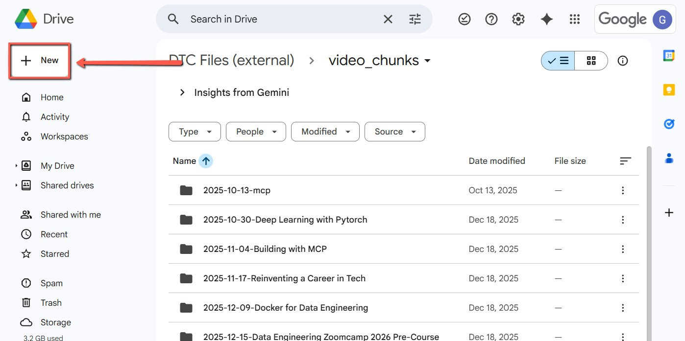
    <!-- sop-caption-start -->
    This screenshot anchors step 2 of the Cutting Videos with FFmpeg process by showing the screen for go to video chunks. Click on "New". Look for the red box, arrow, selected row, or highlighted screen area, then use that highlighted area as the target for the action before continuing.
    <!-- sop-caption-end -->
    <!-- sop-screenshot-end -->
<!-- sop-step-end -->

<!-- sop-step-start id=3 -->
3.  Click “New Folder”.

    <!-- sop-screenshot-start -->
    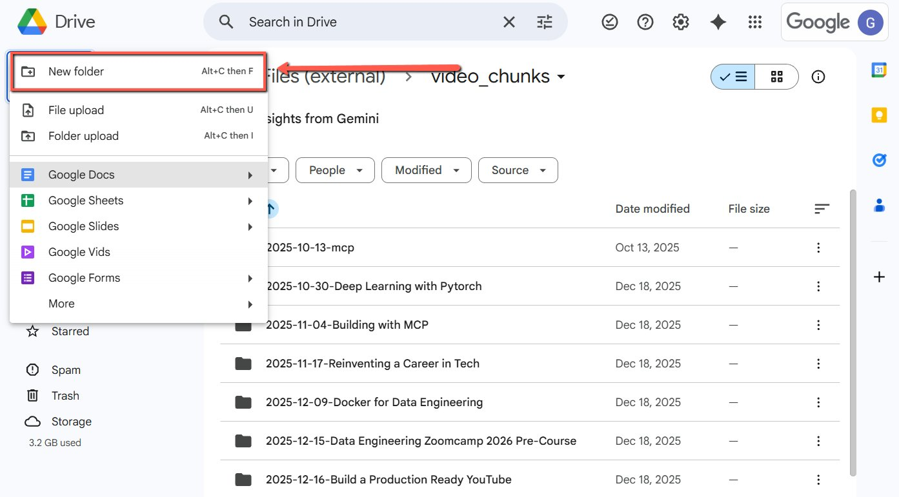
    <!-- sop-caption-start -->
    This screenshot anchors step 3 of the Cutting Videos with FFmpeg process by showing the screen for click "New Folder". Look for the red box or arrow around "New Folder", then use that highlighted area as the target for the action before continuing.
    <!-- sop-caption-end -->
    <!-- sop-screenshot-end -->
<!-- sop-step-end -->

<!-- sop-step-start id=4 -->
4.  Rename it as the YYYY-MM-DD-Title of the video, then click “create”.
    In this example 2025-11-04 Building with MCP

    <!-- sop-screenshot-start -->
    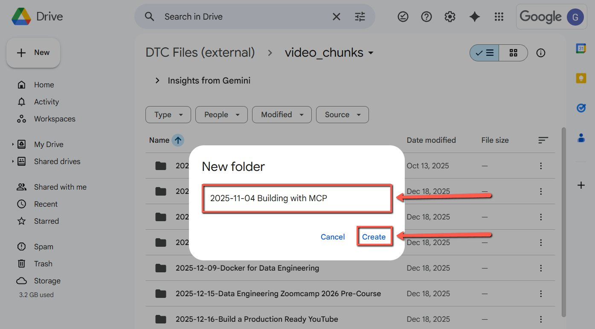
    <!-- sop-caption-start -->
    This screenshot anchors step 4 of the Cutting Videos with FFmpeg process by showing the screen for rename it as the YYYY MM DD Title of the video, then click "create". In this example 2025 11 04 Building with MCP. Look for the red box or arrow around "create", then use that highlighted area as the target for the action before continuing.
    <!-- sop-caption-end -->
    <!-- sop-screenshot-end -->
<!-- sop-step-end -->

<!-- sop-step-start id=5 -->
5.  In the folder, create a new document and paste the insightful parts generated in the Notebook. Rename the document as the title of the video.

    <!-- sop-screenshot-start -->
    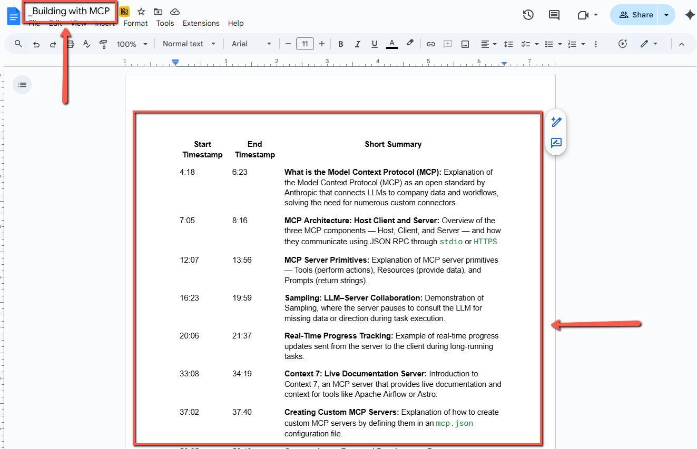
    <!-- sop-caption-start -->
    This screenshot anchors step 5 of the Cutting Videos with FFmpeg process by showing the screen for in the folder, create a new document and paste the insightful parts generated in the Notebook. Rename the document. Look for the red box, arrow, selected row, or highlighted screen area, then use that highlighted area as the target for the action before continuing.
    <!-- sop-caption-end -->
    <!-- sop-screenshot-end -->
<!-- sop-step-end -->

<!-- sop-step-start id=6 -->
6.  Scroll down, put the timestamp and the title of each insightful part and replace the spaces with underscores.
    NOTE: Remove all symbols (like &, ?, :, or -)
    <!-- sop-screenshot-start -->
    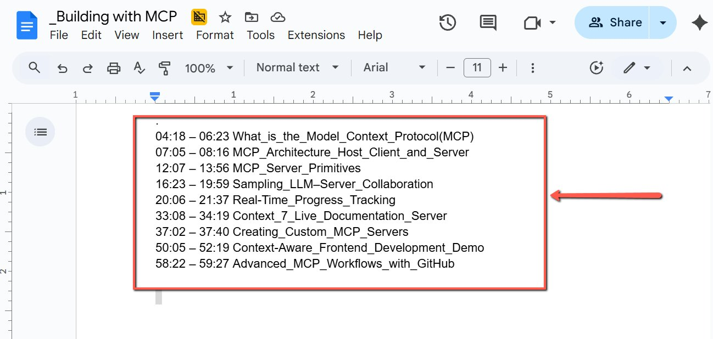
    <!-- sop-caption-start -->
    This screenshot anchors step 6 of the Cutting Videos with FFmpeg process by showing the screen for scroll down, put the timestamp and the title of each insightful part and replace the spaces with underscores. Look for the red box, arrow, selected row, or highlighted screen area, then use that highlighted area as the target for the action before continuing.
    <!-- sop-caption-end -->
    <!-- sop-screenshot-end -->
<!-- sop-step-end -->

<!-- sop-step-start id=7 -->
7.  Go to your File Manager and create a new folder for the task and rename it as “video_edit”

    Example C:\Users\\YourName\>\Downloads\video_edit.

    <!-- sop-screenshot-start -->
    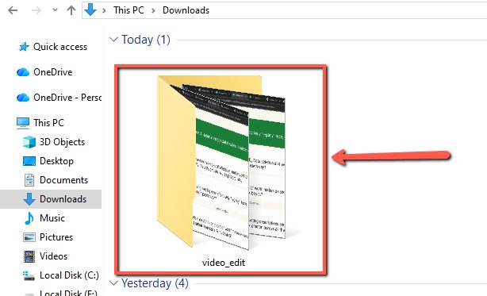
    <!-- sop-caption-start -->
    This screenshot anchors step 7 of the Cutting Videos with FFmpeg process by showing the screen for go to your File Manager and create a new folder for the task and rename it as "video edit" Example. Look for the red box or arrow around "video edit", then use that highlighted area as the target for the action before continuing.
    <!-- sop-caption-end -->
    <!-- sop-screenshot-end -->
<!-- sop-step-end -->

<!-- sop-step-start id=8 -->
8.  Download the Video from Youtube.
    NOTE: Make sure that you are in YouTube Studio so you can easily download the original video file.

    <!-- sop-screenshot-start -->
    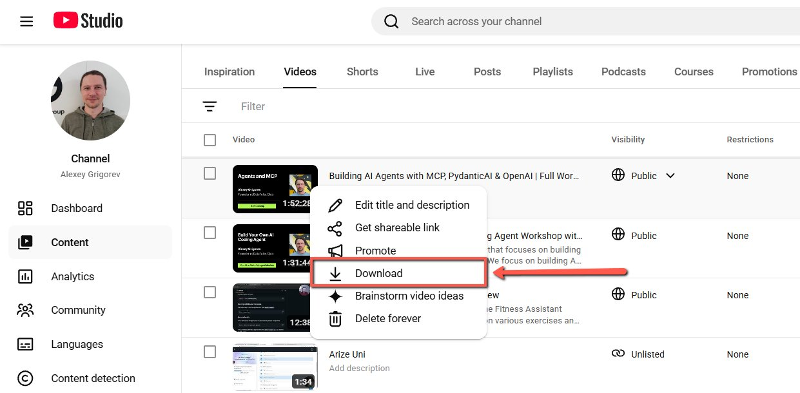
    <!-- sop-caption-start -->
    This screenshot anchors step 8 of the Cutting Videos with FFmpeg process by showing the screen for download the Video from Youtube. Look for the red box or arrow around Download, then use that highlighted area as the target for the action before continuing.
    <!-- sop-caption-end -->
    <!-- sop-screenshot-end -->
<!-- sop-step-end -->

<!-- sop-step-start id=9 -->
9.  Move the downloaded source video into that “video_edit” folder and rename it to a simple name without spaces.

    Format: Youtube_Title.mp4.

    Or in this example is “Building_with_MCP”

    <!-- sop-screenshot-start -->
    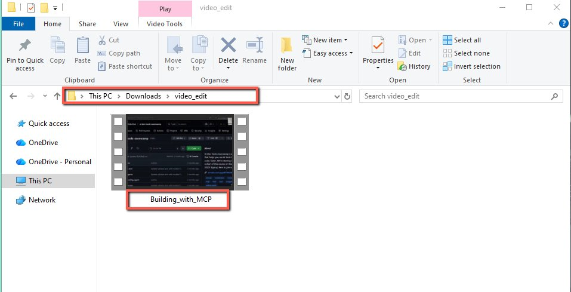
    <!-- sop-caption-start -->
    This screenshot anchors step 9 of the Cutting Videos with FFmpeg process by showing the screen for move the downloaded source video into that "video edit" folder and rename it to a simple name without spaces. Look for the red boxes or arrows around "video edit", "Building with MCP", then use that highlighted area as the target for the action before continuing.
    <!-- sop-caption-end -->
    <!-- sop-screenshot-end -->
<!-- sop-step-end -->

<!-- sop-step-start id=10 -->
10. Go to [video_chunks](https://drive.google.com/drive/folders/1zzaoiWqDNbVoRx0Vc-Hw7zWs5uCHrgDf), download the FFmpeg file.

    <!-- sop-screenshot-start -->
    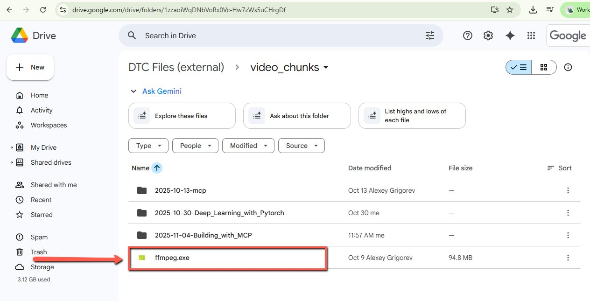
    <!-- sop-caption-start -->
    This screenshot anchors step 10 of the Cutting Videos with FFmpeg process by showing the screen for go to video chunks, download the FFmpeg file. Look for the red box or arrow around Download, then use that highlighted area as the target for the action before continuing.
    <!-- sop-caption-end -->
    <!-- sop-screenshot-end -->
<!-- sop-step-end -->

<!-- sop-step-start id=11 -->
11. Move ffmpeg.exe into your video_edit folder so it sits next to the video.

    <!-- sop-screenshot-start -->
    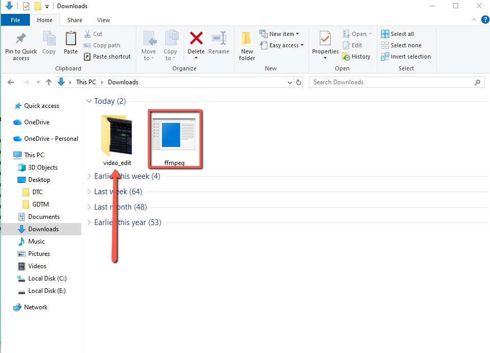
    <!-- sop-caption-start -->
    This screenshot anchors step 11 of the Cutting Videos with FFmpeg process by showing the screen for move ffmpeg.exe into your video edit folder so it sits next to the video. Look for the red box or arrow around Next, Edit, then use that highlighted area as the target for the action before continuing.
    <!-- sop-caption-end -->
    <!-- sop-screenshot-end -->
<!-- sop-step-end -->

<!-- sop-step-start id=12 -->
12. In the Download folder copy the folder location.

    <!-- sop-screenshot-start -->
    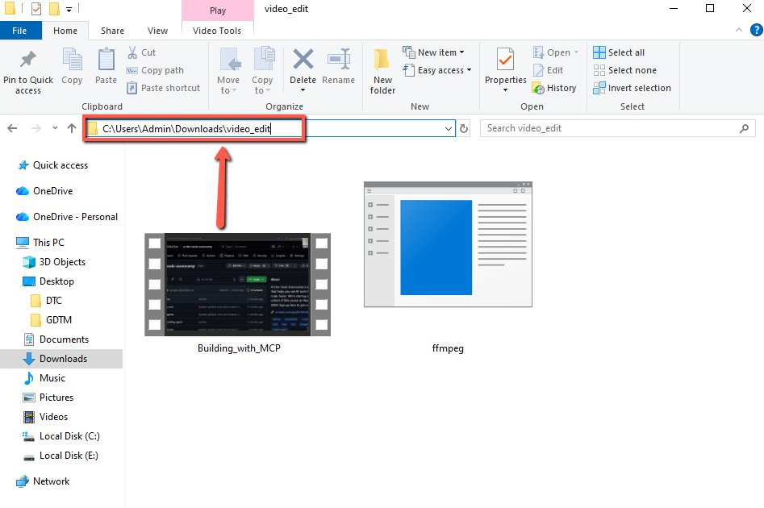
    <!-- sop-caption-start -->
    This screenshot anchors step 12 of the Cutting Videos with FFmpeg process by showing the screen for in the Download folder copy the folder location. Look for the red box or arrow around Download, then use that highlighted area as the target for the action before continuing.
    <!-- sop-caption-end -->
    <!-- sop-screenshot-end -->
<!-- sop-step-end -->

<!-- sop-step-start id=13 -->
13. Go to Windows and type in Command Prompt and click it to open.

    <!-- sop-screenshot-start -->
    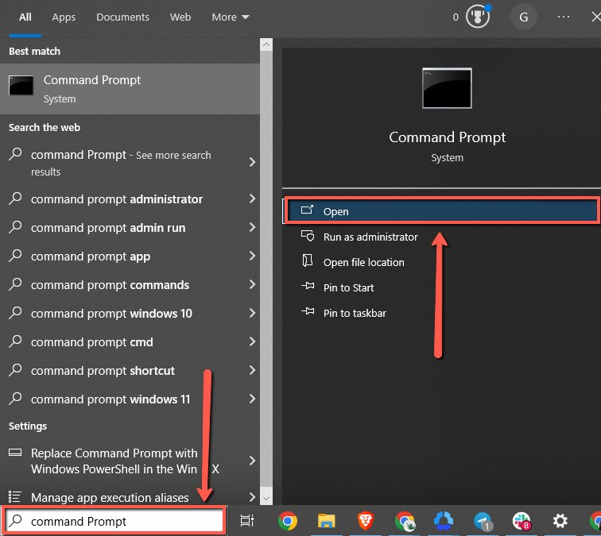
    <!-- sop-caption-start -->
    This screenshot anchors step 13 of the Cutting Videos with FFmpeg process by showing the screen for go to Windows and type in Command Prompt and click it to open. Look for the red box or arrow around Open, then use that highlighted area as the target for the action before continuing.
    <!-- sop-caption-end -->
    <!-- sop-screenshot-end -->
<!-- sop-step-end -->

<!-- sop-step-start id=14 -->
14. In Command Prompt type: “cd” then paste the folder location C:\Users\\YourName\>\Downloads\video_edit then press Enter.
    cd C:\Users\Admin\Downloads\video_edit
    <!-- sop-screenshot-start -->
    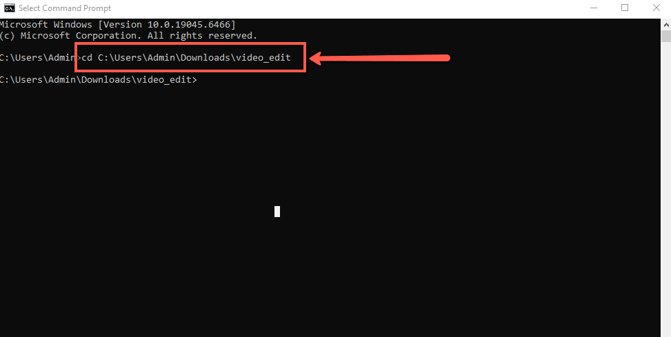
    <!-- sop-caption-start -->
    This screenshot anchors step 14 of the Cutting Videos with FFmpeg process by showing the screen for in Command Prompt type: "cd" then paste the folder location C:\Users\\YourName\ \Downloads\video edit then press. Look for the red box or arrow around Download, Edit, then use that highlighted area as the target for the action before continuing.
    <!-- sop-caption-end -->
    <!-- sop-screenshot-end -->
<!-- sop-step-end -->

<!-- sop-step-start id=15 -->
15. Type in “dir” and press Enter. It will verify that FFmpeg and the video are available in the folder.

    <!-- sop-screenshot-start -->
    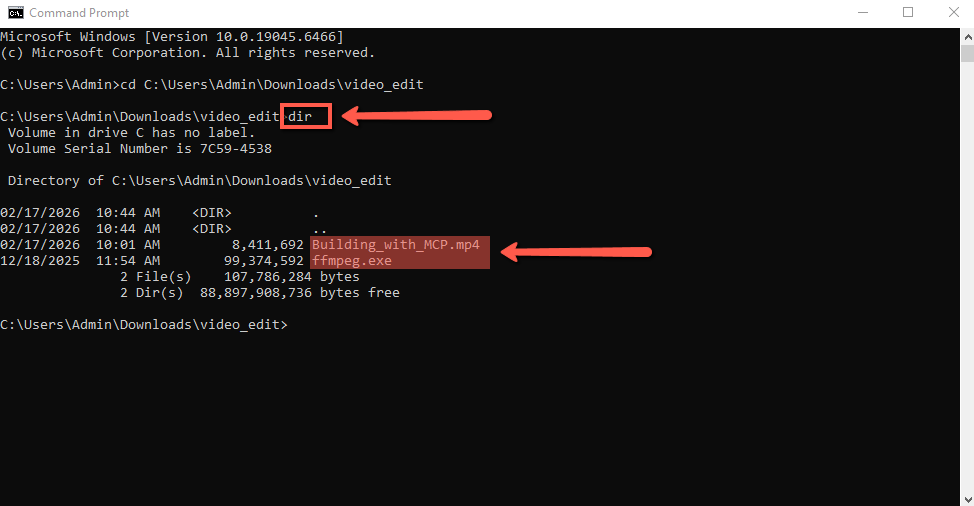
    <!-- sop-caption-start -->
    This screenshot anchors step 15 of the Cutting Videos with FFmpeg process by showing the screen for type in "dir" and press Enter. It will verify that FFmpeg and the video are available in the folder. Look for the red box, arrow, selected row, or highlighted screen area, then use that highlighted area as the target for the action before continuing.
    <!-- sop-caption-end -->
    <!-- sop-screenshot-end -->
<!-- sop-step-end -->

<!-- sop-step-start id=16 -->
16. To ensure the command works in the terminal, you must replace the placeholders in the Command with your specific data.

    Command: ffmpeg -ss 00:MM:SS -to 00:MM:SS -i input.mp4 -c copy chunk_N.mp4
    Rules for Manual Formatting:
    - Time: Use 00:MM:SS. If the transcript says 2:43, write 00:02:43.

    - Input: Replace input.mp4 with the exact title of your video (Building_with_MCP.mp4).

    - Output: Replace chunk_N.mp4 with the segment title.

    NOTE: Use underscores (\_) instead of spaces and remove all symbols (like &, ?, :, or -) as they will cause the command to fail.

    <!-- sop-screenshot-start -->
    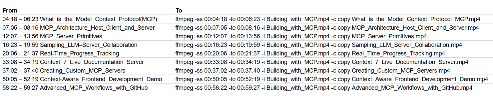
    <!-- sop-caption-start -->
    This screenshot anchors step 16 of the Cutting Videos with FFmpeg process by showing the screen for to ensure the command works in the terminal, you must replace the placeholders in the Command with your specific. Look for the red box, arrow, selected row, or highlighted screen area, then use that highlighted area as the target for the action before continuing.
    <!-- sop-caption-end -->
    <!-- sop-screenshot-end -->
<!-- sop-step-end -->

<!-- sop-step-start id=17 -->
17. Go back to CMD and paste the command for the first segment, then press Enter.
    NOTE: Wait for the process to finish. Once the command line is ready for input again, repeat the process for the next segment until all are completed.

    <!-- sop-screenshot-start -->
    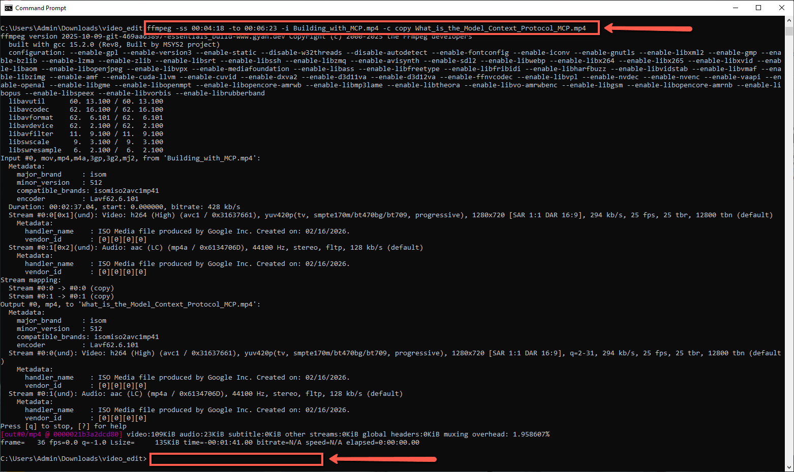
    <!-- sop-caption-start -->
    This screenshot anchors step 17 of the Cutting Videos with FFmpeg process by showing the screen for go back to CMD and paste the command for the first segment, then press Enter. Look for the red box, arrow, selected row, or highlighted screen area, then use that highlighted area as the target for the action before continuing.
    <!-- sop-caption-end -->
    <!-- sop-screenshot-end -->
<!-- sop-step-end -->

<!-- sop-step-start id=18 -->
18. Once all the videos are done, upload them from the “video_edit” folder on your desktop to the designated Google Drive folder.

    NOTE: Verify that all extracted clips are present in your local folder before initiating the transfer to ensure the Google Drive folder is complete.

    <!-- sop-screenshot-start -->
    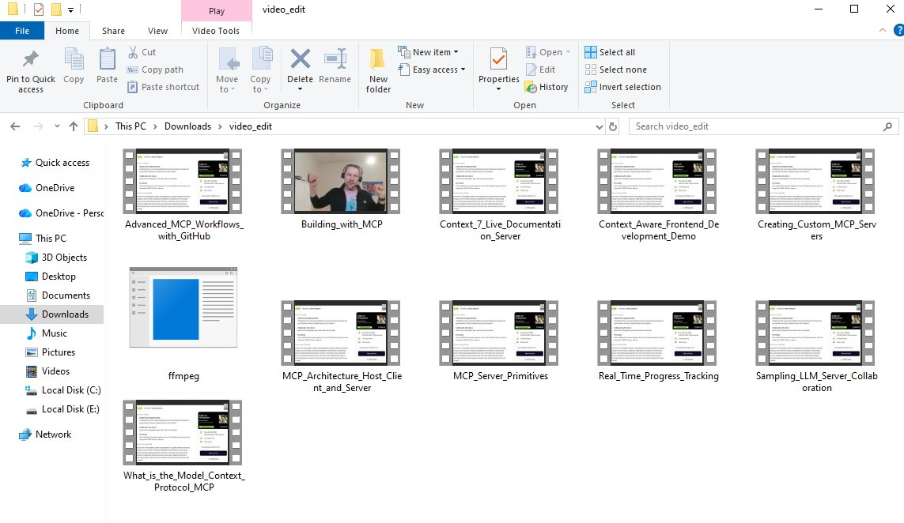
    <!-- sop-caption-start -->
    This screenshot anchors step 18 of the Cutting Videos with FFmpeg process by showing the screen for once all the videos are done, upload them from the "video edit" folder on your desktop to the designated Google. Look for the red box or arrow around "video edit", then use that highlighted area as the target for the action before continuing.
    <!-- sop-caption-end -->
    <!-- sop-screenshot-end -->

    <!-- sop-screenshot-start -->
    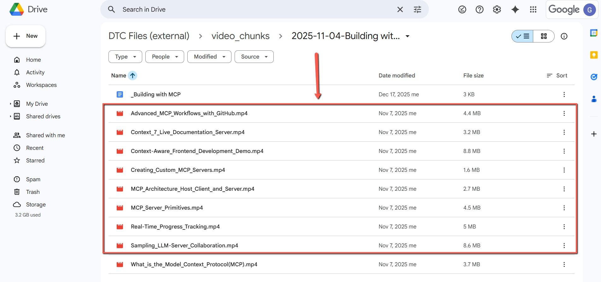
    <!-- sop-caption-start -->
    This screenshot anchors step 18 of the Cutting Videos with FFmpeg process by showing the screen for once all the videos are done, upload them from the "video edit" folder on your desktop to the designated Google. Look for the red box or arrow around "video edit", then use that highlighted area as the target for the action before continuing.
    <!-- sop-caption-end -->
    <!-- sop-screenshot-end -->
<!-- sop-step-end -->

<!-- sop-step-start id=19 -->
19. Copy the Google folder link and send it to DTC content team in telegram
<!-- sop-step-end -->
<!-- sop-section-end -->

<!-- sop-section-start: validation -->
## Validation


-
<!-- sop-section-end -->

<!-- sop-section-start: troubleshooting -->
## Troubleshooting


-
<!-- sop-section-end -->

<!-- sop-section-start: references -->
## References


-
<!-- sop-section-end -->
