# Editing videos using the Video Processor tool

<!-- sop-section-start: summary -->
## Summary

- Purpose: Process videos with the video processor tool before upload.
- Outcome: A processed video is exported with the requested volume and trimming settings.
- Trigger: A video needs audio adjustment or start trimming.
- Frequency: As needed before publishing videos.
<!-- sop-section-end -->

<!-- sop-section-start: prerequisites -->
## Prerequisites

- Access: Source video file and video processor tool.
- Tools: Video processor GUI.
- Inputs: Video file, volume increase value, and cut start duration.
<!-- sop-section-end -->

<!-- sop-section-start: procedure -->
## Procedure

<!-- sop-prose-start -->
How to edit videos using the Video Processor tool
Context: Explain why we need to do the process and its significance.

Example: Process Documents are made to increase efficiency in the work and elaborate the significance of the process or task to be made.

Step-by-step Instructions
<!-- sop-prose-end -->

<!-- sop-step-start id=1 -->
1.  First, open the video the needs necessary edits.

    Note: In this case, “LLM Zoomcamp 1.2 - Configuring Your Environment” is the video to be edited.

    <!-- sop-screenshot-start -->
    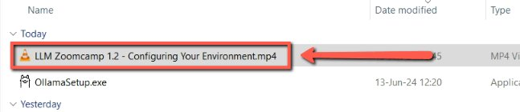
    <!-- sop-caption-start -->
    This screenshot anchors step 1 of the Editing videos using the Video Processor tool process by showing the screen for first, open the video the needs necessary edits. Look for the red box or arrow around Open, Edit, then use that highlighted area as the target for the action before continuing.
    <!-- sop-caption-end -->
    <!-- sop-screenshot-end -->
<!-- sop-step-end -->

<!-- sop-step-start id=2 -->
2.  After clicking, click on play and identify specific parts of the video that need editing.

    Note: In here, the “ding” sound at the beginning of the video is to be removed.

    <!-- sop-screenshot-start -->
    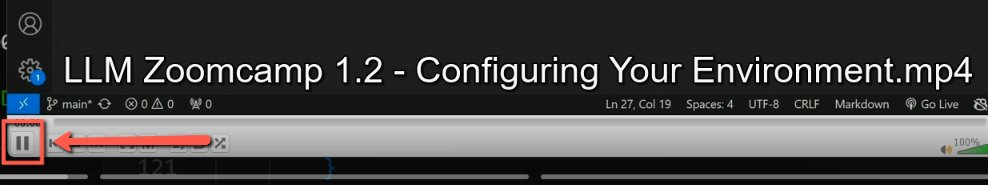
    <!-- sop-caption-start -->
    This screenshot anchors step 2 of the Editing videos using the Video Processor tool process by showing the screen for after clicking, click on play and identify specific parts of the video that need editing. Look for the red box or arrow around Edit, then use that highlighted area as the target for the action before continuing.
    <!-- sop-caption-end -->
    <!-- sop-screenshot-end -->
<!-- sop-step-end -->

<!-- sop-step-start id=3 -->
3.  After identifying, open the Video Processor tool to make the edits.

    <!-- sop-screenshot-start -->
    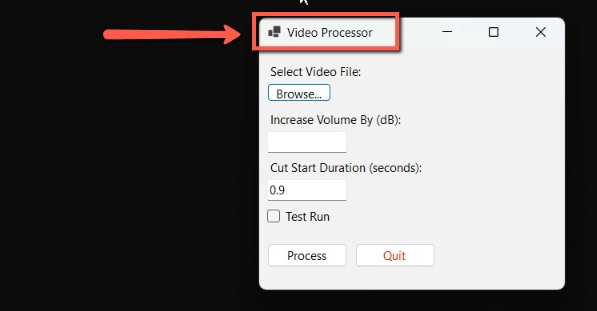
    <!-- sop-caption-start -->
    This screenshot anchors step 3 of the Editing videos using the Video Processor tool process by showing the screen for after identifying, open the Video Processor tool to make the edits. Look for the red box or arrow around Open, Process, then use that highlighted area as the target for the action before continuing.
    <!-- sop-caption-end -->
    <!-- sop-screenshot-end -->
<!-- sop-step-end -->

<!-- sop-step-start id=4 -->
4.  Then, click on “Browse” to select the file you want to edit.

    <!-- sop-screenshot-start -->
    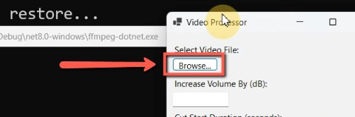
    <!-- sop-caption-start -->
    This screenshot anchors step 4 of the Editing videos using the Video Processor tool process by showing the screen for click on "Browse" to select the file you want to edit. Look for the red box or arrow around "Browse", then use that highlighted area as the target for the action before continuing.
    <!-- sop-caption-end -->
    <!-- sop-screenshot-end -->

    <!-- sop-screenshot-start -->
    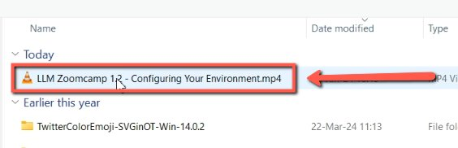
    <!-- sop-caption-start -->
    This screenshot anchors step 4 of the Editing videos using the Video Processor tool process by showing the screen for click on "Browse" to select the file you want to edit. Look for the red box or arrow around "Browse", then use that highlighted area as the target for the action before continuing.
    <!-- sop-caption-end -->
    <!-- sop-screenshot-end -->
<!-- sop-step-end -->

<!-- sop-step-start id=5 -->
5.  Upon clicking the file, the tool processes the video and immediately detects by how much you need to increases the volume of the video.

    Note: In this case, the selected video’s volume needs to be increases by 19.50 dB.

    <!-- sop-screenshot-start -->
    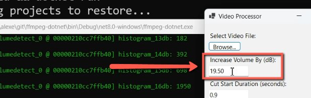
    <!-- sop-caption-start -->
    This screenshot anchors step 5 of the Editing videos using the Video Processor tool process by showing the screen for upon clicking the file, the tool processes the video and immediately detects by how much you need to increases the. Look for the red box or arrow around Process, then use that highlighted area as the target for the action before continuing.
    <!-- sop-caption-end -->
    <!-- sop-screenshot-end -->
<!-- sop-step-end -->

<!-- sop-step-start id=6 -->
6.  After, in “Cut Start Duration (seconds)”, input the value in seconds as to where the video should start with consideration to removing the “ding” sound at the beginning of the video.

    Note: If the video has no “ding” sound at the beginning, then, a value of “0” is to be placed.

    <!-- sop-screenshot-start -->
    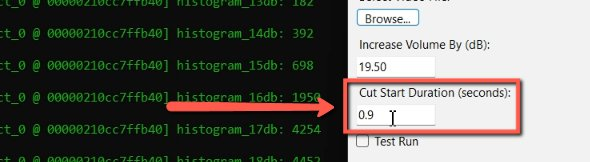
    <!-- sop-caption-start -->
    This screenshot anchors step 6 of the Editing videos using the Video Processor tool process by showing the screen for in "Cut Start Duration (seconds)", input the value in seconds as to where the video should start with. Look for the red boxes or arrows around "Cut Start Duration (seconds)", "ding", then use that highlighted area as the target for the action before continuing.
    <!-- sop-caption-end -->
    <!-- sop-screenshot-end -->
<!-- sop-step-end -->

<!-- sop-step-start id=7 -->
7.  Then, check the box beside “Test Run” and click “Process”.

    Note: A Test Run gives a 1 minute video to show the results of the edits made.

    <!-- sop-screenshot-start -->
    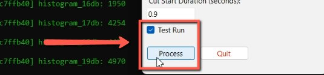
    <!-- sop-caption-start -->
    This screenshot anchors step 7 of the Editing videos using the Video Processor tool process by showing the screen for check the box beside "Test Run" and click "Process". Look for the red boxes or arrows around "Test Run", "Process", then use that highlighted area as the target for the action before continuing.
    <!-- sop-caption-end -->
    <!-- sop-screenshot-end -->
<!-- sop-step-end -->

<!-- sop-step-start id=8 -->
8.  After processing, a dialog box will appear. Click on “Ok” and a new file is created. Select the new file to see the changes made.

    <!-- sop-screenshot-start -->
    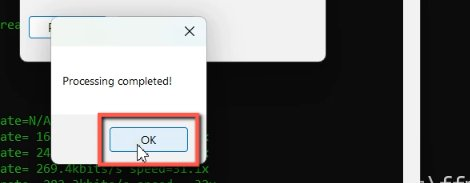
    <!-- sop-caption-start -->
    This screenshot anchors step 8 of the Editing videos using the Video Processor tool process by showing the screen for after processing, a dialog box will appear. Click on "Ok" and a new file is created. Select the new file to see. Look for the red box or arrow around Process, then use that highlighted area as the target for the action before continuing.
    <!-- sop-caption-end -->
    <!-- sop-screenshot-end -->

    <!-- sop-screenshot-start -->
    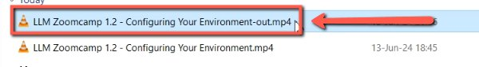
    <!-- sop-caption-start -->
    This screenshot anchors step 8 of the Editing videos using the Video Processor tool process by showing the screen for after processing, a dialog box will appear. Click on "Ok" and a new file is created. Select the new file to see. Look for the red box or arrow around Process, then use that highlighted area as the target for the action before continuing.
    <!-- sop-caption-end -->
    <!-- sop-screenshot-end -->
<!-- sop-step-end -->

<!-- sop-step-start id=9 -->
9.  Then, go back to the Video Processor tool and uncheck “Test Run” and select “Process” to make the necessary edits on the entire video.

    <!-- sop-screenshot-start -->
    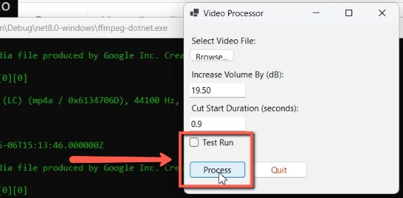
    <!-- sop-caption-start -->
    This screenshot anchors step 9 of the Editing videos using the Video Processor tool process by showing the screen for go back to the Video Processor tool and uncheck "Test Run" and select "Process" to make the necessary edits on the. Look for the red boxes or arrows around "Test Run", "Process", then use that highlighted area as the target for the action before continuing.
    <!-- sop-caption-end -->
    <!-- sop-screenshot-end -->
<!-- sop-step-end -->

<!-- sop-step-start id=10 -->
10. After processing, a dialog box showing “Processing completed!” will appear. Click on “Ok”.

    <!-- sop-screenshot-start -->
    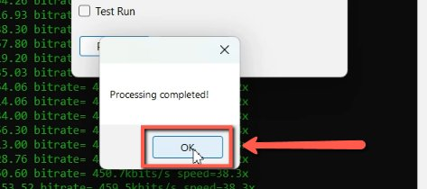
    <!-- sop-caption-start -->
    This screenshot anchors step 10 of the Editing videos using the Video Processor tool process by showing the screen for after processing, a dialog box showing "Processing completed!" will appear. Click on "Ok". Look for the red box or arrow around "Processing completed!", then use that highlighted area as the target for the action before continuing.
    <!-- sop-caption-end -->
    <!-- sop-screenshot-end -->
<!-- sop-step-end -->
<!-- sop-section-end -->

<!-- sop-section-start: validation -->
## Validation

-
<!-- sop-section-end -->

<!-- sop-section-start: troubleshooting -->
## Troubleshooting

-
<!-- sop-section-end -->

<!-- sop-section-start: references -->
## References

-
<!-- sop-section-end -->
