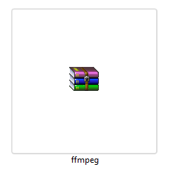
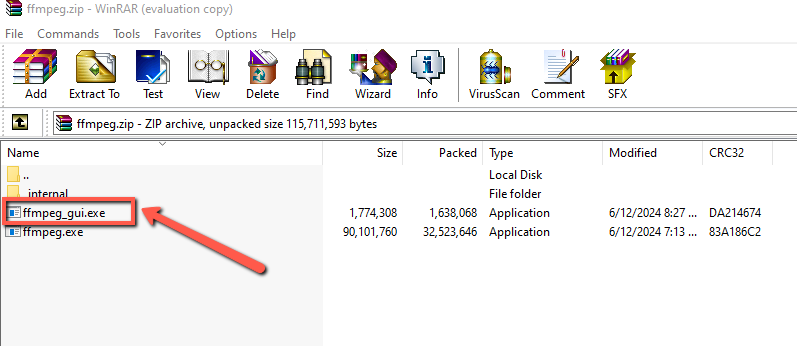
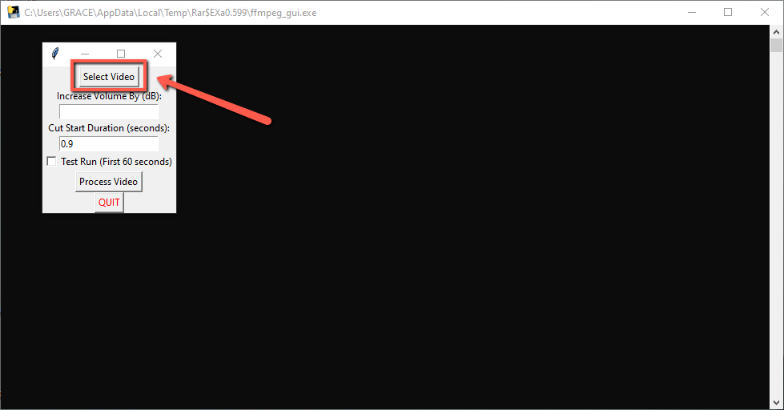
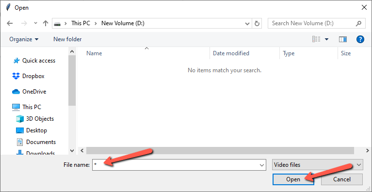
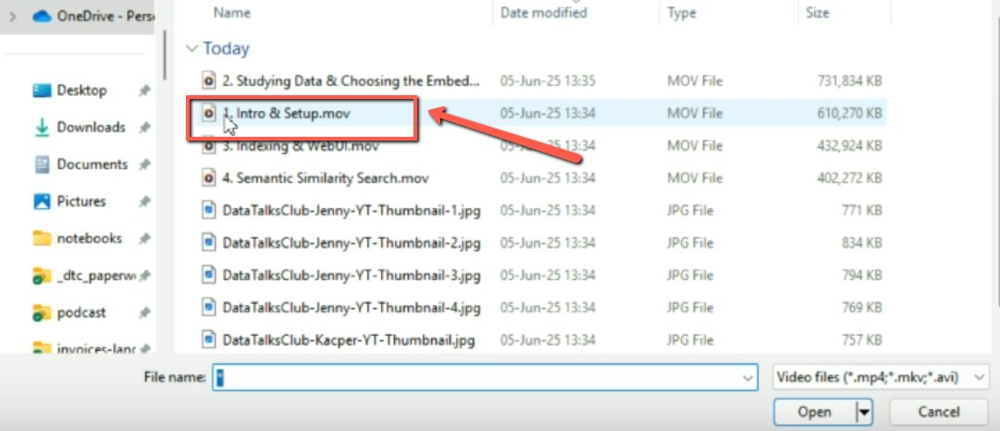
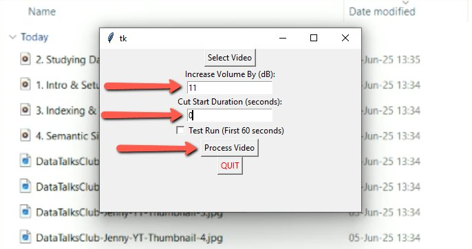
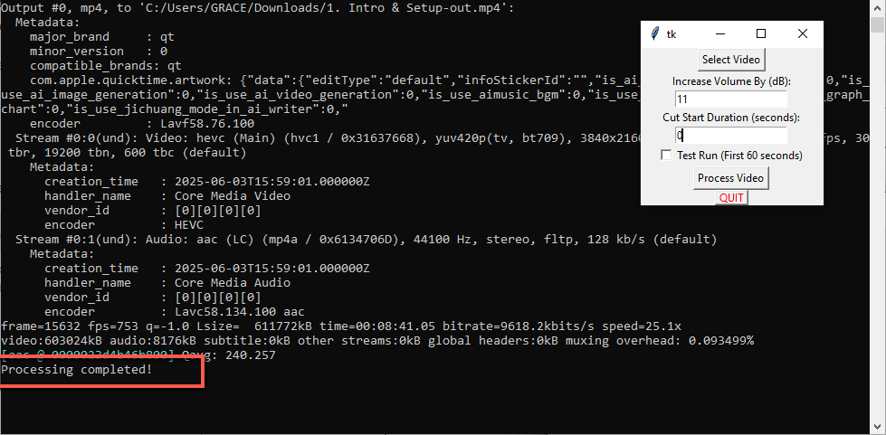
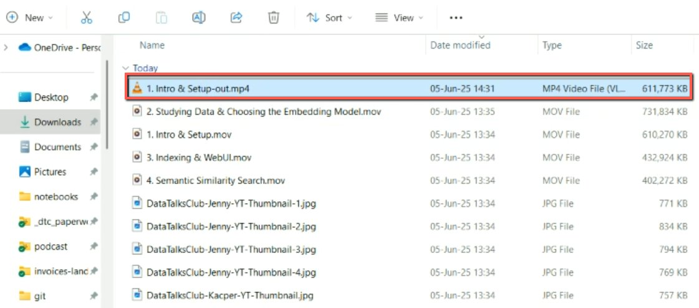

# Increasing Audio in Video using FFmpeg GUI

<!-- sop-section-start: summary -->
## Summary

- Purpose: Increase video audio volume using the FFmpeg GUI tool.
- Outcome: A processed video with corrected audio is ready for YouTube upload.
- Trigger: A video audio track is too quiet.
- Frequency: As needed before uploading videos.
<!-- sop-section-end -->

<!-- sop-section-start: prerequisites -->
## Prerequisites

- Access: Local video file and FFmpeg GUI tool.
- Tools: FFmpeg GUI video processor.
- Inputs: Video file and optional volume or cut duration settings.
<!-- sop-section-end -->

<!-- sop-section-start: procedure -->
## Procedure

<!-- sop-prose-start -->
Increasing Audio in Video using FFmpeg GUI
This procedure will show you the steps on how to increase audio in video using ffmpeg gui.

Step-by-step Instructions
<!-- sop-prose-end -->

<!-- sop-step-start id=1 -->
1.  The first step is to download the ffmpeg.zip file.

    <!-- sop-screenshot-start -->
    
    <!-- sop-caption-start -->
    This screenshot anchors step 1 of the Increasing Audio in Video using FFmpeg GUI process by showing the screen for the first step is to download the ffmpeg.zip file. Look for the red box or arrow around Download, then use that highlighted area as the target for the action before continuing.
    <!-- sop-caption-end -->
    <!-- sop-screenshot-end -->
<!-- sop-step-end -->

<!-- sop-step-start id=2 -->
2.  Open the exe file and double-click it to launch the application.

    <!-- sop-screenshot-start -->
    
    <!-- sop-caption-start -->
    This screenshot anchors step 2 of the Increasing Audio in Video using FFmpeg GUI process by showing the screen for open the exe file and double click it to launch the application. Look for the red box or arrow around Open, then use that highlighted area as the target for the action before continuing.
    <!-- sop-caption-end -->
    <!-- sop-screenshot-end -->
<!-- sop-step-end -->

<!-- sop-step-start id=3 -->
3.  Click “Select Video”.

    <!-- sop-screenshot-start -->
    
    <!-- sop-caption-start -->
    This screenshot anchors step 3 of the Increasing Audio in Video using FFmpeg GUI process by showing the screen for click "Select Video". Look for the red box or arrow around "Select Video", then use that highlighted area as the target for the action before continuing.
    <!-- sop-caption-end -->
    <!-- sop-screenshot-end -->
<!-- sop-step-end -->

<!-- sop-step-start id=4 -->
4.  Videos in the .mov format or extension cannot be visible or accessible in your file browser. To locate such files, type an asterisk or star “\*” in the File name bar and click on"Open ".

    <!-- sop-screenshot-start -->
    
    <!-- sop-caption-start -->
    This screenshot anchors step 4 of the Increasing Audio in Video using FFmpeg GUI process by showing the screen for videos in the .mov format or extension cannot be visible or accessible in your file browser. To locate such files. Look for the red box or arrow around "Open", then use that highlighted area as the target for the action before continuing.
    <!-- sop-caption-end -->
    <!-- sop-screenshot-end -->
<!-- sop-step-end -->

<!-- sop-step-start id=5 -->
5.  Click on the video you are supposed to edit.

    <!-- sop-screenshot-start -->
    
    <!-- sop-caption-start -->
    This screenshot anchors step 5 of the Increasing Audio in Video using FFmpeg GUI process by showing the screen for click on the video you are supposed to edit. Look for the red box or arrow around Edit, then use that highlighted area as the target for the action before continuing.
    <!-- sop-caption-end -->
    <!-- sop-screenshot-end -->
<!-- sop-step-end -->

<!-- sop-step-start id=6 -->
6.  By default, the tool finds the optimum increase in volume. Unless otherwise specified, leave the “Increase Volume By (dB)” field as it automatically detects the appropriate value. Type “0” in the Cut Duration field, then click on “Process Video”.

    <!-- sop-screenshot-start -->
    
    <!-- sop-caption-start -->
    This screenshot anchors step 6 of the Increasing Audio in Video using FFmpeg GUI process by showing the screen for by default, the tool finds the optimum increase in volume. Unless otherwise specified, leave the "Increase Volume. Look for the red boxes or arrows around "Increase Volume By (dB)", "Process Video", then use that highlighted area as the target for the action before continuing.
    <!-- sop-caption-end -->
    <!-- sop-screenshot-end -->
<!-- sop-step-end -->

<!-- sop-step-start id=7 -->
7.  You will see the video being processed in this window.

    <!-- sop-screenshot-start -->
    
    <!-- sop-caption-start -->
    This screenshot anchors step 7 of the Increasing Audio in Video using FFmpeg GUI process by showing the screen for you will see the video being processed in this window. Look for the red box or arrow around Process, then use that highlighted area as the target for the action before continuing.
    <!-- sop-caption-end -->
    <!-- sop-screenshot-end -->

    This is the output that you upload to Youtube

    <!-- sop-screenshot-start -->
    
    <!-- sop-caption-start -->
    This screenshot anchors step 7 of the Increasing Audio in Video using FFmpeg GUI process by showing the screen for you will see the video being processed in this window. This is the output that you upload to Youtube. Look for the red box or arrow around Process, Upload, then use that highlighted area as the target for the action before continuing.
    <!-- sop-caption-end -->
    <!-- sop-screenshot-end -->
<!-- sop-step-end -->
<!-- sop-section-end -->

<!-- sop-section-start: validation -->
## Validation

-
<!-- sop-section-end -->

<!-- sop-section-start: troubleshooting -->
## Troubleshooting

-
<!-- sop-section-end -->

<!-- sop-section-start: references -->
## References

-
<!-- sop-section-end -->
