# Updating timecodes for course videos from github issues

<!-- sop-section-start: summary -->
## Summary

- Purpose: Add course video timecodes from GitHub issues to YouTube descriptions.
- Outcome: The YouTube video description contains valid timecodes starting at 00:00.
- Trigger: A GitHub issue or notification provides new video timecodes.
- Frequency: As needed when course video timecodes are submitted.
<!-- sop-section-end -->

<!-- sop-section-start: prerequisites -->
## Prerequisites

- Access: Course GitHub issue and YouTube Studio.
- Tools: GitHub and YouTube Studio.
- Inputs: GitHub issue with timecodes and the target YouTube video.
<!-- sop-section-end -->

<!-- sop-section-start: procedure -->
## Procedure

<!-- sop-prose-start -->
How to update timecodes for course videos from GitHub issues
This procedure will show you the steps on how to update timecodes for course videos from GitHub issues.

Step-by-step Instructions
<!-- sop-prose-end -->

<!-- sop-step-start id=1 -->
1.  The first thing you need to do is open the [Github repo](https://github.com/DataTalksClub/mlops-zoomcamp/issues/13#event-6629270246) or browse any notification from your email when a person adds the timecodes.

    <!-- sop-screenshot-start -->
    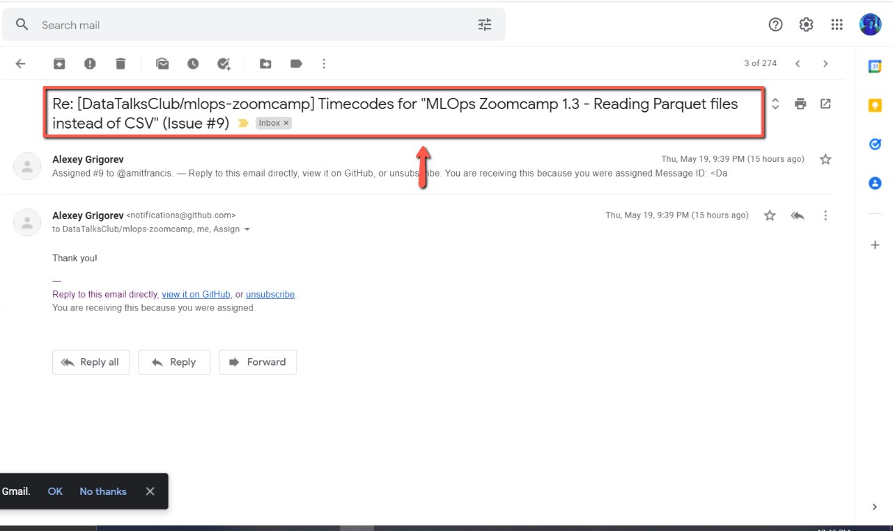
    <!-- sop-caption-start -->
    This screenshot anchors step 1 of the Updating timecodes for course videos from github issues process by showing the screen for open the Github repo or browse any notification from your email when a person adds the timecodes. Look for the red box or arrow around Browse, Open, then use that highlighted area as the target for the action before continuing.
    <!-- sop-caption-end -->
    <!-- sop-screenshot-end -->
<!-- sop-step-end -->

<!-- sop-step-start id=2 -->
2.  Then, click on “view it on Github”

    <!-- sop-screenshot-start -->
    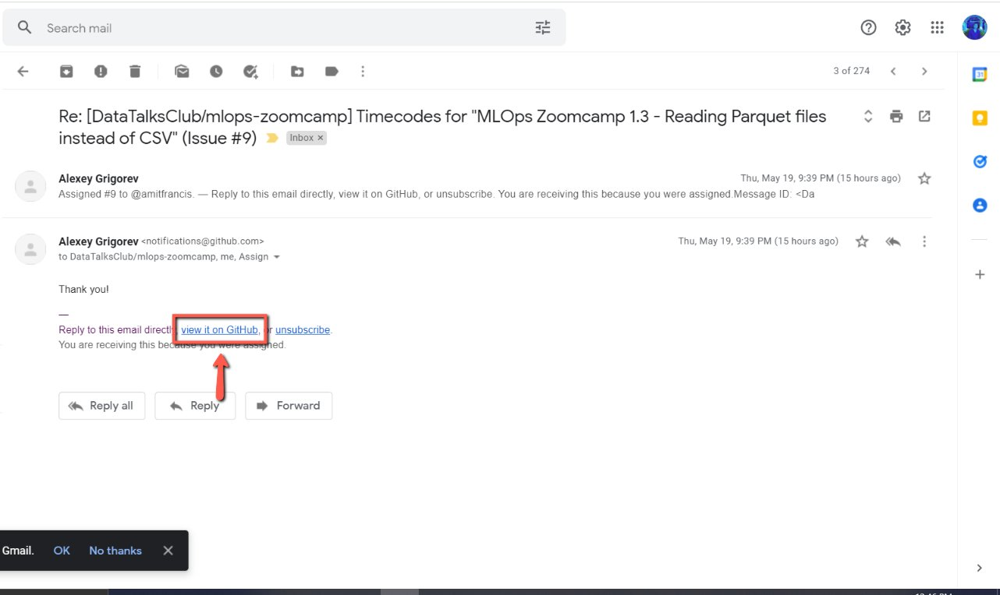
    <!-- sop-caption-start -->
    This screenshot anchors step 2 of the Updating timecodes for course videos from github issues process by showing the screen for click on "view it on Github". Look for the red box or arrow around "view it on Github", then use that highlighted area as the target for the action before continuing.
    <!-- sop-caption-end -->
    <!-- sop-screenshot-end -->
<!-- sop-step-end -->

<!-- sop-step-start id=3 -->
3.  And then it will redirect you to the Github repo, copy the timecodes and select the YouTube video.

    <!-- sop-screenshot-start -->
    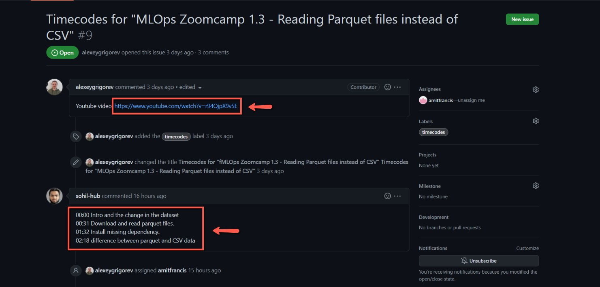
    <!-- sop-caption-start -->
    This screenshot anchors step 3 of the Updating timecodes for course videos from github issues process by showing the screen for it will redirect you to the Github repo, copy the timecodes and select the YouTube video. Look for the red box, arrow, selected row, or highlighted screen area, then use that highlighted area as the target for the action before continuing.
    <!-- sop-caption-end -->
    <!-- sop-screenshot-end -->
<!-- sop-step-end -->

<!-- sop-step-start id=4 -->
4.  Once you are in the Youtube video, select “Edit video”

    <!-- sop-screenshot-start -->
    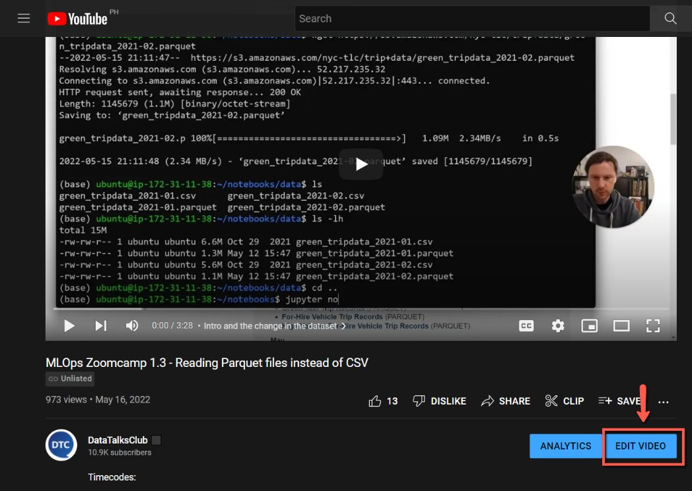
    <!-- sop-caption-start -->
    This screenshot anchors step 4 of the Updating timecodes for course videos from github issues process by showing the screen for once you are in the Youtube video, select "Edit video". Look for the red box or arrow around "Edit video", then use that highlighted area as the target for the action before continuing.
    <!-- sop-caption-end -->
    <!-- sop-screenshot-end -->
<!-- sop-step-end -->

<!-- sop-step-start id=5 -->
5.  And then, paste the timecode of the video.

    Note: If the given timecode doesn’t begin with 00:00, manually add “00:00 \<TITLE\>” in the beginning so that the timecodes will be valid.

    Incorrect time code (doesn’t begin with 00:00)

    00:31 Download and read parquet files.

    01:32 Install missing dependency.

    02:18 Difference between parquet and CSV data

    Correct Timecodes (by adding 00:00 \<TITLE\> in the beginning):

    00:00 Intro and the change in the dataset

    00:31 Download and read parquet files.

    01:32 Install missing dependency.

    02:18 Difference between parquet and CSV data

    <!-- sop-screenshot-start -->
    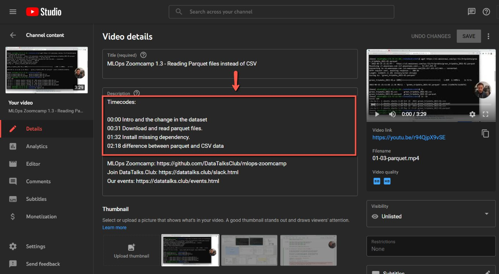
    <!-- sop-caption-start -->
    This screenshot anchors step 5 of the Updating timecodes for course videos from github issues process by showing the screen for , paste the timecode of the video. Incorrect time code (doesn't begin with 00:00) 00:31 Download and read parquet. Look for the red box or arrow around Add, Download, then use that highlighted area as the target for the action before continuing.
    <!-- sop-caption-end -->
    <!-- sop-screenshot-end -->
<!-- sop-step-end -->

<!-- sop-step-start id=6 -->
6.  After updating the timecodes, go back to the GitHub repo and leave a [comment](https://docs.google.com/document/d/15NeUm15z5HPEBKc4dWsFR85lB3thRX1cYWJJL08WGhc/edit?usp=sharing)

    Note: Don’t forget to say “Thank you! I've updated the timecodes” to the person via email.
    <!-- sop-screenshot-start -->
    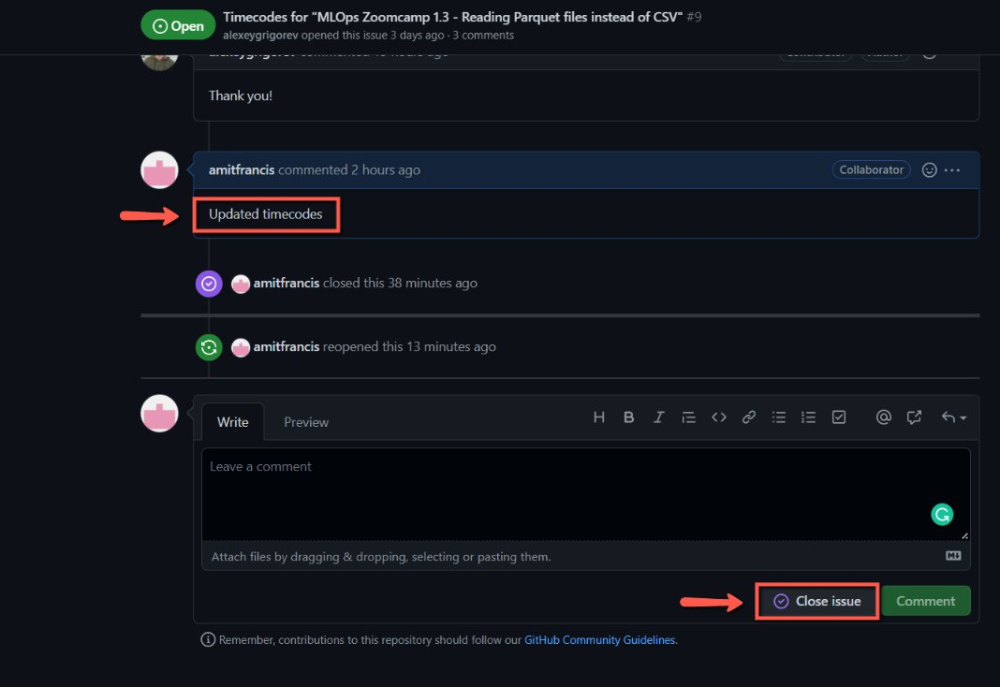
    <!-- sop-caption-start -->
    This screenshot anchors step 6 of the Updating timecodes for course videos from github issues process by showing the screen for after updating the timecodes, go back to the GitHub repo and leave a comment. Look for the red box, arrow, selected row, or highlighted screen area, then use that highlighted area as the target for the action before continuing.
    <!-- sop-caption-end -->
    <!-- sop-screenshot-end -->
<!-- sop-step-end -->

<!-- sop-step-start id=7 -->
7.  If the person removes the timecode in the Github issue, reopen it by clicking “Reopen”

    <!-- sop-screenshot-start -->
    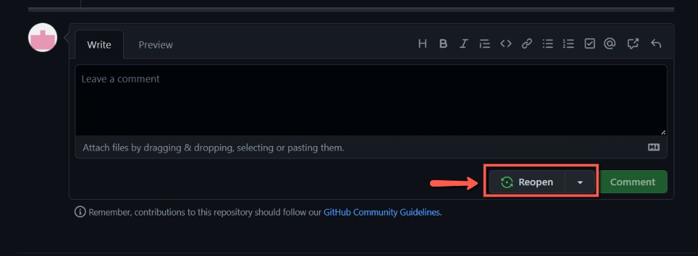
    <!-- sop-caption-start -->
    This screenshot anchors step 7 of the Updating timecodes for course videos from github issues process by showing the screen for if the person removes the timecode in the Github issue, reopen it by clicking "Reopen". Look for the red box or arrow around "Reopen", then use that highlighted area as the target for the action before continuing.
    <!-- sop-caption-end -->
    <!-- sop-screenshot-end -->
<!-- sop-step-end -->

<!-- sop-step-start id=8 -->
8.  Once the person updated the new timecodes, copy the timecodes.

    <!-- sop-screenshot-start -->
    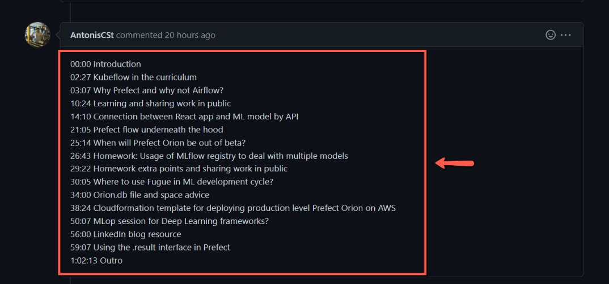
    <!-- sop-caption-start -->
    This screenshot anchors step 8 of the Updating timecodes for course videos from github issues process by showing the screen for once the person updated the new timecodes, copy the timecodes. Look for the red box, arrow, selected row, or highlighted screen area, then use that highlighted area as the target for the action before continuing.
    <!-- sop-caption-end -->
    <!-- sop-screenshot-end -->
<!-- sop-step-end -->

<!-- sop-step-start id=9 -->
9.  And then click the link to the YouTube video

    <!-- sop-screenshot-start -->
    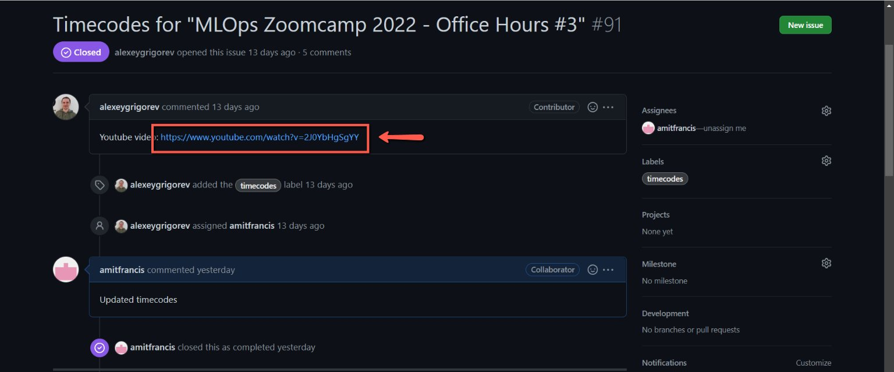
    <!-- sop-caption-start -->
    This screenshot anchors step 9 of the Updating timecodes for course videos from github issues process by showing the screen for click the link to the YouTube video. Look for the red box, arrow, selected row, or highlighted screen area, then use that highlighted area as the target for the action before continuing.
    <!-- sop-caption-end -->
    <!-- sop-screenshot-end -->
<!-- sop-step-end -->

<!-- sop-step-start id=10 -->
10. After, click” EDIT VIDEO”

    <!-- sop-screenshot-start -->
    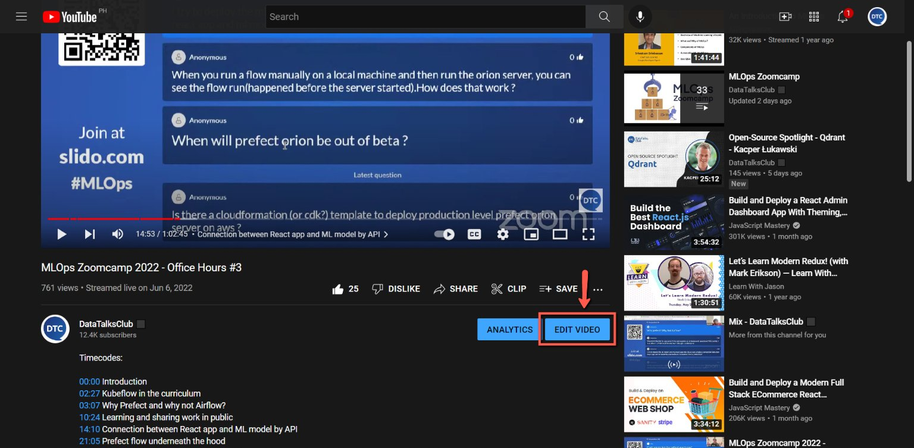
    <!-- sop-caption-start -->
    This screenshot anchors step 10 of the Updating timecodes for course videos from github issues process by showing the screen for click" EDIT VIDEO". Look for the red box or arrow around "EDIT VIDEO", then use that highlighted area as the target for the action before continuing.
    <!-- sop-caption-end -->
    <!-- sop-screenshot-end -->
<!-- sop-step-end -->

<!-- sop-step-start id=11 -->
11. Lastly, paste the timecodes under “Description”

    <!-- sop-screenshot-start -->
    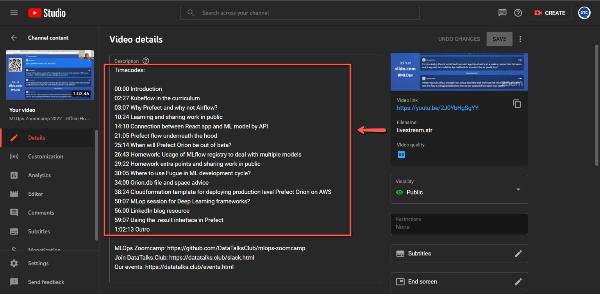
    <!-- sop-caption-start -->
    This screenshot anchors step 11 of the Updating timecodes for course videos from github issues process by showing the screen for paste the timecodes under "Description". Look for the red box or arrow around "Description", then use that highlighted area as the target for the action before continuing.
    <!-- sop-caption-end -->
    <!-- sop-screenshot-end -->
<!-- sop-step-end -->
<!-- sop-section-end -->

<!-- sop-section-start: validation -->
## Validation

-
<!-- sop-section-end -->

<!-- sop-section-start: troubleshooting -->
## Troubleshooting

-
<!-- sop-section-end -->

<!-- sop-section-start: references -->
## References

-
<!-- sop-section-end -->
