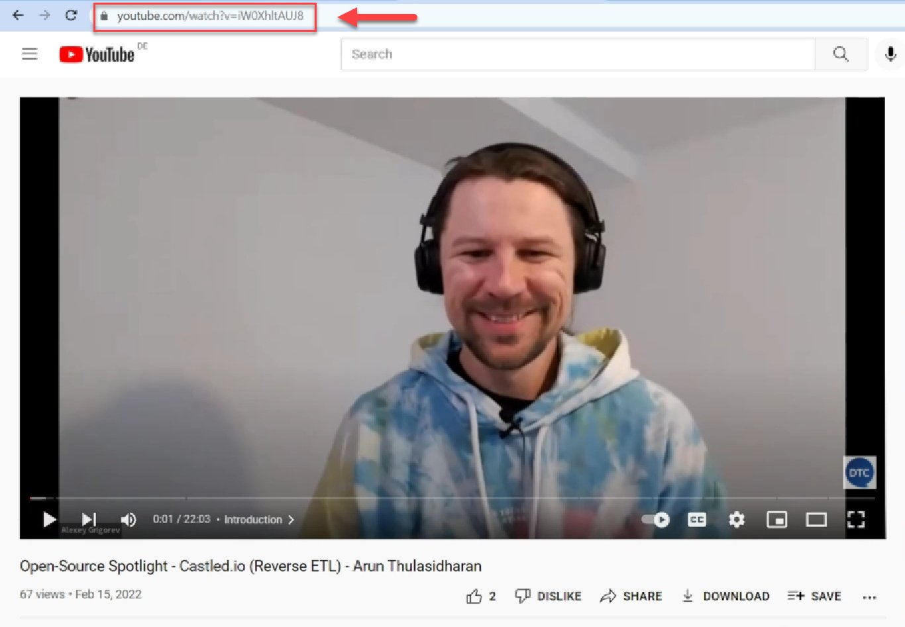
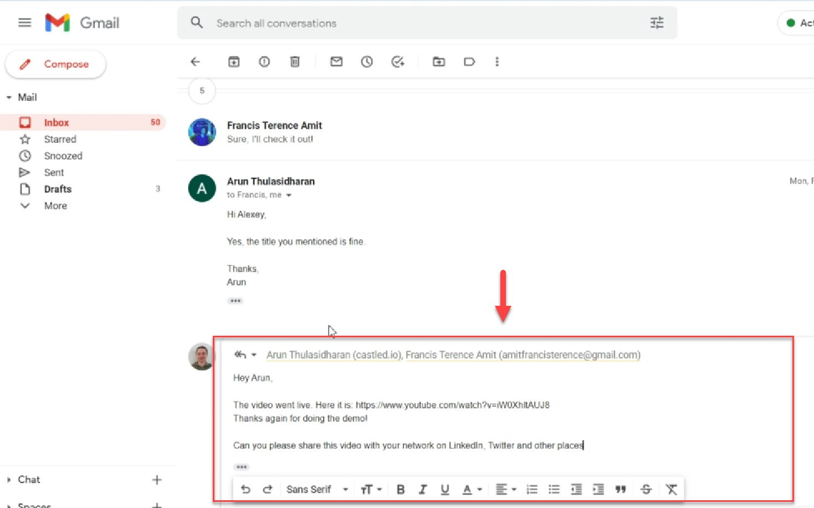

# Ask guests to share the video with their network

<!-- sop-section-start: summary -->
## Summary

- Purpose: Ask webinar guests to share the published video with their network.
- Outcome: The guest receives the YouTube link and sharing request.
- Trigger: A webinar video is published on YouTube.
- Frequency: After each webinar video is published.
<!-- sop-section-end -->

<!-- sop-section-start: prerequisites -->
## Prerequisites

- Access: YouTube video URL and a channel to contact the guest.
- Tools: YouTube, Gmail, or LinkedIn.
- Inputs: Published YouTube video URL and guest contact.
<!-- sop-section-end -->

<!-- sop-section-start: procedure -->
## Procedure

<!-- sop-prose-start -->
How to ask guests to share the video with their network

This procedure will show you the steps on how to share the video with their network.

Step-by-step Instructions
<!-- sop-prose-end -->

<!-- sop-step-start id=1 -->
1.  First, copy the URL of the YouTube video.

    <!-- sop-screenshot-start -->
    
    <!-- sop-caption-start -->
    This screenshot anchors the step about first, copy the URL of the YouTube video so you can match the documented UI before acting. Look for the link, copy, or paste target shown there, then use it to confirm you are in the correct place before continuing.
    <!-- sop-caption-end -->
    <!-- sop-screenshot-end -->
<!-- sop-step-end -->

<!-- sop-step-start id=2 -->
2.  Paste the link to the youtube video and send it to the speaker via Gmail.

    Note: You may also use another platform other than Gmail. LinkedIn may do so.

    <!-- sop-screenshot-start -->
    
    <!-- sop-caption-start -->
    This screenshot anchors the step about you may also use another platform other than Gmail. LinkedIn may do so so you can match the documented UI before acting. Look for the email or message detail shown there, then use it to confirm you are in the correct place before continuing.
    <!-- sop-caption-end -->
    <!-- sop-screenshot-end -->
<!-- sop-step-end -->
<!-- sop-section-end -->

<!-- sop-section-start: validation -->
## Validation

-
<!-- sop-section-end -->

<!-- sop-section-start: troubleshooting -->
## Troubleshooting

-
<!-- sop-section-end -->

<!-- sop-section-start: references -->
## References

-
<!-- sop-section-end -->
