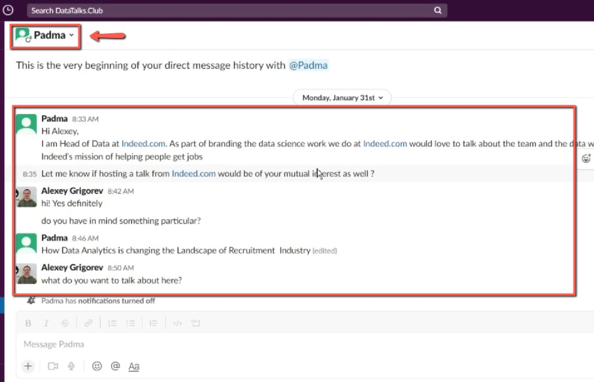
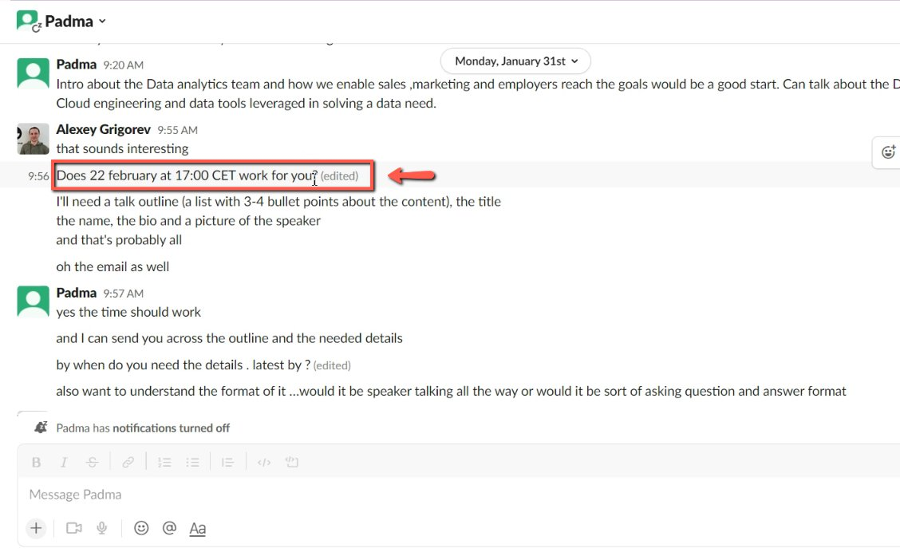
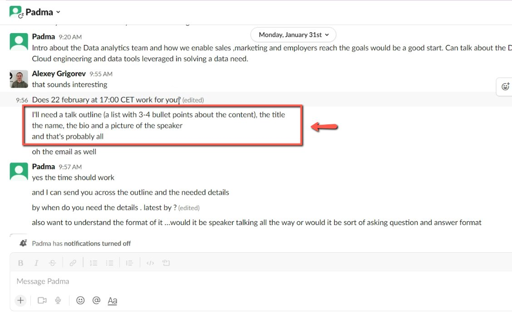

# Initial contact with the speaker

<!-- sop-section-start: summary -->
## Summary

- Purpose: Start coordination with a prospective webinar speaker.
- Outcome: The speaker is asked for date availability, talk outline, title, bio, picture, and email.
- Trigger: A speaker needs to be contacted for a webinar.
- Frequency: For each prospective webinar speaker.
<!-- sop-section-end -->

<!-- sop-section-start: prerequisites -->
## Prerequisites

- Access: Speaker contact channel.
- Tools: Email, LinkedIn, or another messaging channel.
- Inputs: Speaker name, proposed event date, and requested talk details.
<!-- sop-section-end -->

<!-- sop-section-start: procedure -->
## Procedure

<!-- sop-prose-start -->
How to have initial contact with the speaker
This procedure will show you the steps on how to have initial contact with the speaker.

Step-by-step Instructions
<!-- sop-prose-end -->

<!-- sop-step-start id=1 -->
1.  The first thing you will need to do is contact the speaker.

    <!-- sop-screenshot-start -->
    
    <!-- sop-caption-start -->
    This screenshot anchors the step to contact the speaker so you can match the documented UI before acting. Look for the relevant screen area shown there, then use it to confirm you are in the correct place before continuing.
    <!-- sop-caption-end -->
    <!-- sop-screenshot-end -->
<!-- sop-step-end -->

<!-- sop-step-start id=2 -->
2.  After, propose the date of the event.

    <!-- sop-screenshot-start -->
    
    <!-- sop-caption-start -->
    This screenshot anchors the step to propose the date of the event so you can match the documented UI before acting. Look for the schedule or date control shown there, then use it to confirm you are in the correct place before continuing.
    <!-- sop-caption-end -->
    <!-- sop-screenshot-end -->
<!-- sop-step-end -->

<!-- sop-step-start id=3 -->
3.  And then, ask for the talk outline of the event from the speaker. This include
    the content, title, name, bio, and picture of the speaker and the email.
    Note: Don't forget also to ask for the subtitle of the event.

    <!-- sop-screenshot-start -->
    
    <!-- sop-caption-start -->
    This screenshot anchors the step about the content, title, name, bio, and picture of the speaker and the email so you can match the documented UI before acting. Look for the email or message detail shown there, then use it to confirm you are in the correct place before continuing.
    <!-- sop-caption-end -->
    <!-- sop-screenshot-end -->
<!-- sop-step-end -->
<!-- sop-section-end -->

<!-- sop-section-start: validation -->
## Validation

-
<!-- sop-section-end -->

<!-- sop-section-start: troubleshooting -->
## Troubleshooting

-
<!-- sop-section-end -->

<!-- sop-section-start: references -->
## References

-
<!-- sop-section-end -->
