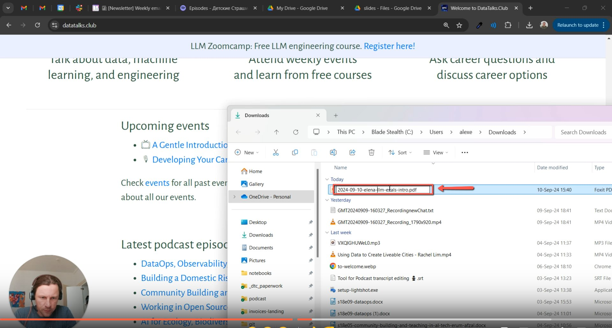
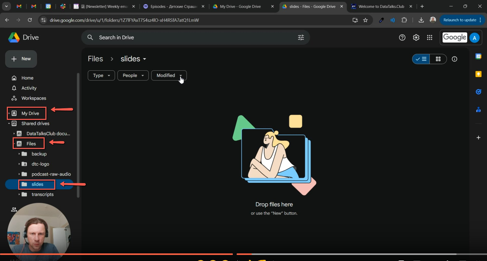
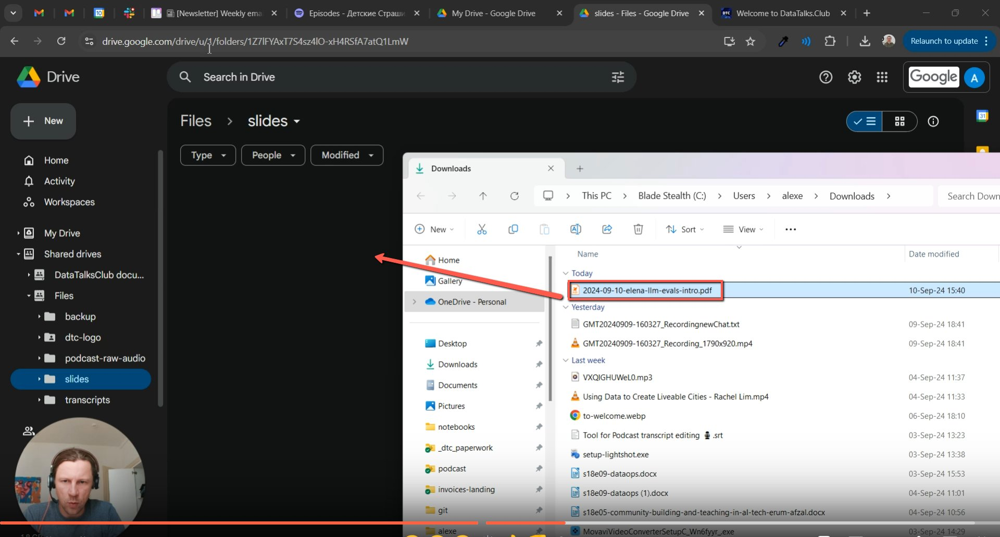
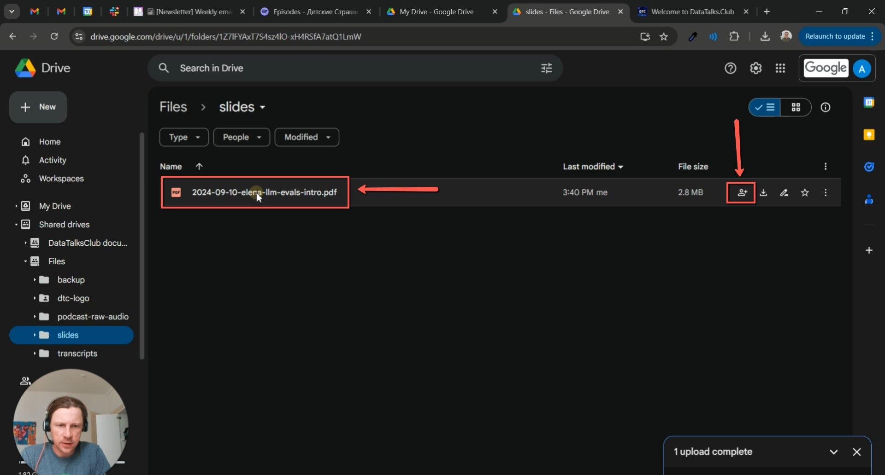
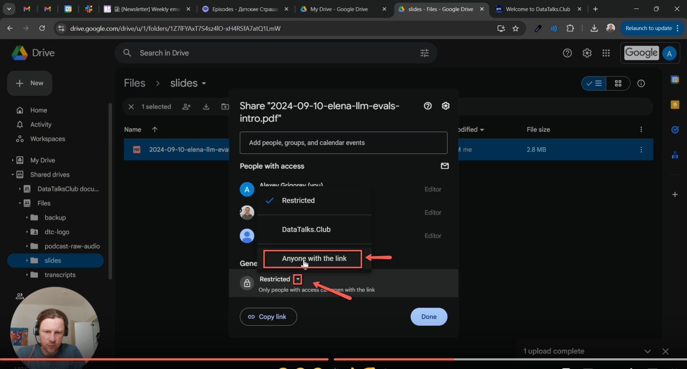
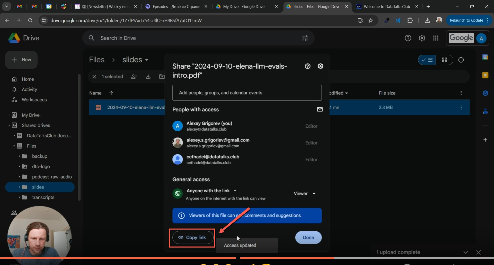
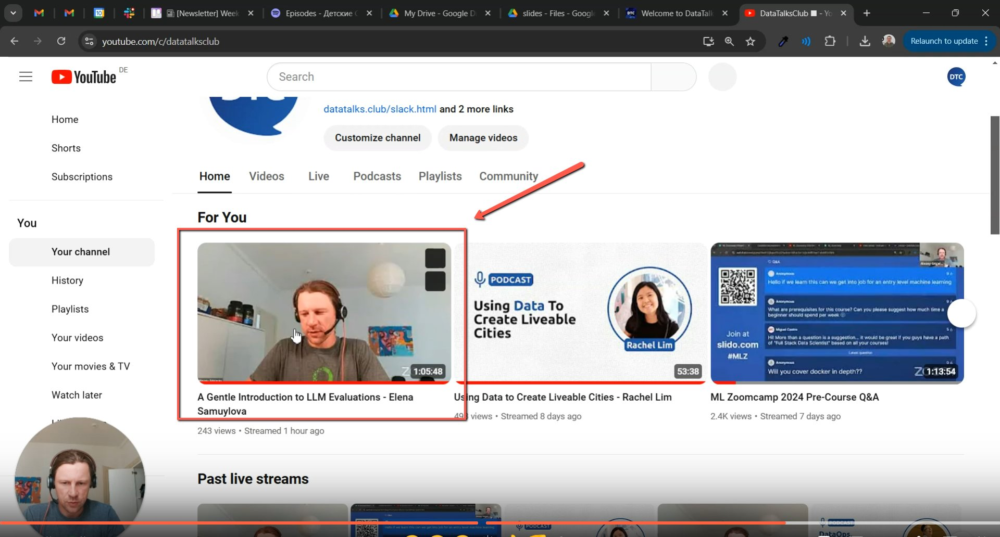
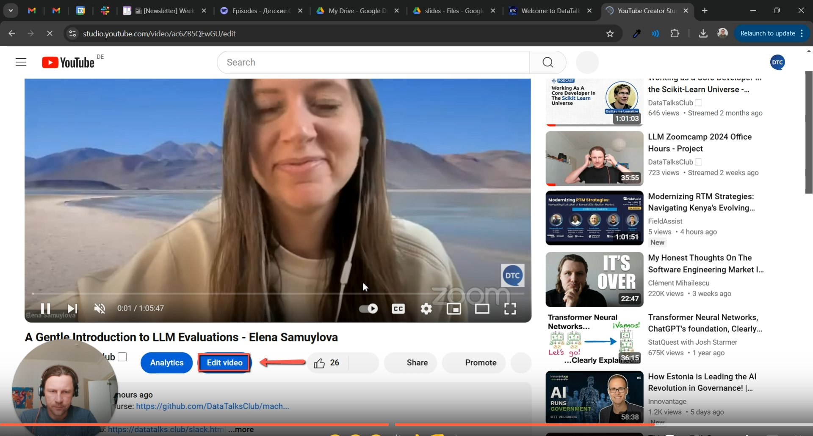
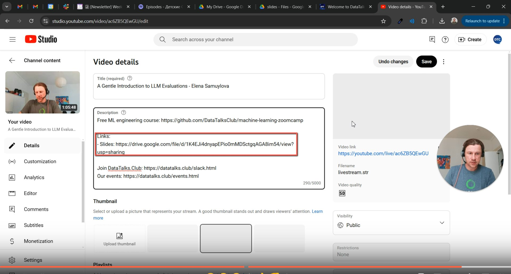

# Uploading Webinar Slides Tutorial

<!-- sop-section-start: summary -->
## Summary

- Purpose: Uploading Webinar Slides in Drive
- Outcome: The webinar slides are uploaded to Drive, shared by link, and added to the YouTube description.
- Trigger: When we need to Link slides for a Youtube Video
- Frequency: Whenever webinar slides need to be linked from YouTube.
<!-- sop-section-end -->

<!-- sop-section-start: prerequisites -->
## Prerequisites

- Access: Google Drive slides folder and YouTube Studio.
- Tools: Google Drive and YouTube Studio.
- Inputs: Webinar slides file, file naming details, and target YouTube video.
<!-- sop-section-end -->

<!-- sop-section-start: procedure -->
## Procedure

<!-- sop-group-start: "Format the Name" -->
### Format the Name

<!-- sop-step-start id=1 -->
1.  Rename the file in this format: \[Date-FirstName-ShortTitle\].

    <!-- sop-screenshot-start -->
    
    <!-- sop-caption-start -->
    This screenshot anchors the step to rename the file in this format: [Date-FirstName-ShortTitle] so you can match the documented UI before acting. Look for the file transfer or file picker state shown there, then use it to confirm you are in the correct place before continuing.
    <!-- sop-caption-end -->
    <!-- sop-screenshot-end -->
<!-- sop-step-end -->

<!-- sop-group-end -->

<!-- sop-group-start: "Upload in a Shared Folder" -->
### Upload in a Shared Folder

<!-- sop-step-start id=2 -->
2.  Go to drive, click “Files” and select “slides”.

    <!-- sop-screenshot-start -->
    
    <!-- sop-caption-start -->
    This screenshot anchors the step to go to drive, click “Files” and select “slides” so you can match the documented UI before acting. Look for “Files” and “slides”, then use those cues to complete or verify the step before continuing.
    <!-- sop-caption-end -->
    <!-- sop-screenshot-end -->
<!-- sop-step-end -->

<!-- sop-step-start id=3 -->
3.  Drag the file in the drive to upload.

    <!-- sop-screenshot-start -->
    
    <!-- sop-caption-start -->
    This screenshot anchors the step to drag the file in the drive to upload so you can match the documented UI before acting. Look for the file transfer or file picker state shown there, then use it to confirm you are in the correct place before continuing.
    <!-- sop-caption-end -->
    <!-- sop-screenshot-end -->
<!-- sop-step-end -->

<!-- sop-step-start id=4 -->
4.  Once upload is completed, click the “share button” on the right side of the screen.

    <!-- sop-screenshot-start -->
    
    <!-- sop-caption-start -->
    This screenshot anchors the step about once upload is completed, click the “share button” on the right side of the screen so you can match the documented UI before acting. Look for “share button”, then use that cue to complete or verify the step before continuing.
    <!-- sop-caption-end -->
    <!-- sop-screenshot-end -->
<!-- sop-step-end -->

<!-- sop-step-start id=5 -->
5.  Another tab will appear and click the downwards arrow right beside the word “restricted” and select “Anyone with the link”

    <!-- sop-screenshot-start -->
    
    <!-- sop-caption-start -->
    This screenshot anchors the step about another tab will appear and click the downwards arrow right beside the word “restricted” and select “Anyone with the link” so you can match the documented UI before acting. Look for “restricted” and “Anyone with the link”, then use those cues to complete or verify the step before continuing.
    <!-- sop-caption-end -->
    <!-- sop-screenshot-end -->
<!-- sop-step-end -->

<!-- sop-step-start id=6 -->
6.  After access is successfully changed click “Copy link” on the bottom.

    <!-- sop-screenshot-start -->
    
    <!-- sop-caption-start -->
    This screenshot anchors the step about access is successfully changed click “Copy link” on the bottom so you can match the documented UI before acting. Look for “Copy link”, then use that cue to complete or verify the step before continuing.
    <!-- sop-caption-end -->
    <!-- sop-screenshot-end -->
<!-- sop-step-end -->

<!-- sop-group-end -->

<!-- sop-group-start: "Youtube Link" -->
### Youtube Link

<!-- sop-step-start id=7 -->
7.  Go to youtube studio and select the video of the slides.

    <!-- sop-screenshot-start -->
    
    <!-- sop-caption-start -->
    This screenshot anchors the step to go to youtube studio and select the video of the slides so you can match the documented UI before acting. Look for the relevant screen area shown there, then use it to confirm you are in the correct place before continuing.
    <!-- sop-caption-end -->
    <!-- sop-screenshot-end -->
<!-- sop-step-end -->

<!-- sop-step-start id=8 -->
8.  Another page with the video will appear and Click “Edit Video”

    <!-- sop-screenshot-start -->
    
    <!-- sop-caption-start -->
    This screenshot anchors the step about another page with the video will appear and Click “Edit Video” so you can match the documented UI before acting. Look for “Edit Video”, then use that cue to complete or verify the step before continuing.
    <!-- sop-caption-end -->
    <!-- sop-screenshot-end -->
<!-- sop-step-end -->

<!-- sop-step-start id=9 -->
9.  Paste the link on the description section under “Video details” following the format below:

    Links:

    \- Slides: https://drive.google.com

    <!-- sop-screenshot-start -->
    
    <!-- sop-caption-start -->
    This screenshot anchors the step about slides: https://drive.google.com so you can match the documented UI before acting. Look for the folder or Drive location shown there, then use it to confirm you are in the correct place before continuing.
    <!-- sop-caption-end -->
    <!-- sop-screenshot-end -->
<!-- sop-step-end -->

<!-- sop-group-end -->
<!-- sop-section-end -->

<!-- sop-section-start: validation -->
## Validation

-
<!-- sop-section-end -->

<!-- sop-section-start: troubleshooting -->
## Troubleshooting

-
<!-- sop-section-end -->

<!-- sop-section-start: references -->
## References

-
<!-- sop-section-end -->
