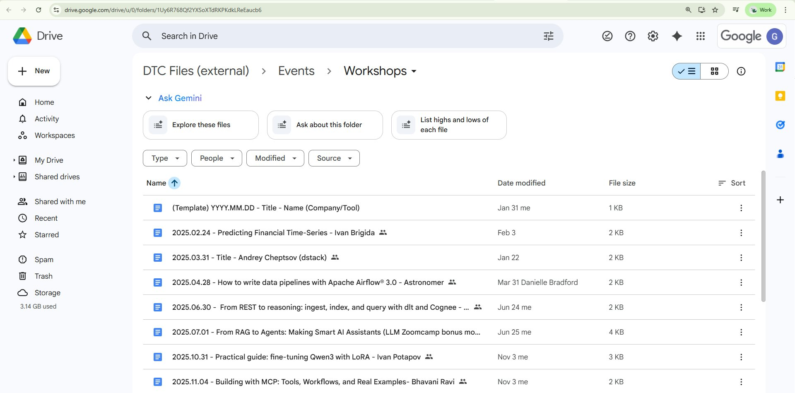
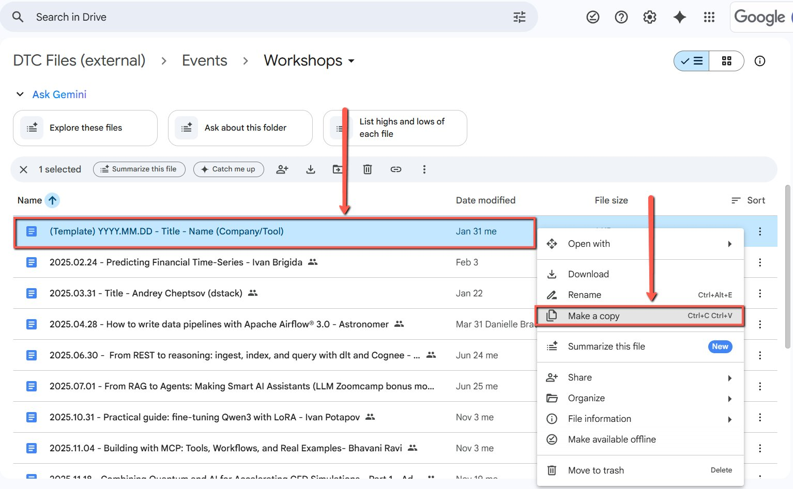

# Creating a workshop document

<!-- sop-section-start: summary -->
## Summary

- Purpose: Create a workshop planning document from the workshop template.
- Outcome: A copied workshop document is ready to share with the instructor or sponsor.
- Trigger: A workshop is confirmed or likely to happen.
- Frequency: Per workshop.
<!-- sop-section-end -->

<!-- sop-section-start: prerequisites -->
## Prerequisites

- Access: Workshop documents and templates.
- Tools: Google Drive, Google Docs, Trello.
- Inputs: Workshop topic or tool, date, instructor email, and template document.
<!-- sop-section-end -->

<!-- sop-section-start: procedure -->
## Procedure

<!-- sop-prose-start -->
This procedure will show you the steps on how to create a workshop document.

Step-by-step Instructions
<!-- sop-prose-end -->

<!-- sop-step-start id=1 -->
1.  Go to [https://drive.google.com/drive/u/0/folders/1Uy6R768Qf2YXSoXTdRKPKdkLReEaucb6](https://drive.google.com/drive/u/0/folders/1Uy6R768Qf2YXSoXTdRKPKdkLReEaucb6)

    <!-- sop-screenshot-start -->
    
    <!-- sop-caption-start -->
    The screenshot confirms the Google Drive folder that contains the workshop template documents. Use it to check that you are in the shared workshop template location before copying anything.
    <!-- sop-caption-end -->
    <!-- sop-screenshot-end -->
<!-- sop-step-end -->

<!-- sop-step-start id=2 -->
2.  Hover your mouse over the template document. Right-click and select “Make a copy.”

    <!-- sop-screenshot-start -->
    
    <!-- sop-caption-start -->
    The screenshot shows the template document's context menu in Google Drive with the “Make a copy” option. This is the menu action that creates a separate planning document for the new workshop.
    <!-- sop-caption-end -->
    <!-- sop-screenshot-end -->
<!-- sop-step-end -->

<!-- sop-step-start id=3 -->
3.  Rename the document using the workshop date, the speaker’s name, and the company or tool.
<!-- sop-step-end -->

<!-- sop-step-start id=4 -->
4.  Once the event title is confirmed, replace “Title” in the document name with the actual title.
<!-- sop-step-end -->
<!-- sop-section-end -->

<!-- sop-section-start: validation -->
## Validation

-
<!-- sop-section-end -->

<!-- sop-section-start: troubleshooting -->
## Troubleshooting

-
<!-- sop-section-end -->

<!-- sop-section-start: references -->
## References

-
<!-- sop-section-end -->
